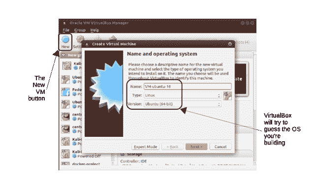
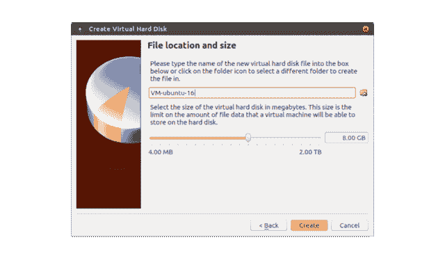
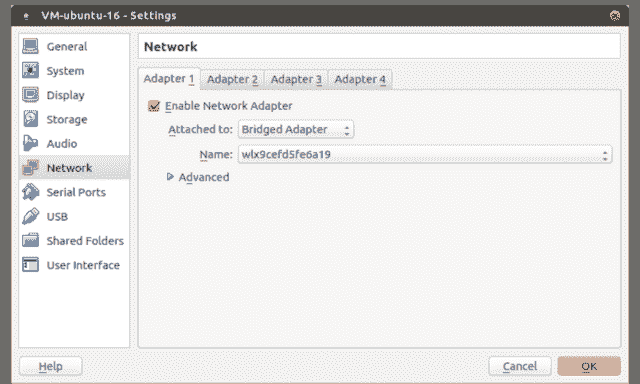

# 如何创建虚拟 IT 工作区

> 原文：<https://www.freecodecamp.org/news/how-to-create-a-virtual-it-workspace-16927c0f3535/>

*本文基于我的免费在线书籍《技术解决方案:如何在疯狂变化的技术世界中快速学习有价值的新技能》中的一章。在我的 Bootstrap IT 网站上还有很多，包括我的书的链接， [Linux in Action](https://www.manning.com/books/linux-in-action?a_aid=bootstrap-it&a_bid=4ca15fc9) ，以及一个名为 [Linux in Motion](https://www.manning.com/livevideo/linux-in-motion?a_aid=bootstrap-it&a_bid=0c56986f&chan=motion1) 的混合课程，它由两个多小时的视频和大约 40%的 Linux in Action 文本组成。*

在测试一项新技术时，你有没有彻底清洗过你的工作站或笔记本电脑？或者您安装了如此多的包及其依赖项，以至于您不再知道是什么让您的实验成功或失败？

虚拟化可以为您提供一个干净、快速、轻量级的环境，您可以在其中尽情测试。您甚至不受运行在您的主机上的操作系统的限制，所以这也是了解多平台如何工作的一个很好的方式。

当你完成时——或者如果一切都在光荣的失败中崩溃——你可以简单地杀死你的环境，并点燃一个新的来代替它。没有伤害。

在本文中，我将探索 VirtualBox 和 Linux Containers(lxc ),作为提供易于复制和共享的虚拟操作系统环境的工具。最后，我将谈谈在虚拟环境中直接编写代码和构建软件堆栈的一些想法

### VirtualBox(虚拟方块)

因此，请向 Oracle 的免费 VirtualBox 跨平台虚拟机管理程序产品问好，特别是向一些从您的(无成本)投资中获取更多价值的高级技巧问好。VirtualBox 是一个可以在任何操作系统上使用的东西，它可以创建运行任何风格的 Windows 或 Linux 的虚拟化计算机。

> 您仍然需要为您决定运行的任何 Windows 映像获取许可证，尽管您通常可以在一个月左右的时间内免费安装和使用副本，而无需激活许可证。

如果你已经读过我的 [Linux in Action](https://www.manning.com/books/linux-in-action?a_aid=bootstrap-it&a_bid=4ca15fc9&chan=freeCodeCamp1) 一书，并且其中的一些内容感觉有点熟悉，那是因为这一章是 Linux in Action 第二章的缩小版。该内容已获得曼宁出版公司的许可。

#### 开始使用 VirtualBox

VirtualBox 提供了一个环境，在这个环境中，您可以启动物理系统资源所能处理的尽可能多的虚拟机。当然，对于安全地测试和学习新的管理技能来说，它是一个特别有用的工具——这是我们现在的主要目标。

**安装 VirtualBox**

想在 Windows PC 上尝试这一切吗？前往 [VirtualBox 网站](https://www.virtualbox.org/wiki/Downloads)下载可执行文件。单击您下载的文件，然后完成几个设置步骤(默认值应该都可以)。最后，系统会询问您是否同意重置网络接口，然后询问您是否要安装 VirtualBox。你当然是了。

让 VirtualBox 愉快地安装在 Ubuntu Linux 机器上甚至更简单。只有两个命令:

```
sudo apt updatesudo apt install virtualbox
```

#### 定义虚拟机

我不确定你是否曾经用组件组装过一台物理计算机，但是它可能会很复杂。在 VirtualBox 中定义一个新的虚拟机也是同样的方式。唯一显著的区别是，VirtualBox 允许您通过单击鼠标来定义虚拟机的“硬件”规格，而不是跪在地上，用牙齿咬着手电筒来手动添加 RAM 和存储驱动器。

在 VirtualBox 界面中单击 New 后，您将为将要构建的虚拟机指定一个描述性名称，如图所示，软件应该能够自动正确填充 Type 和 Version 字段。您在此选择的类型和版本不会安装实际的操作系统，而只是用于应用适当的硬件模拟设置。



The Create Virtual Machine dialog: VirtualBox will try to guess your OS and OS version to offer intelligent default choices later

在下一个屏幕上，您将为虚拟机分配 RAM。除非你计划做一些特别苛刻的事情——比如托管一个容器群或者运行一个繁忙的 web 服务器——默认的大小(768 MB)应该没问题。如果有必要，您当然可以给它更多的 RAM，但是不要忘记为您的主机和任何其他可能已经在其上运行的虚拟机留出足够的空间。因此，如果您的主机只有 4 GB 的物理 RAM，您可能不想将其中的一半给虚拟机。

如果您最终决定一次运行多个虚拟机，请记住这些限制，这对测试更复杂的基础架构项目非常有用。即使每个虚拟机只使用默认数量的内存，其中两三个也会开始消耗正常主机操作所需的 RAM。

#### 定义您的虚拟硬盘

没有硬盘的电脑算什么？VirtualBox 安装过程现在会询问您是要为虚拟机创建新的虚拟磁盘还是使用现有的虚拟磁盘。有时，您可能希望在两个虚拟机之间共享一个磁盘，但对于本练习，我猜您会希望从头开始。所以选择“现在创建一个虚拟硬盘”。

下一个屏幕让您为即将创建的磁盘选取硬盘文件格式。除非您计划最终导出磁盘以在其他虚拟化环境中使用，否则默认的 VirtualBox 磁盘映像(VDI)格式就可以了。

我也从未后悔使用默认的“动态分配”选项来确定虚拟驱动器将如何消耗主机上的空间。“动态”是指主机存储磁盘上的空间将仅根据需要分配给虚拟机。如果虚拟机磁盘使用率保持较低水平，分配的主机空间将会减少。

另一方面，固定大小的磁盘将立即获得其最大空间量，而不管它实际使用了多少空间。“固定大小”的唯一优势是应用程序性能，但由于我通常只使用 VirtualBox 虚拟机进行测试和实验，我很好地避免了这种权衡。

当 VirtualBox 知道你在找的是 Linux 时——因为 Linux 可以如此有效地利用存储空间——VirtualBox 可能会在下一个屏幕上只提供 8 GB 的总磁盘空间(如下所示)。除非您对 VM 有非常大的计划(比如说，您将处理一些严重的数据库操作)，否则这可能没问题。另一方面，如果您选择 Windows 作为您的操作系统，默认选择将是 25 GB，这是有充分理由的:Windows 并不羞于要求大量资源。这是 Linux 如此适合虚拟环境的一个很好的例子。



If necessary, your virtual disk can be as large as 2 TB — or the maximum free space on the host device

您也可以在此屏幕上编辑 VirtualBox 将用于您的磁盘的名称和位置。

完成后，单击创建，新虚拟机将出现在 VirtualBox 管理器左侧的虚拟机列表中。享受成功的滋味，但你还没有完成:那只是机器。现在你需要一个操作系统来让它活起来。

#### 下载操作系统

现在，您已经定义了新虚拟机的虚拟硬件配置文件，接下来还需要做些什么:

*   下载一个包含您要使用的操作系统映像的文件(ISO 格式)。
*   使用包含您下载的 ISO 的虚拟 DVD 驱动器启动新的虚拟机
*   完成标准操作系统安装过程
*   启动虚拟机并启动刚刚安装的操作系统

您需要下载一个包含操作系统文件和安装程序的. ISO 文件。找到正确的文件通常只是在互联网上搜索发行版名称和“下载”一词。在 Ubuntu 的情况下，你也可以直接进入[ubuntu.com](https://ubuntu.com)页面，点击下载标签，如图所示。注意 Ubuntu 的各种版本。如果您打算使用该虚拟机执行管理任务，那么小型快速服务器版本可能是比桌面更好的选择。


The Downloads drop-down on the home page of Ubuntu.com. Note the range of versions Ubuntu offers

**验证您下载的 ISO 档案文件**

大型文件有时会在下载过程中损坏。如果你的。ISO 已被更改，有可能安装根本无法工作。因为您不想花费时间和精力发现下载有问题，所以立即计算。ISO 你已经下载了，以确认一切都是原来的样子。

为此，您需要获得适当的 SHA 或 MD5 校验和，这是一个长字符串，如下所示:

`4375b73e3a1aa305a36320ffd7484682922262b3`

在 Ubuntu 的情况下，获得它意味着进入 releases.ubuntu.com 的网页，点击与你下载的版本相匹配的目录，然后点击一个校验和链接(比如 SHA1SUMS)。

您应该将该页面中的相应字符串与从下载目录中运行的命令的结果进行比较。ISO 可能是这样的:

`$ shasum ubuntu-16.04.2-server-amd64.iso`

如果匹配，你就成功了。如果没有，并且您已经仔细检查过以确保您看到的是正确的版本，那么您可能需要下载。ISO 第二次。

#### 安装操作系统

一旦你。ISO 文件已经准备好了，回到 VirtualBox。当您刚刚创建的虚拟机在左侧面板中突出显示时，单击应用程序顶部的绿色开始按钮。系统会提示您从文件系统中选择一个. ISO 文件作为虚拟 DVD 驱动器。很自然，你会选择你刚刚下载的那个。新虚拟机将读取该 DVD 并启动操作系统安装。

> 大多数情况下，安装过程都会很顺利。然而，描述许多可能出错的小事情的解决方案需要一大堆文章。因此，如果您遇到问题，可以参考适用于您的操作系统的文档和指南，或者在在线社区中分享您的问题。

当所有的东西都安装好之后，在成功引导到 VM 之前，可能还有一些事情需要处理。突出显示您的虚拟机条目后，单击黄色设置图标。在这里，您可以尝试虚拟机的环境和硬件设置。

例如，单击网络，您可以定义网络连接。如果您希望您的虚拟机通过主机的网络接口拥有完全的互联网访问权限，那么，如下所示，您可以从附加的下拉列表中选择“桥接适配器”，然后选择您的主机适配器的名称。



The network tab of the Settings screen. You can determine what type of network interface — or interfaces — to use for your VM

> 使用桥接适配器可能并不总是您的首选，有时它可能会带来安全风险。事实上，选择“NAT 网络”是为虚拟机提供互联网访问的一种更常见的方式。然而，桥接网络是获得完整网络连接的最简单方法，因此，至少对于测试来说，这是一种有用的方法。

接下来的这些部分有点意外，但是谁不喜欢免费的东西呢？我将告诉您两个相关的技巧:如何组织您的 VirtualBox 虚拟机以尽可能快地建立新的虚拟机，以及如何使用命令行在网络上共享虚拟机。

#### 克隆虚拟机以快速启动

使用虚拟机最明显的优势之一是能够快速访问全新、干净的操作系统环境。但是如果访问那个环境需要经历完整的安装过程，那么我看不出有多少“快”

除非，你把克隆也算进去。为什么不将您的原始虚拟机保持在其干净的安装后状态，并在您想要做一些实际工作时简单地创建一个完全相同的克隆呢？

很简单。再看一下 VirtualBox 的应用程序。选择要用作主副本的(已停止)虚拟机，单击机器菜单链接，然后克隆。您将确认您想要为您的克隆命名，然后在单击“下一步”后，您是否想要创建完整克隆(意味着将为新虚拟机创建全新的文件副本)或链接克隆(意味着新虚拟机将与其主虚拟机共享所有的*基本*文件，同时单独维护您的新工作)。

选择链接选项会运行得更快，占用的硬盘空间也更少。唯一的缺点是，以后您将无法将这个特定的克隆移动到不同的计算机上。这是你的选择。

现在单击 Clone，一个新的虚拟机将出现在虚拟机面板中。以正常方式启动它，然后使用在主服务器上设置的相同凭据登录。

#### 从命令行管理虚拟机

VirtualBox 自带命令行 shell，可以使用`vboxmanage`调用。为什么要用命令行呢？因为，除了其他好处之外，它将允许您在远程服务器上工作——这可以极大地增加可能的项目的范围。要查看`vboxmanage`是如何工作的，使用`list vms`列出系统上当前可用的所有虚拟机。这是它在我的机器上的样子:

```
$ vboxmanage list vms
“Ubuntu-16.04-template” {c00d3b2b-6c77–4919–85e2–6f6f28c63d56}
“centos-7-template” {e2613f6d-1d0d-489c-8d9f-21a36b2ed6e7}
“Kali-Linux-template” {b7a3aea2–0cfb-4763–9ca9–096f587b2b20}
“website-project” {2387a5ab-a65e-4a1d-8e2c-25ee81bc7203}
“Ubuntu-16-lxd” {62bb89f8–7b45–4df6-a8ea-3d4265dfcc2f}
```

`vboxmanage clonevm`将使用 GUI 完成我上面描述的相同类型的克隆操作。在这里，我制作了 Kali-Linux-template VM 的克隆，将副本命名为“newkali”:

```
$ vboxmanage clonevm Kali-Linux-template --name newkali
```

只要我只需要在我的本地计算机上使用新的 VM，这就很好了。但是，假设我想让团队中的其他成员拥有一个该虚拟机的精确副本——也许这样他们就可以测试我一直在做的一些东西。为此，我需要将虚拟机转换成某种标准化的文件格式。下面是我如何使用开放虚拟化格式将本地虚拟机导出到一个文件中。OVA):

```
$ vboxmanage export website-project -o website.ova
0%…10%…20%…30%…40%…50%…60%…70%…80%…90%…100%
Successfully exported 1 machine(s).
```

接下来，您需要复制。OVA 文件到你同事的电脑上。请记住，无论从哪个角度来看，这个文件都不会被认为是小巧玲珑的。如果你没有多余的网络带宽来传输 1gb 的数据，那么可以考虑通过 USB 设备来传输。

传输完成后，剩下的工作就是从远程计算机将虚拟机导入该计算机的 VirtualBox。命令很简单:

```
$ vboxmanage import docker.ova
```

使用`list vms`确认导入操作有效，并尝试从桌面启动虚拟机。

```
$ vboxmanage list vms“docker-project” {30ec7f7d-912b-40a9–8cc1-f9283f4edc61}
```

如果您不需要任何复杂的远程访问，您也可以从 GUI 共享一个虚拟机。突出显示您要共享的机器后，单击文件菜单，然后单击导出设备。

接下来是:奇妙而神秘的 LXC 世界。

VirtualBox 非常适合运行需要内核访问的操作，当你需要 GUI 桌面会话时，或者测试利基市场边缘操作系统。但是如果你在一台 Linux 机器上，你只需要快速访问一个干净的 Linux 环境，并且你不寻找任何特殊的发布版本，那么你将很难击败 Linux 容器。

LXC 集装箱到底有多快？你很快就会亲眼看到了。但是，因为它们巧妙地与主机和其他容器共享许多系统资源，所以它们像全口径独立服务器一样工作，同时只使用最少的存储空间和内存。

> 注意:我们将讨论经典的 LXC，但是你应该知道来自相同开发者的一个类似的环境叫做 LXD。LXD 本质上是 LXC 接口的更新实现。它仍然使用 LXC，但提供了一组不同的命令，将功能扩展到远程网络管理。

### LXC 入门

在你的 Ubuntu 工作站上安装 LXC？小菜一碟:

```
sudo apt updatesudo apt install lxc
```

就是这样。我们准备好进入正题了。LXC 的基本技能其实很简单。我将向您展示让这一切正常运行所需的三四个命令，然后是一个内部提示，一旦您了解 LXC 是如何组织自己的，它将会让您大吃一惊。

#### 启动您的第一个容器

为什么不直接开始创建你的第一个容器呢？给`-n`的值设置了我想为容器使用的名称，而`-t`告诉 LXC 从 Ubuntu 模板构建容器。

```
$ sudo lxc-create -n mycont -t ubuntu
```

如果您决定创建一个 CentOS 容器，那么您应该记下输出的最后几行，因为它包含了登录时应该使用的密码信息:

```
$ sudo lxc-create -n centos_lxc -t centos 
[...]
The temporary root password is stored in:
        '/var/lib/lxc/centos_lxc/tmp_root_pass'
```

您将使用用户名“root”和该文件中包含的密码登录。另一方面，如果您的容器使用了 ubuntu 模板，那么您将使用“Ubuntu”作为您的用户名和密码。很自然，如果您计划将这个容器用于任何重要的事情，您会想要立即更改这个密码。

使用`lxc-ls --fancy`检查容器的状态:

```
$ sudo lxc-ls --fancy
NAME    STATE   AUTOSTART GROUPS IPV4    IPV6 
mycont  STOPPED 0         -      -       -
```

它是存在的，但显然它需要启动。和以前一样，`-n`通过名称指定您想要启动的容器。`-d`代表“分离”——意思是当容器启动时，你*不想*自动进入一个交互会话。

```
$ sudo lxc-start -d -n mycont
```

列出您的容器现在应该显示如下内容:

```
$ sudo lxc-ls --fancy
NAME    STATE   AUTOSTART GROUPS IPV4        IPV6
mycont  RUNNING 0         -      10.0.3.142  -
```

这一次，容器正在运行，并且已经获得了一个 IP 地址。您可以使用这个地址通过安全 shell 会话登录。

```
$ ssh ubuntu@10.0.3.142
```

或者，您可以使用`lxc-attach`在一个正在运行的容器中启动一个根 shell 会话。

```
$ sudo lxc-attach -n mycontroot@mycont:/#
```

当你玩完你的新容器后，你可以运行`exit`退出，让容器继续运行:

```
root@mycont:/# exitexit
```

…或者使用`shutdown -h now`关闭容器。

但在此之前，让我们看看 LXC 集装箱到底有多快。我之前加在`shutdown`上的`-h`标志代表“暂停”。如果我使用`r`来代替，而不是永远关闭，容器会重启。因此，让我们运行 reboot，然后尝试立即再次登录，看看容器恢复正常需要多长时间。

```
root@mycont:/# shutdown -r nowsudo lxc-attach -n mycont
```

怎么样了？我敢打赌，当您设法重新键入`lxc-attach`命令时，mycont 已经醒来并准备好行动了。但是您知道吗，在 Bash 中按向上箭头键会用前面的命令填充命令行。使用它会使请求登录更快。对我来说，没有明显的延迟。容器在不到 2 秒的时间内关闭并完全重启！

> Linux 容器也很容易占用系统资源。与我使用 VirtualBox 虚拟机的经历不同——在那里同时运行三个虚拟机已经开始严重影响我的 8GB 主机工作站性能——我可以启动所有类型的 LXC 容器，而不会有任何减速。

#### 修理一个冷的 LXC 容器

我答应给你的内部消息怎么样了？那么，回到主机上的终端(与容器相反)，您需要使用`sudo su`打开一个管理员 shell。从现在开始——直到你输入`exit`——你将是全职的`sudo`。

```
$ sudo su[sudo] password for username:#
```

现在将目录更改为`/var/lib/lxc/`并列出内容。您应该会看到一个带有容器名称的目录。如果系统中有其他容器，它们也会有自己的目录。

```
# cd /var/lib/lxc
# ls
mycont
```

移动到您的容器目录并列出其内容。会有一个名为“config”的文件和一个名为“rootfs”的目录。“fs”代表“文件系统”。

```
# cd mycont
# ls
config rootfs
```

我现在真正想让您看到的是 rootfs 目录:

```
# cd rootfs
# ls
bin   dev  home  lib64  mnt  proc  run   srv  tmp  var
boot  etc  lib   media  opt  root  sbin  sys  usr
```

所有那些填充 rootfs 的子目录…你看着眼熟吗？当然啦！它们都是 Linux 文件系统层次标准的一部分。这实际上是容器的根(/)目录…但是在*主机的*文件系统中。只要您在主机上拥有管理员权限，您就可以浏览这些目录并编辑您想要的任何文件——即使容器没有运行。

有了这个权限，你可以做各种各样的事情，但有一天，这里有一个很可能会拯救你的(职业)生活。假设您在容器上做了一些愚蠢的事情，把自己锁在了外面，现在没有什么可以阻止您在文件系统中导航，修复您弄乱的配置文件，然后继续工作。继续:告诉我那不酷。

需要在一个停止的容器上挂载一个进程吗？按照我在本文中描述的方式使用 chroot。

但事情会变得更好。的确，自从几年前技术走出 LXC 的阴影以来， [Docker 生态系统](https://hackernoon.com/too-many-choices-how-to-pick-the-right-tool-to-manage-your-docker-clusters-b5b3061b84b7)已经获得了许多功能和复杂性。然而，在引擎盖下，它仍然建立在一个基本的结构范式之上，熟悉 LXC 的任何人都会立即认出来。

这意味着，如果你想试驾这十年来发展最快的虚拟化技术，你已经有机会了。

### 在远程服务器上编写代码

现在你已经弄清楚了那些虚拟环境的东西，你能用它们做什么呢？很明显，这样的设置非常适合使用系统工具和架构。

假设您对系统不感兴趣，但是您想要一个安全的地方来构建应用程序。我说的“安全”是什么意思我说的是一个环境，你可以自由地安装库和依赖包，而不必担心破坏你的个人工作计算机。

但是你能走多远是有限度的。在像 Eclipse 或 Visual Studio 这样的 ide 的表面之下有很多事情正在发生，人们变得非常依赖它们的便利性。但是期望能够轻松地在远程连接上运行所有这些复杂层——尤其是在一个无头远程服务器上——可能有点雄心勃勃。

但是，在笔记本电脑上的 IDE 上工作，并且远程保存、编译和运行代码，比如说，在托管的 VM 或云实例上，不是很好吗？这样，您可以在实际运行应用程序的服务器上构建您的应用程序，而不必拿您自己工作站的稳定性冒险。

可以做到。通常，诀窍是让您的 IDE 建立在安全 Shell (SSH)会话之上。有关详细信息，请在互联网上搜索类似“eclipse 在远程服务器上编辑 java 代码”的内容。

*本文基于我的免费在线书籍《技术解决方案:如何在疯狂变化的技术世界中快速学习有价值的新技能》中的一章。在我的 Bootstrap IT 网站上还有很多，包括我的书的链接， [Linux in Action](https://www.manning.com/books/linux-in-action?a_aid=bootstrap-it&a_bid=4ca15fc9) ，以及一个名为 [Linux in Motion](https://www.manning.com/livevideo/linux-in-motion?a_aid=bootstrap-it&a_bid=0c56986f&chan=motion1) 的混合课程，它由两个多小时的视频和大约 40%的 Linux in Action 文本组成。*