# 使用 Affinity Designer 为 Android 导出资源

> 原文：<https://www.freecodecamp.org/news/exporting-assets-for-android-using-affinity-designer-2564ecf53755/>

by Dixita Ganatra

# 使用 Affinity Designer 为 Android 导出资源

[亲和设计师](https://affinity.serif.com/en-gb/designer/)有一个丰富的功能，**导出人物角色**。我想知道它是否可以简化为 Android 项目导出资产的过程。以下是我钻研后的发现。

#### 前言

本文假设您熟悉在 Affinity Designer 中导航。我将使用一个名为**观察你的脚步**的健身应用程序的样本。这个应用程序计算你每天的脚步，你活动的时间，你燃烧的卡路里和你走的距离。

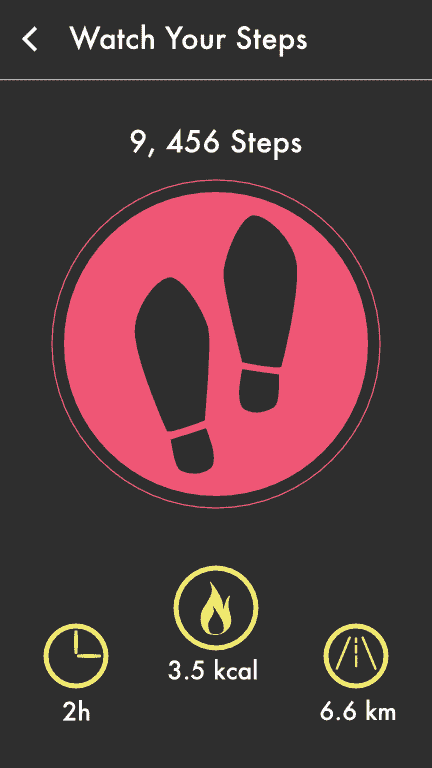

“Watch Your Steps”

要在 Android 应用程序中使用这些图标，我们需要导出它们。由于这个应用程序将在各种屏幕尺寸的 Android 设备上运行，我们需要为各种分辨率导出它们。

#### 脚步声

**步骤 1:** 当你的设计准备好了，切换到**导出角色**。

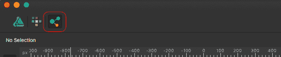

Export Persona

**第二步:**转到右窗格的**切片**面板。

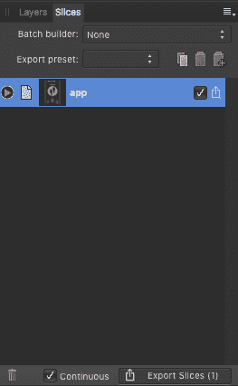

**Slices** panel

要导出图标，我们需要将它们切片。默认情况下，Affinity 会为我们的作品创建一个切片。现在我们需要从我们的作品中切下图标。我们将直接从层创建切片。我们也可以使用**切片工具**手动创建切片。

第三步:进入图层面板。选择想要导出的图层，点击**创建切片**。

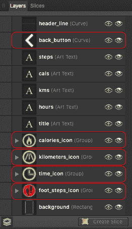

Layers to be sliced

这些是在**绘制人物角色**中创建的图层。我们将导出上面突出显示的图层。现在，您应该能够在图稿中看到切片层周围的蓝色边框，表示切片已创建。

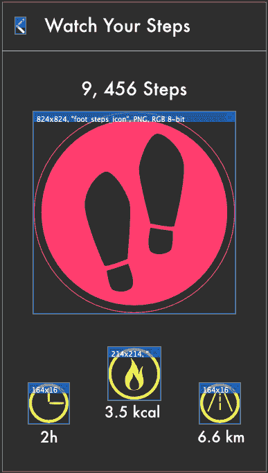

Slices

**步骤 4:** 转到**切片**面板，取消选中默认切片(本例中为 app 切片)和任何其他不想导出的切片。

Sliced layers

**第五步:**点击左侧箭头展开切片，设置文件路径。

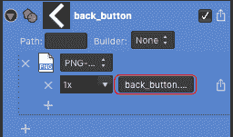

它显示了切片的细节。突出显示的区域显示了扩展切片的文件路径。因为我们给了我们的层合适的名字，我们可以重用它们作为文件路径。

默认情况下，png 的大小将是 **1x** (与图标的大小相同)。在一个 Android 项目中，我们需要这个尺寸用于 **drawable-mdpi** 。单击文件路径，并执行以下步骤来设置它。

从文件名中删除**比例后缀(1x)** ，并将`drawable-mdpi/` 添加到我们的文件路径中(不要忘记末尾的/)。因为我们希望我们的资产在名为`back_button.png`的文件夹`drawable-mdpi/`中。

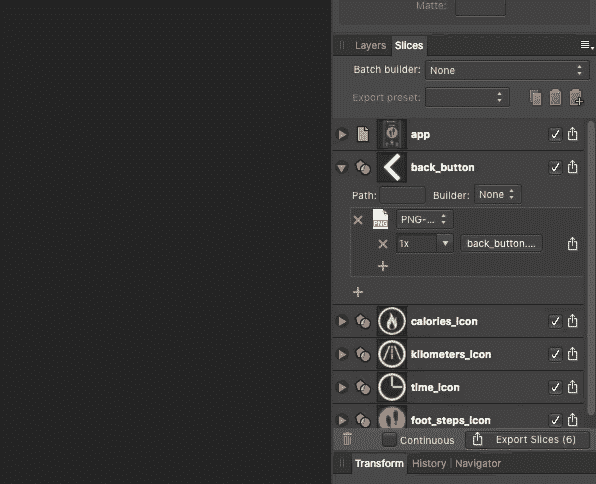

drawable-mdpi/back_button.png

**第六步:**对 **drawable-hdpi — 1.5x，drawable-xhdpi — 2x，drawable-xxhdpi — 3x** 和 **drawable-xxxhdpi — 4x** 按照上一步。

完成**步骤 6** 后，切片将如下所示:

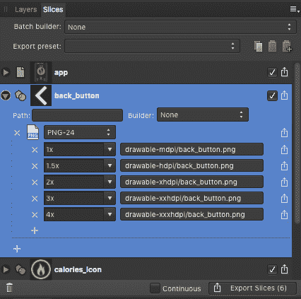

All sizes with respective folders

我们不必对以下所有图标重复此过程。Affinity 提供了一个将它保存为预置的功能。

**步骤 7:** 点击切片面板右上角的菜单图标，选择**创建导出设置预置**。然后将其命名为 **Android** (或者你喜欢的任何名字)。

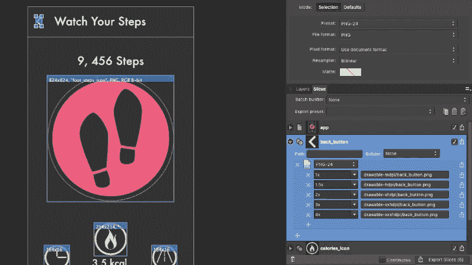

Create **Android** preset

现在，我们准备选择其余的切片，并在它们上面应用 **Android** 预设。？

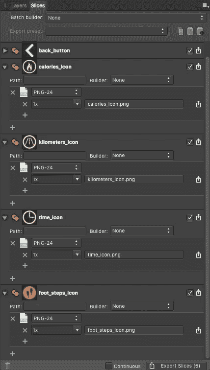

Apply Android preset to rest of the slices

正如你所看到的，一旦你创建了一个预置，它非常容易应用到其他人身上。

**第八步:**点击右下角的**导出切片**。图标将被导出到各自的文件夹中。导出后，文件夹结构将如下所示:

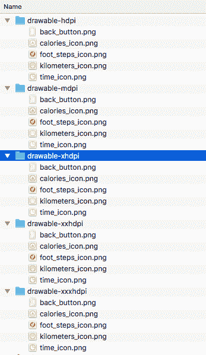

Exported icons just like we wanted ?

如果我们以后改变图标呢？我们必须再次出口它们吗？？

不，我们没有。

#### 奖金

只需勾选高亮显示的选项，**连续**。

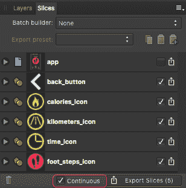

Check continuous

现在，无论何时保存更改，导出的资源都会不断更新。是不是很酷？？

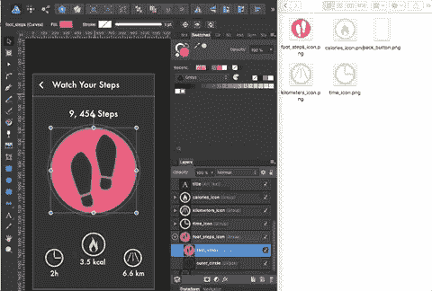

Live update on saving the artwork

这是所有的乡亲。如果你有任何值得分享的想法，请联系我。我很乐意在 twitter 上听到你的消息。

#### 应用模型

您可以从这里下载本教程中使用的模型文件。。

[**【小心脚步】af design**](https://drive.google.com/file/d/1XMIWRoeKHryH2B7i3CMLb30usCDJo3p2/view?usp=sharing)
[*drive.google.com*](https://drive.google.com/file/d/1XMIWRoeKHryH2B7i3CMLb30usCDJo3p2/view?usp=sharing)

#### *参考*

*[**安卓图标参考图|图标手册**](http://iconhandbook.co.uk/reference/chart/android/)
[*《图标手册》集参考手册、操作指南和茶几‘展示橱窗’于一体。学习如何设计图标…*iconhandbook.co.uk](http://iconhandbook.co.uk/reference/chart/android/)[**一个命名 Android 资产的设计者指南**](https://medium.com/@AkhilDad/a-designers-guide-for-naming-android-assets-f790359d11e5)
[*这篇文章主要是为好奇的设计者准备的，它也将帮助新手开发者但是经验丰富…*medium.com](https://medium.com/@AkhilDad/a-designers-guide-for-naming-android-assets-f790359d11e5)*