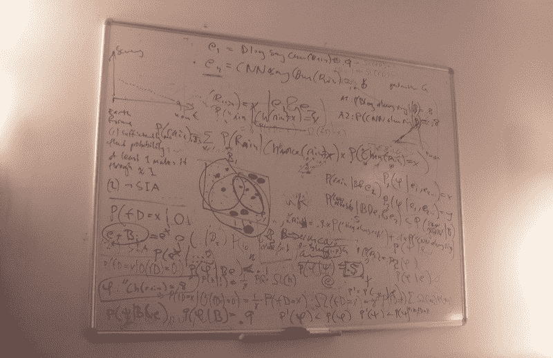

# 如何在为编码面试而学习的同时取得进步

> 原文：<https://www.freecodecamp.org/news/how-to-make-progress-while-studying-for-coding-interviews-894c320bfa74/>

山姆·加维斯-休森

# 如何在为编码面试而学习的同时取得进步

卡住从来都不好玩。尤其是当你非常努力的时候。然而，我发现这种情况总是发生在准备编码面试的人身上。

你投入了持续的工作。你已经完成了数百道练习题，每天划出一个小时来学习。但你就是没有进步。

即使在所有这些准备工作之后，你仍然觉得每个问题都是一个新的挑战，你不知道如何解决。大部分时间你都能解决问题，但感觉并没有变得容易多少。

当我与[一对一辅导客户](https://www.byte-by-byte.com/coaching/)一起工作时，这正是我经常发现他们所处的情况。在几乎所有的情况下，一旦我们确定了阻碍他们的事情，他们就会经历重大的突破。解决这些问题让我的客户在亚马逊、彭博、优步等地找到了工作！

那么到底是什么阻碍了你呢？是什么阻碍了你取得你想要的进步？在这篇文章中，我将向你展示人们最常纠结的十个问题。不过，给你一个合理的警告:在你身上发现这些问题真的很难。如果你真的想突破你的问题，我建议和教练一起工作。

### 1.发展强大的基础

我之前已经谈过这个问题，但是在编码面试中成功的最重要的关键之一是有一个坚实的计算机科学基础。

随着时间的推移，我开发了许多不同的技巧来帮助我的学生提高他们在面试中解决问题的能力，比如[快速方法](http://www.byte-by-byte.com/dpbook)。然而，如果你没有强大的基础，这些技术都没有价值。

例如，FAST 方法旨在帮助学生学习动态编程。快速方法的第一步是找到初始强力递归解。这是你需要自己去做的事情，这样 FAST 方法才能对你有用。即使你了解方法论，如果你不知道如何得到初始解，它也不会帮助你。

如果你有很强的基础，那么递归对你来说应该不难。这是一个经常出现的话题，你应该能够在任何你想要的时候提出来。

所有其他基本数据结构和算法都是如此。如果你不知道如何实现链表，那么你学了多少解决链表问题的技巧都没用。

如果你缺乏正式的计算机科学背景，或者只是发现推荐的编码面试问题解决技术并没有真正帮助你，那么你的第一步应该是致力于学习所有的基本数据结构和算法。

最好的办法是选择麻省理工学院(Python)或 T2 大学(Princeton)的数据结构和算法课程。买书，做作业，参加考试。如果你投入工作，你可以在 3 个月或更短的时间内轻松完成课程，你将有一个强大的基础向前迈进。

### 2.获得更多编码经验

你曾经第一次尝试做某事吗？当我第一次学习如何弹吉他时，我要花 30 秒来掌握基本和弦的指法。理论上，如果我有足够的时间，面前有和弦表，我可以演奏任何歌曲，但听起来不会很好。

有时候，我和一些在编码方面与我处境相似的学生一起工作。他们只是还没有达到可以在面试中轻松写出代码的熟练程度。

理论上，面试的编码部分应该是比较容易的部分。只要你已经在白板上练习过，面试中最难的部分应该是在你写一行代码之前首先开发一个解决方案。如果这不是真的，那么你可能需要提高你的编码技能。

还有一些群体比其他群体受这个问题的影响更大。主要是那些编码经验较少的人。我经常看到训练营的毕业生，从一个不同的领域转到计算机科学专业攻读硕士学位的硕士生，或者长期经理，他们已经有一段时间没有编码了，他们在编码方面挣扎得最厉害。

这里的关键是进行更多的编码练习，最好是在你的代码得到良好反馈的环境中进行。最好的方法之一就是为开源项目做贡献。这不仅是展示您的经验的好方法，而且您将受益于彻底的代码审查和学习如何在生产环境中工作。

如果你是使用开源软件的新手，那么[仅首次使用](http://www.firsttimersonly.com/)对于那些想要开始使用的人来说是一个很好的资源。他们分享如何做出贡献的教程，并编制了一份适合初学者的潜在项目列表。

### 3.策略性地回答每个面试问题

当投入战斗时，任何期望成功的将军都有详细的计划。如果你想在面试中取得成功，你也需要有一个详细的计划。

我看到的解决面试问题的最常见的计划如下:

1.  看问题
2.  思考这个问题
3.  想出解决办法
4.  写出解决方案
5.  成功

然而，你注意到这里的一个问题了吗？希望你问的第一件事是“我如何提出解决方案？”这个计划完全缺乏任何解决方案的策略。它假设解决方案将会出现。

而这也是大多数人对面试问题的看法。他们记住了大量的解决方案，希望其中一个与他们在面试中面临的问题足够相似，这样一个解决方案就会神奇地实现。

这充其量是有风险的。

一个更好的面试方式是为你将如何对待每一次面试和面试中的每一个问题制定一个清晰的计划。以下是你如何应对长达一小时的面试的大致轮廓:

**【0:00–0:05】**安顿下来，确保你完全理解他们问的问题。完成提供的任何示例输入。

**【0:05–0:10】**想出一个解决问题的[蛮力解决方案](https://www.byte-by-byte.com/brute-force/)。没有编码在这一点上，只是通过它交谈，并画出任何图片，如果你觉得有帮助。如果你想不出一个强力的解决方案，试着手工解决这个问题，并把你的解决过程转化成一个算法。

[**0:10–0:15]**优化您的解决方案。用这 5 分钟时间想出在这段时间内你能找到的最佳解决方案。比较解决方案时，考虑时间复杂性。

**[0:15–0:35]**编写您的解决方案。即使不是最优的，有一个完整的非最优解也比一个不完整的最优解要好。

**【0:35–0:50】**测试您的代码并修复任何问题。这非常重要。如果你的代码第一次不完美也没关系，但是你最好能够识别错误。

**【0:50–1:00】**给面试官的问题。

通过遵循这些步骤，你可以同时实现两件事。首先，你有效地安排时间。世界上最令人沮丧的事情是，当你完全知道如何解决问题时，时间却快用完了。

其次，这些步骤将帮助你确保你总能找到解决方案。通过从强力解决方案开始并进行优化，你几乎可以保证你至少会想出**某种**解决方案。很多时候，如果你在接下来的面试中表现出色，最佳的解决方案并不是必须的。

### 4.考虑不同的可能解决方案

你知道大多数面试问题都有不止一个正确答案吗？我知道，很震惊，对吧？然而，成千上万的人找到了解决方案，然后他们就止步于此，不再继续寻找。

这总是让我失望。很多时候，会有另一个更好的解决方案，而且他们非常接近。或者可能存在具有不同权衡的类似解决方案。

例如，考虑这个问题:

*   一种解决方案具有`O(n)`时间复杂度和`O(1)`空间复杂度
*   另一种解决方案具有`O(log n)`时间复杂度和`O(log n)`空间复杂度

这些解决方案哪一个更好？

这取决于我们实际上在寻找什么。如果我们有一个巨大的数据集，但没有很多内存，第一个解决方案可能会更好。然而，如果内存不是问题，那么显然我们希望采用第二种解决方案。

这里的关键是，虽然在某些情况下可能有一个“最佳”解决方案，但有更多的问题，您可以做出不同的权衡，您必须决定做出哪些选择。作为一名面试官，我喜欢看到那些权衡不同可能性的应聘者。

当你想出解决方案时，花点时间想想你能解决同样问题的其他方法。您能否做出权衡，以提高与时间相关的空间利用率，或者反之亦然？

最后，您应该始终考虑您提出的每个解决方案的空间和时间复杂性。这为您提供了一种客观的方法来评估哪些解决方案优于其他解决方案，并有助于您做出更明智的选择。如果你有多个可比较的解决方案，和你的面试官一起讨论，共同决定哪一个是更好的方法。

### 5.从暴力解决方案开始

我已经在技巧 3 中顺便提到了这一点，但人们在试图解决面试问题时犯的最大错误之一是，他们立即试图找到问题的最佳解决方案。

但是让我问你这个问题:暴力解决方案和无解方案哪个更好？

我告诉你，找到一个蛮力解决方案，比根本找不到解决方案好 1000%。如果你一开始就试图立即找到最佳解决方案，那么很容易陷入困境，最终在面试结束时没有一个完整的解决方案。

虽然您实际上并不需要编写代码，但我建议您在继续尝试优化您的解决方案之前，至少简要介绍一下如何使用强力解决方案来解决问题。这实现了两件重要的事情:

1.  它给你一个后备计划。如果你试图优化你的解决方案，但失败了，你可以在 5 或 10 分钟后停下来，编写你的强力解决方案。你仍然可能通过面试。不是所有的问题都有最优解。
2.  它帮助你澄清问题。定义一个强力解决方案可以帮助你准确地理解提出这个问题的解决方案涉及到什么。这是关键。用这种深度的方式理解问题，会更容易优化。

尝试立即找到最佳解决方案似乎是正确的方法，因为这将节省宝贵的时间。然而，我发现采用这种方法所导致的混乱往往会浪费更多的时间。

从一个强力的解决方案开始会给你清晰的思路和一个让其他事情变得更容易的起点。

### 6.在你编码之前计划好完整的解决方案

那里有一些超级漂亮的白板。但是很有可能，您将要使用的白板没有复制粘贴选项。这意味着在你写代码之前，你需要有一个好的代码大纲。

很多时候，人们在面试中一被问到问题，就会马上开始写代码。现在，如果你想继续前进，预先定义你的方法，这是完全没问题的，但是那应该是你编写代码的范围，直到你完全找到解决方案。编写比这更多的代码是一个严重的错误，原因有二。

首先，如我所说，白板没有复制粘贴功能。这意味着，如果你想移动代码行，你要么删除并重写它们，要么画箭头到处走。你不希望你的白板看起来像这样:

对你和你的面试官来说，保持白板的条理更容易。他们更容易理解你的解决方案，你也更容易跟踪正在发生的事情。如果你决定只是重写材料，你将会浪费大量宝贵的时间。

立即开始编码的另一个问题是，它会将你锁定在一种思考问题的特定方式上。我们将在第 7 点中详细讨论这一点，但这对你的面试表现会非常有害。

想象一下，你看到一个问题，一个解决方案立刻浮现在脑海里。你开始编码，但是你意识到它不再是最优的。你不太可能想要抹去一切，重新开始。即使你这样做了，你也会被锁定在那种思维模式中。

存在最优解与强力解完全不相关的问题，并且优化强力解的尝试将会失败。如果你等待开始编码，你就避免了把你的思维锁定在看待问题的那种方式上。

这些顾虑就是为什么我总是建议您在编写代码之前充分理解您想要编写的解决方案。画图，写伪代码，做任何你需要做的事情来理解解决方案。一旦你开始编码，它应该是琐碎的，因为你已经确切地知道该写什么。

### 7.牢记大局

我认为对于更有经验的开发人员来说，最大的问题之一是他们完全陷入了问题的泥沼。他们开始纠结于循环是否应该是`<`；n`or &`lt；= N 并且想不出哪种方法是正确的。

这是一个舍本逐末的完美例子。他们试图解决的问题变成了“我如何正确地写这个循环？”而不是“这个循环在我的代码的大环境中有什么作用？”

一个很好的例子就是你试图使用错误的数据结构。假设您正在存储从`1-N`开始索引的值，并且决定使用散列表。可以插入`1 -> val` ue `1, 2 ->` value2，以此类推。

但是现在，当你想按顺序遍历它们时，这将是一件痛苦的事情，因为你必须从散列表中获取所有的元素，并对它们进行排序。然而，如果你后退一步，看看你实际上在做什么，你只是想存储每个索引的值，并遍历它们。数组是一种更容易使用的数据结构。

现在你可能在想，“我绝不会做那样的蠢事，”但是相信我，这种事经常发生。当你解决问题时，你的思维过程是非线性的，所以你可能认为你需要一个散列表，因为你已经放弃了其他的思路。

这就是为什么时不时停下来是如此重要，尤其是当你开始做一些看起来有挑战性的事情时，回头看看你正在努力做的事情。每当你在做一些看起来不必要的复杂的事情时，看看你的最终目标，看看你是否能简化你的方法。

### 8.利用抽象来获得优势

我喜欢问复杂的面试问题。如果一个问题涉及几个不同的组成部分，作为面试官，你会非常深刻地了解到当有这么多问题需要同时处理时，应聘者是如何管理自己的思维的。

成功解决这些问题的关键是使用抽象。从本质上来说，这意味着将你的代码分解成更小的具有更具体目的的函数。

考虑一个简单的例子。假设我们想以相反的顺序打印一个链表。在解决了这个问题之后，我们意识到有一个使用堆栈的`O(n)`时间和空间解决方案(当我们遍历列表时，将每个元素推到堆栈上，然后弹出每个项目并打印)，但是我们可以通过反转链表在`O(n)`时间和`O(1)`空间中解决这个问题。

现在，在我们的代码中反转链表是很容易的，但是如果我们有一个函数来做这件事呢？那会让我们的生活轻松很多。我们只需调用链表上的函数，遍历链表中的所有内容并打印出来，然后再次反转链表，这样我们就可以将输入返回到初始状态。

有了这个逻辑，我们现在可以隔离反转链表的过程，并考虑如何有效地完成它。虽然这个问题是一个非常简单的例子，但很容易看出这是如何降低我们在任何给定时间必须考虑的复杂性的。

对于更复杂的问题，我建议你问自己这样一个问题:“如果存在的话，什么功能会让我现在的生活更轻松？”如果有一个或多个明确的函数，编写代码时就假设这些函数已经存在。然后你可以回头实现那些函数，现在你的代码的其余部分已经工作了。

这有几个优点:

1.  如果你没有时间了，你仍然有一个基本的工作代码。抽象可以让你专注于整体结构，而不必陷入细枝末节。如果你有多余的时间，你可以担心细节，但即使你没有，你的面试官也很清楚你知道发生了什么。
2.  思路清晰，代码清晰。他们说一张干净的桌子意味着一个清晰的头脑，对代码来说也是如此。你越好地组织你的代码，并把它分解成易于管理的组件，它就越容易被考虑。

我发现问题越复杂，将事情分解成可管理的部分就越有价值。

### 9.测试您的代码

当我们在做新的事情时，我们往往会忘记很多我们已经知道的事情。我们假设我们已经知道的事情并不适用。

考虑这个例子:我一直在业余时间学习如何弹吉他。我正在努力取得进步，所以我向老师寻求帮助，他建议我写下一些我想完成的目标。“咄”。我一直在写关于[这类事情](https://www.byte-by-byte.com/interview-roadmap/)，但是我没能把编码面试准备和吉他练习联系起来。

同样，我发现许多学生忘记了将他们从真实世界的编码中了解到的最佳实践应用到他们的面试中。他们认为编码面试是完全不同的，所以他们通常会做的事情并不适用。

人们总是忘记的一件事是测试他们的面试解决方案。但是你会在现实世界中提交代码而不首先彻底测试它吗？

您测试您的代码是因为您想要确保它是正确的，并且它做了您认为它应该做的事情。这在紧张的面试环境中更为重要，因为你更容易出错。

测试您的解决方案的关键是实际上逐行检查代码，跟踪每个变量的值，并有效地“运行”代码。如果你只是在高层次上通读代码，你很容易忽略代码中的小问题。我[录制了一个视频](https://www.byte-by-byte.com/testing-solutions/),演示了如何测试你的代码。

我发现许多学生强调要让他们的代码第一次就完美，虽然这是一个很好的愿望，但很少发生。这种情况在现实世界中几乎从未发生过，所以你为什么会认为它会发生在压力更大的面试环境中呢？然而，如果您彻底测试您的代码，您可以修复任何错误，并仍然以 A+解决方案结束。

### 10.获得良好的反馈

做真实世界的面试是提高面试水平的好方法。你可以更加适应这种经历，给自己很多成功的机会。一个经常被推荐的策略是安排大量的面试，首先是那些你最不感兴趣的。这样你就可以在不在乎结果的情况下练习面试，这样当重要的面试来临的时候，你会准备得更充分。

虽然我认为这种策略有优点，但有一个致命的缺陷:众所周知，公司不善于给你任何有意义的反馈。

“所以，”你可能会说，“谁在乎呢？我只能自己判断自己的表现。”

嗯，是的，这是真的，但它真的很难判断自己。你不知道你的面试官在寻找什么样的标准(仅仅得到一个问题的最优解可能并不合适)。如果你正在努力争取成功，很可能有些事情你没有看到。

这就是为什么模拟面试，最重要的是和教练一起工作是如此重要。模拟面试让你有机会获得对你表现的详细反馈。面试官也可以告诉你是否有你没有注意到的事情

如果你真的想在面试中表现出色，我还建议在模拟面试的基础上找一位教练。模拟面试是单独的数据点。他们告诉你，在特定的时间，在特定的问题上，你做得好或不好。然而，教练可以查看所有这些数据点，并帮助你建立联系。它们可以帮助你看到你需要改进的具体方面，以提高你面试表现的不同方面。

最终，模拟面试会给你数据点，教练会帮你把这些点联系起来。获得这种反馈是加快面试进度的最好方法。

一次又一次，我看到人们在面试中拖延时间。几乎总是出于上述原因之一。如果你没有取得你想要的进步，请仔细阅读这篇文章。找出你的问题所在，并努力改正。假以时日，你将能够改进你的面试，并开始接到你想听到的电话。