# 如何在你的下一个网页设计项目中使用谷歌字体

> 原文：<https://www.freecodecamp.org/news/how-to-use-google-fonts-in-your-next-web-design-project-e1ad48f1adfa/>

海登·米尔斯

所以你可能听说过谷歌有数百种免费的网络字体准备用于你的下一个项目。但是你如何在你的网站上使用它们呢？这篇文章将带你了解让它们在你的网站上运行的步骤。应该不到 10 分钟！

#### 什么是谷歌字体？

> “谷歌字体[于 2010 年首次推出](https://googlecode.blogspot.com/2010/05/introducing-google-font-api-google-font.html),作为一项工程倡议，推动网络向前发展，使其速度更快。”— [谷歌设计](https://design.google/library/reimagining-google-fonts/)

谷歌字体于 2010 年推出，迅速成为互联网上最大的免费开源字体选择。所有谷歌字体对于商业和个人使用都是免费的。谷歌字体网站让任何人都可以根据自己的设计需求快速选择和使用不同的字体。

#### 谁使用谷歌字体？

每个人都这样！平面设计师、UX 设计师、研究人员、开发人员、网页设计师、博客作者、社交媒体经理、企业家、艺术家、学生、教师、摄影师等等。我在广告牌、海报、展示平台、婚礼请柬、网站和书籍上见过谷歌字体。

Everybody and their mother uses Google Fonts

#### 谁创造了字体？

谷歌字体与世界各地的字体设计师、字体铸造厂和设计社区合作。这些人和组织设计了你在谷歌字体上看到的字体。例如，[ukasz Dziedzic](http://www.latofonts.com/)是一位独立的字体设计师，他设计了流行的字体， [Lato](https://fonts.google.com/specimen/Lato) 。一家名为 [ParaType](http://www.paratype.com/) 的字体铸造厂设计了字体 [PT Serif](https://fonts.google.com/specimen/PT+Serif) 。

#### 谷歌为什么会在意字体？

网站上的每一个谷歌字体 API 链接都让谷歌有机会进行更多的数据挖掘。听起来很恶心吗？是的，但我认为这不应该阻止你使用谷歌字体。

谷歌关心字体的另一个更令人欣慰的原因是，他们希望开源网络字体能够为大众所用。他们想创建一个更快、更漂亮、更容易导航和使用的网站。他们还在 2010 年推出了谷歌字体，当时非常需要这样的服务，所以他们解决了我们在互联网上遇到的另一个问题。#dontbeevil

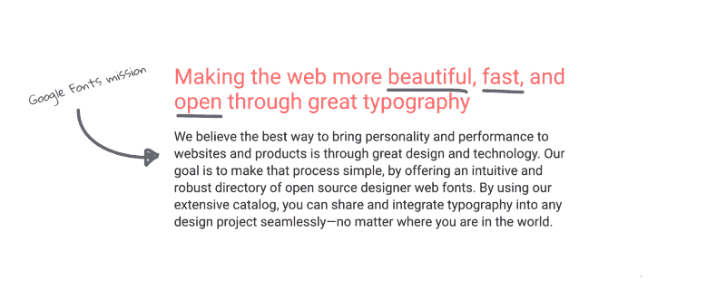

Source — [fonts.google.com/about](https://fonts.google.com/about)

#### 我为什么要考虑使用它们？

你不能免费打。我说的对吗？除了免费，你应该考虑在你的下一个网页设计项目中使用谷歌字体，因为…

*   字体很容易在你的网站上实现
*   有 850 多种字体可供选择(还在增加)
*   字体的整体质量不断提高
*   谷歌字体也可以下载打印使用

好了好了好了。现在来看看如何使用它们。

### 如何一步一步使用谷歌字体

#### 1)进入[谷歌字体网站](https://fonts.google.com/)

访问谷歌字体网站，在那里你可以从 853 种字体家族中进行选择！该网站允许你通过字体风格、语言、流行度和权重来过滤结果。如果你访问[“特色”页面](https://fonts.google.com/featured)，谷歌字体也有新的特色字体。

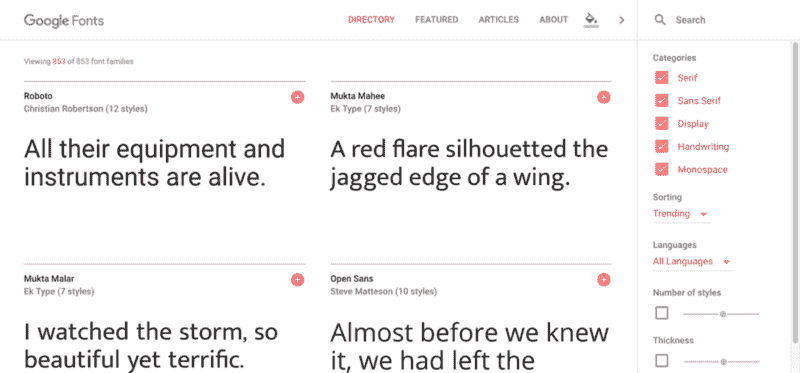

[fonts.google.com](https://fonts.google.com/)

#### 2)搜索你喜欢的字体

如果你心中有一个字体系列名称，你可以搜索它。

#### 3)准备好使用时，单击“+”

每个字体系列的右上角都有一个加号按钮。点按加号按钮，将字体系列添加到屏幕底部出现的“选择抽屉”中。

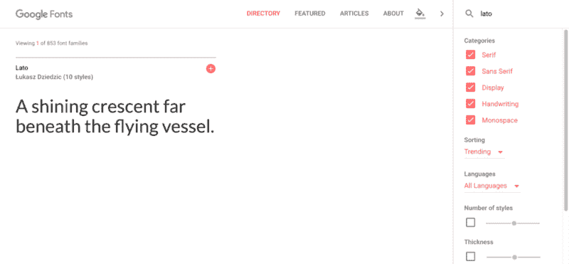

#### 4)如果您要寻找一种以上的字体，请重复步骤 1-3

#### 5)点按“选择抽屉”以显示您选取的所有字体

在“选择抽屉”中，您可以看到您添加的所有字体。在这里你可以找到添加到你的网站的代码。您也可以选择将字体下载到您的桌面。

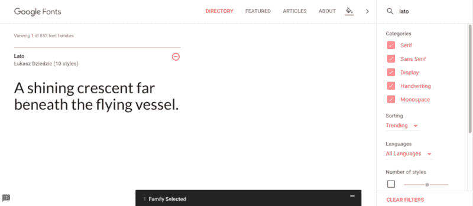

#### 6)“选择抽屉”是你抓取代码的地方，你将把这些代码复制/粘贴到你的网站 HTML 和 CSS 代码中

从“选择抽屉”，您将复制代码粘贴到您的 HTML 和 CSS。为了让谷歌字体在你的网站上工作，你必须有链接到谷歌字体 API 的字体系列(在 HTML 中)和你必须有指定的字体系列(在 CSS 中)。

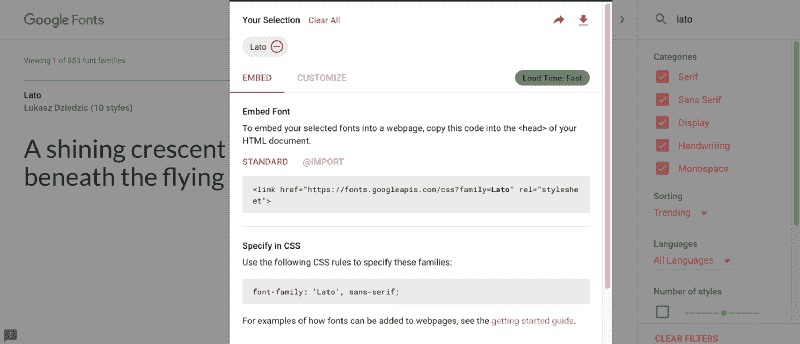

#### 7)如果您愿意，点击“自定义”选项卡，添加不同的字体粗细和样式

在将字体添加到网站之前，这是您向字体系列添加不同字体粗细和样式的最后机会。只添加你知道你需要的字体粗细和样式，因为你添加的字体越多，它们在你的网站上加载的速度就越慢。

#### 8)复制 HTML 代码并粘贴到您网站的

好了，我们快完成了！我们现在需要做的就是将 HTML 和 CSS 代码复制并粘贴到您的网站中。首先，将 HTML 链接复制到 HTML 文档的头部。

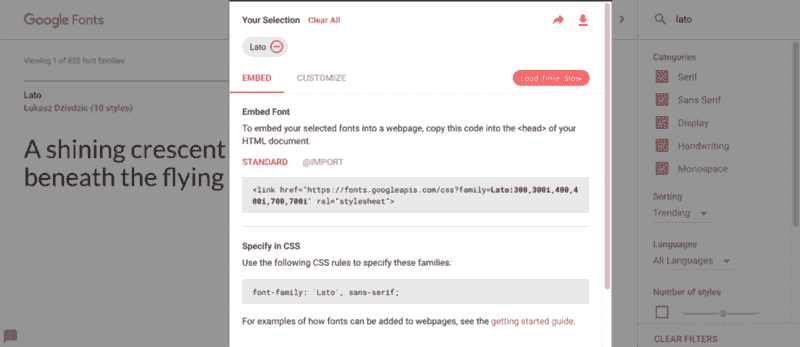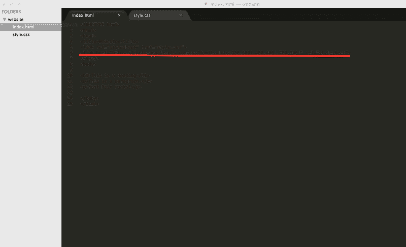

#### 9)复制 CSS 规则并将其粘贴到您网站的 CSS 文件中

最后，我们还需要将 CSS 规则复制并粘贴到您的 CSS 文件中。如果你要为你的网站添加一种谷歌字体，你可以将 CSS 字体系列规则添加到你的 body 标签中。否则，您需要确保将它添加到 CSS 文件中的正确元素中。

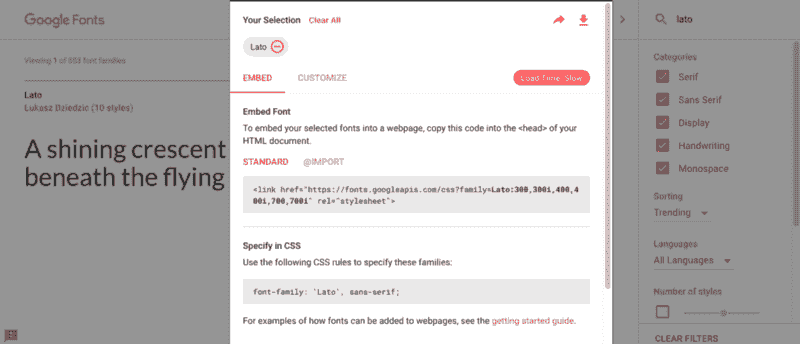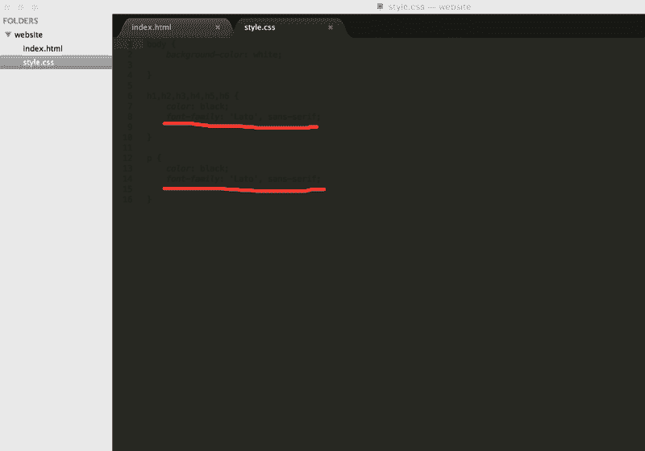

#### 10)保存两个文件(HTML 和 CSS ),然后刷新您的网站并查看新字体

不要忘记保存和刷新！

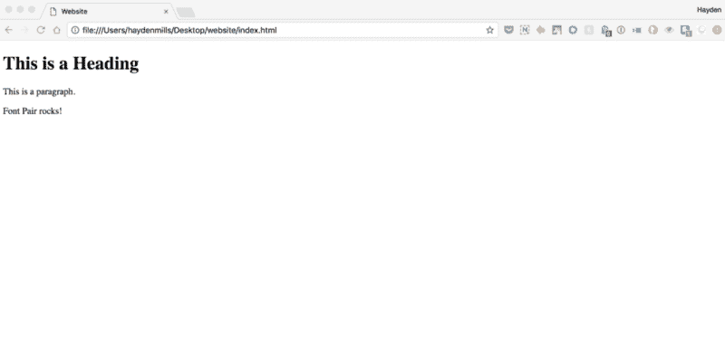

Refresh your local files and you should see the new font family… in this case it’s a Google Font called [Lato](https://fonts.google.com/specimen/Lato).

这就对了。你已经成功地在你的网站上实现了你的第一个谷歌字体。恭喜你，你成功了。公平地说，谷歌字体基本上…

### 更多阅读

*   [“重新想象谷歌字体”，作者 Yuin Chien(谷歌设计)](https://design.google/library/reimagining-google-fonts/)
*   [“更好字体配对的 6 个技巧”，作者海登·米尔斯(字体对)](https://medium.com/fontpair/6-tips-for-better-font-pairing-b71d1045032c)
*   [“选择网页字体:初学者指南”由谷歌字体](https://design.google/library/choosing-web-fonts-beginners-guide/)

### 感谢阅读

如有任何问题，欢迎在下方留言或在 Twitter 上联系我，✌️

还有，我是[字体对](https://fontpair.co/)的创建者，它帮助你将谷歌字体配对在一起。查看[我们的新媒体出版物，阅读更多排版文章](https://medium.com/fontpair)！

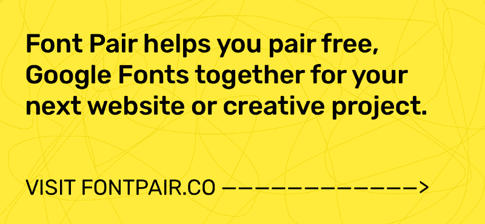