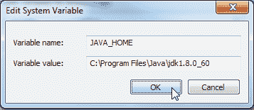
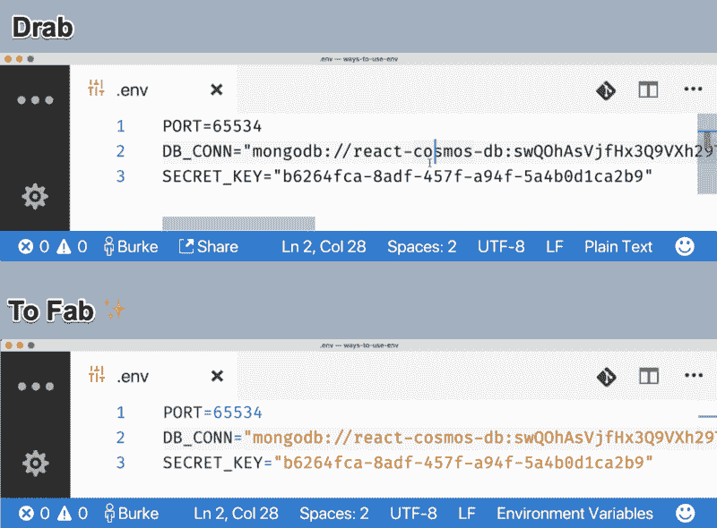
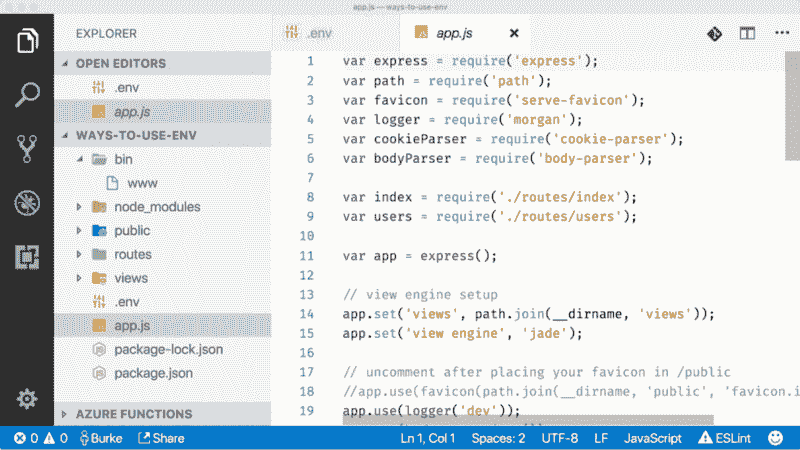
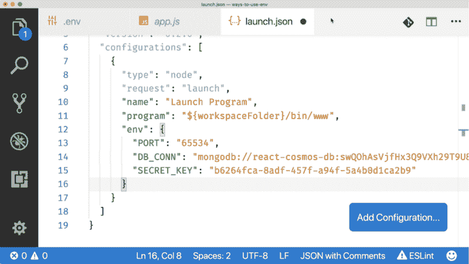
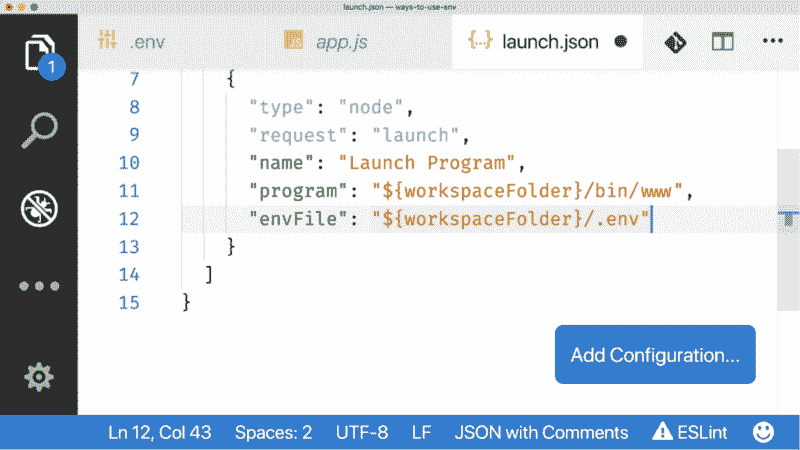
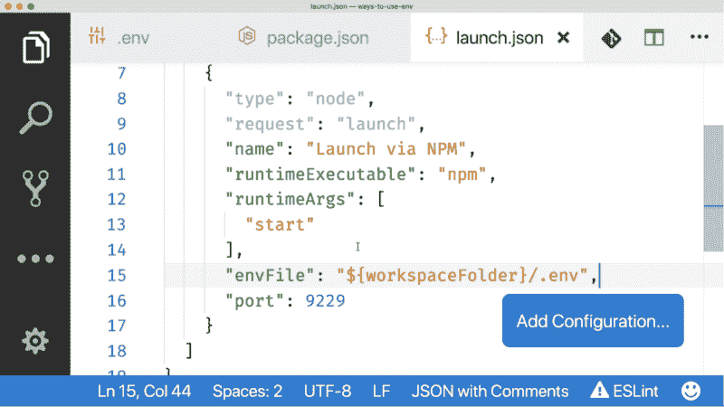
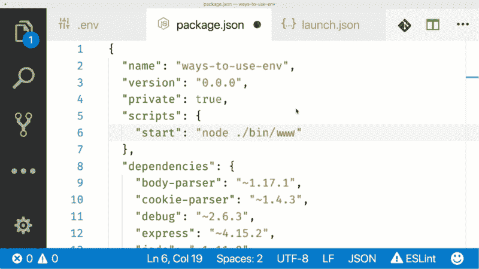
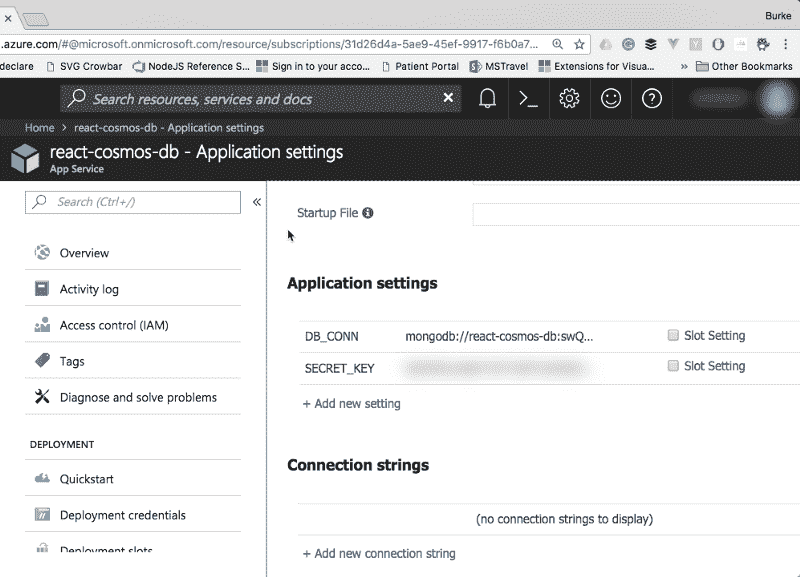
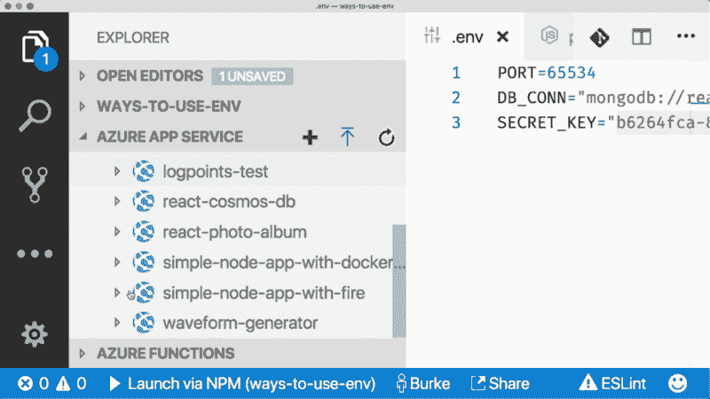

# 下面是如何实际使用节点环境变量的方法

> 原文：<https://www.freecodecamp.org/news/heres-how-you-can-actually-use-node-environment-variables-8fdf98f53a0a/>

环境变量是节点开发的基本组成部分，但出于某种原因，我从未费心去学习如何正确使用它们。

也许是因为它们被称为“环境变量”

仅仅“环境变量”这几个字就触发了一个带有 PTSD 的闪回，在这个闪回中，我试图在 Windows 上添加 Java 主目录的正确路径。它是放在 PATH 中还是 JAVA_HOME 中，还是两者都放？我需要用分号结尾吗？为什么我要用 JAVA？



KILL_ME

在 Node 中，环境变量可以是全局的(像在 Windows 上)，但通常用于您想要运行的特定流程。例如，如果您有一个 web 应用程序，您可能有定义以下内容的环境变量:

*   要侦听的 HTTP 端口
*   数据库连接字符串
*   JAVA _ HOME…等等…不——抱歉。愈合过程需要时间。

在这种情况下，环境变量更像是“配置设置”看到这听起来有多好了吗？

如果你做完了。NET 之前，您可能熟悉类似于`web.config`文件的东西。节点环境变量的工作方式与`web.config`中的设置基本相同——它们是您传递不想硬编码的信息的一种方式。


Quoting yourself is the pinnacle of delusion

但是如何在节点应用程序中使用这些变量呢？我很难找到关于这方面的好资源和必要数量的 Java 笑话，所以我决定创建一个。下面是在节点应用程序中定义和读取环境变量的一些不同方法。

#### 在终端里传递它

作为节点流程的一部分，您可以在终端上传递环境变量。例如，如果您正在运行一个 Express 应用程序，并且想要传入端口，您可以这样做…

```
PORT=65534 node bin/www
```

有趣的事实:端口 65535 是可用的最大 TCP/IP 网络值。我怎么知道？当然是 stack overflow。怎么会有人知道任何事？但对于一个网络应用，你只能使用 65534 端口，因为这是 Chrome 能连接的最高端口。我怎么知道**那件事？**因为[里然塔尔](https://www.freecodecamp.org/news/heres-how-you-can-actually-use-node-environment-variables-8fdf98f53a0a/undefined)在评论里告诉我。你应该跟着他。在我们俩之间，他是唯一知道自己在做什么的人。

现在要在代码中使用这个变量，您可以使用`process.env`对象。

```
var port = process.env.PORT;
```

但这可能会变得很难看。如果您有一个连接字符串，您可能不希望在终端上传递多个变量。这看起来像是你在囤积配置值，而某个爱你的人可能会进行干预，这对所有参与者来说都是尴尬的。

```
PORT=65534
DB_CONN="mongodb://react-cosmos-db:swQOhAsVjfHx3Q9VXh29T9U8xQNVGQ78lEQaL6yMNq3rOSA1WhUXHTOcmDf38Q8rg14NHtQLcUuMA==@react-cosmos-db.documents.azure.com:10255/?ssl=true&replicaSet=globaldb"
SECRET_KEY="b6264fca-8adf-457f-a94f-5a4b0d1ca2b9"
```

这个不可伸缩，大家都想伸缩。根据我参加过会议的每一位架构师的说法，“可伸缩性”甚至比应用程序的工作更重要。

那么我们来看另一种方式:。环境文件。

#### 使用. env 文件

。env 文件允许您将环境变量放在一个文件中。您只需在项目中创建一个名为`.env`的新文件，并将变量放在不同的行中。

```
PORT=65534

DB_CONN="mongodb://react-cosmos-db:swQOhAsVjfHx3Q9VXh29T9U8xQNVGQ78lEQaL6yMNq3rOSA1WhUXHTOcmDf38Q8rg14NHtQLcUuMA==@react-cosmos-db.documents.azure.com:10255/?ssl=true&replicaSet=globaldb"

SECRET_KEY="b6264fca-8adf-457f-a94f-5a4b0d1ca2b9"
```

要读取这些值，有几个选项，但最简单的是使用 npm 的`dotenv`包。

```
npm install dotenv --save
```

然后，您只需要在项目中需要使用环境变量的地方使用该包。`dotenv`包将获取文件并将这些设置加载到节点中。

```
Use dotenv to read .env vars into Node
require('dotenv').config();
var MongoClient = require('mongodb').MongoClient;

// Reference .env vars off of the process.env object
MongoClient.connect(process.env.DB_CONN, function(err, db) {
  if(!err) {
    console.log("We are connected");
  }
});
```

PROTIP:不要将你的`.env`文件签入 Github。里面有你所有的秘密，Github 会发邮件告诉你。不要像我一样。

好的——很好。但这有点痛苦。你必须把它放在每一个你想使用环境变量的文件中，并且你必须把`dotenv`部署到你实际上不需要它的地方。我不是部署无意义代码的狂热爱好者，但我想我只是描述了我的整个职业生涯。

幸运的是，你使用的是 [VS 代码](https://code.visualstudio.com/?wt.mc_id=dotenv-medium-buhollan)(因为**当然你是**，所以你有一些其他的选择。

#### 一起工作。VS 代码中的 env 文件

首先，您可以[安装 DotENV 扩展](https://marketplace.visualstudio.com/items?itemName=mikestead.dotenv&wt.mc_id=dotenv-medium-buhollan)用于代码，这将在您的。环境文件。

[**DotENV-Visual Studio market place**](https://marketplace.visualstudio.com/items?itemName=mikestead.dotenv&WT.mc_id=dotenv-medium-buhollan)
[*Visual Studio 代码扩展-支持 DotENV 文件语法*](https://marketplace.visualstudio.com/items?itemName=mikestead.dotenv&WT.mc_id=dotenv-medium-buhollan)
[marketplace.visualstudio.com](https://marketplace.visualstudio.com/items?itemName=mikestead.dotenv&WT.mc_id=dotenv-medium-buhollan)



VS 代码调试器还提供了一些更方便的选项，用于从。env 文件**如果**你正在使用 VS 代码调试器。

#### VS 代码启动配置

VS 代码的节点调试器(已经有了，不需要安装任何东西)支持加载。通过启动配置生成 env 文件。你可以在这里阅读更多关于发布配置[的信息。](https://code.visualstudio.com/docs/nodejs/nodejs-debugging?WT.mc_id=dotenv-medium-buhollan)



当您创建一个基本的节点启动配置时(单击齿轮并选择节点)，您可以做两件事情中的一件或两件。

首先，您可以简单地在启动配置中传递变量。



这很好，但是每个值都必须是字符串的事实让我有点困扰。是数字，不是字符串。JavaScript 只有 3 种类型。别从我身边夺走他们中的一个。

这里有一个更简单的方法。我们已经学会喜欢`.env`文件，所以我们可以只给 VS 代码一个。环境文件。



只要我们从 VS 代码开始我们的进程，环境变量文件就会被载入。我们不必将数字分割成字符串，也不会将无价值的代码部署到产品中。至少你不是。

#### 从 NPM 而不是节点开始

你可能已经走到这一步，并认为，“伯克，我从来没有运行`node`任何事情。总是像`npm start`这样的 npm 脚本。

在这种情况下，您仍然可以使用 VS 代码启动配置。不使用标准的节点启动过程，而是添加一个“通过 NPM 启动”任务的配置。


现在您可以添加回您的`envFile`行并调整`runtimeArgs`以便它们启动正确的脚本。这就是*通常*类似“启动”或“调试”的东西。



**注意，您必须将`--inspect`标志添加到 npm 脚本中，以便 VS 代码可以附加调试器**。否则任务会启动，但 VS 代码调试器会超时，就像我在高中试图约会一样。



### 生产环境变量

到目前为止，我们已经了解了如何定义发展变量。你可能不会用。生产中的 env 文件和 VS 代码启动配置在服务器上不会有太大帮助。

在生产中，变量将根据您选择的平台来定义。在 Azure 的例子中，有 3 种不同的方法来定义和管理环境变量。

第一种方式是使用 [Azure CLI](https://docs.microsoft.com/en-us/cli/azure/webapp/config/appsettings?view=azure-cli-latest&wt.mc_id=dotenv-medium-buhollan) 。

```
az webapp config appsettings set -g MyResourceGroup -n MyApp --settings PORT=65534
```

很有用，但是，呃。

另一种方式是通过 Azure 门户网站。我并不总是使用 web 门户，但当我使用时，是为了设置环境变量。

在 Azure 的情况下，这些被称为“应用程序设置”。



由于你使用的是 VS 代码，你可以安装应用服务扩展，并直接从编辑器管理所有的应用设置[。](https://marketplace.visualstudio.com/items?itemName=ms-azuretools.vscode-azureappservice&WT.mc_id=dotenv-medium-buhollan)



我喜欢不用离开 VS 代码去做任何事情。如果可以的话，我会用 VS 代码写邮件。

等一下！

[**markdown-mail-Visual Studio market place**](https://marketplace.visualstudio.com/items?itemName=ccccly.markdown-mail&WT.mc_id=dotenv-medium-buhollan)
[*Visual Studio 代码扩展-使用 markdown 编写您的电子邮件并发送！*](https://marketplace.visualstudio.com/items?itemName=ccccly.markdown-mail&WT.mc_id=dotenv-medium-buhollan)
[marketplace.visualstudio.com](https://marketplace.visualstudio.com/items?itemName=ccccly.markdown-mail&WT.mc_id=dotenv-medium-buhollan)

### 现在你知道了

现在你知道了我所知道的(让我告诉你，我知道的并不多),我觉得我已经完成了一路上讲大量有趣的 Java 笑话的目标。以防万一，我把这个留给你。

> Java 是一个非常强大的工具，可以将 XML 转换成堆栈跟踪
> 
> ——未知

*讽刺免责声明:这大部分是拙劣的幽默尝试，有些是以 Java 为代价的；这不太好，但非常简单。这些笑话不会自己写。*