# 如何使用 Flutter SDK 构建加密货币价目表 app

> 原文：<https://www.freecodecamp.org/news/how-to-build-a-cryptocurrency-price-list-app-using-flutter-sdk-1c75998e1a58/>

[Flutter](https://flutter.io) 是谷歌新的**开源**工具包，用于帮助开发者只用**一个代码库**构建 iOS 和 Android 应用。Flutter 应用程序是用 [Dart](http://dartlang.org) 编程语言编写的，编译成**原生**代码，所以性能真的真的很棒。

在本教程中，我将向您展示如何使用 Flutter 构建一个显示不同加密货币当前价格的应用程序。我将带你了解颤振和飞镖的基本原理。

在我们开始之前，[安装 Flutter](https://flutter.io/get-started/install/) 和 [Flutter 编辑器插件](https://flutter.io/get-started/editor/)，如果你还没有这样做的话。安装应该是直截了当的，但如果你遇到问题，你可以在这个帖子上留下评论，我很乐意帮助你。

对于本教程，我将使用 [Android Studio](https://developer.android.com/studio/index.html) ，但你也可以使用 [IntelliJ](https://www.jetbrains.com/idea/) 或 [Visual Studio 代码](https://code.visualstudio.com/)。

此外，还需要一些面向对象编程(OOP)的经验。放松点。你不需要多年的经验——如果你知道什么是[类和对象](https://www.techrepublic.com/article/intro-to-oop-understanding-classes-and-objects/)，你应该没问题。

#### 我们开始吧

在 Android Studio 或 IntelliJ 上，点击**文件**菜单-&g**t；**新 **- >新扑 P** 项目。如果你没有选择新的颤振项目选项，确保你已经安装了颤振插件。如果您使用的是 Visual Studio 代码，请按照这里的步骤创建一个新项目。

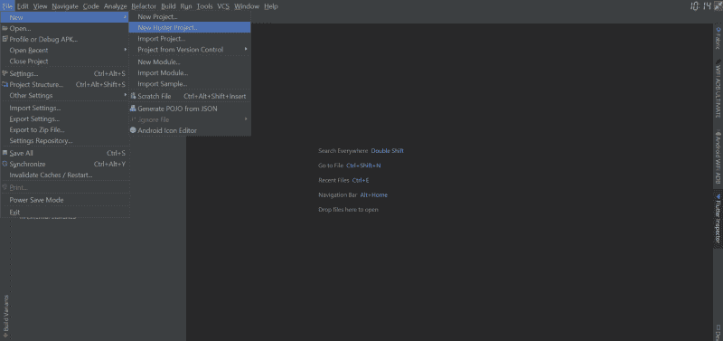

当页面打开时，选择**颤振应用**并点击**下一个**按钮。

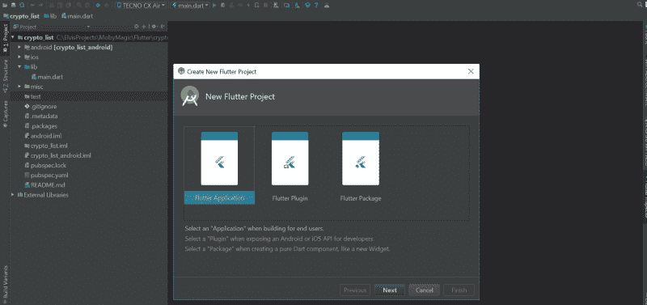

下一页允许您配置项目。您可以使用类似下图的配置。只要确保 Flutter SDK 路径指向你下载 Flutter 的目录。

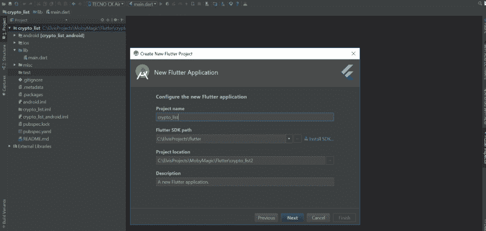

最后一页让您配置您公司的域名，您可以将其设置为任何域名。之后，点击完成按钮。

项目创建应该在单击 finish 按钮后开始，这通常需要几分钟时间。

完成后，您的项目应该是这样的。

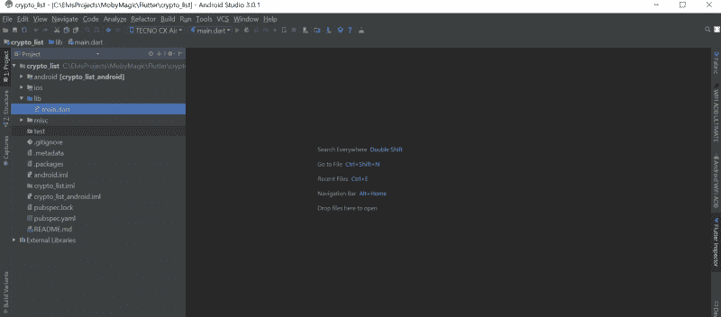

在`lib`文件夹中创建了一个名为`main.dart`的文件。它包含一个演示应用程序的代码。因为我们将从头开始构建我们的应用程序，打开`main.dart`文件，删除/清除其中的所有代码。

如果您的项目包含一个包含文件`widget_test.dart`的`test`目录，请在继续之前删除该文件。它包含对我们刚刚删除的代码的测试。

Flutter 应用程序是用 Dart 编程语言编写的。`main.dart`文件是一个 Dart 源文件(`.dart`扩展名)。Dart 惯例是使用`lowercase_with_underscores`命名源文件。

让我们开始写一些 Dart 代码。我们将从编程传统开始:打印“Hello World！”

为此，我们必须创建一个叫做`main`的函数。`main`函数是每个 Flutter 应用程序都有的顶级函数，用作进入应用程序的入口点。把它想象成房子的入口。

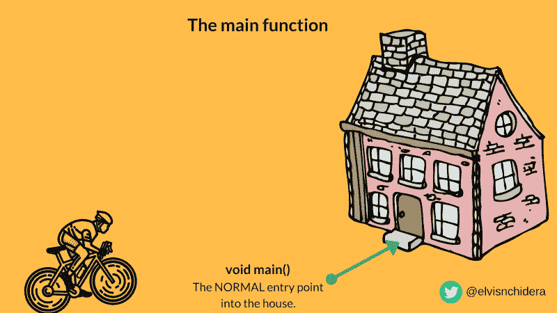

当您在设备上运行应用程序时，将从主函数开始执行。让我们创建一个简单的`main`函数，将下面的代码输入到您的`main.dart`文件中。

如您所见，创建`main`函数很容易。第二行包含`main`函数声明:它的返回类型(`void`)和名称(`main`)。主函数返回`void`，这意味着它不返回任何东西。

第三行打印控制台。我们调用`print`函数并传递一个字符串参数给它。注意，在 Dart 中，当声明字符串文字时，可以使用单引号(`‘string’`)或双引号(`“string”`)。

要运行代码，点击 Android Studio 或 IntelliJ 顶部的绿色 run(播放)按钮。确保您连接了一个实际的设备，或者您有一个运行的[仿真器。](https://flutter.io/setup-windows/)

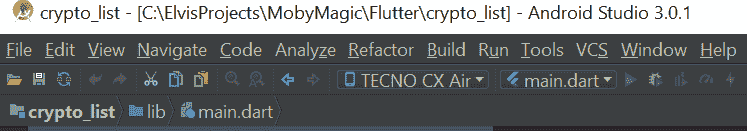

应用程序成功启动后，您应该会看到“Hello World！”印在控制台上。

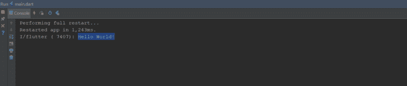

但是如果你检查你的设备或者模拟器，你会看到一些令人失望的东西。

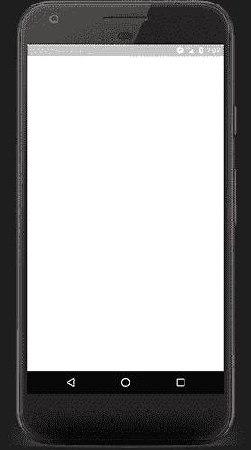

A blank screen

嗯，这是意料之中的，因为我们目前只打印到控制台。没有任何东西添加到应用程序的用户界面，这就是为什么它是空白的。

因此，让我们通过向应用程序 UI 添加一些元素来解决这个问题。我们的应用程序将使用材质设计，所以让我们在`main.dart`文件中添加一个包来帮助我们。

```
import 'package:flutter/material.dart';
```

就像任何现代编程语言一样，您可以导入一个库/包用于您的代码中。这里我们正在导入`material.dart`包。这个包包含代码，帮助我们创建一个材质风格的应用程序。

`material.dart`包有一个函数叫做`runApp`。`runApp`获取一个小部件并将其附加到屏幕上。那么，什么是小部件呢？

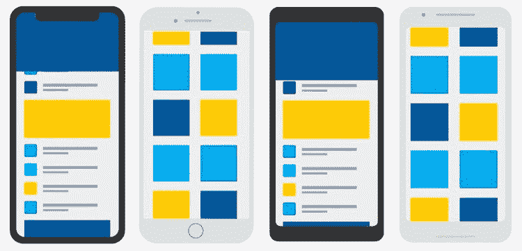

Widgets

您可以将小部件视为视图或 UI 元素。它们是你在设备上运行应用时看到的东西(有些是你看不到的)。在 Flutter 中，你会大量使用小部件，因为主要思想是你的应用程序 UI 完全由小部件组成。

Flutter 已经配备了一套强大的小部件，如文本和图像。我们刚刚导入的`material.dart`包中有几个材质设计小部件，我们很快就会用到。

现在让我们使用`runApp`方法来显示“Hello World！”位于设备屏幕的中央。用下面的代码替换`main`函数的内容。

```
void main() {
  print('Hello World!');

  // Runs the MaterialApp widget
  runApp(new MaterialApp(
    // This is the widget that is displayed first when the application is started normally
    home: new Center(
      // The Text widget is wrapped in a center widget to center it on the screen
      child: new Text('Hello World!'),
    ),
  ));
}
```

让我解释一下上面代码中的一些新东西

1.  `new`:创建一个对象，你通常使用`new`关键字和一个类的*构造函数*。(OOP)
2.  `new MaterialApp()`:我们在这里创建一个名为`MaterialApp`的新 widget 对象。`MaterialApp`小部件创建了材料设计应用程序所需的许多有用的东西。
3.  `home:`:在 Dart 中，我们可以清楚地说出函数/构造函数调用中每个参数的名称。当应用程序正常启动时，首先显示作为`home`参数传入的小部件。
4.  我们将文本小部件包装在一个中心小部件中，这样文本就可以在屏幕上居中显示。文本小部件是中心小部件的子部件。是的，小部件可以嵌套。

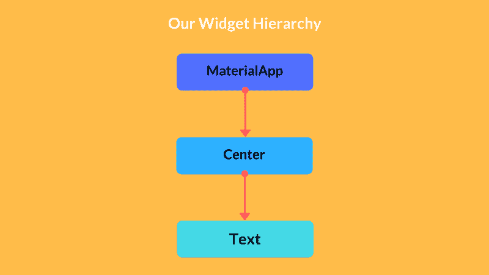

如果您再次运行代码并打开您的设备，您现在应该会看到稍微好一点的屏幕。

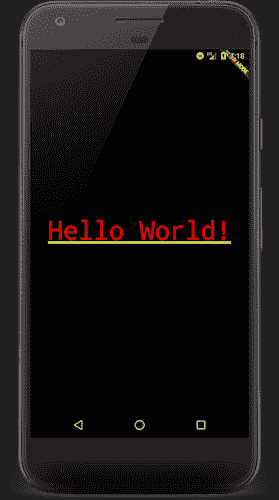

酷！我们能够在设备屏幕中央显示难看的文本。

#### 接下来的步骤

现在让我们向前迈几步。我们将从 [CoinMarketCap API](https://api.coinmarketcap.com/v1/ticker/) 中获取加密货币的价格。API 返回一个 JSON 数组。以下是来自 API 的示例响应:

```
[
    {
        "name": "Bitcoin", 
        "price_usd": "11525.7", 
        "percent_change_1h": "-0.18",
        ...
    },
    ...
]
```

我们将向 CoinMarketCap API 发出请求，并从应用程序中解码 JSON。我们将不得不在`main.dart`文件中加入几个新的包。

```
import 'dart:async';
import 'dart:convert';
import 'package:http/http.dart' as http;
```

以下是新软件包的概述:

1.  `dart:async`:提供了`Future`类，下面我会详细介绍。
2.  `dart:convert`:提供我们将用来解码 JSON 字符串响应的`json`变量。
3.  `package:http/http.dart`:提供我们将用来发出 HTTP GET 请求的函数。

让我们向`main.dart`文件添加一个新函数，该函数向 CoinMarketCap API 发出请求。

```
 Future<List> getCurrencies() async {
  String apiUrl = 'https://api.coinmarketcap.com/v1/ticker/?limit=50';
  // Make a HTTP GET request to the CoinMarketCap API.
  // Await basically pauses execution until the get() function returns a Response
  http.Response response = await http.get(apiUrl);
  // Using the JSON class to decode the JSON String
  return JSON.decode(response.body);
}
```

让我们浏览一下新代码

→ `Future<List>`:我们基本上是说`getCurrencies()`函数会在未来某个时候返回一个`List`。它将向 CoinMarketCap API 发出一个 HTTP 请求，并在完成后返回一个货币的`List`。

`getCurrencies()`函数是异步的。如果你有一些 JavaScript 经验，你可以把`Futures`想象成`Promises`。我制作了下面的图片来帮助你理解 Dart 中的`Futures`。

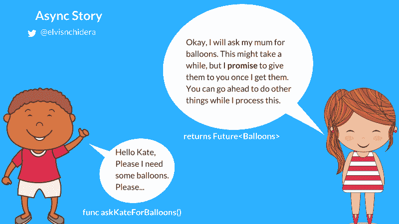

Bob calls the asynchronous function askKateForBalloons() which returns a Future<Balloons>

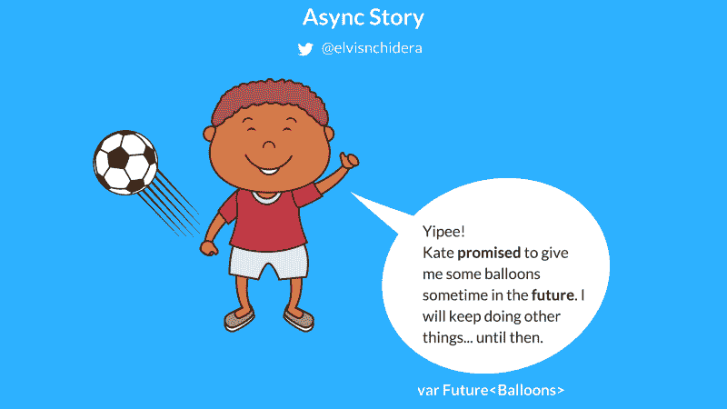

Bob can keep the Future<Balloons>

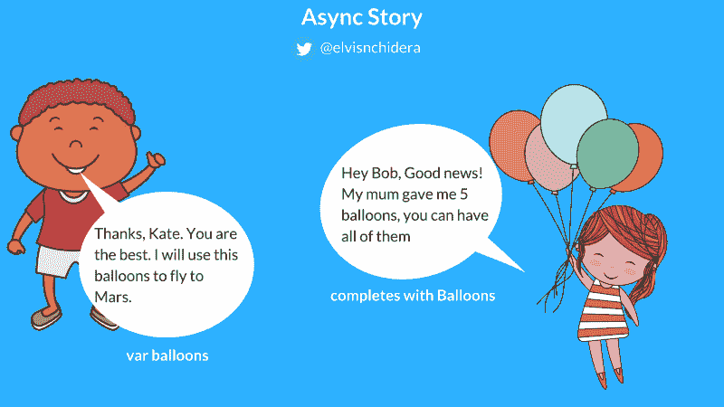

Bob can know when the Future completes

→ `async and await`:

表达式让你编写异步代码，就好像它是同步的一样。`http.get(url)`函数是异步的，当它被调用时立即返回一个`Future<Respon` se >。我们希望等待`r the Re`响应，这样我们就可以解码 JSON 字符串，但是我们也不想使用难看的回调。

`await`表达式对`http.get(url)`求值，然后挂起当前运行的函数(`getCurrencies()`)，直到结果准备好——也就是说，直到未来完成。

要使用`await`，代码必须位于标记为异步的函数中。一个`async`函数是一个体标有`async`修饰符的函数。当你调用一个`async`函数时，它立即返回一个 Future。函数体被安排在以后执行。

你可以在这里阅读更多关于飞镖[中`async`和`await`的内容。](https://www.dartlang.org/articles/language/await-async)

→ `http.get(url)`:向 CoinMarketCap API 发出 HTTP GET 请求。这个函数是异步的，会立即返回一个未来值。

1.  `JSON.decode(response.body)`:解码 JSON 字符串响应。

让我们测试一下我们刚刚创建的`getCurrencies()`函数。我们通过在我们的`main`函数中调用它并将返回值打印到控制台来实现。

```
// Since we are using await within the main function, we have to make it asynchronous too
void main() async {
  // Testing the getCurrencies function
  // We wait for the currency data to arrive
  List currencies = await getCurrencies();
  // Before printing it to the Console
  print(currencies);

  runApp(new MaterialApp(
    home: new Center(
      child: new Text('Hello World!'),
    ),
  ));
```

如果您运行上面的代码，您应该会看到输出到控制台的 API 响应。

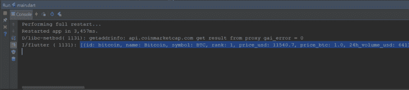

嗯，在现实世界中，坏事可能会发生。例如，您可能没有连接到 internet，因此对 CoinMarketCap API 的请求将会失败。对于本教程，我们将假设我们在 [Wakanda](https://en.wikipedia.org/wiki/Wakanda_(comics)) 中。

在生产应用程序中，您必须处理网络故障。您可以通过将 HTTP 调用放在一个`[try…catch](https://www.dartlang.org/guides/libraries/futures-error-handling)`块中来实现。

#### 构建用户界面

现在我们有了一个货币列表，让我们继续构建 UI 来显示这个列表。

编写 Flutter 应用程序时，通常会创建新的小部件类。小部件的主要工作是实现一个`build`函数，它用其他更低级别的小部件来描述小部件。

让我们创建一个名为 CryptoListWidget 的新小部件。将下面的代码添加到您的`main.dart`文件的底部。

```
class CryptoListWidget extends StatelessWidget {

  // This is a list of material colors. Feel free to add more colors, it won't break the code
  final List<MaterialColor> _colors = [Colors.blue, Colors.indigo, Colors.red];
  // The underscore before a variable name marks it as a private variable
  final List _currencies;

  // This is a constructor in Dart. We are assigning the value passed to the constructor
  // to the _currencies variable
  CryptoListWidget(this._currencies);

  @override
  Widget build(BuildContext context) {
    // Build describes the widget in terms of other, lower-level widgets.
    return new Text('Hello World!');
  }

}
```

让我们浏览一下上面的新代码:

1.  `StatelessWidget`:你通常会创建`[StatelessWidget](https://stackoverflow.com/questions/47501710/stateful-vs-stateless-widgets-in-flutter)` [或者`StatefulWidget`](https://stackoverflow.com/questions/47501710/stateful-vs-stateless-widgets-in-flutter) 的子类，这取决于你的小部件是否管理任何状态。我们使用`StatelessWidget`是因为我们已经有了我们的数据，我们不会在本教程中更新它。
2.  `final List<MaterialColor> _`colors:Variables `in a Stateless`Widget shou`ld be`final(表示它们是常数或者不变)。这里我们是 declarer`ing a`final 变量，它包含一个 Li`st of Materia`lcolor。变量名前的下划线`c` ore (_)使其成为私有的(其他类不可访问)。
3.  这是我们小部件的构造函数。它将我们传递给构造函数的货币列表赋给变量`_currencies`。
4.  `build`函数:build 方法返回一个描述外观的底层小部件(`Text`)。

让我们用一个名为`Scaffold`的新部件替换上面的`build`函数中的文本部件。`Scaffold`小部件实现了基本的材料设计可视化布局结构。用下面的功能替换上面的`build`功能。

```
@override
  Widget build(BuildContext context) {
    return new Scaffold(
      body: _buildBody(),
      backgroundColor: Colors.blue,
    );
  }
```

Scaffold 类提供了显示抽屉、浮动操作按钮、底部栏、小吃栏等的 API。我们稍后将添加一个浮动的动作按钮。

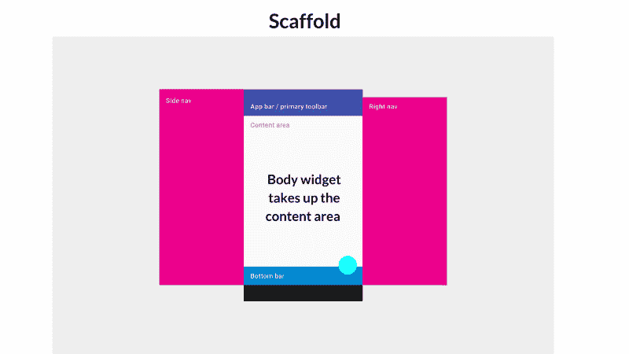

您会收到警告:没有为类`CryptoListWidget`定义`_buildBody()`。让我们继续在`CryptoListWidget`类中创建`_buildBody()`函数。

```
Widget _buildBody() {
    return new Container(
      // A top margin of 56.0\. A left and right margin of 8.0\. And a bottom margin of 0.0.
      margin: const EdgeInsets.fromLTRB(8.0, 56.0, 8.0, 0.0),
      child: new Column(
        // A column widget can have several widgets that are placed in a top down fashion
        children: <Widget>[
          _getAppTitleWidget(),
          _getListViewWidget()
        ],
      ),
    );
  }
```

这里的语法应该很熟悉。我们正在使用两个新的部件:

1.  `Container`widget:`[Container](https://docs.flutter.io/flutter/widgets/Container-class.html)`widget 只是一个容器:)(用于其他 widget)。
2.  Column 小部件:一个`[Column](https://docs.flutter.io/flutter/widgets/Column-class.html)`小部件在垂直方向上布局一个子小部件列表。它有一个名为`children`的参数，接受一个小部件列表。

让我们创建在`_buildBody()`函数中调用的两个函数。第一个是`_getAppTitleWidget()`。

```
Widget _getAppTitleWidget() {
    return new Text(
      'Cryptocurrencies',
      style: new TextStyle(
          color: Colors.white,
          fontWeight: FontWeight.bold,
          fontSize: 24.0),
    );
  }
```

该函数返回一个常规的`Text`小部件，其样式是粗体和白色，字体大小为 24.0。

当我们运行应用程序时，文本看起来会像这样。

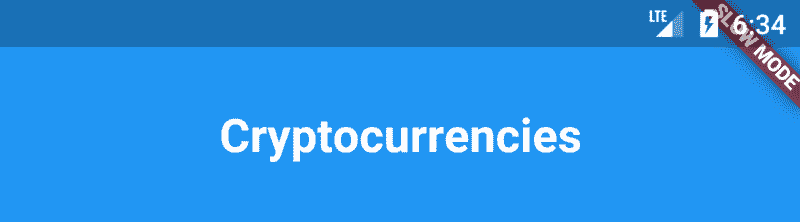

我们还不能运行这个应用程序，因为我们还没有创建另一个名为`_getListViewWidget()`的函数。让我们使用下面的代码快速创建它。

```
Widget _getListViewWidget() {
    // We want the ListView to have the flexibility to expand to fill the
    // available space in the vertical axis
    return new Flexible(
        child: new ListView.builder(
            // The number of items to show
            itemCount: _currencies.length,
            // Callback that should return ListView children
            // The index parameter = 0...(itemCount-1)
            itemBuilder: (context, index) {
              // Get the currency at this position
              final Map currency = _currencies[index];

              // Get the icon color. Since x mod y, will always be less than y,
              // this will be within bounds
              final MaterialColor color = _colors[index % _colors.length];

              return _getListItemWidget(currency, color);
            }));
  }
```

`_getListViewWidget()`返回一个包装在`Flexible`小部件中的`ListView`小部件。我们使用`ListView.builder`来轻松创建列表。我们传入一个`itemCount`，它告诉生成器要显示多少种货币。

将为每个项目调用`itemBuilder`回调，并且您必须返回一个新的小部件。在上面的代码中，我们调用了一个名为`_getListItemWidget()`的函数来返回一个小部件。

```
CircleAvatar _getLeadingWidget(String currencyName, MaterialColor color) {
    return new CircleAvatar(
      backgroundColor: color,
      child: new Text(currencyName[0]),
    );
  }
```

在我们创建`_getListItemWidget()`函数之前，让我们快速创建 ListView item 小部件的各个元素。我们希望 ListView 中的每个项目看起来像这样:


因此，我们有三个主要的部件:

1.  带有货币名称第一个字符的圆形图标小部件
2.  带有货币名称的文本小部件
3.  一个文本小部件，显示 1 小时内的价格和百分比变化。

```
Text _getTitleWidget(String currencyName) {
    return new Text(
      currencyName,
      style: new TextStyle(fontWeight: FontWeight.bold),
    );
  }

  Text _getSubtitleWidget(String priceUsd, String percentChange1h) {
    return new Text('\$$priceUsd\n1 hour: $percentChange1h%');
  }
```

让我们创建小部件。为了简单起见，我为它们每个都创建了一个函数。第一个名为`_getLeadingWidget()`的函数返回带有文本的圆形图标。

小部件将如下所示:

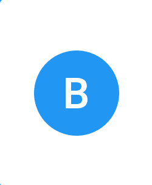

第二个名为`_getTitleWidget`的函数返回货币名称的`Text`小部件。

第三个名为 _getSubtitleWidget()的函数返回货币当前价格和 1 小时内百分比变化的`Text`小部件。

这两个小部件应该如下所示:

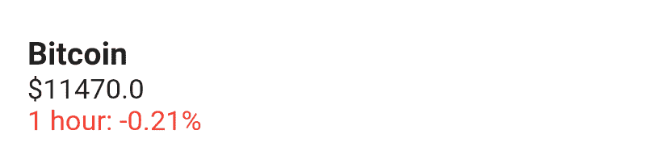

让我们将这三个小部件包装在一个叫做`ListTile`的小部件中。`ListTile`小工具基于[材料设计列表](https://material.io/guidelines/components/lists.html)文档。它以这种风格显示了所有三个小部件。


我们将创建一个名为`_getListTile`的新函数，它返回一个`ListTile`小部件。

```
ListTile _getListTile(Map currency, MaterialColor color) {
    return new ListTile(
      leading: _getLeadingWidget(currency['name'], color),
      title: _getTitleWidget(currency['name']),
      subtitle: _getSubtitleWidget(
          currency['price_usd'], currency['percent_change_1h']),
      isThreeLine: true,
    );
  }
```

最后，让我们创建`_getListItemWidget()`。它将返回一个顶部填充为 5.0 的`Container`小部件，并且有一个`Card`小部件子部件。卡片小部件有由`_getListTile`返回的`ListTile`作为它的子部件。

```
Container _getListItemWidget(Map currency, MaterialColor color) {
    // Returns a container widget that has a card child and a top margin of 5.0
    return new Container(
      margin: const EdgeInsets.only(top: 5.0),
      child: new Card(
        child: _getListTile(currency, color),
      ),
    );
  }
```

小部件将如下所示。

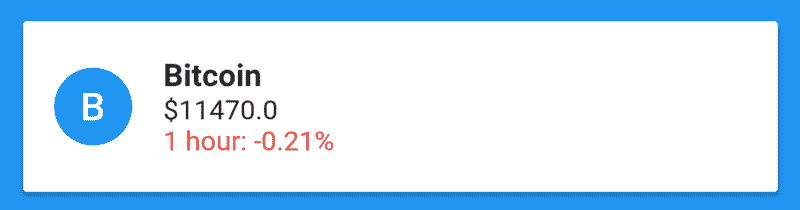

我们已经成功完成了我们的`CryptoListWidget`。但是我们必须更新`main`函数来显示新创建的小部件，而不是`Text`小部件。

```
void main() async {
  // Bad practice alert :). You should ideally show the UI, and probably a progress view,
  // then when the requests completes, update the UI to show the data.
  List currencies = await getCurrencies();
  print(currencies);

  runApp(new MaterialApp(
    home: new CryptoListWidget(currencies),
  ));
}
```

就是这样。你可以再次点击运行按钮。如果一切正常，并且您已连接到互联网，您应该会看到如下所示的屏幕。

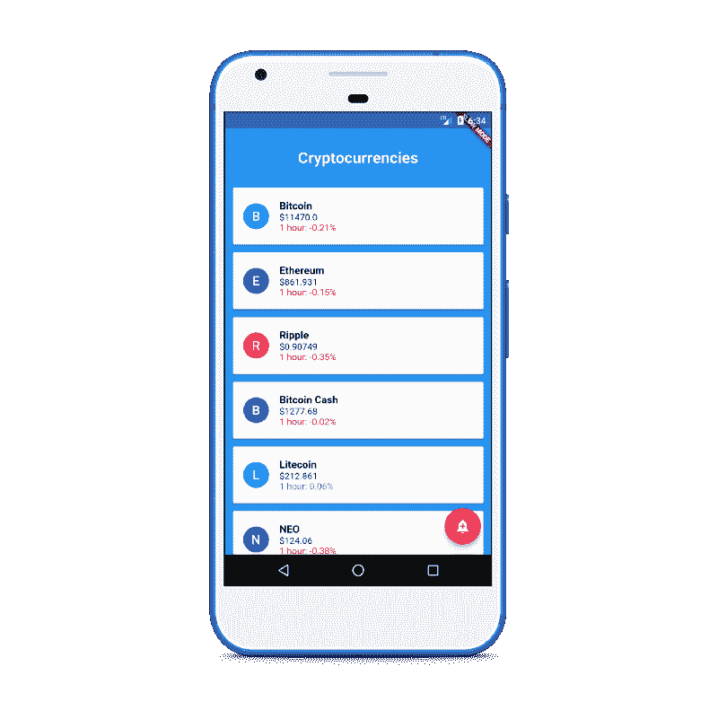

很酷吧？

您看到的应用程序将与上面的截图略有不同:

1.  它的右下角没有浮动的动作按钮。
2.  1 小时内百分比变化的文本颜色为黑色。

我决定不把它们包含在教程中。但是你可以检查项目 [Github 库](https://github.com/Elvis10ten/FlutterCryptocurrencyListApp)来看看我是如何实现它的。

完成的 app 可以在这里下载[。](https://drive.google.com/file/d/1awcyZCsbeM3qiNHgBb_Jx-On2N3lEh9F/view?usp=sharing)

感谢你的阅读，希望你和我一样喜欢 Flutter。如果您有任何问题、建议等，请随时在下面留下您的评论。