# 如何在物联网平台上使用 TensorFlow 进行声音分类

> 原文：<https://www.freecodecamp.org/news/how-to-use-sound-classification-with-tensorflow-on-an-iot-platform-8997eb7bbdef/>

尼古拉·哈巴罗夫

# 如何在物联网平台上使用 TensorFlow 进行声音分类

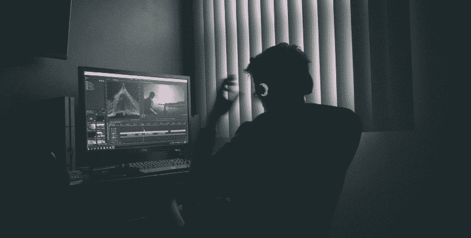

### 介绍

人类语音识别有许多不同的项目和服务，如 Pocketsphinx、Google 的语音 API 等。这类应用和服务可以识别语音，并以相当高的准确度将其转换为文本。但是它们都不能确定麦克风捕捉到的不同声音。记录了什么:人类的语言，动物的声音，还是音乐演奏？

我们面临着这项任务，并决定调查和建立几个样本项目，这些项目将能够使用机器学习算法对不同的声音进行分类。

本文描述了我们选择了哪些工具，我们面临了哪些挑战，我们如何为 TensorFlow 训练我们的模型，以及如何运行我们的开源项目。

我们还可以向 [DeviceHive](https://devicehive.com/?utm_source=medium&utm_medium=social&utm_campaign=d-spring-2018) (物联网平台)提供识别结果，以便在云服务中用于第三方应用。

### 选择工具和分类模型

首先，我们需要选择哪种软件最适合神经网络。我们找到的第一个合适的解决方案是 [Python 音频分析](https://github.com/tyiannak/pyAudioAnalysis)。

机器学习的主要问题是找到一个好的训练数据集。有许多用于语音识别和音乐分类的数据集，但用于随机声音分类的数据集不多。经过一番研究，我们找到了[城市声音数据集](https://serv.cusp.nyu.edu/projects/urbansounddataset/)。

经过一些测试后，我们面临以下问题:

*   pyAudioAnalysis 不够灵活。它不需要各种各样的参数，其中一些参数是动态计算的(例如，基于样本数量的训练实验数量——您无法改变这一点)。
*   数据集只有 10 个类，而且都是“城市”

我们找到的下一个解决方案是[谷歌音频集](https://research.google.com/audioset/index.html)。它基于标记的 YouTube 视频片段，可以以两种格式下载:

1.  描述每个片段的 YouTube 视频 ID、开始时间、结束时间以及一个或多个标签的 CSV 文件。
2.  提取的音频特征存储为 TensorFlow 记录文件。

这些功能与 [YouTube-8M 型号](https://research.google.com/youtube8m/index.html)兼容。该解决方案还使用 [TensorFlow VGGish 模型](https://github.com/tensorflow/models/tree/master/research/audioset)作为特征提取器。它涵盖了我们的许多需求，因此是我们的最佳选择。

### 训练模型

下一个任务是弄清楚 YouTube-8M 接口是如何工作的。它是为视频设计的，但幸运的是也可以处理音频。这个库非常灵活，但是它有一些硬编码的示例类。所以我们稍微修改了一下，将类的数量作为参数传递。

YouTube-8M 可以处理两种类型的数据:聚合要素和框架要素。正如我们之前提到的，Google AudioSet 可以提供数据作为特性。通过进一步的研究，我们发现这些特性是帧格式的。然后，我们需要选择要训练的模型。

### 资源、时间和准确性

GPU 是比 CPU 更适合机器学习的选择。你可以在这里找到更多关于这个[的信息。因此，我们将跳过这一点，直接进入我们的设置。在我们的实验中，我们使用了一台配有一个 NVIDIA GTX 970 4GB 的 PC。](https://docs.devicehive.com/blog/using-gpus-for-training-tensorflow-models?utm_source=medium&utm_medium=social&utm_campaign=d-spring-2018)

在我们的案例中，训练时间并不重要。我们应该提到，一两个小时的培训足以对所选模型及其准确性做出初步决定。

当然，我们希望获得尽可能高的精度。但是为了训练一个更复杂的模型(可能更精确)，你需要更多的内存(对于 GPU 来说是视频内存)来容纳它。

### 选择模型

YouTube-8M 型号的完整列表及其说明可在[此处](https://github.com/google/youtube-8m#overview-of-models)获得。因为我们的训练数据是帧格式的，所以必须使用帧级模型。Google AudioSet 为我们提供了一个分成三部分的数据集:平衡训练、不平衡训练和评估。你可以在这里获得更多关于他们[的信息。](https://research.google.com/audioset/download.html)

YouTube-8M 的修改版本用于训练和评估。这里有[这里有](https://github.com/igor-panteleev/youtube-8m)。

#### 平衡列车

训练命令如下所示:

*python train . py–train _ data _ pattern =/path _ to _ data/audioset _ v1 _ embeddings/bal _ train/*。TF record–num _ epochs = 100–learning _ rate _ decay _ examples = 400000–feature _ names = audio _ embedding–feature _ size = 128–frame _ features–batch _ size = 512–num _ classes = 527–train _ dir =/path _ to _ logs–model = model name*

对于 LstmModel，我们按照文档建议将基本学习率更改为 0.001。此外，我们将 lstm_cells 的默认值更改为 256，因为我们没有足够的 RAM 来容纳更多。

让我们看看训练结果:

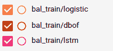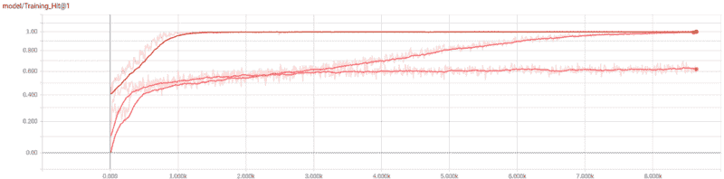

型号名称培训时间培训最后一步命中率评估平均命中率 14m 3s 0.58590.5560 dbof 31m 46s 1.0000.5220 lstm 1h 45m 53s 0.98830.4581

如您所见，我们在培训阶段取得了良好的结果，但这并不意味着我们会在全面评估中取得良好的结果。

#### 不平衡列车

然后我们尝试了不平衡的训练数据集。它有更多的样本，所以我们将训练时期的数量更改为 10(至少应该更改为 5，因为它需要大量的时间来训练)。

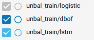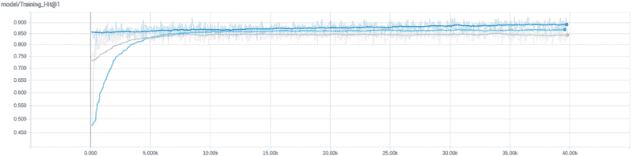

型号名称训练时间训练最后一步命中率评估平均命中率 2h 4m 14s 0 . 87500 . 5125 dbof 4h 39m 29s 0 . 88805 lst M9 h 42m 52s 0 . 86501 . 86565665666

### 火车日志

如果你想查看我们的训练日志，你可以下载并解压 [train_logs.tar.gz](https://s3.amazonaws.com/audioanalysis/train_logs.tar.gz) 。然后运行*tensor board–logdir/path _ to _ train _ logs/*进入 [http://127.0.0.1:6006](http://127.0.0.1:6006/)

### 关于培训的更多信息

YouTube-8M 需要很多参数，其中很多参数会影响训练过程。

例如:你可以调整学习速度和将会大大改变训练过程的时期数。还有三个不同的损失计算函数和许多其他有用的变量，您可以调整和更改以改善结果。

### 使用具有音频捕获设备的训练模型

既然我们已经有了一些经过训练的模型，是时候添加一些代码来与它们进行交互了。

### 捕获麦克风

我们需要以某种方式从麦克风捕捉音频数据。我们用了 [PyAudio](https://pypi.python.org/pypi/PyAudio) 。它提供了一个简单的接口，可以在大多数平台上工作。

### 声音准备

正如我们之前提到的，我们使用 TensorFlow VGGish 模型作为特征提取器。下面是转换过程的简短说明:

来自 UrbanSound 数据集的“狗叫”示例用于可视化。

将音频重新采样为 16 kHz 单声道。

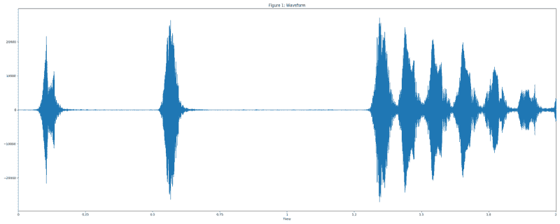

使用窗口大小为 25 ms、窗口跳跃为 10 ms、周期[汉恩窗口](https://en.wikipedia.org/wiki/Hann_function)的短时傅立叶变换的幅度计算频谱图。

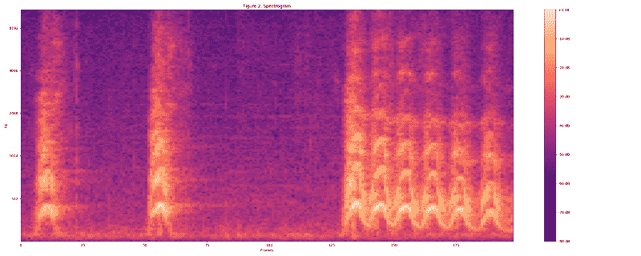

通过将谱图映射到 64 个 mel 箱来计算 mel 谱图。

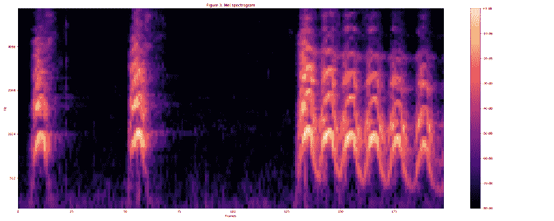

通过应用 log(mel-spectrum + 0.01)计算稳定的 log mel 谱图，其中使用偏移以避免取零的对数。

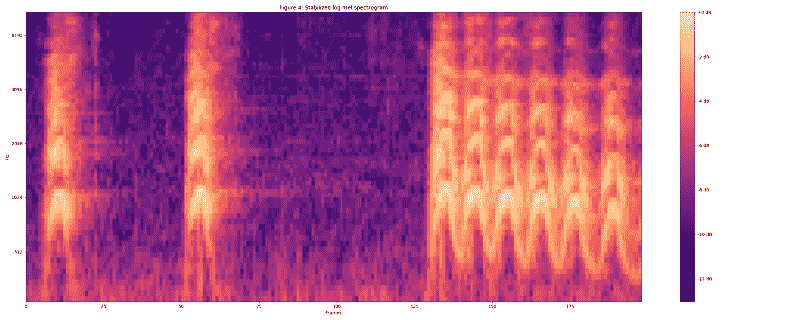

然后将这些特征组织成 0.96 秒的非重叠例子，其中每个例子覆盖 64 个 mel 带和 96 个 10 ms 的帧。

这些例子然后被输入到 VGGish 模型中以提取嵌入。

### 表示中心名词属性的

最后，我们需要一个接口将数据输入神经网络并得到结果。

我们使用 YouTube-8M 接口作为示例，但是对其进行了修改，删除了序列化/反序列化步骤。

在这里，你可以看到我们工作的成果。让我们仔细看看。

### 装置

PyAudio 使用 libportaudio2 和 portaudio19-dev，所以你需要安装它们才能让它工作。

需要一些 Python 库。您可以使用 pip 安装它们。

*pip install-r requirements . txt*

您还需要下载归档文件，并将其与保存的模型一起解压缩到项目根目录下。这里可以找到[。](https://s3.amazonaws.com/audioanalysis/models.tar.gz)

### 运转

我们的项目提供了三个接口供使用。

1.处理预先录制的音频文件

只需运行*python parse _ file . py path _ to _ your _ file . wav*就能在终端看到类似*演讲:0.75，音乐:0.12，室内，大房间或大厅:0.03*

结果取决于输入文件。这些值是神经网络做出的预测。较高的值意味着输入文件属于该类的几率较高。

#### 2.捕捉和处理来自麦克风的数据

*python capture.py* 启动从您的麦克风中无限捕获数据的过程。它将每隔 5-7 秒向分类界面提供数据(默认)。您可以在前面的示例中看到结果。

您可以使用*–save _ path =/path _ to _ samples _ dir/*运行它，在这种情况下，所有捕获的数据都将存储在提供的目录中的 *wav* 文件中。如果您想用相同的示例尝试不同的模型，此功能非常有用。使用*–帮助*参数获取更多信息。

#### 3.网络界面

*python daemon.py* 实现了一个简单的 web 接口，在 [http://127.0.0.1:8000](http://127.0.0.1:8000/) 上默认可用。我们使用了与上一个例子相同的代码。在 events([http://127 . 0 . 0 . 1:8000/events](http://127.0.0.1:8000/events))页面可以看到最后十个预测。

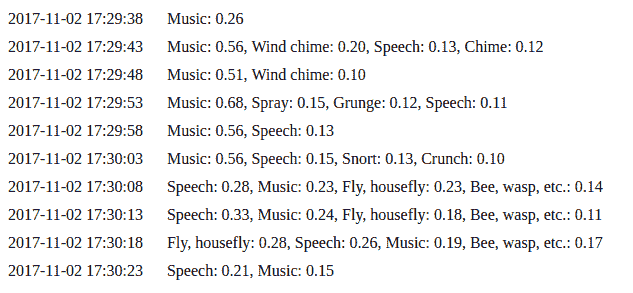

### 物联网服务集成

最后但同样重要的是与物联网基础设施的集成。如果您运行我们在上一节中提到的 web 界面，那么您可以在索引页面上找到 DeviceHive 客户端状态和配置。只要客户端连接，预测将作为通知发送到指定的设备。

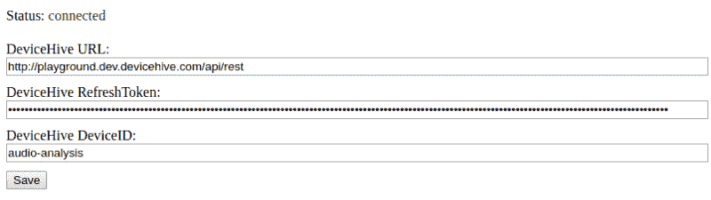

### 结论

正如你所看到的，TensorFlow 是一个非常灵活的工具，可以在许多机器学习应用程序中提供帮助，如图像和声音识别。拥有这样的解决方案和物联网平台，您可以在非常广阔的领域构建智能解决方案。

智能城市可以将此用于安全目的，持续监听碎玻璃、枪声和其他与犯罪相关的声音。即使在雨林中，这种解决方案也可以通过分析野生动物或鸟类的声音来追踪它们。

物联网平台可以传递所有此类通知。这个解决方案可以安装在本地设备上(尽管它仍然可以作为云服务部署在某个地方),以最小化流量和云费用。它还可以被定制为只发送通知，而不包括原始音频。不要忘记这是一个开源项目，所以请放心使用。

由 [DeviceHive](https://devicehive.com/?utm_source=medium&utm_medium=social&utm_campaign=d-spring-2018) 的联合创始人尼古拉·哈巴罗夫(Nikolay Khabarov)撰写。