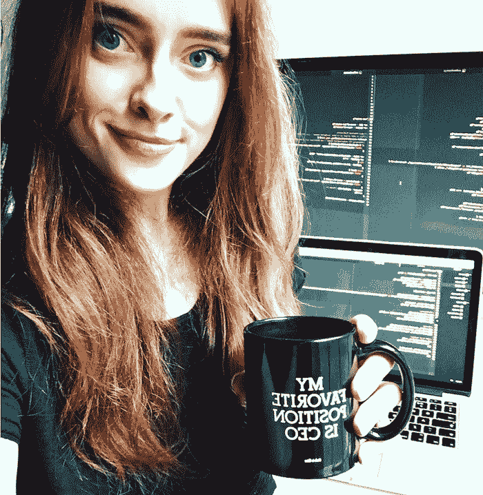
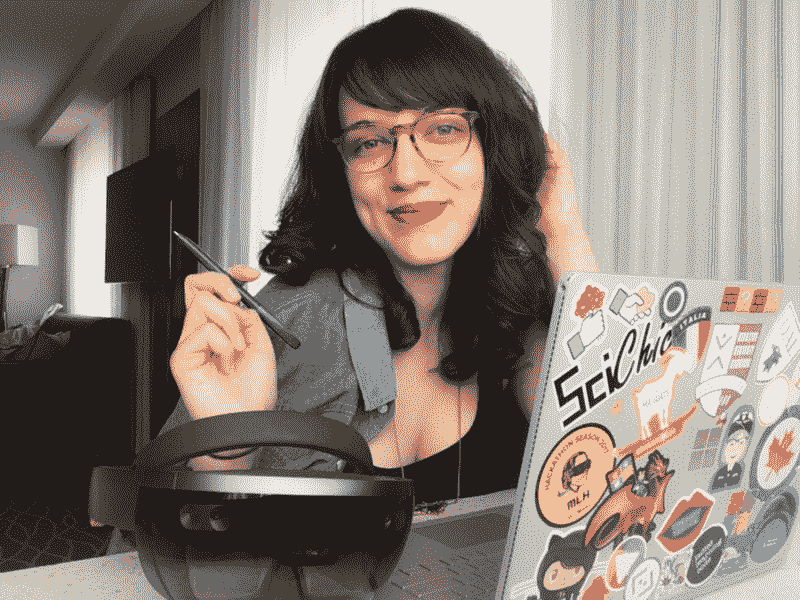
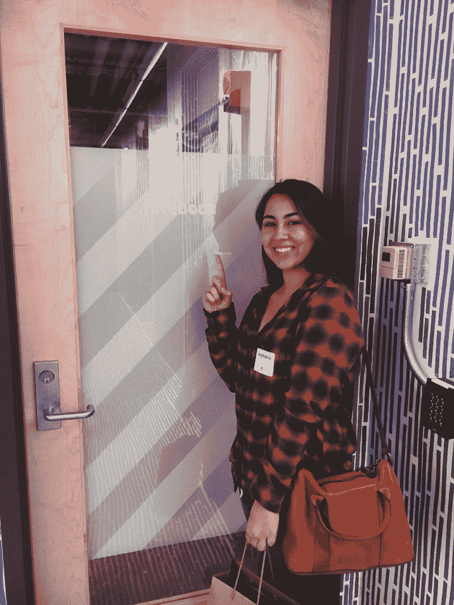
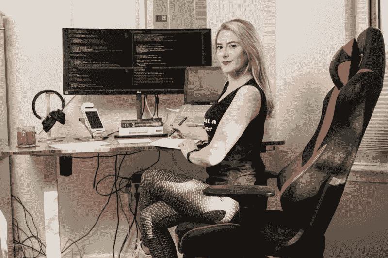
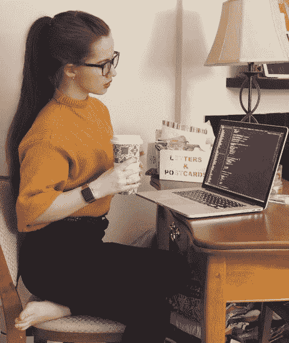
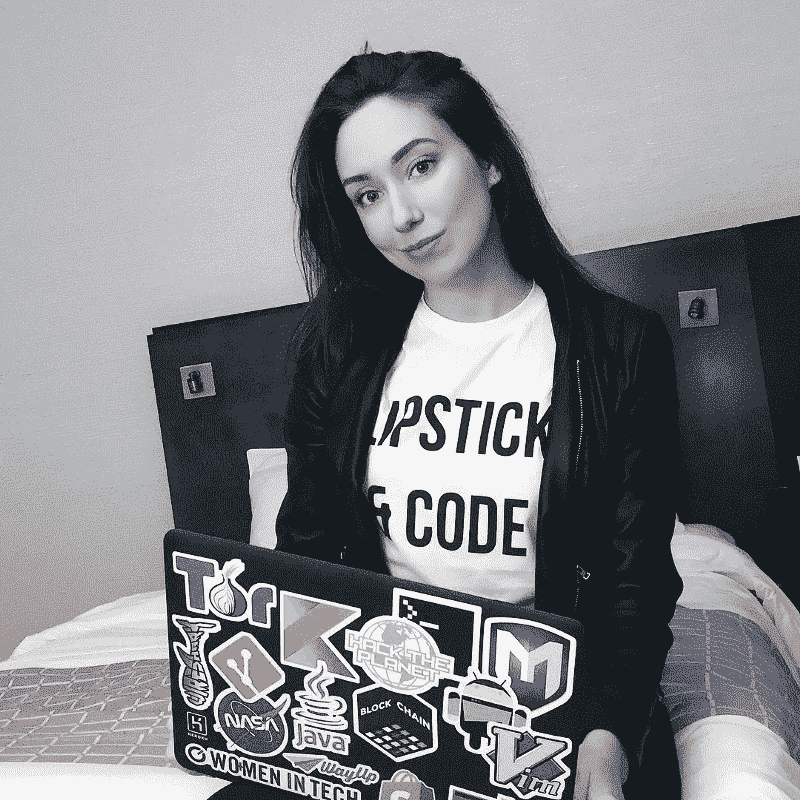

# 来自 Instagram 的九位技术女孩的技术面试技巧

> 原文：<https://www.freecodecamp.org/news/top-tips-for-technical-interviews-from-9-of-instagrams-tech-girls-9d1b576bc287/>

作者瑞秋

# 来自 Instagram 的九位技术女孩的技术面试技巧

我的求职在几周前结束了。经过没完没了的电话面试、编码挑战和现场考察，我得到了三份软件工程的工作邀请。(另一篇文章中有更多相关内容)。我从 11 月份开始准备，那时我的计算机科学硕士项目已经毕业了。所以我经历了三个月的失败、沮丧和被拒绝**(也就是学习和变得更好)**。

我现在满脑子都是关于我做错的事情和我开始面试时不理解的事情的建议。我希望这篇文章主要是关于态度、方法和什么是重要的提示和建议，而不是“学什么”的指南。因此，我请我最喜欢的 Instagram 账户背后的一些女士与我合作(其中一些人自己进行过技术采访)。

#### 在面试目前的工作/实习时，我们每个人都有独特的见解和经验，所以希望这篇文章是全面的。它来自世界各地的女性工程师，来自一系列行业和职位。

**Top Row (L-R):** Robyn Silber, Sage Franch, Stephanie Angulo. **Middle Row (L-R):** Johna Rutz, Rachel Slater, Olivia Shanley. **Bottom Row (L-R):** Lea Coligado, *Kristina Balaam, Alison Falk.*

所以现在开始:

### **1。瑞秋:你可以做你自己。**

瑞秋(Instagram 上的我— [@secretlifeofcode](https://www.instagram.com/secretlifeofcode/) )是伦敦大学学院计算机科学硕士毕业生。她是 GSoC-er(谷歌代码之夏)，也是 She++ London 的社区负责人。她是爱尔兰人，但已在世界各地生活过(巴黎、伦敦、旧金山、北卡罗来纳)。Rachel 很快将搬回西海岸从事她的第一份软件工程工作，她对医疗技术和所有健康的东西都很着迷。

Instagram: [@secretlifeofcode](https://www.instagram.com/secretlifeofcode/)

根据我的经验，我能给出的最诚实的建议是，你可以做你自己。

当我回想起我的第一次现场时，我有点畏缩。不是因为我在技术问题上的表现，而是因为我觉得我不能做我自己。

那天早上准备的时候，我戴上了眼镜，没有化妆，头发盘了起来，穿着我能找到的最单调的衣服。我以为我会融入更多。快进到我最近一次在一家大型科技公司的面试，我采取了“去他妈的”的态度。我穿上每天都穿的皮夹克，放下头发，化好所有平常的妆。我感觉像是我自己，而不像是一个刻板的伪君子，应该符合我认为他们想要的任何刻板印象。很顺利。

我从这次采访中学到了很多。我发现“做你自己”不仅仅是个性和外表。在我开始面试之前，我想象着被问到我完全不知道如何回答的问题，想象着当我坐在面试官的对面时有多容易被吓到。但我意识到，有信心坦率地说“哦，我其实不知道”会感到轻松和自然。在这种情况下，问题是“TCP 和 UDP 协议之间有什么区别？”\_(ツ)_/

但是，同样放松和自然的是，有信心以一种合乎逻辑、连贯的方式(而不是恐慌)解决你从未梦想过在 30 分钟内解决的编码问题。

在过去的几个月里，我被问了一些非常难的技术问题(想想极客给极客的 4.5 分)，但我现在明白了，他们的目的是评估我是如何思考和处理难题的。

在这种情况下，面试官明确表示我不一定要写代码——只要把它说出来，并找出解决方案。所以，给他们他们想要的！在你默默地盯着问题并想出解决办法之前，立即大声说出来。面试官感兴趣的是你是如何做到这一点的——并不总是多快或多完美。

一句话:保持冷静，明白你不必完美是关键。

### *2。Lea:将你无法控制的事情具体化。*

Lea(她/她)目前是谷歌本地搜索和谷歌地图的软件工程师。斯坦福大学计算机科学毕业生，曾在苹果公司和脸书实习。她是硅谷女性的创始人，这是一个模仿纽约人的交叉女权主义摄影系列。

Instagram: [@leacoligado](https://www.instagram.com/leacoligado/)

一定要和朋友一起练习技术面试。让一个同伴扮演一个小时的“面试官”，这样你就可以在另一个人面前练习白板算法。研究你申请的公司的项目，并准备好和面试官谈论这些项目。

做网络，或者其他对你有意义的事情。即使你不认识你申请的公司里的任何人，也可以在网上找到招聘人员的电子邮件，询问申请技巧或参观校园。

作为候选人，你有权让你的问题得到解答，你会惊讶有多少人愿意帮助你。我曾经请一位我不认识的工程师带我参观一下 Twitter，他们照做了。我甚至没有推特。

不要弄坏你受邀去的科技公司的任何家具。在一次现场面试中，我打翻了一个花瓶，打翻了我的咖啡，打碎了一个卫生间的门。这家公司将保持匿名。

一定要将你无法控制的事情具体化。技术性就业市场中有太多系统性的不公正，会对你作为候选人的待遇产生负面影响，尤其是如果你是有色人种、女性、TGI 人(跨性别者、性别酷儿、阴阳人)和/或不同能力的人。

当我在斯坦福大学的时候，我听到了很多事情，从多次纠正面试官后用错误的代词称呼朋友，到面试官过分关注他们的头发或衣服。

因此，如果你觉得除了你的编码能力和团队合作能力之外，你还在接受其他方面的评估，那么问题可能不在你。记住这一点。

一定要内化你的成功和小胜利，这些都是你可以控制的。如果你在面试中表现出色，承认这一点，并为此感到高兴。如果你没有，就去学习，从中学到你错过的东西。下次尽力而为。

### 3.圣人:问对你重要的问题。

Sage Franch，又名 [theTrendyTechie](https://www.instagram.com/thetrendytechie/) ，是一名开发人员、区块链教育家、企业家和科技生活博客 TrendyTechie.ca 的创建者。她专门研究区块链、混合现实和认知计算，并对利用新兴技术建设更美好的未来充满热情。

Instagram: [@thetrendytechie](https://www.instagram.com/thetrendytechie/)

面试不是你通过或失败的测试，而是你和公司确定你们是否合适的机会。

众所周知，你应该在面试中提问——但是不要仅仅因为你认为你应该提问就提问。想知道什么就问吧。

在面试之前，列一个清单，列出你想要得到这份工作需要做到的事情。公司文化对你来说重要吗？他们使用的编程语言或操作系统？队里的性别比例？

这些是你应该问的问题。当谈到编码组件时，解释你的整个思维过程。你展示的批判性思维技巧比完美的语法更重要。

### 4.艾莉森:面试官想看到你的激情。

*Alison 是一家医疗解决方案公司的前端应用程序开发人员。除了朝九晚五的工作时间，她还是一名内衣模特，并参加了乔治华盛顿大学的网络安全工程硕士项目。她是 [@momscancode](https://www.instagram.com/momscancode/) 的助理教练，也是[@ the menofxtech](https://www.instagram.com/thewomenofsextech/)的成员。*

Instagram: [@falkyou](https://www.instagram.com/falkyou/)

当我作为一名前端开发人员开始我的面试过程时，我真的患有冒名顶替综合症，因为我刚刚从训练营出来。一个朋友给了我一个非常棒的建议，我永远不会忘记。

> “找人做这项工作真的很容易。但是很难找到一个对他们将要做的工作充满热情的人。这也是我在面试新团队成员时寻找的东西。”

这个建议促使我努力在简历中展示我的激情，并且能够当面讨论它。

因此，除了学习代码，我还在网上平台上写我在科技领域的经历，参加聚会交流和学习新技能，开始从事自由职业以建立一个作品集，并在寻求帮助的组织中担任志愿者，教授他人简单的编码技能。

在被目前的工作聘用后，我发现尽管我在代码方面还有很多东西要学，他们还是选择让我加入团队，因为我表现出了作为一名新开发人员学习和成长的热情和兴奋。

### 5.斯蒂芬妮:进行对话，而不是采访。

斯蒂芬妮是洛杉矶一所小型文理学院西方学院的计算机科学专业学生。她曾在谷歌、脸书、美国国家航空航天局喷气推进实验室等公司工作过，很快又加入了 Twitter。

Instagram: [@stephcodes](https://www.instagram.com/stephcodes_/)

技术面试很耗脑力！我仍在学习如何生存的技巧和诀窍。以下是我从他们身上学到的一些最有用的东西:

#1 大声思考——这可能是人们在技术面试中给你的最常见/最通用的建议(但这不会降低它的重要性)。说出你所想的一切，不管你认为自己听起来有多傻。这让面试官知道你是如何考虑问题的，但更重要的是，帮助他们找到帮助你的方法！

#2 提问——面试不是期末考试，你应该在困惑的时候告诉面试官。我在采访中常用的短语是“你是什么意思？”以及“你能给我举个例子吗？”如果你被困在某件事情上，这对你和面试官都没有好处，软件工程/编码就是关于合作的。就像在真实的工作环境中，当你遇到困难时，你会向另一个工程师寻求帮助。

#3 进行对话，而不是面试——这是我最近采用的一种方法，对我的紧张情绪帮助很大。

向一个聪明、成功的工程师解释你的思维过程是令人生畏的。试着想象一下，你的面试官是一个需要帮助的朋友，你必须引导他们回答这个问题。

因为这正是你正在做的。平等地对待他们，尽可能地随意和放松，以确保唯一可能阻碍你的是你的计算机科学知识。

请记住，你能够在技术面试中胜出这一事实本身就已经是一项了不起的成就了。保持冷静，做好自己，提前做好准备，确保到时候全力以赴！:)

### 6.罗宾:你可以公开你需要特殊住宿。

Robyn Silber 是一名软件工程师，拥有计算机科学硕士学位。她目前在一家初创公司工作，该公司开发虚拟现实应用来帮助自闭症儿童。

Instagram: [@programm.r](https://www.instagram.com/programm.r/)

美国的许多公司已经开始雇佣更多神经多样化和能力不同的人。如果你有残疾，在你的工作申请中披露。在你的技术面试中，向招聘人员透露你的残疾，并要求额外的时间。额外时间的长短应该基于你在学校接受的测试。

在我的采访经历中，我感觉自己被接纳为自闭症谱系中的一员。

在某些情况下，公司要求提供文件。我重新使用了我大学残疾人中心的“给教授的信”,解释了我的住宿情况。

令人惊讶的是，潜在雇主对这封信的重视程度超过了我的一些大学教授。你的残疾是保密的，所以你的面试官不会被告知你为什么得到额外的时间。尽管如此，我几乎总是向我的面试官透露原因。

每一次，我都因自己的坦诚而受到尊重和赞赏。

意识和宣传很重要，尤其是在工作场所。为了成功，不要羞于提出你需要的东西。现在是我们的时代了。

### 7.约翰娜:你的“大声思考”不一定要完美！

*Johna Rutz 工作日在 [Credera，](http://www.credera.com/)为客户开发定制软件解决方案，周末则和朋友一起寻找达拉斯周围的特色咖啡店。*

Instagram: [@jonesdoeslife](https://www.instagram.com/jonesdoeslife/)

作为一名学生，我害怕技术面试，因为我不擅长死记硬背。但是作为一个有机会观察候选人面试的人，我对他们的看法已经完全改变了。

不要害怕回答错误。除非你获得了某种语言的专业认证，否则没人指望你对某种语言、框架或算法有广博的知识。你对 Java 8 的所有语法都了如指掌，这很酷，但这只能告诉我你记忆得很好。

相反，练习大声思考。如果你能向面试官解释你解决问题的思维过程，这说明了两件事。首先，如果你陷入困境，你可以向试图帮助你的人解释你的问题和想法。第二，你能够向向你寻求帮助的缺乏经验的人解释逻辑。

对自己的技能要谦虚，必要时寻求帮助。获得 90%的正确答案并一直说下去，要比静静地坐着，得到 100%错误的答案要好。

### 8.克里斯蒂娜:能够深入谈论过去的项目。

Kristina Balaam 是 Shopify 的应用安全工程师。她构建网络和移动安全工具，并帮助发现现有平台中的漏洞。

Instagram: [@chmodxx](https://www.instagram.com/chmodxx/)

能够通过过去的工作经验或项目来展示你的热情是很重要的。如果你是一名应届毕业生或自学者，个人项目同样重要！如果你是全职工作，只要能够清晰而热情地讨论最近的工作就可以了。

作为一名面试官，我与应聘者进行的最好的讨论是当他们能够轻松地(并且兴奋地！)聊一聊他们做过的项目——他们喜欢这些项目的什么，他们学到了什么，以及他们发现最具挑战性的是什么。项目——无论是个人的还是与工作相关的——也是你在申请中脱颖而出的一个好方法。当我在大学的时候，一位教授告诉我们班三个学生开发了一个游戏作为他们作业的一部分。其中一名学生在一个游戏开发工作室的面试中演示了这款游戏。他提到他和两个朋友一起做这个项目。他们三个都得到了职位！

### 9.奥利维亚:软技能能让你脱颖而出。

Olivia Shanley 是一名软件工程师，拥有计算机工程学位，热爱动物、社会正义和美味的咖啡。

我能给出的最重要的建议不是技术性的。归根结底，技术技能或多或少都很重要。随着行业变化的速度，语言和框架一直在变化，尤其是在 web 开发中。

在软件工程这个竞争激烈的世界里，软技能是让你脱颖而出的关键。适应性、渴望和创造力，以及批判性思维和团队精神，是让你在众多同样有才华和资格的候选人中脱颖而出的因素。

在你的面试中，一定要问问题，让面试官参与进来。解释你的思维过程，并尽可能结合相关知识。

如果你自学过，参与过任何个人项目，或者有过在团队中工作的经历，一定要强调这一点。

也问一些关于团队动态和办公室文化的问题——毕竟，你在面试这家公司，就像他们在面试你一样。

表现出你对这些事情感兴趣有助于让面试官知道你不仅关心自己职业发展的潜力，还关心你如何与公司一起成长。

— — — — — — — — — — — — — — — — — — — — — — — — — — — — — —

#### 如果你喜欢这样——为它鼓掌，并与那些认为它有帮助的人分享。❤

#### 如果你对你想涉及的其他话题有想法/建议——给我发邮件到**secretlifeofcode@gmail.com。**

#### 感谢阅读！❤