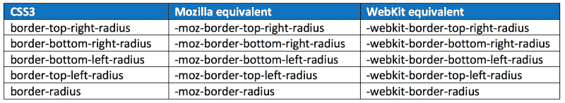
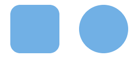
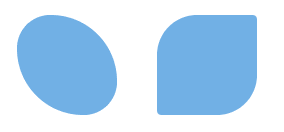
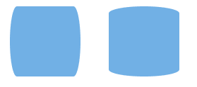
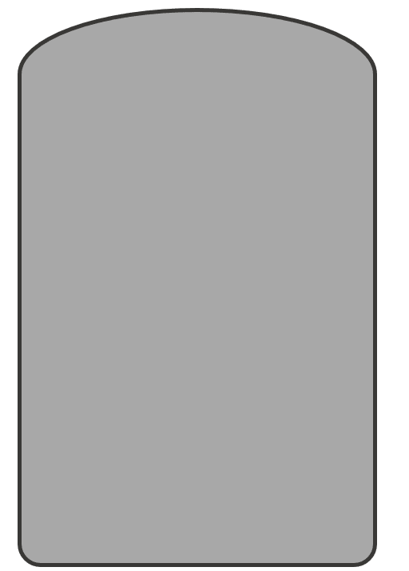
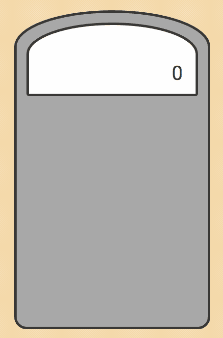
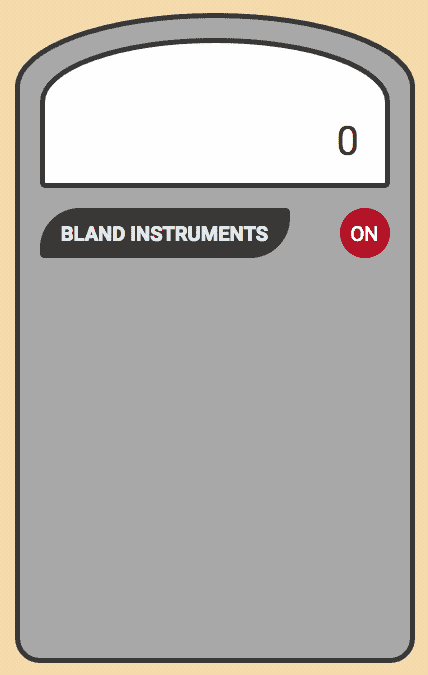
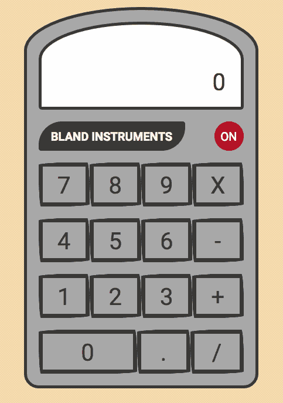
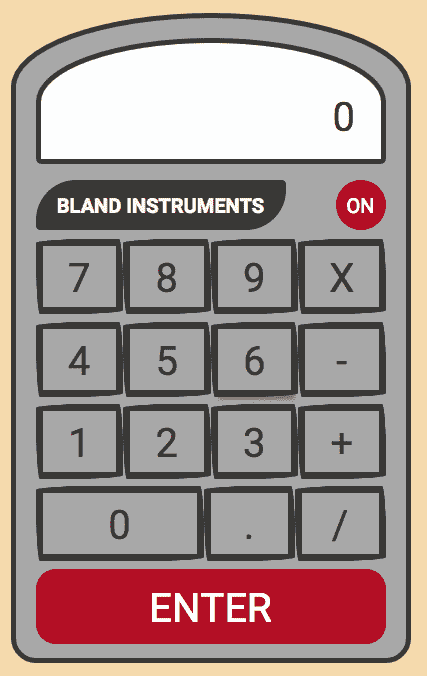
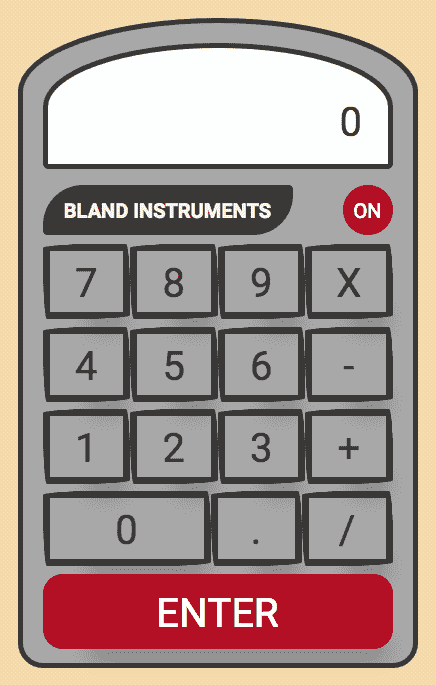

# 通过构建计算器了解 CSS 边框半径属性

> 原文：<https://www.freecodecamp.org/news/learn-css-border-radius-property-by-building-a-calculator-53497cd8071d/>

你见过网页上有圆形边缘的按钮吗？你见过适合一个圆的图像吗？如果是这样，您已经看到了使用 CSS border-radius 属性的影响。

通过 CSS 应用边框半径，你可以给任何元素“圆角”。

### 边框半径语法

与许多与边距、填充和边框相关的 CSS 属性一样，有四个单独的属性(box 元素的每个角一个)和一个速记属性。每个角属性将接受一个或两个值。

每个主流浏览器都接受 border-radius 属性，但是它们有特定于浏览器的属性。以下是 CSS 和浏览器特定的属性:



每个单独的角 CSS3 属性采用一个或两个长度值(通常为“px”或“em”值)。如果提供了单个值，则该值成为圆角的半径。如果提供了两个值，那么它们将成为椭圆角的水平和垂直半径。

border-radius 属性本身接受一个或两个值，并使用它们来设置所有四个角的样式，形成一个漂亮的对称形状。

### 你还需要使用边界前缀吗？

既然我已经向您展示了特定于浏览器的边框前缀，那么问题是您真的需要使用它们吗，或者您可以只使用 CSS3 属性吗？

这个问题的简单答案取决于你的网站支持什么版本的浏览器。

火狐 3.6 要求使用`-moz-`前缀。从 4 开始，使用 CSS3 属性就可以了。

Safari 4 需要`-webkit-`前缀。Safari 5 及以上版本接受 CSS3 属性。

iOS3 需要`-webkit-`前缀。这仅适用于从未升级过的 iPhone 3GS 或 iPad 1。

### **边界半径属性的基本演示**

这里有两个边界半径的演示。为属性提供的值可以是 px、rem、em 或%。

```
div {    width: 100px;    height: 100px;    background-color: #7db9e8;}#demo-one {    border-radius: 20px;}#demo-two {    border-radius: 50%;}
```



#demo-one image on left and #demo-two image on right

对于第一个 div，8px 的圆角应用于 div 的每个角。在第二个示例中，每个角都应用了 50%的圆角，从而创建了一个圆。

如果只有一个值，元素的所有四个角的边框半径都将相同，如上所示。您可以选择为每个角指定不同的值。

当您指定单个值时，它们将按以下顺序应用:左上、右上、右下、左下。这里有一个例子:

```
#demo-three {    border-radius: 10em 20em 10em 20em;}#demo-four {    border-radius: 40px 5px;}
```



#demo-three image on left and #demo-four image on right

### 椭圆形边缘

边缘不必是圆形的，也可以是椭圆形的。要创建椭圆边，请在两个值之间加一条斜线(“/”)。这里有一个例子:

```
#demo-five {    border-radius: 10% / 50%;}#demo-six {    border-radius: 50% / 10%;}
```



#demo-five image on left and #demo-six image on right

### 创造我们的计算器

我们将应用我们刚刚学到的关于边界半径的知识来创建这个计算器:


Image of the calculator we will be making

#### 计算器框架

首先，我们需要为我们的计算器创建框架。计算器的顶部有一个拱形，底部有圆形边缘。为了创建此设计，我们将为每个单独的角指定一个值，如下所示:

```
.calc-frame {    display: flex;    flex-direction: column;    align-items: center;    max-height: 650px;    max-width: 400px;    width: 90%;    padding: 20px;    border: solid 5px #41403E;    border-top-left-radius: 270px 100px;    border-top-right-radius: 270px 100px;    border-bottom-right-radius: 35px;    border-bottom-left-radius: 35px;    background: #b1b1b1;}
```



Image of calculator frame created with above CSS

#### 计算器结果框

计算器顶部包含已计算的总数(结果)。它由两部分组成:外部框架和包含总数的输入区域。外部框架使用框架的完全相同的边界半径来具有相同的拱形。以下是这两个项目的样式:

```
.calc-result-frame {    background: #fefefe;    border: solid 5px #41403E;    width: 100%;    height: 150px;    border-top-left-radius: 270px 100px;    border-top-right-radius: 270px 100px;    border-bottom-right-radius: 10px;    border-bottom-left-radius: 10px;    display: flex;    justify-content: center;    align-items: flex-end;}.calc-result-input {    width: 85%;    height: 70px;    text-align: right;    color: #41403E;    overflow: hidden;    font-size: 2rem;
```



Image of calculator result frame created with CSS above

#### 计算器徽标和电源按钮

添加到我们计算器的下一个项目是徽标、“平淡无奇的仪器”和电源按钮。我们将使用# demo-4 中的代码作为徽标，使用# demo-2 中的代码作为电源按钮。看起来是这样的:

```
.calc-logo {    background: #41403e;    color: #e8eff0;    border: solid px #41403E;    border-radius: 40px 5px;    width: 250px;    height: 50px;    line-height: 50px;    font-weight: bold;    text-align: center;}.calc-on {    border-radius: 50%;    border: none;    background: #bb0f29;    color: #fefefe;    width: 50px;    height: 50px;}
```



Image showing our calculator logo and power button from CSS above

#### 计算器按钮

接下来，我们将为每个计算器按钮创建样式。我们将为每个单独的角指定一个样式，然后为每个角提供两个值。这产生了按钮的手绘外观。代码如下:

```
.calc-btn {    background: transparent;    color: #41403E;    font-size: 2rem;    width: 75px;    height: 75px;    outline: none;    border-radius: 255px 15px 225px 15px/15px 225px 15px 255px;    border: solid 7px #41403E;    flex: 1;    transition: all .5s ease;}
```



Image showing calculator buttons using CSS above

#### 输入按钮

我们需要添加到计算器中的最后一个东西是`ENTER`按钮。我们将使用#demo-one 中的代码来实现这个按钮。代码如下:

```
.calc-enter {    background: #bb0f29;    color: #fefefe;    border-radius: 20px;    border: none;}
```



Image showing calculator enter buttons from CSS above

#### 按钮动画

我们要添加到计算器中的最后一件事是当用户悬停在按钮上时每个按钮的动画。这模拟了按钮实际被按下的动作。

为了实现这一点，我们将添加一个框阴影到我们的按钮。这是将为所有按钮显示的阴影，并使按钮看起来比计算器框架稍微高一些。

为了提供动画，我们将向按钮添加一个过渡。然后，当用户悬停在按钮上时，我们将为按钮提供不同的框阴影。代码如下:

```
.calc-btn {    background: transparent;    color: #41403E;    font-size: 2rem;    width: 75px;    height: 75px;    outline: none;    border-radius: 255px 15px 225px 15px/15px 225px 15px 255px;    border: solid 7px #41403E;    flex: 1;    box-shadow: 20px 38px 34px -26px hsla(0,0%,0%,.2);    transition: all .5s ease;}.calc-btn:hover {    box-shadow:2px 8px 4px -6px hsla(0,0%,0%,.3);}
```

这是我们完成的计算器:



Image showing calculator button animation from CSS above

### 获取代码

如果你想看计算器的完整代码，你可以从我的 [GitHub repo 这里](https://github.com/ratracegrad/border-radius)得到。当你得到代码时，请启动我的回购！

代码将 Flexbox 用于计算器的布局。如果你对 Flexbox 不熟悉或者想复习一下，可以在 5days.tech 的[查看我关于 Flexbox 的免费培训课程。](https://www.in5days.tech/)

### 感谢阅读

感谢您阅读我的文章。如果你喜欢，请点击下面的拍手图标，这样其他人就会找到这篇文章。

这里有更多你可能会感兴趣的我的文章:

[以下是你可以用 FlexBox 做出的 5 种布局](https://hackernoon.com/here-are-5-layouts-that-you-can-make-with-flexbox-6ca1e941f33d)
[用 CSS 外形跳出框框思考——跳出框框](https://hackernoon.com/mastering-css-series-shape-outside-44d626270b25)
[为什么公司文化对你的软件工程师职业很重要](https://medium.freecodecamp.org/why-company-culture-is-important-to-your-career-as-a-software-engineer-5a590bc44621)