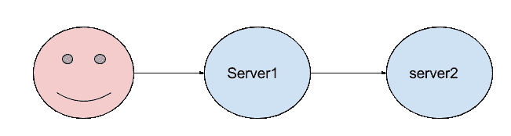

# 如何获得更好的性能:超时案例

> 原文：<https://www.freecodecamp.org/news/better-performance-the-case-for-timeouts-3234d6aceeaf/>

亚历克斯·纳达林

# 如何获得更好的性能:超时案例


我们现在设计的大部分大型服务或多或少都依赖于外部 API。你已经听过很多次了:一旦你的代码库开始看起来像一个整体，是时候开始将它分成[个更小的服务](https://en.wikipedia.org/wiki/Microservices)了，这些服务可以独立发展，并且不与整体紧密耦合。

即使你没有真正使用微服务，你也有可能已经依赖于外部服务，如 [elasticsearch](https://en.wikipedia.org/wiki/Elasticsearch) 、 [Redis](https://redis.io/) 或支付网关，并需要通过某种 API 与它们集成。

当这些服务很慢或不可用时会发生什么？嗯，你不能处理搜索查询或支付，但你的应用程序仍然可以“正常”工作，对吗？

**情况并不总是这样**，我想运行几个基准测试，向您展示在处理外部服务时，[超时](https://en.wikipedia.org/wiki/Timeout_(computing)这一小小的调整是如何证明是有益的。

### 我们的案子

我们已经开始了一个新的 *Hello World！令人惊讶的是，这家初创公司通过部署一个无用的服务来赚钱，这个服务打印从另一个服务中检索到的字符串。这是对真实世界场景的过度简化，但是它将足够好地服务于我们的目的。*



我们的客户端将连接到我们的主前端，`server1.js`然后向另一个服务发出 HTTP 请求，`server2.js`将会回复。一旦我们从`server2.js`那里得到答案，我们就可以将响应体返回给我们的客户。

需要注意一些事情:

*   服务器运行在端口`3000`(主应用程序)和`3001`(后端服务器)上。因此，一旦客户端向`localhost:3000`发出请求，一个新的 HTTP 请求将被发送到`localhost:3001`
*   后端服务将在返回响应之前等待 100 毫秒(这是为了模拟真实世界的用例)
*   我使用的是 [unirest](https://github.com/Mashape/unirest-nodejs) HTTP 客户端。我非常喜欢它，尽管我们可以简单地使用内置的`http`模块，但我相信它会给我们带来更好的现实应用体验
*   Unirest 很好地告诉我们请求中是否有错误，所以我们可以检查`response.error`并从那里处理这个问题
*   我将使用 [docker](https://www.docker.com/) 来运行这些测试，代码是 GitHub 上的[。](https://github.com/odino/the-case-for-timeouts)

### 让我们进行第一次测试

让我们运行我们的服务器，开始用请求轰炸`server1.js`。我们将使用[围攻](https://www.joedog.org/siege-home/)(对于 [AB](https://httpd.apache.org/docs/2.4/programs/ab.html) 我太时髦了)，它在执行负载测试时提供了一些有用的信息:

```
siege -c 5 www.google.com** SIEGE 3.0.5** Preparing 5 concurrent users for battle.The server is now under siege...^CLifting the server siege...      done.
```

```
Transactions:                26 hitsAvailability:            100.00 %Elapsed time:              6.78 secsData transferred:          0.20 MBResponse time:             0.52 secsTransaction rate:          3.83 trans/secThroughput:                0.03 MB/secConcurrency:               2.01Successful transactions:          27Failed transactions:              0Longest transaction:           1.28Shortest transaction:          0.36
```

在 siege 中的`-c`选项定义了我们应该向服务器发送多少个并发请求，您甚至可以指定想要运行多少次重复(`-r`)。例如，`-c 10 -r 5`意味着我们将向服务器发送总共 50 个请求，每批 10 个并发请求。然而，为了我们的基准，我决定让测试运行三分钟，然后分析结果，而不设置最大重复次数。

此外，在下面的例子中，我将把结果精简到由围攻提供的最重要的项目:

*   可用性:服务器能够处理多少我们的请求
*   事务速率:我们每秒能够发出多少请求？
*   成功/失败的事务:有多少请求以成功/失败状态代码结束(即 2xx 对 5xx)？

让我们从发送 500 个并发请求开始，观察服务的行为。

```
docker run --net host -v $(pwd):/src -d mhart/alpine-node:7.1 node /src/server1.jsdocker run --net host -v $(pwd):/src -d mhart/alpine-node:7.1 node /src/server2.js
```

```
siege -c 500 127.0.0.1:3000
```

大约三分钟后，是时候停止围攻了(`ctrl+c`)，看看结果如何:

```
Availability:             100.00 %Transaction rate:       1156.89 trans/secSuccessful transactions:      205382Failed transactions:              0
```

还不错，因为我们每秒可以处理 1156 笔交易。更好的是，我们似乎没有任何错误，这意味着我们的成功率是 100%。如果我们升级游戏，追求 1k 并发事务会怎么样？

```
siege -c 1000 127.0.0.1:3000...
```

```
Availability:            100.00 %Transaction rate:       1283.61 trans/secSuccessful transactions:      232141Failed transactions:              0
```

干得好！我们略微增加了吞吐量，因为现在我们的应用程序每秒能够处理 1283 个请求。由于应用程序做得很少(打印一个字符串，仅此而已)，很可能我们发送的并发请求越多，吞吐量就越高。

这些数字现在可能没用(我们不会拿它们和任何东西比较)，但在接下来的段落中会被证明是必不可少的。

### 引入失败

现实世界的 web 服务并不是这样的:你必须**接受失败**并构建能够克服它们的弹性应用程序。

例如，假设我们的后端服务正在经历一个艰难的阶段，并且开始时不时地滞后:

在本例中，10 个请求中有 1 个将在 10 秒超时后得到服务，而其他请求将以 100 毫秒的“标准”延迟进行处理。这种情况模拟了一个场景，在这个场景中，我们在一个负载均衡器后面有多个服务器，其中一个开始抛出随机错误，或者由于负载过大而变得更慢。

让我们回到我们的基准测试，看看我们的`server1.js`现在表现如何，因为它的依赖性将开始变慢:

```
siege -c 1000 127.0.0.1:3000
```

```
Availability:            100.00 %Transaction rate:        853.93 trans/secSuccessful transactions:      154374Failed transactions:              0
```

**真令人失望**:我们的交易率直线下降，下降了 30%以上，仅仅是因为一些响应滞后。这意味着`server1.js`需要等待更长时间以接收来自`server2.js`的响应，从而使用更多的资源并能够服务比理论上更少的请求。

### 现在的错误胜过明天的回应

超时的理由从认识到一个简单的事实开始:**用户不会等待缓慢的响应**。

1 或 2 秒后，他们的注意力会逐渐消失，一旦你跨过 4/5 秒的门槛，他们仍然被你的内容吸引的机会就会消失。这意味着**最好给他们一个即时的反馈，即使是负面的**(“*出现错误，请再试一次*”)，而不是让他们因为你的服务有多慢而沮丧。

本着“ [fail fast](https://en.wikipedia.org/wiki/Fail-fast) ”的精神，我们决定添加一个超时，以确保我们的响应满足特定的 SLA。在这种情况下，我们决定我们的 SLA 是 3s，这是我们的用户可能等待使用我们的服务的时间。

```
...
```

```
require('unirest').get('http://localhost:3001').timeout(3000).end(function(r) {
```

```
...
```

让我们看看启用超时后的数字:

```
Availability:              90.14 %Transaction rate:       1125.26 trans/secSuccessful transactions:      209861Failed transactions:          22964
```

天啊，我们又回到游戏中了。事务速率再次高于每秒 1k，我们几乎可以为理想条件下(后端服务没有延迟时)的许多请求提供服务。

当然，缺点之一是我们现在增加了失败的次数(总请求的 10%)，这意味着一些用户将被呈现一个错误页面。尽管如此，这仍然比 10 秒后为他们服务要好，因为他们中的大多数人无论如何都会放弃我们的服务。

我们现在已经看到，理想情况下，**超时有助于保持接近理想的 rps** (每秒请求数)，但是资源消耗呢？如果他们的一个依赖变得不那么响应，他们是否能更好地确保我们的服务器不需要额外的资源？

让我们深入研究一下。

### RAM 系数

为了计算出我们的`server1.js`消耗了多少内存，我们需要定期测量服务器正在使用的内存量。在制作中，我们会使用诸如 [NewRelic](https://newrelic.com/) 或 [KeyMetrics](https://keymetrics.io/) 之类的工具，但是，对于我们的简单脚本，我们将求助于穷人版本的此类工具。我们将打印来自`server1.js`的内存量，我们将使用另一个脚本来记录输出并打印一些简单的统计数据。

让我们确保`server1.js`每 100ms 打印一次使用的内存量:

```
...
```

```
setInterval(_ => {  console.log(process.memoryUsage().heapUsed / 1000000)}, 100)
```

```
...
```

如果我们启动服务器，我们应该会看到类似这样的内容:

```
3.9901764.0667524.0760244.0777844.0795444.0813044.0830644.084824
```

这是服务器正在使用的内存量，以 MB 为单位。为了处理这些数字，我编写了一个简单的脚本来读取来自`stdin`的输入并计算统计数据:

该模块在 NPM 上是[公共](https://github.com/odino/node-number-aggregator-stats)和[可用的，所以我们可以全局安装它，并将服务器的输出重定向到它:](https://www.npmjs.com/package/number-aggregator-stats)

```
docker run --net host -v $(pwd):/src -ti mhart/alpine-node:7.1 shnpm install -g number-aggregator-statsnode /src/server1.js | number-aggregator-stats
```

```
Meas: 18 Min: 3 Max: 4 Avg: 4 Cur: 4
```

现在让我们再次运行我们的基准测试— 3 分钟，1k 并发请求，无超时:

```
node /src/server1.js | number-aggregator-stats
```

```
Meas: 1745 Min: 3 Max: 349 Avg: 194 Cur: 232
```

现在让我们启用 3s 超时:

```
node /src/server1.js | number-aggregator-stats
```

```
Meas: 1429 Min: 3 Max: 411 Avg: 205 Cur: 172
```

哇，乍一看，似乎**超时根本没有帮助:启用超时后，我们的内存使用量达到最高，平均也高出 5%**。对此有什么合理的解释吗？

当然有，因为我们只需要回到围城，看看 rps:

```
853.60 trans/sec --> without timeouts1134.48 trans/sec --> with timeouts
```

这里我们将苹果和橘子进行比较。查看为不同数量的 RP 提供服务的两台服务器的内存使用情况是没有用的。相反，我们应该确保它们都提供相同的吞吐量，并且只测量此时的内存。否则，服务更多请求的服务器将总是以一些劣势开始！

要做到这一点，我们需要某种工具来轻松地生成基于 rps 的负载，而 siege 不太适合这样做。是时候给我们的朋友[贝吉塔](https://github.com/tsenart/vegeta)打电话了，这是一个用 [Golang](https://golang.org/) 编写的现代负载测试工具。

### 进入贝吉塔


贝吉塔的使用非常简单，只需开始“攻击”一台服务器，并让它报告结果:

```
echo "GET http://google.com" | vegeta attack --duration 1h -rate 1000 | tee results.bin | vegeta report
```

这里有两个非常有趣的选项:

*   `--duration`，以便贝吉塔在一定时间后停止
*   `--rate`，如 rps 中的

看起来贝吉塔是适合我们的工具——然后我们可以发出一个为我们的服务器定制的命令，并查看结果:

```
echo "GET http://localhost:3000" | vegeta attack --duration 3m --insecure -rate 1000 | tee results.bin | vegeta report
```

这是贝吉塔在没有超时的情况下输出的内容:

```
Requests      [total, rate]            180000, 1000.01Duration      [total, attack, wait]    3m10.062132905s, 2m59.998999675s, 10.06313323sLatencies     [mean, 50, 95, 99, max]  1.172619756s, 170.947889ms, 10.062145485s, 10.134037994s, 10.766903205sBytes In      [total, mean]            1080000, 6.00Bytes Out     [total, mean]            0, 0.00Success       [ratio]                  100.00%Status Codes  [code:count]             200:180000Error Set:
```

这是当`server1.js`启用 3s 超时时我们得到的结果:

```
Requests      [total, rate]            180000, 1000.01Duration      [total, attack, wait]    3m3.028009507s, 2m59.998999479s, 3.029010028sLatencies     [mean, 50, 95, 99, max]  455.780741ms, 162.876833ms, 3.047947339s, 3.070030628s, 3.669993753sBytes In      [total, mean]            1142472, 6.35Bytes Out     [total, mean]            0, 0.00Success       [ratio]                  90.00%Status Codes  [code:count]             500:18000  200:162000Error Set:500 Internal Server Error
```

如您所见，两个基准测试的请求总数和运行时间是相同的，这意味着我们将服务器置于相同的压力水平下。现在我们已经让它们在相同的负载下执行相同的任务，我们可以查看内存使用情况，看看超时是否有助于我们保持较低的内存占用。

无超时:

```
node /src/server1.js | number-aggregator-stats
```

```
Meas: 1818 Min: 3 Max: 372 Avg: 212 Cur: 274
```

超时情况下:

```
node /src/server1.js | number-aggregator-stats
```

```
Meas: 1886 Min: 3 Max: 299 Avg: 149 Cur: 292
```

这看起来更像是这样:超时帮助我们保持了平均 30%的内存使用量。

所有这一切都归功于一个简单的`.timeout(3000)`。多么大的胜利！

### 避免多米诺效应

引用我自己的话:

> 当这些服务很慢或不可用时会发生什么？嗯，你不能处理搜索查询或支付，但你的应用程序仍然可以“正常”工作，对吗？

有趣的事实:**错过一个超时会使你的整个基础设施瘫痪！**


在我们的基本示例中，我们看到了一个以 10%的比率开始失败的服务是如何显著增加依赖它的服务的内存使用的。这不是一个不切实际的场景——它基本上只是十台服务器中的一台不可靠的服务器。

想象一下，你有一个依赖于后端服务的网页，在一个负载均衡器后面，开始比平常运行得慢。该服务仍然工作(只是比它应该的慢了很多)，您的健康检查可能仍然会从该服务获得一个`200 Ok`(尽管它是在几秒钟而不是几毫秒之后出现的)，因此该服务不会从负载平衡器中删除。

你刚刚为你的前端创建了一个陷阱。他们将开始需要更多的内存，服务更少的请求……这是一个灾难的配方。

这就是多米诺效应的样子:一个系统变慢(或者导致停机)，架构中的其他部分受到它的影响，突出了一个没有考虑故障选项的设计，它既不健壮也不够有弹性。

要记住的关键是:**拥抱失败**，让它们到来，并确保你能轻松战胜它们。

### 关于超时的说明

如果你认为等待是危险的，让我们再添一把火:

*   我们不只是在谈论 HTTP 每当我们依赖外部系统时，我们都应该使用超时
*   服务器可能会打开一个端口，丢弃您发送的每个数据包，这将导致 TCP 连接超时。在你的终端上试试这个:`time curl example.com:81`。祝你好运！
*   服务器可以立即回复，但发送每个数据包的速度非常慢(例如，数据包之间的间隔为秒)。然后，您需要保护自己免受**读取超时的影响。**

…还有更多的边缘案例可以列举。我知道，分布式系统很讨厌。

幸运的是，高级 API(像 unirest 公开的那个[)通常是有帮助的，因为它们会处理过程中可能发生的所有问题。](https://github.com/Mashape/unirest-nodejs#requesttimeoutnumber)

### 结束语:我已经打破了每一条基准规则

如果你对我生疏的基准测试技能有任何“攻击性”的反馈，我会同意你的观点。为了简化我的工作，为了让您能够轻松地复制这些基准，我特意走了一些捷径。

如果您对性能指标评测很认真，您应该做的事情有:

*   不要在同一台机器上运行您正在进行基准测试的代码和您用来进行基准测试的工具。在这里，我在我的 XPS 上运行了所有的东西，它足够强大，可以让我运行这些测试。但是在运行服务器的同一台机器上运行围城/贝吉塔肯定会对结果产生影响(我说`ulimit`，剩下的你自己想办法)。我的建议是尝试在 AWS 上获得一些硬件，并从那里进行基准测试——更多的隔离，更少的怀疑。
*   不要用一个`console.log`来测量内存，而是使用一个工具，比如 NewRelic，我认为它的侵入性更小。
*   测量更多数据:对于本文来说，三分钟的基准测试是可以的，但是如果我们想要查看真实世界的数据，以更好地估计超时有多大帮助，您应该让基准测试运行更长时间。
*   运行`siege ...`时保持 Gmail 关闭，住在`/proc/cpuinfo`的房客会很感激。

今天的工作到此结束:我希望你喜欢这篇文章，如果不喜欢，请在下面的评论框里畅所欲言！

*最初发布于[odino.org](http://odino.org/better-performance-the-case-for-timeouts/)(*2017 年 1 月 19 日*)。*