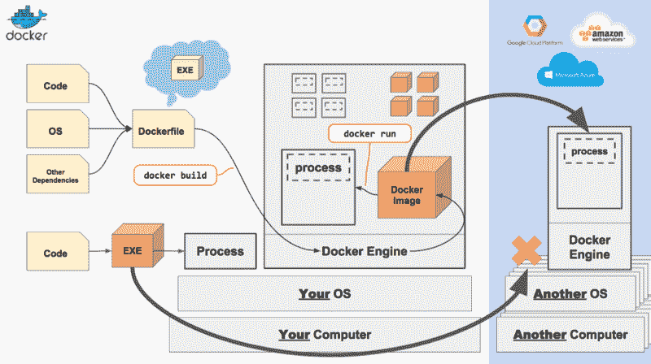

# 初学者快速简单的 Docker 教程(视频系列)

> 原文：<https://www.freecodecamp.org/news/docker-quick-start-video-tutorials-1dfc575522a0/>

马克·霍普森

# 初学者快速简单的 Docker 教程(视频系列)

#### Docker 新手？然后，这个视频系列将有助于解释基础知识，并让你马上开始。

以下视频旨在帮助 Docker 新手熟悉基础知识。视频很简短，因为我试图只涵盖要点，这样你就可以快速编码。

一些背景信息。这些视频最初是为我的雇主( [Flipp Corp.](https://corp.flipp.com/) )制作的，以帮助宣传 Docker，但我认为它们在这里也可能有用。

我对 Docker(以及制作截屏视频)相当陌生，我在这些视频中放的很多东西是我发现其他视频中缺乏的。欢迎在下面的评论中留下任何意见或建议。谢谢！

### 第 1 部分:什么是 Docker 和关键概念(13 分钟)

第一个视频解释了 Docker 存在的原因，以及它要解决的问题。我们将在较高层次上回顾 Docker 是如何工作的，以及一些关键概念(Docker 图像、容器和 Docker 文件)。

### 第 2 部分:在 Mac 上开始使用 Docker(21 分钟)

在这个截屏中，我们将为 OSX 安装 Docker，并使用一个简单的 NodeJS 应用程序构建我们的第一个 Docker 映像。

### 第 3 部分:在 Dockerfile 中使用 CMD 分钟)

在这个简短的截屏中，我们将回顾 CMD 命令，以及如何使用它。

### 第 4 部分:调试中断的 Docker 构建(4 分钟)

在这个截屏中，我们将回顾一个调试中断的 Docker 构建的有用策略。本质上，我们在部分构建的 Docker 映像中运行“Shell”程序，以检查什么出现了故障，并找出如何修复它。

### 第 5 部分(TBD):复合坞站

因此，这里还没有视频，但如果有兴趣，我将创建另一个视频，介绍 Docker Compose 是什么，以及它为什么很棒。同时，这里有一个来自[全栈讲座](https://www.youtube.com/channel/UCpq2_V-9AYYUHSsjoJZPUTg)的截屏，我觉得非常有用。