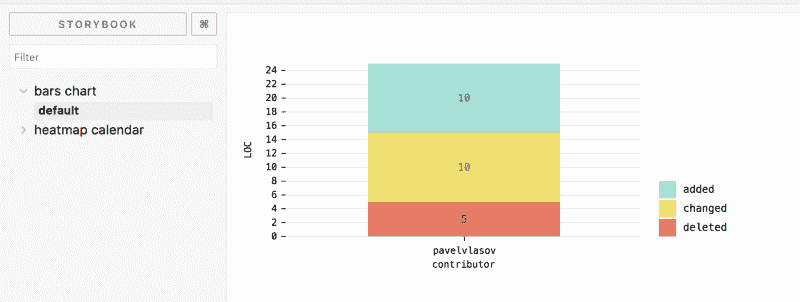
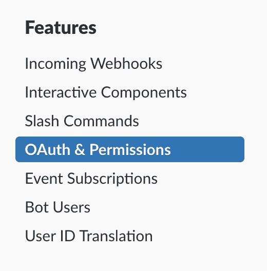
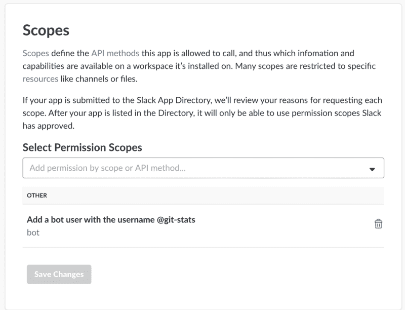
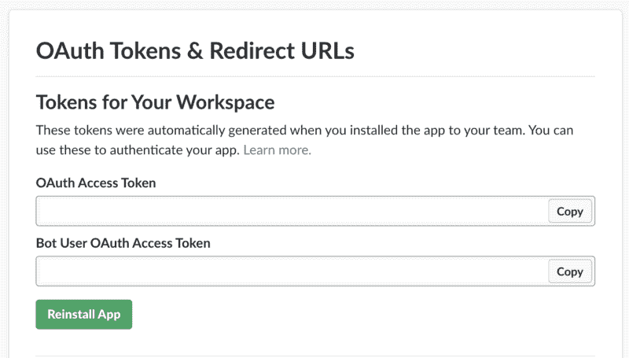
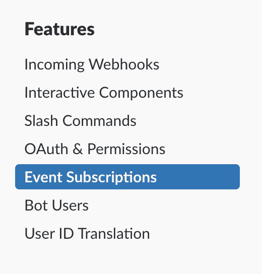
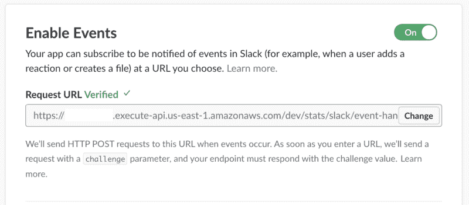
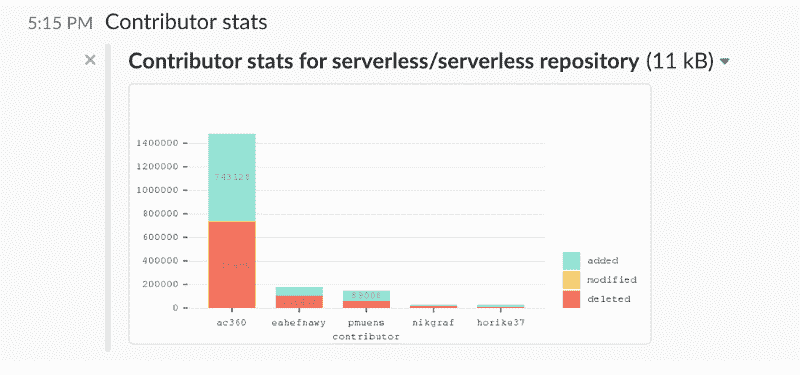
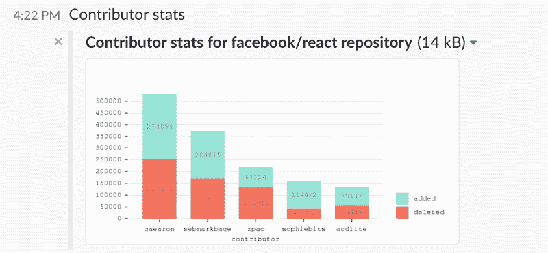
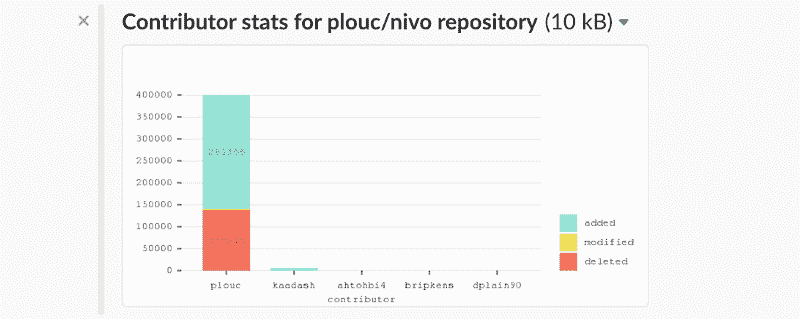

# 如何用 PhantomJS、React 和无服务器框架构建 GitHub bot

> 原文：<https://www.freecodecamp.org/news/how-to-build-a-github-bot-with-phantomjs-react-and-serverless-framework-7b66bb575616/>

作者:帕维尔·弗拉索夫


Lego IT guy by [bnilsen](https://www.flickr.com/photos/bnilsen)

# 如何用 PhantomJS、React 和无服务器框架构建 GitHub bot

本教程是关于构建一个简单的无服务器 bot，它返回一个图表，其中包含一段时间内排名靠前的 GitHub 库贡献者。它与那些对 React、JavaScript、TypeScript、Node.js、Amazon Web Services (AWS)和无服务器框架有一定经验的人相关。

你可以在 Github 上查看[的代码。](https://github.com/threadheap/github-stats-bot/blob/master/tsconfig.json)

#### 我们将使用的服务和工具

在开始编码之前，让我们对 AWS 服务和我们将使用的工具做一个快速的概述。

为了检索顶级的存储库贡献者，我们将使用 [GitHub stats API](https://developer.github.com/v3/repos/statistics/#get-contributors-list-with-additions-deletions-and-commit-counts) ，惊人的 [Nivo](http://nivo.rocks/#/pie) 来显示数据， [Storybook](https://github.com/storybooks/storybook) 来检查我们的图表看起来和感觉如何， [PhantomJS](http://phantomjs.org/) 将 HTML 转换成图像，以及[无服务器框架](https://serverless.com/)来与 AWS 交互。

#### 我们开始吧

我会用打字稿。如果你更喜欢 [ES6](http://es6-features.org/#Constants) ，你将需要配置[巴别塔](https://babeljs.io/)。

首先，您必须在您的存储库的根目录下创建`[tsconfig.json](https://github.com/threadheap/github-stats-bot/blob/master/tsconfig.json)`。要注意的选项包括:

```
"module": "commonjs","target": "es5","lib": ["es6", "esnext.asynciterable"],"moduleResolution": "node","jsx": "react"
```

然后，我们将创建一个简单的 API 来查询 GitHub 的统计数据。您可以遵循 GitHub repo 中的文件结构，也可以使用自己的文件结构。例如:

要访问 GitHub API，您必须[创建一个个人访问令牌](https://help.github.com/articles/creating-a-personal-access-token-for-the-command-line/)。

这个模块简单地用提供的令牌发送请求并检索数据。

#### 显示图表

为了显示数据，我们将使用 Nivo 和 Storybook。一个简单的组件可能如下所示:

首先，通过在根文件夹中运行以下命令来设置故事书:

```
npm i -g @storybook/cligetstorybook
```

复制[。故事书文件夹](https://github.com/threadheap/github-stats-bot/tree/master/.storybook)放入根存储库并替换所有现有文件。它包含 Webpack 和 Storybook 配置。创建一个`stories`文件夹，并为您的组件放入一个示例故事:

运行`npm run storybook`，在浏览器中打开 [localhost](http://localhost:6006/) 。您应该会看到以下结果:



尝试使用选项和测试数据。故事书会立刻改变外观。

#### 将 HTML 转换成 PNG

通常，像 Facebook Messenger 和 Slack 这样的聊天系统不允许用户在对话框中插入 HTML 卡片，因此下一步将构建一个将 HTML 渲染为 PNG 图像的助手。

使用带有 [jsdom](https://github.com/tmpvar/jsdom) 库的简单脚本，我们可以模仿浏览器行为并序列化 HTML，如下所示:

`createDomForChart`返回 jsdom 的一个新实例，组件渲染完成后，chart 函数简单调用`dom.serialize()`。

有了 PhantomJS，我们可以使用这个简单的脚本将标记转换成图像:

我们将`screenshot.js`传递到`phantomjs`可执行路径中——连同一个 HTML 字符串、宽度和高度——并获得渲染图像的缓冲区。

您可能注意到，我一直在使用两个 PhantomJS 二进制文件(用于 OS X 和 Linux)。在 AWS 环境中，我们还需要 Linux 版本。你可以从[PhantomJS.org](http://phantomjs.org/download.html)下载它们，或者从资源库中使用文件。

#### 把一切都绑起来

现在，让我们创建 [lambda](https://aws.amazon.com/lambda/) 来处理请求。我建议将 PNG 呈现逻辑放在一个单独的服务中。因为 PhantomJS 二进制文件的大小大约为 50 mb，所以如果您在 API 中做了任何更改，就会降低部署速度。此外，您可以出于其他目的重用这个 lambda。

我们将从在根文件夹中创建`[webpack.config.ts](https://github.com/threadheap/github-stats-bot/blob/master/webpack.dev.ts)`(捆绑源代码)和`[serverless.base.js](https://github.com/threadheap/github-stats-bot/blob/master/serverless.base.js)`(定义基本的无服务器配置)开始。

如果你想了解更多关于无服务器 JavaScript 配置的用例，你可以在我的前一篇文章中阅读。

您必须更改部署和映像存储桶名称，如下所示:

```
deploymentBucket: {    name: 'com.github-stats....deploys'},environment: {    BUCKET: 'com.github-stats....images',    GITHUB_TOKEN: '${env:GITHUB_TOKEN}',    SLACK_TOKEN: '${env:SLACK_TOKEN},    STAGE: '${self:provider.stage}'},
```

这是因为存储桶的名称必须是全局唯一的。

#### 将 HTML 转换为 PNG 服务

首先，我们将创建一个[处理程序](https://github.com/threadheap/github-stats-bot/blob/master/app/html-to-png/index.ts)，它将返回所生成图像的 URL。处理程序应该验证和处理请求体:

…如果一切正常，它应该生成图像并将其放入 S3 桶中。

让我们创建`[webpack.config.ts](https://github.com/threadheap/github-stats-bot/blob/master/app/html-to-png/webpack.config.ts)`来捆绑源文件。我们将使用`[copy-webpack-plugin](https://github.com/webpack-contrib/copy-webpack-plugin)`和`[webpack-permissions-plugin](https://github.com/GeKorm/webpack-permissions-plugin)`将 PhantomJS 二进制文件包含到一个包中，并授予执行权限。这将要求我们使用 sudo 运行 deploy 命令，因为缺省情况下 Webpack 没有修改文件系统权限的权限。

最后一步将使用`[serverless.js](https://github.com/threadheap/github-stats-bot/blob/master/app/html-to-png/serverless.js)`文件将我们的处理程序与 API 网关事件联系起来。

现在，我们需要为[统计处理程序](https://github.com/threadheap/github-stats-bot/blob/master/app/stats/index.ts)执行相同的步骤，但是我们不需要对`webpack.config.ts.`做任何修改

唯一的区别是调用 lambda 的额外权限:

```
iamRoleStatements: [                           ...baseConfig.provider.iamRoleStatements,{    Effect: 'Allow',    Action: ['lambda:InvokeFunction'],    Resource: ['*']}]
```

#### 设置 Slack bot

最后一步是创建一个为机器人处理消息事件的服务。为了简单起见，我们将只处理提到事件。让我们设置基本的事件处理程序。

我们必须处理 Slack 中的验证事件，并使用 200 个状态和挑战参数进行响应:

```
callback(null, {   body: JSON.stringify({     challenge: (slackEvent as VerificationEvent).challenge   }),   statusCode: 200});
```

为了正确处理 Slack 事件，端点必须在 3000 毫秒(3 秒)内回复，因此我们必须立即响应，并使用 [postMessage API](https://api.slack.com/methods/chat.postMessage) 异步发送后续消息。

在上面的代码中，我们解析消息文本来提取存储库名称，并调用 image stats lambda 来检索图像 URL 并将消息发送回 Slack。你可以在这里找到处理程序的完整代码。

serverless.js 和 Webpack 配置的代码类似于 stats 服务，因此如果您在设置它时遇到问题，请查看一下[完整源代码](https://github.com/threadheap/github-stats-bot/tree/master/app/slack)。

#### 创建 Slack 应用程序

现在让我们创建一个新的 Slack 应用程序。转到 [Slack API](https://api.slack.com) ，创建一个新帐户(如果您还没有这样做)，创建一个新应用程序，并在 scopes 部分添加 bot 范围。

转到侧边栏的“OAuth & Permissions”部分。



添加 bot 用户范围。



然后，您将能够将该应用程序安装到您的组织中并访问令牌。



#### 部署服务

你必须安装高于 1.26 的无服务器框架版本**，因为早期版本不支持 JavaScript 配置文件。我建议安装 [slx](https://github.com/threadheap/serviceless) 来简化多种服务的部署。**

```
npm install -g serverlessnpm install -g serviceless
```

复制 GitHub 和 Slack bot 令牌，并相应地将它们设置为 GITHUB_TOKEN 和 SLACK_TOKEN 环境变量。在终端中运行以下命令:

```
sudo GITHUB_TOKEN=<your token> SLACK_TOKEN=<your slack token> slx deploy all
```

如上所述，我们需要 sudo 为 PhantomJS 二进制文件设置执行权限。

耐心点！部署可能需要一段时间。最后，您应该会看到类似的输出:

```
Deployment completed successfuly
```

```
[app/html-to-png] [completed]:Service Informationservice: html-to-pngstage: devregion: us-east-1stack: html-to-png-devapi keys:   Noneendpoints:   Nonefunctions:   renderToPng: html-to-png-dev-renderToPngServerless: Removing old service versions...[app/slack] [completed]:Service Informationservice: git-stats-slackstage: devregion: us-east-1stack: git-stats-slack-devapi keys:   Noneendpoints:   POST - https://xxxxxxx.execute-api.us-east-1.amazonaws.com/dev/stats/slack/event-handlerfunctions:   eventHandler: git-stats-slack-dev-eventHandlerServerless: Removing old service versions...[app/stats] [completed]:Service Informationservice: git-statsstage: devregion: us-east-1stack: git-stats-devapi keys:   Noneendpoints:   GET - https://xxxxxx.execute-api.us-east-1.amazonaws.com/dev/stats/contributors/{owner}/{repo}functions:   getContributorStatsImage: git-stats-dev-getContributorStatsImageServerless: Removing old service versions...
```

最后一步是为我们的端点订阅 bot 提及的事件。

在 Slack API 导航中选择“事件订阅”部分。



然后粘贴可以在部署命令输出中找到的事件处理程序 URL。



是玩一会儿的时候了！以下是一些渲染图像的示例:

[无服务器/无服务器](https://github.com/serverless/serverless)



[facebook/react](https://github.com/facebook/react)



铅/nivo



### 就是这样！

我希望这篇文章对你有所帮助。我很乐意在评论中看到你希望在服务中看到的其他类型的数据。

如果你喜欢这篇文章，请鼓掌！如果你想聊天或联系，你可以在 [Twitter](https://twitter.com/pvl4sov) 、 [GitHub](https://github.com/pavelvlasov) 和 [Linkedin](https://www.linkedin.com/in/pavel-vlasov-7647b889/) 上找到我。