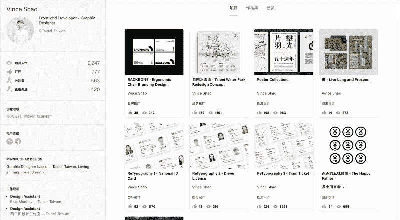
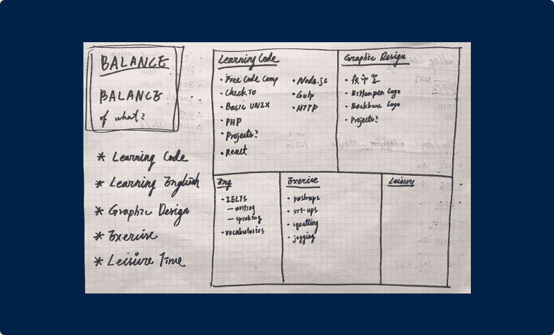
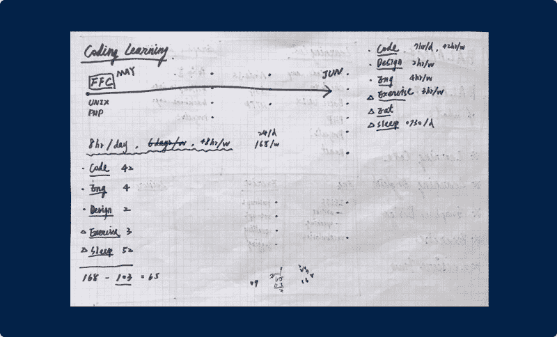
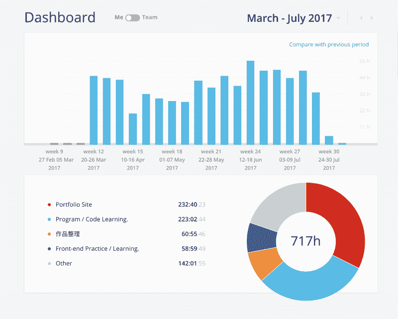
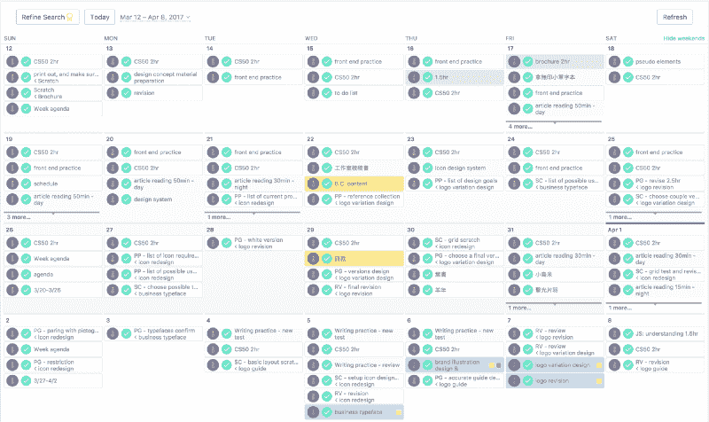
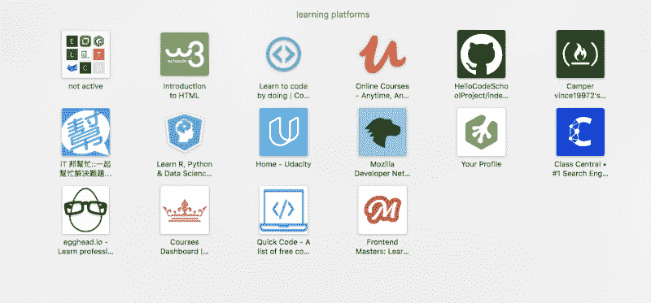
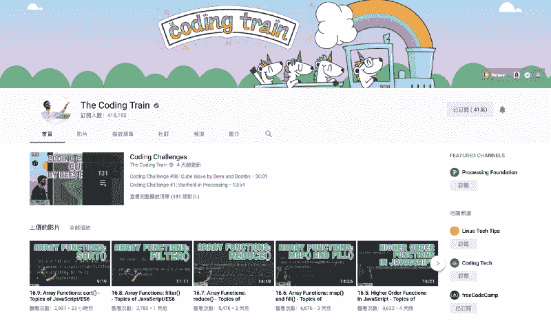
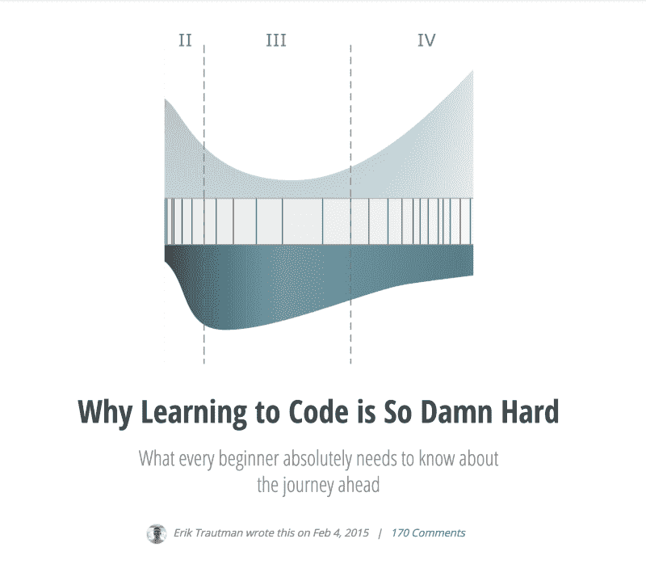
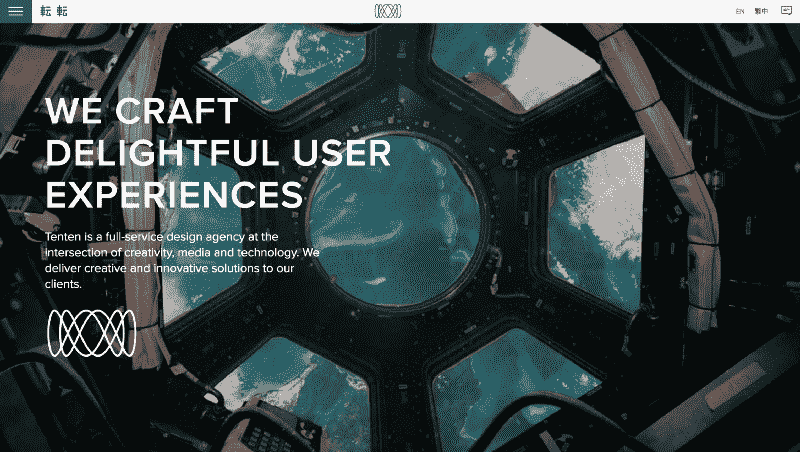

# 我如何在 5 个月内从一名平面设计师转型为前端开发人员

> 原文：<https://www.freecodecamp.org/news/graphic-designer-to-front-end-developer-7be7bfd6a46c/>

对我来说，2017 年是坎坷但令人兴奋的一年。我在三月份辞去了平面设计师的工作，进入了编码世界的迷宫。五个月后，我终于在 Tenten.co 找到了一份前端开发人员的工作。

做了六个月的全职前端开发人员，我想分享一下我为什么以及如何改变人生道路的故事。这是写给那些可能和我一样无助但雄心勃勃的人的。

需要说明的是，这篇文章并不是从一个经验丰富的开发人员或设计人员的角度来写的，他们能够给出一个清晰的路线图。也不是学习前端开发的速成班。关于这个主题有很多很棒的教程，我将在本文后面列出一些。

记住，对所有人来说完美的(普遍的)道路是不存在的。

### 我的背景

My [Behance](https://www.behance.net/vinceshaodesign) page

我是一名 24 岁的平面设计师，没有任何与编码相关的经验。在我上学的时候，我的数学、物理、化学和科学的考试分数低得可怕。这些科目用枯燥复杂的公式、数字、错误把我吓坏了。那时让我感兴趣的总是绘画、音乐或文字创造的美。很自然地，我选择了英语作为我的专业，并在大学里迷上了文学、文化、摄影和设计。

我是如何在大学自学设计，毕业后成为一名平面设计师的，这是以后的事了。关键是，在我整个一生中，直到去年，我一直梦想成为一名作家、摄影师、影评人、歌手和设计师，但我从未想过在任何情况下成为一名开发人员。

### 为什么我想编码

对我来说，平面设计的目的是用吸引人的视觉形式来解决一个问题，这些视觉形式由看不见的系统或结构来支持。

由于世界正面临着如此多的关键问题，我相信解决问题的设计思维能够并且应该帮助解决其中的一些问题。当然，我第一次打开 Photoshop 的时候只是想设计一些漂亮的东西。然而，我对设计了解得越多，我就越渴望参与平面设计的关键问题。

但是，经过许多努力来实现我的抱负之后，我对平面设计在台湾(或者全世界)所能产生的影响深感失望？).

毫无疑问，我仍然意识到伟大设计的力量和重要性。但大多数时候，设计师只被允许处理“客户的问题”，而不是解决“客户的真正问题”设计师大部分时间都在猜测客户的愿望，没有深刻的数据和分析，只有直觉、经验或常识。

在我从事平面设计两年后，我厌倦了这个游戏。

就在那时，我决定认真研究一下 Medium 上始终流行的前端开发主题。

[https://player.vimeo.com/video/208035080?app_id=122963](https://player.vimeo.com/video/208035080?app_id=122963)

我发现，作为一名具有设计技能的开发人员，你可以对每个案例和客户有更多的控制和权力。此外，从事 web 开发或应用程序可以让您有效地传播信息。

我在二月底辞去了平面设计的工作。在没有精心计划，银行存款有限的情况下，我开始了转型做前端开发者的旅程。

### 做什么

迈出第一步总是艰难的。但是如果你认识到推动你的原因是什么，事情就会变得简单。例如，如果你成为一名开发人员的目的是尽快获得更好的报酬，那么你应该学习市场上热门的东西。

就我而言，因为我意识到我当前的目标是获得将设计与开发技能相结合的能力，所以我专注于展示这两种能力。

于是，我定了一个目标，以我对前端开发的浅薄理解，列了一个必做任务清单:

List of skills I wanted to learn and the rough plan I sketched on paper

#### 1.目标

找一份前端开发的工作

#### 2.如何实现目标

建立我的作品集网站来展示我的能力

#### 3.要做的任务

*   学习 HTML、CSS、jQuery/JavaScript
*   设计作品集网站
*   作品集作品准备

起初，我只给自己分配了这些任务。但是随着我阅读更多的文章、教程或工作要求，我把这些技能列在了清单上:

*   厚颜无耻
*   吞咽
*   CS50
*   基本 Unix
*   基本 Wordpress
*   吉基尔博士
*   基本 AWS 知识
*   基本网络知识

当然，网络上爆炸式的信息轰炸了我，让我有更多的东西要学。在这五个月里，我曾经把 Node.js、React.js、PHP 等等放在列表里。上面的任务是我最终真正完成的。

My Toggl report from March to July in 2017

为了遵循这个计划，我给自己设定了一个每周 48 小时的工作目标。这意味着我必须每天工作八小时，一周只休息一天。 [**Toggl**](https://toggl.com/) 帮我记录我的表现。

Asana for schedule

此外，我还采用了*长期目标- >月目标- >周日程- >戴* ly 日程法来安排我的学习日程[**【ule】**](https://asana.com/)，Asana 是我管理这些任务的最佳助手。

### 去哪里学

一路上，我尝试从许多平台、教程或文章中学习。以下是资源列表和我对每个资源的想法:

#### 学习平台

那时候，我讨厌那些向我展示我不知道该怎么做的代码行的教程。一些人认为我知道它的每一点，或者他们告诉我暂时忽略它。拜托，我真的连屏幕上的一行代码都看不懂，因为我完全是初学者。

这种讲座让我痛苦，让我看不起自己。一般来说，没有完美的平台来学习一切。我试着尽可能的灵活，在他们之间跳跃。

*   Codecademy**——**很多人推荐它，但我当时对它的教程感到非常沮丧。我总是在没有任何线索的情况下坚持练习。****
*   ****[代号学校](https://www.codeschool.com/)**——**我在这里花了很多时间，因为老师们把为什么解释得很清楚。推荐。********
*   ******[树屋](https://teamtreehouse.com/)——**T3【Youtube 上广告最多的一个！Treehouse 在营销方面做得很好，这很有效(至少对我这个迷失的初学者来说)。它涵盖了如此多的主题，其中一些对我真的很有用。例如，很难找到一个面向前端开发者学生的像样的 Wordpress 教程，但 Treehouse 有一个。********
*   ****[freeCodeCamp](https://www.freecodecamp.org/) —对 freeCodeCamp 的巨大热爱！这个社区为初学者提供了一条清晰的道路，它知道何时从学生那里拿走训练轮。我曾经为学习了基本的 HTML、CSS 和 JavaScript 之后下一步该做什么而焦虑，但是 freeCodeCamp 把小项目放在了学习轨道的正确位置上。该社区还通过媒体和电子邮件分享精彩的帖子。强烈推荐！****

****

My bookmarks of learning platforms in Safari**** 

#### ****Youtube 频道****

****这是免费学习或娱乐的最佳场所。Youtube 视频不仅有助于从播放列表中彻底学习某些主题，还可以方便地体验一些有趣的知识。****

*   ****编码列车(The Coding Train)由 NYU ITP 大学教授丹尼尔·希夫曼(Daniel Shiffman)主持，他是我见过的最有活力的老师，该频道提供简单易懂的视频。****
*   ****新的主题几乎涵盖了我能想到的任何话题。主持人巴奇有能力让令人生畏的事情听起来简单。****
*   ****[Academind](https://www.youtube.com/channel/UCSJbGtTlrDami-tDGPUV9-w)——也提供各种教程。很容易理解。推荐。****
*   ****[Fun 趣味功能](https://www.youtube.com/channel/UCO1cgjhGzsSYb1rsB4bFe4Q) —主持人 Mattias Petter Johansson 是一名开发人员，此前曾在 Spotify 和黑莓工作。他的频道是一个简单学习 JavaScript 的好地方。****
*   ****[Linux Academy](https://www.youtube.com/channel/UClGShptNEuvTWGAAfpa2Etw) —我在这里学到了一些 AWS 的基础知识。喜欢！****
*   ****电脑爱好者——这里的视频都是关于电脑的。有趣的是，我可能永远也不会真正理解他们在说什么。****
*   ****电脑专家 Eli——我在这里学到了网络或服务器方面的知识。****
*   ****我考 CS50 时最好的朋友。它清楚地解释了计算机科学的东西。很喜欢。****

****

Coding Train Channel**** 

#### ****要阅读的文章****

****阅读对我来说是人生道路或灵感话题的完美媒介。在这五个月里，当我多次受挫时，我被伟大的文章所鼓舞。以下是我的一些最佳生活指南:****

*   ****[为什么学习编码如此困难](http://www.vikingcodeschool.com/posts/why-learning-to-code-is-so-damn-hard)****
*   ****[我在两个月内学会了编码、构建网络应用并在产品 Hun 上发布它](https://medium.com/@AndreyAzimov/i-learned-to-code-and-build-a-web-app-in-2-months-da8f2932c139)****
*   ****[为什么我花了 8 个月的时间全职学习谷歌面试](https://medium.freecodecamp.org/why-i-studied-full-time-for-8-months-for-a-google-interview-cc662ce9bb13)****
*   ****[如何从业余爱好者变成专业开发人员](https://medium.freecodecamp.org/how-to-go-from-hobbyist-to-professional-developer-11a8b8a52b5f)****
*   ****[2017 年学编码，被录用，一路上玩得开心](https://hackernoon.com/learn-to-code-in-2017-get-hired-and-have-fun-along-the-way-5ff4c1b1a790)****
*   ****[6 个月学习全栈 Web 开发的终极指南，30 美元](https://codeburst.io/the-ultimate-guide-to-learning-full-stack-web-development-in-6-months-for-30-72b3854a7458)****

****

These articles gave me strength whenever I felt stuck**** 

#### ****其他有用的资源****

*   ****[JavaScript:理解奇怪的部分](https://www.udemy.com/understand-javascript/learn/v4/overview)——很棒的 Udemy 课程为我澄清了 JavaScript 的许多令人困惑的部分。强烈推荐。****
*   ****[哈佛的 CS50](https://cs50.harvard.edu/)—我知道计算机科学知识不是申请初级前端开发人员工作的必备知识，但我还是抵挡不住诱惑，选修了这门课，因为它看起来太有趣了！回想起来，我的宝贵时间是值得的。****
*   ****[nyame—第 1 集—Pieter Levels](https://soundcloud.com/tobiasvanschneider/ntmy-episode-1-pieter-levels)**—nyame 是一个由天才设计师 Tobias van Schneider 主持的播客节目。在这一集里，他采访了游牧主义者彼得关卡的制作者。我在情绪低落的时候听了好几遍彼得的故事。这个一小时的节目向我展示了成为一名程序员/设计师的无限可能性。******

### ********如何找到工作********

****经过大约 4 个月不停的编码和设计，我终于对前端有了一点了解。我也完成了几乎 80%的投资组合网站。与此同时，我剩余的积蓄只够我再活几个月。****

****是时候找份新工作了。****

****不幸的是，我几乎没有任何选择。没有多少公司想要一个没有相关开发经验/背景的人，更没有人欣赏我的平面设计能力的价值。同样令人难过的是，适合我的工作机会不到五个。从好的方面来看，这种情况迫使我关注这些宝贵的机会。****

****

?T[enten.co](http://tenten.co) ?**** 

****我观察天天设计公司至少有三年了。这是台湾唯一一家能够同时驾驭设计、数字开发和创新的机构。我把他们列在“请雇佣我”的名单上已经有很长时间了，我相信天天是这里唯一一家也会对我的多学科技能感兴趣的公司。****

****在我旅程的最后两个月，我尽可能多地了解了天天初级前端开发人员的职位。同时，我完成了我的个人网站。时机成熟时，我申请了这个职位。作为后备计划，我也把我的简历和作品集寄给了其他五家公司。我等待着。****

****最后…****

********

### ******回顾过去******

****回过头来看，我仍然不会说把自己从一个设计师转变成一个开发人员是容易的，但是也没有我想象的那么难。过程中最难的部分从来不是理解或编写代码，而是拥有推动你前进的强大动力。****

****如果你找到了这个动机，恭喜你。如果你还没有，在你放弃之前多尝试一下。如果你从不尝试，你永远不会知道。****

****我在这个过程中学到的最重要的一课是尽快开始做一些事情。我知道迈出实际建造东西的第一步很可怕，但这是真正学到东西的唯一方法。记住，反正你也没什么可失去的。****

****正式成为开发者后的日子和艰辛是另一个故事。****

****我很高兴已经在天天做了 6 个月的前端开发人员。学习的旅程永无止境！****

* * *

****[中文版連結](https://share.tenten.co/graphic-designer-to-front-end-developer-ch-3e1ac681eea8?source=linkShare-9a527cc91bb-1520941056)(中文版)/阅读更多我关于 vinceshao.com[的作品](https://www.vinceshao.com/blog/how-i-transitioned-from-a-graphic-designer-to-front-end-developer-in-5-months/)****