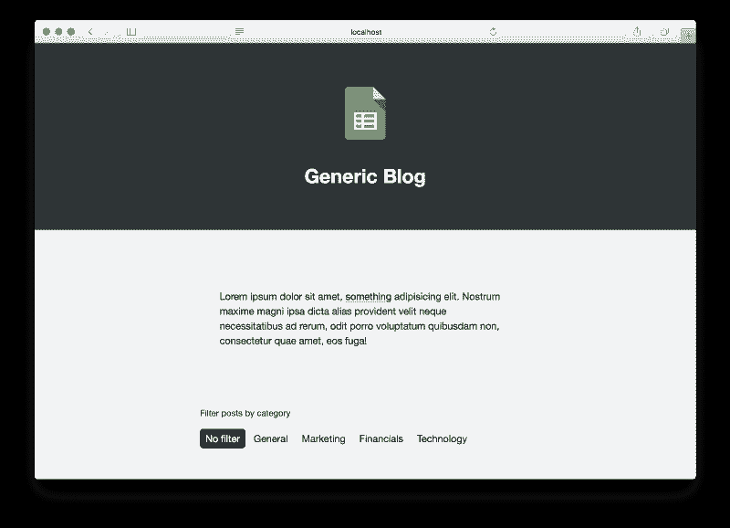
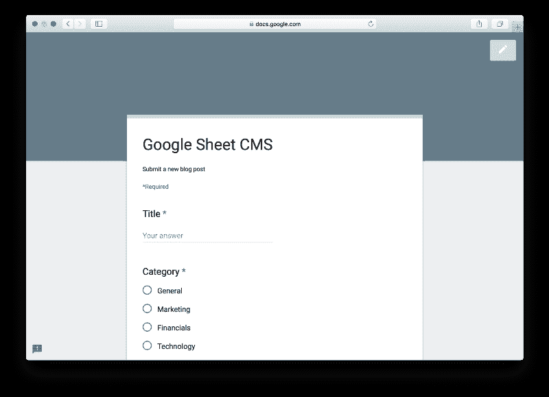
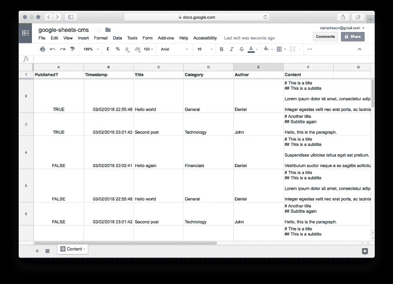

# 如何使用 Google Sheets 和 Google Apps 脚本来构建自己的博客内容管理系统

> 原文：<https://www.freecodecamp.org/news/use-google-sheets-and-google-apps-script-to-build-a-blog-cms-c2eab3fb0b2b/>

丹尼尔·艾瑞森


Using graphics from [SAP Scenes Pack](https://experience.sap.com/designservices/approach/scenes)

# 如何使用 Google Sheets 和 Google Apps 脚本来构建自己的博客内容管理系统

我最近偶然发现了 [Google Apps Scripts](https://developers.google.com/apps-script/) ，这是一个允许用户通过 JavaScript 派生的脚本语言扩展 Google 在线产品 G 套件的平台。它类似于大多数微软 Office 产品内置的 [VBA](https://msdn.microsoft.com/en-us/vba/office-shared-vba/articles/getting-started-with-vba-in-office) 。

Google Apps 脚本非常强大，可以在 Google 服务的基础上构建复杂的系统。当您需要快速原型化一个想法或设计一个可由非技术用户定制的解决方案时，它可能是一个很好的选择。创建易访问的解决方案的一个好方法是在用户已经熟悉的产品的基础上构建。

在本文中，我将通过一个简单而新颖的例子，使用 Google Sheets、Google Forms 和 Google Apps 脚本为在线博客构建一个“内容管理系统”(CMS)。

该博客将被设计为一个单页应用程序，具有分页和按文章类别过滤的能力。博客文章将存储在谷歌工作表电子表格中。新帖子将通过谷歌表单添加，因为它提供了一个用户友好的界面。Google Apps 脚本将用于构建一个 API，以一种易于使用的格式提供电子表格内容。



[https://danielireson.github.io/google-sheets-blog-cms](https://danielireson.github.io/google-sheets-blog-cms/)

#### 放弃

我没有在生产中使用它，我不知道它是否可以扩展。请将它视为展示可能性的概念证明。如果您想在生产环境中使用它，您应该自己进行研究。我怀疑，如果接近服务配额的上限，流量将会受到抑制。免费谷歌账户的脚本每天有 20，000 次 URL 获取的硬性限制，也可能有其他限制。

### 存储数据

Google Sheets 将被用作存储博客文章的平面文件数据库。平面文件数据库以纯文本形式在单个表中存储数据。相比之下，关系数据库捕获跨表的关系，并强制实施这些关系的结构，以最小化重复并最大化数据完整性。

尽管有更多的限制，平面文件结构很容易上手，并且适合我们的小型博客用例。

#### 电子表格结构

每一行代表一篇新的博客文章，而列将用于捕获单个博客文章字段。在平面文件结构中，没有关系模型中的主键和外键的概念。在栏中捕获的信息，如类别和作者，在常见的情况下会在博客文章中重复。

#### 入门指南

创建一个新的 Google Sheets 电子表格，并通过进入菜单栏中的 **Tools > Create a fo** rm 将其连接到 Google Forms。选择该选项后，将出现一个编辑器来定义表单问题。这些被映射到电子表格列。

对于我的演示，我增加了四个问题，分别是**标题**、**类别**、**作者、**和**内容**。

除了**类别**之外，每个字段都有一个文本类型，后者是一个单选类型，有四个假设类别:一般、营销、金融、技术。



[https://docs.google.com/forms/d/1QKthdGK9pznyojcZ4esrU1moky8_Wih4aqa7_uIQ0sw](https://docs.google.com/forms/d/1QKthdGK9pznyojcZ4esrU1moky8_Wih4aqa7_uIQ0sw/closedform)

提交表单时，Google Sheets 电子表格中会追加一行。为每一行自动添加一个**时间戳**字段，我们将使用它来计算发布日期。

考虑到文章草稿，我还添加了一个布尔型的 **Published？**字段作为第一列。API 应该只返回值为 **true** 的帖子。这允许帖子在发布前被审阅和编辑。



[https://docs.google.com/spreadsheets/d/1xy6Hz8yagIW7zwdGGC0XICObIoZ_YYhRhnQ1T8GrQnE/edit?usp=sharing](https://docs.google.com/spreadsheets/d/1xy6Hz8yagIW7zwdGGC0XICObIoZ_YYhRhnQ1T8GrQnE/edit?usp=sharing)

### 构建 API

Google Apps 脚本建立在 ECMAScript 5 (ES5) JavaScript 标准之上。在构建 API 时，我们不能使用 ES6 的特性，比如作用域变量、箭头函数或默认参数。如果你不确定 ES5 中有什么，我建议你参考一下 [MDN 文档](https://developer.mozilla.org/en-US/docs/Web/JavaScript)兼容性表。

尽管缺少 ES6，Google Apps 脚本仍然可以用来在 G Suite 产品上构建相当复杂的应用程序。

#### 入门指南

你可以通过进入**工具>脚本编辑**或者在谷歌工作表电子表格的菜单栏中访问谷歌应用程序脚本在线编辑器。一个脚本编辑器将打开一个名为**代码** .gs 的空文件。因为这是一个简单的应用程序，我们将把我们的逻辑放在这个脚本中，但是你也可以很容易地把你的应用程序分成单独的脚本。

#### 返回响应

我们可以利用`doGet`和`doPost`回调函数来响应 HTTP 请求。这些只是普通的函数，当分别向 API 发出 GET 或 POST 请求时，Google Apps 脚本会调用这些函数。

为了生成响应，我们将使用[内容服务](https://developers.google.com/apps-script/guides/content)。可以将一个 JavaScript 对象传递给这个服务上的`JSON.stringify`，然后再传递给`createTextOutput`，以构建一个 JSON 响应。如果 mime 类型被设置为`ContentService.MimeType.JSON`，这将适当地设置内容类型为`application/json`。

生成 JSON 响应非常简单，如下所示:

```
function doGet(e) {  var output = JSON.stringify({    status: 'success',    message: 'It worked',  });    return ContentService.createTextOutput(output)    .setMimeType(ContentService.MimeType.JSON);}
```

#### 解析请求

`doGet`回调总是由请求生成的事件调用。从这个事件中，我们可以访问查询字符串参数，我们将使用这些参数来支持各种 API 选项。简单的无状态认证将通过一个`key`参数来实现。这将简单地检查`key`参数值是否与硬编码的键值匹配。不匹配的请求将显示未授权的响应。

将使用一个`category`参数，以便用户可以从一个单一的类别中请求帖子。这使他们不必在前端按类别过滤。分页也将通过一个`page`参数来实现。

当发出 API 请求时，这些选项应该附加到 URL 上。

```
GET https://apiurl?key=abcdef&category=general&page=1
```

该请求将生成以下事件:

```
{  "queryString": "key=abcdef&category=general&page=1",  "parameter": {},  "contextPath": "",  "parameters": {    "key": [      "abcdef"    ],    "category": [      "general"    ],    "page": [      "1"    ]  },  "contentLength": -1}
```

我们先来鉴定一下事件。我们将通过检查是否已经提供了`key`以及它是否与定义的 API 键匹配来实现这一点。

```
var API_KEY = 'abcdef';
```

```
function doGet(e) {  if (!isAuthorized(e)) {    return buildErrorResponse('not authorized');  }      return buildSuccessResponse('authorized');}
```

```
function isAuthorized(e) {  return 'key' in e.parameters && e.parameters.key[0] === API_KEY;}
```

```
function buildSuccessResponse(message) {  var output = JSON.stringify({    status: 'success',    message: message  });    return ContentService.createTextOutput(output)   .setMimeType(ContentService.MimeType.JSON);}
```

```
function buildErrorResponse(message) {  var output = JSON.stringify({    status: 'error',    message: message  });    return ContentService.createTextOutput(output)   .setMimeType(ContentService.MimeType.JSON);}
```

API 键被定义为文件顶部的`abcdef`。`isAuthorized`函数返回一个用于认证的布尔值。如果返回假，那么通过`buildErrorResponse`助手返回一个`not authorized`消息。如果`isAuthorized`返回真，则允许该功能继续，直到通过`buildSuccessResponse`返回成功响应。

我发现在 Google Apps 脚本上构建应用程序的一个缺点是，你不能为响应设置状态代码。这些可以用来指示响应是否成功，如果不成功，为什么。

例如， [401 未认证](https://httpstatuses.com/401)状态代码意味着用户凭证不匹配，他们应该使用不同的凭证重试。使用`doGet`时，响应总是有一个 [200 OK](https://httpstatuses.com/200) 状态码，即使是处理不成功的响应。我通过向所有 API 响应添加一个`status`值来解决这个问题。对于这个简单的例子，状态可以是`success`或`error`，但是很容易看出，如果需要，这个模式可以扩展到其他更细粒度的状态。

让我们创建两个函数来解析`category`和`page`参数。如果没有提供有效的数值`page`，其默认值应该是`1`。同样，如果没有提供类别，默认值应该设置为`null`，在这种情况下，应该返回所有类别的帖子。

```
function getPageParam(e) {  if ('page' in e.parameters) {    var page = parseInt(e.parameters['page'][0]);    if (!isNaN(page) && page > 0) {      return page;    }  }    return 1}
```

```
function getCategoryParam(e) {  if ('category' in e.parameters) {    return e.parameters['category'][0];  }    return null}
```

#### 从电子表格中读取

Google Apps 脚本提供了各种全局对象，可用于与 G Suite 产品进行交互。我们将使用 [SpreadsheetService](https://developers.google.com/apps-script/reference/spreadsheet/) 按 ID 加载我们的电子表格并阅读博客文章。查找电子表格 ID 最简单的方法是查看 Google Sheets 的 URL。

```
https://docs.google.com/spreadsheets/d/{id}/edit
```

通过全局`SpreadsheetService`上的`openById`方法加载电子表格后，我们需要从第一张工作表中获取活动数据区域。为了首先返回最近的帖子，我们应该对第二列的**时间戳**进行排序。

```
var SPREADSHEET_ID = '12345';var spreadsheet = SpreadsheetApp.openById(SPREADSHEET_ID);var worksheet = spreadsheet.getSheets()[0];var rows = worksheet.getDataRange() .sort({column: 2, ascending: false}) .getValues();
```

来自`getDataRange`的`rows`数组包含作为第一个数组项的列标题和作为后续数组项的博客文章行。标题可以映射到博客文章，这样 API 就可以返回完整的博客文章对象，而不仅仅是列值。

```
var headings = rows[0].map(String.toLowerCase);var posts = rows.slice(1);var postsWithHeadings = addHeadings(posts, headings);
```

```
function addHeadings(posts, headings) {  return posts.map(function(postAsArray) {    var postAsObj = {};        headings.forEach(function(heading, i) {      postAsObj[heading] = postAsArray[i];    });        return postAsObj;  });}
```

#### 过滤无关的帖子

只有当博客文章的类别与请求的类别相匹配时，它们才应该被返回，如果没有被请求，所有类别的文章都应该被返回。博客文章也应该进一步返回，如果他们有一个真正的**的`**Published**`值。**

**让我们创建一个函数，通过一个[数组过滤器](https://developer.mozilla.org/en-US/docs/Web/JavaScript/Reference/Global_Objects/Array/filter)删除草稿帖子:**

```
`var postsPublic = removeDrafts(postsWithHeadings);`
```

```
`function removeDrafts(posts, category) {  return posts.filter(function(post) {    return post['published'] === true;  });}`
```

**还有另外一个功能给`filter`上的帖子分类:**

```
`var category = getCategoryParam(e);var postsFiltered = filter(postsPublic, category);`
```

```
`function filter(posts, category) {  return posts.filter(function(post) {    if (category !== null) {      var c1 = post['category'].toLowerCase()      var c2 = category.toLowerCase()      return c1 === c2;    } else {      return true;    }  });}`
```

#### **将响应分页**

**出于性能原因，我们应该限制单个 API 响应返回的帖子的最大数量。客户端应该能够通过增加查询参数`page`来请求下一页的帖子。**

**让我们通过分页函数来实现这一点，该函数返回一个对象，该对象包含在`posts`下过滤的博客文章和在`pages`下的分页链接。如果有更多或以前的结果，`pages`分别在`next`和`previous`下包含相应的页码。**

```
`var RESULTS_PER_PAGE = 5;var page = getPageParam(e)var paginated = paginate(postsFiltered, page);`
```

```
`function paginate(posts, page) {  var postsCopy = posts.slice();  var postsChunked = [];  var postsPaginated = {    posts: [],    pages: {      previous: null,      next: null    }  };    while (postsCopy.length > 0) {    postsChunked.push(postsCopy.splice(0, RESULTS_PER_PAGE));  }    if (page - 1 in postsChunked) {    postsPaginated.posts = postsChunked[page - 1];  } else {    postsPaginated.posts = [];  }`
```

```
 `if (page > 1 && page <= postsChunked.length) {    postsPaginated.pages.previous = page - 1;  }    if (page >= 1 && page < postsChunked.length) {    postsPaginated.pages.next = page + 1;  }    return postsPaginated;}`
```

**我们之前的`buildSuccessResponse`助手可以更新来处理`posts`和`pages`。然后，API 应该可以部署了。**

```
`function buildSuccessResponse(posts, pages) {  var output = JSON.stringify({    status: 'success',    data: posts,    pages: pages  });    return ContentService.createTextOutput(output)    .setMimeType(ContentService.MimeType.JSON);}`
```

#### **部署 API**

**脚本完成后，可以通过从脚本编辑器菜单栏转到**Publish>Deploy as weba**PP 来公开 API。确保应用程序在任何人处以**我和**的身份执行，甚至匿名** ous 也可以访问。****

**部署将返回如下所示的 URL:**

```
`https://script.google.com/macros/s/{id}/exec`
```

**将 API 密钥附加到 URL，然后将其输入到您的 web 浏览器中，以检查 API 是否正常工作。希望您应该看到一个 JSON 响应，其中有三个顶级键:`status`、`posts`、`pages`。**

```
`https://script.google.com/macros/s/{id}/exec?key=abcdef`
```

### **摘要**

**如果你一直这样做，你现在应该有一个基于 Google Sheets、Google Forms 和 Google Apps 脚本的功能性 CMS。它并不先进，但是很容易上手，并且满足了 CMS 的核心需求。将它连接到前端超出了本文的范围，但是如果您想了解如何做到这一点，您应该查看我在 GitHub 上整理的演示[。](https://github.com/danielireson/google-sheets-blog-cms)**

**下一次，当你打算尝试当今的技术时，我建议你花点时间思考一下，是否有一个更简单的解决方案可以使用现有的软件来构建。该解决方案可能功能不全，但它通常会让您用 20%的精力完成 80%的工作，这在许多情况下已经足够好了。我希望这篇博文能够证明这一点，并希望你在这个过程中对 Google Apps 脚本有所了解。**

#### **[观看演示](https://danielireson.github.io/google-sheets-blog-cms)**

#### **[在 GitHub 上查看项目](https://github.com/danielireson/google-sheets-blog-cms)**

****