# 更新:航空公司网站不关心你的隐私:Emirates.com 的案例研究

> 原文：<https://www.freecodecamp.org/news/how-airlines-dont-care-about-your-privacy-case-study-emirates-com-6271b3b8474b/>

作者科纳克·莫迪

# 更新:航空公司网站不关心你的隐私:Emirates.com 的案例研究

我问我的妻子，如果她的出生日期被一个陌生人知道，是否可以。除非他们送我生日礼物，她开玩笑说。你的护照号码是多少？她放下正在读的书。我现在引起了她的注意。

现在想象一下，我说“你试着在网上办理登机手续，看到错误信息——这个预订不存在。你再试一次，这肯定是个错误。没有，还是同样的错误信息。呼叫中心的人重复同样的话。这一定是个错误！你检查你的电子邮件，它就在那里——盯着你——确认取消的电子邮件。但你确定不是你干的。”侦探小说？

这不是科幻小说中牵强的场景，[这真的发生了](https://media.ccc.de/v/33c3-7964-where_in_the_world_is_carmen_sandiego)。

一个拥有初级数字产品、甚至缺乏基本数据安全实践的组织，正生活在一个乌托邦世界中，在那里，人们开着保险箱，永远不会想到会有窃贼闯入。

在全面披露之后，去年的某个时候，在为家人预订旅行时，我无意中发现了一些数据安全做法，作为一名数据安全倡导者，这让我非常担心。当我向酋长队表达我的担忧时，发生了这样的对话-

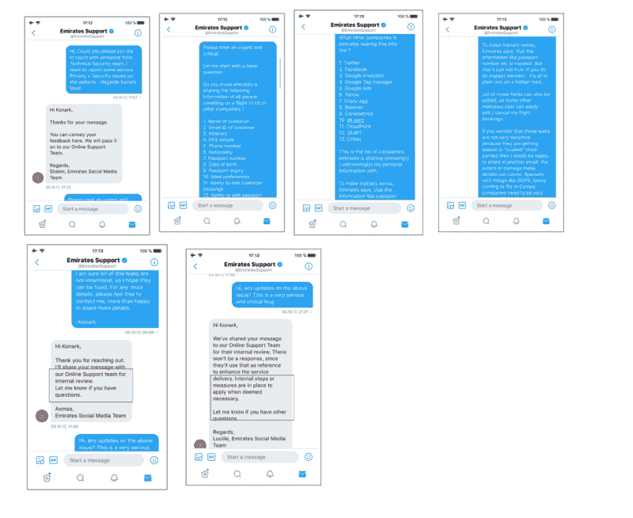

Conversation with Emirates support.

对于一个门外汉来说，当你通过阿联酋航空预订国内或国际航班时，大约有 [300 个数据点](https://pastebin.com/cAcXx2A4)与你的预订相关。

当你点击“管理偏好设置”为你的旅行选择座位或餐食或办理登机手续时，你的预订 ID 和姓氏会被传递给大约 14 个不同的第三方追踪器，如 Crazy egg、Boxever、Coremetrics、Google 和脸书等。

### **详情**

在阿联酋航空完成预订后，我收到了一封标题为“预订确认——预订号码”的电子邮件。

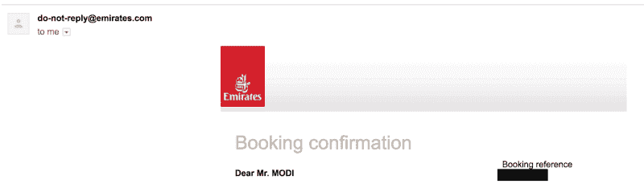

Booking confirmation email.

电子邮件的正文包含管理预订。我点击“管理预订”按钮选择座位和餐食，然后进入“管理首选项”页面。这很简单。

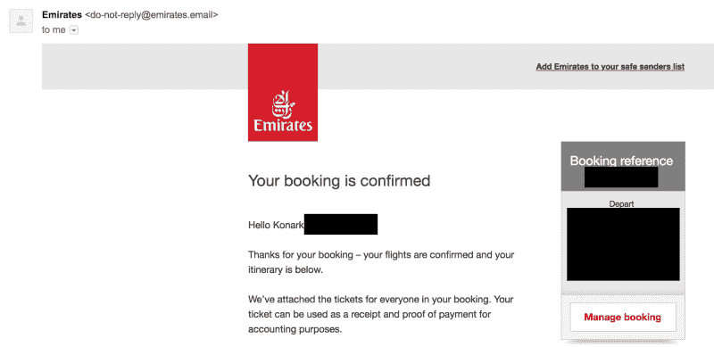

Manage booking link in email.

作为一个用户，我看到了点击一个链接并到达登陆页面“管理首选项”的正常行为，在后台发生了一个重定向链。

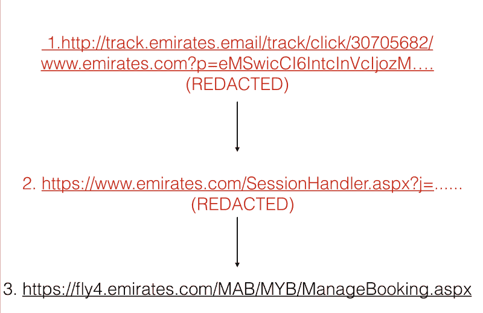

Redirection chain before reaching the landing page.

虽然管理预订链接应该是我(用户和网站)独有的，但该链接也与阿联酋航空在其网页上实现的许多第三方追踪器共享。

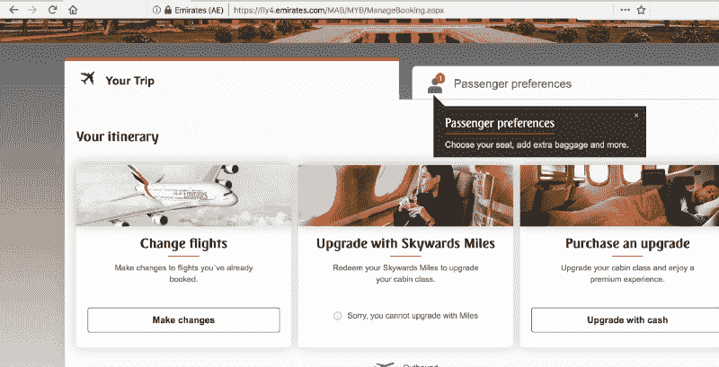

Manage booking page.

蛋糕上的樱桃是指向管理首选项页面的 HTTP 链接。HTTP 的不安全性已经被反复讨论过，尤其是在维护内容的真实性和防止入侵者方面。但简而言之，HTTP 链接是一个数据隐私噩梦。因此，阿联酋航空不仅将用户信息传递给自行实施的第三方追踪器，还允许网络对手访问所谓的“私人”页面。

[http://track.emirates.email/track/click/30705682/www.emirates.com?p=eMSwicCI6IntcInVcIjozM....(REDACTED)](http://track.emirates.email/track/click/30705682/www.emirates.com?p=eMSwicCI6IntcInVcIjozM....(REACTED))

### **第三方可以访问什么样的信息？**

(1)和(2)中提到的链接目前正在发送给第三方。

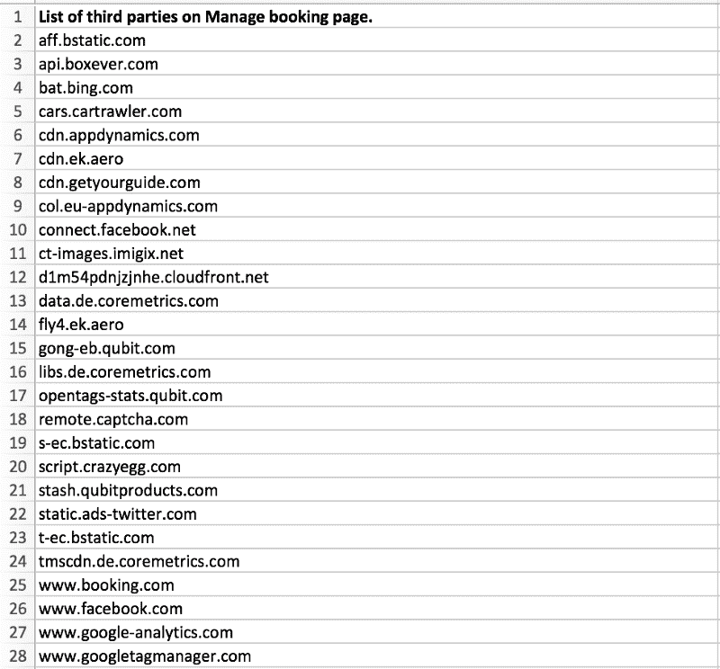

以下字段包含 URL，它提供了对预订详细信息的访问。

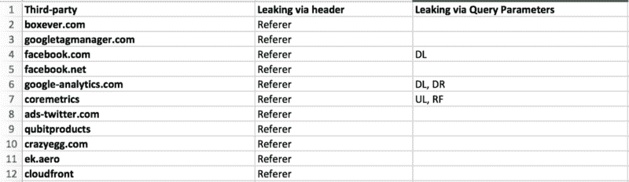

Fields which take home the private url.

Sending url in key `dr` used by Google Analytics.

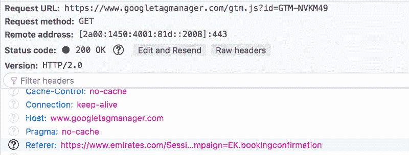

任何有权访问这些链接的人不仅可以阅读，还可以编辑我作为用户可以编辑的信息。

例如，他们现在可以-

1.  更改或取消航班
2.  更改座位或用餐偏好
3.  向预订中添加更多产品
4.  更改或添加护照信息
5.  更改或添加常旅客信息等。

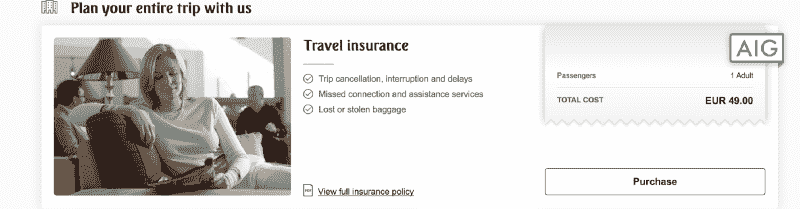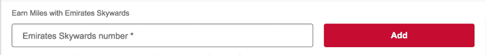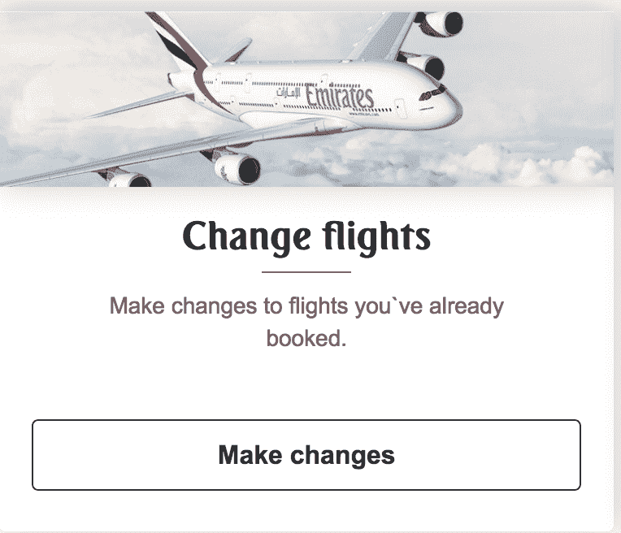

Modify booking.

**该页面可编辑个人信息展示:**

**答:全名:**

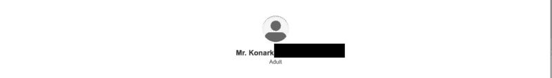

Name.

**b .朝天数**

Skywards number

**c .电子邮件 ID /电话号码:**

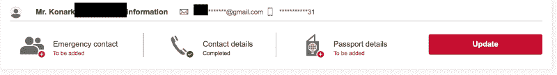

Read / Change personal information

**d .已付金额，费用分解。**

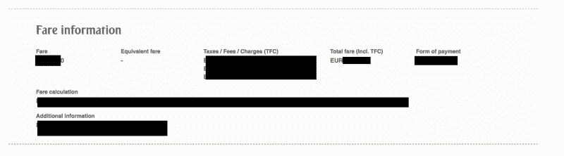

Amount paid, form of payment, fare break-up.

**e .护照详情、国籍、出生日期、性别**

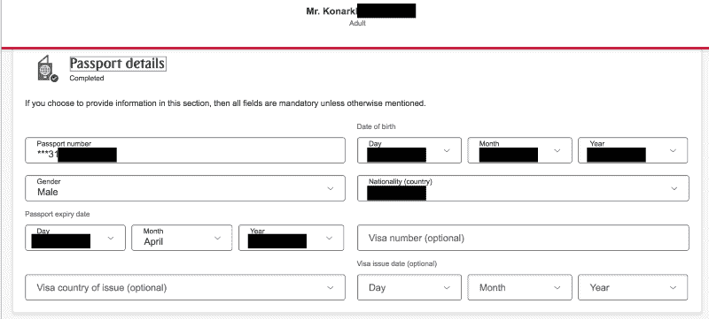

Passport details, DOB, Expiry, Gender, Nationality.

*注:【2017 年 10 月，护照号、邮箱 Id、电话号码等字段在用户界面上显示被屏蔽，但在源代码中没有被混淆。自那以后，这个网络应用程序已经被修改，这些字段现在已经变得模糊不清了。*

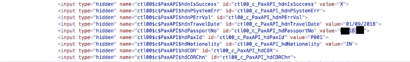

Masked fields in plain text. (October 2017)

我决定看一眼手机应用程序，看看过去是否赶上了现在，你瞧，它完全展现了自己的荣耀——明文显示护照号码、电子邮件 ID 和电话号码。在 web 应用上被混淆的内容在移动应用上很容易获取。

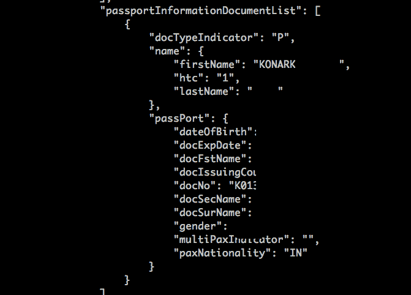

Passport details in plain text on mobile API.

现在，这有什么问题？

这个问题不仅限于阿联酋航空公司，很多航空公司，如汉莎航空公司、荷兰皇家航空公司(最近一次检查是在 2017 年 10 月)都存在同样的问题。

每个网站都使用第三方追踪器来改进他们的产品，提供更好的网络使用体验。数据泄漏通常被认为是附带损害，有时在实施这种追踪器时甚至根本不被考虑。

这些第三方大多出现在许多其他网站上，并使用 cookies 等长期标识符来跨域跟踪用户。现在，因为其中一个网站，在这种情况下，阿联酋航空公司，泄露私人信息，这些公司现在不仅可以链接用户在网络上的活动，还可以识别用户是谁。

阿联酋航空(和其他公司)需要回答的问题是-

1.  为什么我的预订信息在没有得到我明确同意的情况下就被传递给了这些第三方。
2.  为什么这些第三方需要接收这些信息？
3.  阿联酋航空是否意识到敏感的用户信息正被泄露给这些第三方？
4.  这些第三方是谁？
5.  他们用用户信息做什么？

### **报告给酋长**

出于负责任的行为，在发现这些侵犯用户数据隐私的严重安全缺陷后，我决定在 2017 年 10 月通过 Twitter DM 向阿联酋航空发出警告。请注意，我在阿联酋航空网站上找不到报告安全漏洞的专用渠道。

社交媒体团队立即回复了我的推特信息，但我不准备放弃希望。我还写了一封电子邮件给产品经理，强调了安全缺陷。我遇到了震耳欲聋的沉默。

截至今天(2018-03-03 ),许多这些问题仍然存在。

这是对隐私的严重侵犯，在整个预订过程中，我没有同意与这些网站分享任何个人信息。

阿联酋航空本身的[隐私政策](https://www.emirates.com/english/sitetools/privacy_policy.aspx)也不是很清楚。T2 提到了这些服务中的一部分，但并没有提到所有的或者哪些数据与他们共享。

#### 我可以不选择退出吗？

不是一个选项。不幸的是，我无法找到退出阿联酋航空提供的这个系统的方法。我最终不得不依靠使用隐私保护浏览器扩展。

#### **这不是阿联酋航空能搞定的吗？**

作为一名为一些最大的电子商务公司工作的软件工程师，我理解使用第三方服务来优化和增强数字产品以及用户与产品的交互方式的必要性。

在这种情况下，我们关心的不是第三方服务的使用，而是这些服务的实现。阿联酋航空控制着他们的网站，以及该网站与第三方服务共享的内容。需要行使这种控制来限制用户信息的泄露。

这不是一项艰巨的任务，只是一个维护基本隐私权的承诺问题。

例如:

1.  私人页面应该有 [noindex meta 标签](https://developer.mozilla.org/en-US/docs/Web/HTML/Element/meta)。
2.  限制第三方服务在个人页面上的出现。
3.  [包含敏感数据的页面上的 Referrer-Policy](https://developer.mozilla.org/en-US/docs/Web/HTTP/Headers/Referrer-Policy) 。
4.  实施 CSP 和 SRI。即使有大量第三方服务 [CSP](https://developer.mozilla.org/en-US/docs/Web/HTTP/CSP) 、 [SRI](https://developer.mozilla.org/en-US/docs/Web/Security/Subresource_Integrity) 都没有在 Emirates.com 启用
5.  用户需要被告知敏感信息，如护照，联系方式等。被更新、编辑或删除。
6.  发送邮件的域名:track.emirates.email，要有有效证书。[https://track.emirates.email/](https://track.emirates.email/)

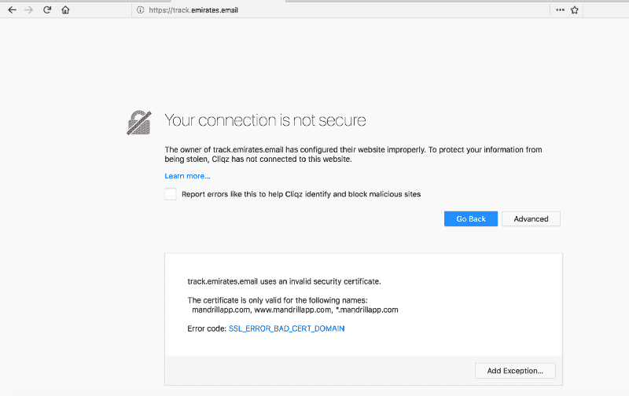

如果你有兴趣在你最喜欢的网站上阅读更多关于追踪器的信息，我强烈推荐你查看一下 [WhoTracksMe](https://whotracks.me/) 。

***更新:***

***-2018 年 3 月 6 日:***

阿联酋航空发表了一份标准声明。

*摘录:“**莫迪文章中关于共享哪些数据或客户选择‘退出’的描述是不准确的。”***

*以下是我的回应:[隐私泄露往返:Emirates.com 在否认](https://medium.com/@konarkmodi/privacy-leaks-round-trip-emirates-com-in-denial-7f99950bcdd)*

黑客快乐！

- [Konark Modi](https://twitter.com/konarkmodi)

感谢阅读和分享！:)

如果你喜欢这个故事，请随意？？？几次(最多 50 次。说真的)。

*鸣谢:特别感谢[雷米](https://twitter.com/Pythux)、[帕拉维](https://twitter.com/Pi_Modi)对帖子的审核。*