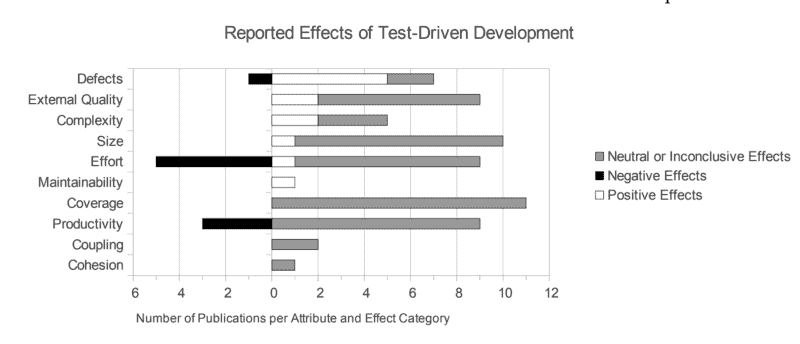
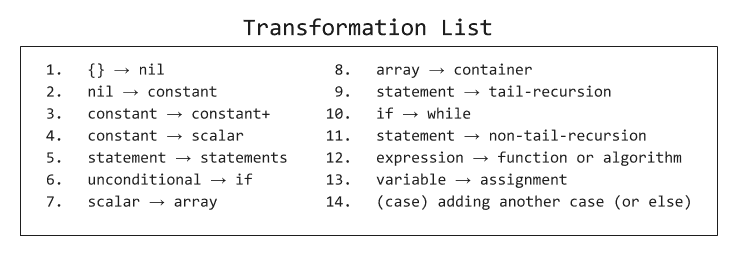
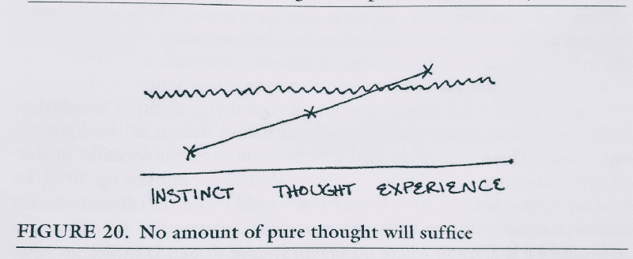

# 测试驱动开发的测试文化观察

> 原文：<https://www.freecodecamp.org/news/8-observations-on-test-driven-development-a9b5144f868/>

道格·阿库里

# 测试驱动开发的测试文化观察


A homage to “purple” wires installed by IBM field engineers decades ago. They were actually yellow.

这不是测试驱动开发的初级读本。它包含了我个人对重新开始学科的观察和单元测试工艺的问题。

Kent Beck 是软件工程的领导者，也是测试驱动开发(TDD)的现代发明者。Kent 还与 Erich Gamma 共同编写了一个广泛使用的测试框架 JUnit。

肯特在他的《XP 解释 T1》(第二版)一书中描述道，在**价值观**和**实践**的交叉点上，形成了**原则**。当我们从概念开始迭代并插入我们认为是公式的东西时，我们实现了一个转换。

```
[KISS, Quality, YAGNI, ...] + [Testing, Specs, ...] == [TDD, ...]
```

我对 Kent 一生的工作怀有深深的敬意，不仅因为他辉煌的软件创作，还因为他对**信任*****勇气*****反馈*****简单** 和**漏洞** *的不断探索。所有的属性对于极限编程(XP)的发明都是至关重要的。****

**TDD 是 XP 社区遵循的原则和规则。这门学科已经存在了 19 年。**

**在这篇文章中，我将描述我对采用 TDD 的看法。接下来，当我们执行 TDD 时，我们将探索有趣的个人观察。最后，我们将通过假设为什么 TDD 没有像它应该的那样起飞来结束。我们开始吧。**

### **TDD、研究和专业精神**

**十九年过去了，在开发社区中，TDD 仍然是一个争论的话题。**

**一个分析人员会问的第一个问题是“今天有多少或者百分之多少的软件专业人员使用 TDD？”如果你问罗伯特·马丁(鲍勃叔叔)的朋友，肯特·贝克的朋友，答案是百分之百。这是因为 Bob 叔叔认为，如果测试驱动开发没有被实践，考虑成为专业人员是不可行的。[1]**

**鲍勃叔叔几年来一直是这个学科的焦点，作为这篇文章的一部分来讨论他是很自然的。Bob 叔叔捍卫了 TDD，并极大地推动了该学科的发展。毫无疑问，我也尊重鲍勃叔叔和他的实用主义教条主义。**

**然而，没有人问后续问题“实践的定义是故意使用——但它没有指定数量或百分比，对吗？”我的主观估计是，大多数人甚至在很短的时间内都没有实践过 TDD。**

**现实情况是，我们实际上**不知道，**因为实践百分比还没有被广泛研究。我们唯一具体的衡量标准是聚集在 [WeDoTDD](http://www.wedotdd.com/) 的一小群公司。在这里，有对这类公司的跟踪。采访是对那些 100%时间都在练习的人进行的，但是这个名单很小。它也是不完整的，因为简单的搜索发现其他更大的商店在实践——但可能不是满负荷的。**

**如果我们不知道有多少人在实践，下一个问题是“基于测量的利益，TDD 有多有效？”**

**您会很高兴地知道，多年来已经有研究证明了 TDD 的有效性。这包括来自[微软](https://collaboration.csc.ncsu.edu/laurie/Papers/Unit_testing_cameraReady.pdf)、 [IBM](http://citeseerx.ist.psu.edu/viewdoc/download?doi=10.1.1.567.3740&rep=rep1&type=pdf) 、北卡罗来纳大学和[赫尔辛基大学](http://www.sserg.org/publications/uploads/04b700e040d0cac8681ba3d039be87a56020dd41.pdf)的公认报告。**

**

An impactful visual taken from the Helsinki report.** 

**这些报告在一定程度上证明了缺陷密度减少了 40%到 60%,而付出的努力和执行时间却增加了 15%到 35%。这些数字也开始通过书籍和新的行业流程(如 DevOps 社区)得到反映。**

**这些问题已经回答了一半，最后一个问题是“当我开始执行 TDD 时，我应该期待什么？”你很幸运，因为我已经形成了自己对 TDD 的观察。接下来我们来复习一下。**

### **1.描述进近的 TDD 命令**

**当我们实践 TDD 时，我们开始经历一种“发号施令”的现象。简单地说，创建失败和通过测试的简短行为将在智力上挑战开发人员。他们会大声说“我认为这将会过去”和“我不认为这将会过去”或“我不确定，让我在尝试这种方法后再想想。”**

**开发者的 IDE 已经变成了一只乞求激烈对话的橡皮鸭。至少，TDD 商店应该与这种类型的转换保持一致。**

> **思考，然后大声说出你下一步要做的事情。**

**这种类型的强化是沟通的关键，不仅是为了预测你的下一步行动，也是为了强化编写最简单的代码来通过单元测试的概念。当然，如果开发人员变得沉默，他们几乎肯定会偏离循环，必须回到正确的道路上。**

### **2.TDD 命令肌肉记忆**

**当开发人员在 TDD 的第一个周期中前进时，他们将会在高摩擦和笨拙的流程中经历沉重的疲劳。这对于任何主动但未经学习的人类活动都是正确的。开发人员将试图找到改善循环的捷径，因为目标是减少尴尬和改善肌肉记忆。**

**肌肉记忆是感觉良好和流畅的关键。因为执行重复，所以 TDD 需要它。**

> **打印出一个快捷的备忘单。在你的 IDE 中学习尽可能多的快捷方式，以使你的循环更有效。然后，继续寻找更多。**

**开发人员将成为选择快捷方式的专家，包括构建和运行测试平台。通过更多的练习，创建新的工件、突出显示文本和导航 IDE 将变得很自然。最后，我们开始解锁所有的重构快捷方式，比如提取、重命名、生成、提取、重新格式化和下推代码。**

### **3.TDD 要求至少稍微向前思考**

**每次开发人员坐下来开始 TDD 时，他们必须有一个具体的简短的关于要解决什么的思维地图。在传统的编码方法中，这并不总是正确的，因为求解的思维导图可能是宏观的和探索性的。开发人员不知道如何解决问题，但可能知道一个模糊的目标。为了达到这个目标，单元测试在这个过程中被忽略了。**

**坐的开始和结束也要仪式化。首先，思考并列出清单。玩吧。列举更多。然后开始，做，然后思考。检查完毕。重复几次。最后想想又停下来。**

> **像鹰一样维护你的测试列表。一边走一边核对项目。不要开车。想想吧！**

**该列表可能需要一些时间来制定，并不是周期的一部分。然而，它应该在周期开始前准备好。如果你没有，你可能不知道你要去哪里。总是有一张地图。**

```
**`// A Test List// "" -> does not validate// "a" -> does not validate// "aa" -> validates// "racecar" -> validates// "Racecar" -> validates// print the validation// have a blueberry ale`**
```

**正如 Kent Beck 所描述的，开发人员必须命令一个**测试列表**。测试列表允许在接下来的直接循环中解决问题。在周期开始之前，测试列表应该总是被修改和更新。一旦测试列表被解决，减去最后一步，循环以红色停止，测试失败。**

### **4.TDD 要求与他人沟通**

**填写上面的测试列表时，某些步骤可能会因为工作承诺不明确而受阻。开发人员无法找出测试列表。或者反过来。生成一个假定的测试列表，该列表对缺失的需求有太多的猜测。建议就此打住。**

**没有 TDD 的驱动将导致不必要的复杂性的实现。无精打采、漫不经心地驾驶 TDD 同样危险。**

> **如果测试列表有缺口，请大声说出来。**

**在 TDD 中，开发人员必须根据所有者对需求的描述来理解要构建什么，仅此而已。如果需求在上下文中不清楚，测试列表将开始分解。这种崩溃需要一次对话。坦诚的交流可以迅速转化为信任和尊重。短反馈回路现在已经建立。**

### **5.TDD 需要迭代架构**

**Kent 最初在 XP 的第一版中提出，测试应该驱动架构。然而，在过去的几年中，有一些关于短跑团队如何在几场短跑中碰壁的故事。**

**当然，让测试驱动所有的架构是不明智的。Bob 叔叔同意其他专家的观点，即由测试驱动的架构是“马 sh * t”。[1]需要一些更大的地图，但是不要超出该领域中正在工作的分布式测试列表太多。**

**Kent 在多年前的《TDD 举例说明》一书中也提到了这一点。**并发**和**安全**是 TDD 无法驱动，开发者必须分别关注的两大领域。不严格地说，通过系统设计的并发性是在不同的层次上，并且必须反复地和 TDD 一起努力。这在今天是千真万确的，因为一些架构正朝着反应式和反应式扩展发展，这是并发构造的顶点。**

> **创建一个更大的组织图。一个稍微超前一点的愿景。确保你以同样的方式带领团队前进。**

**然而，最重要的想法是 TDD 无法单独有效处理的系统的**组织**。这是因为单元测试是在较低的层次上进行的。迭代架构和 TDD 编排在实践中很难，需要所有团队成员之间的信任、结对编程和可靠的代码审查。没有明确的方法可以做到这一点，但是很明显，需要简短的迭代设计会议，与现场的测试列表保持一致。**

### **6: TDD 揭示了单元测试的脆弱性和退化的实现**

**单元测试有一个有趣的特性，TDD 暴露了这个特性。他们无法证明正确性。E.W. Dijkstra 在这方面做了大量工作，并讨论了在我们的专业中用数学证明来解决这一差距的可能性。**

**例如，下面解决了业务所需的关于一个假设的不完美回文的所有测试。它是用 TDD 开发的。**

```
**`// Not an imperfect palindrome.`**
```

```
**`@Testfun `Given "", then it does not validate`() {    "".validate().shouldBeFalse()}@Testfun `Given "a", then it does not validate`() {    "a".validate().shouldBeFalse()}@Testfun `Given "aa", then it validates`() {    "aa".validate().shouldBeTrue()}@Testfun `Given "abba", then it validates`() {    "abba".validate().shouldBeTrue()}@Testfun `Given "racecar", then it validates`() {    "racecar".validate().shouldBeTrue()}@Testfun `Given "Racecar", then it validates`() {    "Racecar".validate().shouldBeTrue()}`**
```

**事实上，这些测试有漏洞。单元测试是脆弱的，即使对于最琐碎的问题。我们永远无法证明正确性，因为如果我们不得不证明，那将需要极端的脑力劳动，并且所需的投入将是无法想象的。**

```
**`// Too generic of a solve based on tests provided`**
```

```
**`fun String.validate() = if (isEmpty() || length == 1) false else toLowerCase() == toLowerCase().reversed()`**
```

```
**`// Is the best implementation and solves all tests`**
```

```
**`fun String.validate() = length > 1`**
```

**`length >`；1 可以被称为 **ed 退化工具**离子。它仅仅是解决手头问题的足够的实现，但是它本身并没有告诉我们关于我们试图解决的问题的任何信息。**

**问题是，开发人员什么时候停止编写测试？答案似乎很简单。当**业务被满足**时，而不是代码作者被满足时。这可能会伤害我们**的建设热情** 而我们又被**的简洁** *所尴尬。*这些感觉被干净代码的良好感觉和以后自信地重构的能力所平衡。东西就是感觉整洁干净。**

> **要知道单元测试是不可靠的，但却是必要的。了解他们的优缺点。突变检测可能有助于弥补这一差距。**

**TDD 有好处，但是它可以带走建造我们不需要的沙堡。这是一个约束，但它允许我们走得更快、更远、更安全。也许这就是鲍勃大叔关于成为一名**职业**的真正含义。**

**但是！无论单元测试看起来有多脆弱，它们都是核心必需品。他们需要让**恐惧**转化为**勇气**。测试允许那些人仁慈地重构代码，甚至更好的是，它是一个指南，一个**文档**，对于任何其他开发人员来说，可以立即投入其中，为一个被单元测试很好地支持的项目增加价值。**

### **7: TDD 揭示断言完成反馈循环**

**再退一步。对于接下来的两个现象，我们将参观奇怪的重复出现。对于第一次出现的情况，让我们快速看一下 FizzBuzz。这是我们的测试清单。**

```
**`// Print numbers 9 to 15\. [OK]// For numbers divisible by 3, print Fizz instead of the number.// ...`**
```

**我们已经进去了几步。我们现在有一个失败的测试。**

```
**`@Testfun `Given numbers, replace those divisible by 3 with "Fizz"`() {    val machine = FizzBuzz()    assertEquals(machine.print(), "?")}class FizzBuzz {    fun print(): String {        var output = ""        for (i in 9..15) {            output += if (i % 3 == 0) {                "Fizz "            } else "${i} "        }        return output.trim()    }}`**
```

```
**`Expected <Fizz 10 11 Fizz 13 14 Fizz>, actual <?>.`**
```

**自然地，如果我们将预期的断言数据复制到`assertEquals`，它将获得结果，测试通过。**

> **当我们在实现步骤中不断询问测试装备时，围绕数据设置的失败单元测试可能会正确地回答他们自己的断言。或许我们可以称之为巫毒测试。**

**有时失败的测试会喊出一个正确的结果，这是通过测试所需要的。我不知道该如何称呼这些事件……也许是**巫毒测试** *。*根据你的懒惰和测试礼仪，你的距离可能会有所不同，但是我已经看到过无数次这样的事情发生，当我努力让实现达到既定的和预期的**数据集** *。***

### **8: TDD 揭示转型优先前提**

**在 TDD 中，一个人可能会被困住。有些情况下，开发人员会被他们为实现而应用的转换所困扰。在某些时候，测试代码成为前进的瓶颈。一个僵局形成了。开发人员不得不退出，并通过删除一部分测试来解除武装，以摆脱困境。开发者就暴露了。**

**Bob 叔叔可能在他的职业生涯中经历过这些僵局，然后他可能意识到进行测试通过的行为必须需要优先顺序，以便降低僵局的风险。同时，他也意识到了一个前提。随着测试变得更加具体，代码也变得更加通用。**

**

The order of the transformations. One should always prefer the simplest (top of the list).** 

**这叫做[转换优先前提](https://8thlight.com/blog/uncle-bob/2013/05/27/TheTransformationPriorityPremise.html)。似乎有一个重构风险的顺序，可以选择通过测试来实现。所选择的顶层转换(最简单的)通常是最好的选择，并且产生僵局的风险最小。**

**[TPP](http://blog.cleancoder.com/uncle-bob/2013/05/27/TheTransformationPriorityPremise.html) 或者也许是**鲍勃大叔的测试演算** 是迄今为止最耐人寻味、技术性最强、最令人兴奋的观测之一。以此为指导，尽可能保持代码简单。**

> **打印出 TPP 清单，放在办公桌上。开车时参考它，以避免陷入僵局。拥抱简单的秩序。**

**这就完成了所有的初步观察。但是在我们结束之前，我想回到我最初没有回答的问题“今天有多少或者百分之多少的软件专业人员使用 TDD？”我的回答站在“我觉得群体小”。我想在下面探究一下这个猜测的原因。**

### **TDD 起飞了吗？**

**不幸的是，它没有。这个百分比主观上很低，对数据的搜索还在继续。根据我在招聘、领导团队以及作为一名有同情心的开发人员的经历，让我依靠我的观察。**

#### **原因 1:没有接触过真正的测试文化**

**我有根据的猜测是，大多数软件开发人员没有通过测试文化学习和工作的经验。**

**测试文化的定义是开发人员通过测试有意实践和改进的地方。他们不断指导那些在该领域不熟练的人。每一次配对和每一次拉取请求都是一个反馈循环，帮助个人成为测试高手。在整个工程链中还有主要的支持和后盾。所有经理都理解并相信测试。当最后期限和时间变得艰难时，测试规程不会被放弃——而是被保持。**

**那些经历过测试文化的人，比如我，很幸运能有这些观察。我们可以将这些经验应用到未来的项目中。**

#### **原因二:教育资源不清晰**

**有些人试图写一些关于这个主题的书，比如 [xUnit 模式](http://xunitpatterns.com/)和[有效单元测试](https://www.manning.com/books/effective-unit-testing)。但是，似乎没有一个地方明确规定要测试什么，为什么要测试。大多数资源都没有清楚地描述断言和验证的技巧。**

**开源项目也有好的单元测试。在这些不熟悉的项目中，我做的第一件事就是寻找测试。我的失望几乎是肯定的。我还记得当测试出现时很少的兴奋的情况，但也…可读。**

#### **原因 3:在大学里没有重点**

**我对这些年刚从大学毕业的候选人的观察揭示了一个众所周知的假设:几乎没有严格的测试纪律。我认识的每一个开发人员后来都学习了测试，有些是他们自己学的，但大多数都经历过以前的测试文化。**

#### **理由 4:需要高度测试热情的职业**

**对测试感兴趣并在很长一段时间内理解细节和好处也需要热情。你必须对干净的代码充满渴望，并专注于将技术做得更好。**

**大多数人只是想让事情运转起来，只实现了肯特·贝克所说的“首先让事情运转起来，然后再把事情做好”的一半。我理解让事情运转起来本身就是一场艰苦的战斗。**

**测试也很难做好，所以让我们总结一下这个想法。**

### **结论**

**Kent 在 XP 中的建议包括一个简单的公式:本能(T0)、**思想(T3)和**经验(T5)。这三个级别是执行质量的垫脚石，通过一个**阈值**来衡量。这是解释 TDD 问题的一个很好的模型。******

**干净测试执行的门槛很高，因为它掩盖了大量的经验基线。大多数人永远也不会浮出水面，那些能浮上水面的人是幸运的——他们从难以捉摸的考试文化中获得了经验。**

**

From XP Explained. Originally about design quality, imagine a higher threshold line.** 

**软件很难构建和组织，但是测试把它带到了一个全新的层次。**

**在早期，我有一种测试很重要的本能，但是我的测试文化(T2)经历(T3)是后来才有的。在我的职业生涯中，这需要多年的**思想**，但是如果没有那种测试文化的经历，我就不会超越那个门槛。**

**我相信许多开发人员也有这种想法，但由于缺乏具体的**经验**，他们看不到测试文化的真正好处。**

> **部分由于测试的高学习曲线，TDD 学科一直在努力起步。即使有了经验丰富的测试知识和经验，TDD 也需要一个独特的、具有挑战性的顶部空间。不过，都应该尝试一下。**

**放大这个。TDD 要求所有的**思想**和**经历** 以及更多的*。*不容易，是一门技能。我认为这是因为它命令开发人员持续不懈地最大限度地提高生产能力。在这个过程中，我们都是脆弱的，很少有开发人员喜欢处于这种境地。**

```
**`@Testfun `Given software, when we build, then we expect tests`() {    build(software) shoudHave tests}`**
```

**然而，TDD 是一个有趣的学科，**是一个依赖于**的工具。它的**现象**应该被详细研究。如果有什么不同的话，这种训练有助于更好的开发人员，因为这种实践包含了可以增强个人和集体的利益。**

**这篇文章的灵感部分来自于[丹尼·普勒斯勒](https://www.freecodecamp.org/news/8-observations-on-test-driven-development-a9b5144f868/undefined)。当我重新探索这个学科时，他已经开始运行全面的 Android TDD 研讨会。[点击这里查看他最近的牌组](https://speakerdeck.com/dpreussler/tdd-on-android-mobos-2018)。**

**[1] [吉姆·科普林和鲍伯·马丁辩论 TDD](https://www.youtube.com/watch?v=KtHQGs3zFAM)**