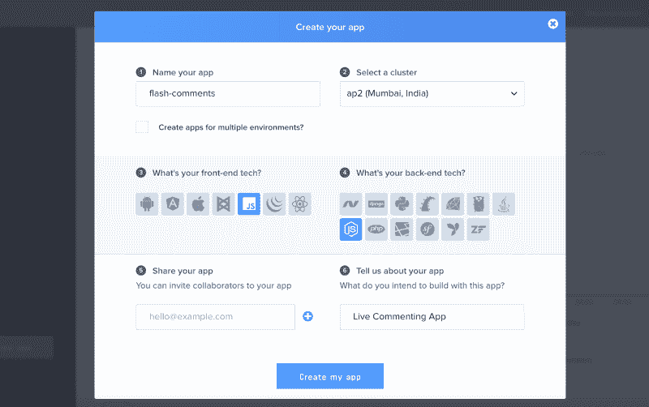
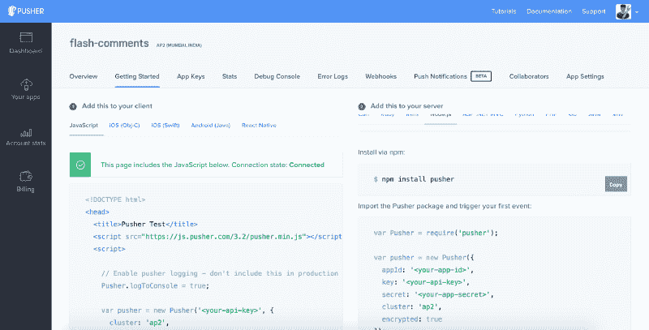
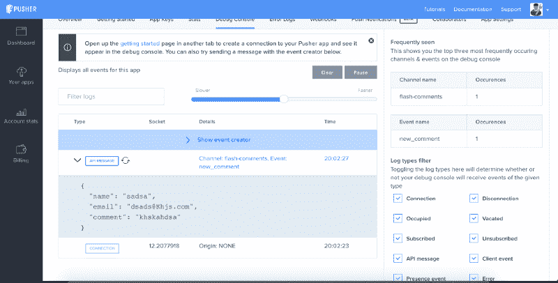
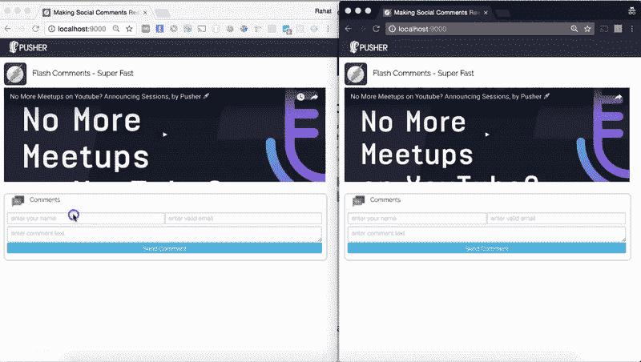

# 如何使用 JavaScript 和 Pusher 构建实时评论功能

> 原文：<https://www.freecodecamp.org/news/how-to-build-a-live-comment-feature-using-javascript-and-pusher-747d51e21430/>

作者拉哈特·卡纳

# **如何使用 JavaScript 和 Pusher 构建实时评论功能**

如今，“社交”已经成为一个时髦词，我们都希望我们的应用程序成为这些令人惊叹的社交对话的中心。对你的新应用的帖子、视频、更新或任何功能的评论是为你的应用增加乐趣和丰富社交对话的好方法。

如果这些对话可以是实时的，那就更好了。因此，在本文中，我们将讨论如何使用前端带有普通 JavaScript 的 [Pusher](https://pusher.com/) 和后端的 [Node.js](https://nodejs.org/en/) 为我们的 web 应用程序创建实时评论功能。

我们将这个实时评论系统称为 **Flash 评论**，它可以在你的应用程序中重复用于多个帖子/功能，并可以实时生成令人惊叹的对话。阅读这篇博文只需要基本的 HTML、CSS 和 JavaScript 知识。

我们的应用程序看起来会像这样:

### 部分

*   推杆简介
*   与 Pusher 签约
*   Node.js 和 Express App，用于公开评论创建 API 和触发 Pusher 事件
*   使用普通 JavaScript 订阅频道的前端

**如果您已经注册了 Pusher，请跳过前两个部分。

### 推杆简介

Pusher 是一个令人惊叹的平台，它抽象了我们自己使用 WebSockets 或长轮询实现实时系统的复杂性。我们可以使用 Pusher 立即将实时特性添加到我们现有的 web 应用程序中，因为它支持各种各样的软件开发工具包(SDK)。

集成工具包可用于各种前端库，如 Backbone、React、Angular 和 jQuery，也可用于后端平台/语言，如。NET，Java，Python，Ruby，PHP，还有 GO。

### 与 Pusher 签约

您可以在的[按钮中创建一个免费账户。注册并首次登录后，您将被要求创建一个新的应用程序，如下图所示。您必须填写一些关于您的项目的信息，以及您将用来构建应用程序的前端库或后端语言。您也可以根据用户的位置分布选择推送器集群，我选择了`ap2 (Mumbai, India)`，因为我可能要为印度地区创建一个应用程序。](http://pusher.com/signup)

对于这篇文章，我们将选择 JavaScript 作为前端，Node.js 作为后端，如上图所示。

这只会向您显示这些选择的一组入门示例代码，但是您可以在以后使用任何集成工具包来使用这个应用程序。

### Node.js 应用程序

您可以创建一个名为`**flash-comments**`的新文件夹，并在该文件夹的根目录下运行以下命令:

它会问你一些关于应用程序的信息，并在你的文件夹中创建一个新的`**package.json**`文件。

我们将在 Node.js 中使用相当简单和流行的 Express 框架。

安装完所有需要的`npm`模块后，现在我们将在根文件夹中为 Node.js 应用程序创建一个入口点文件，名为`server.js`。为使用端口`9000`运行的基本 HTTP 服务器添加以下基本代码。

Pusher 为我们将要使用的 Node.js 集成提供了一个开源的 NPM 模块。它提供了一套使用独特的`**appId**`、`**key**` 和`**secret**`与 Pusher APIs 集成的实用方法。我们将首先使用以下命令安装`pusher` `npm`模块:

现在，我们可以使用 require 来获取 Pusher 模块，并创建一个新的实例，传递一个带有重要键的 options 对象来初始化我们的集成。对于这篇文章，我已经把随机键。您必须从 Pusher 仪表板为您的应用程序获取它。

你必须用你自己的应用特有的值来替换`appId`、`key`和`secret`。在此之后，我们将为一个新的 API 编写代码，该 API 将用于创建一个新的注释。这个 API 将使用 HTTP `POST`方法公开路由`/comment`，并期望一个具有属性`name`、`email`和`comment`的注释对象。将以下代码添加到您的`server.js`文件中的`app.listen`部分之前。

在上面的代码中，我们将来自`req.body`的数据提取到一个`newComment`对象中，然后用它来调用`Pusher` 实例上的`trigger`方法。

### 重要的推动器概念

#### 频道

在 Pusher 中，我们有一个称为“通道”的概念分组，它提供了在 Pusher 中过滤数据的基本方法。在现实世界的应用程序中，一个通道可以代表许多实体。例如:在我们的评论应用程序中，一个频道可以是对特定文章、视频、博客帖子、照片或活动直播的评论。

我们将为这些实体中的每一个创建一个新的唯一通道 id，以唯一地标识或分组数据，如与这些实体中的任何一个相关联的评论。两个独特的直播视频流也应该有单独的通道，以便我们可以在各自的页面上显示各自的直播评论流。

因此，我们将为每个具有唯一 id 的实体创建一个新的唯一通道。例如，YouTube 视频评论频道可以命名为`comments-youtube-234`。

有三种类型的渠道

*   **公共频道** —任何知道频道名称的人都可以订阅。
*   **私人频道** —只有授权用户才能订阅的频道。如果频道名称有一个`private-`前缀，它将被视为私有频道。
*   **在线频道** —这是一种特殊的频道类型，类似于私有频道，因为只有授权用户才能订阅，订阅者列表也被维护并通知给其他用户。通道名应该有前缀`presence-`

我们将在我们的博客文章中使用一个公共频道，我们将其命名为 **flash-comments** ，但是您应该理想地使用一个私人频道来评论系统，为您想要启用评论功能的每个实体使用唯一的名称。

### 事件

现在，pusher 中的真实数据通过事件传输，这是封装消息的主要方式。对于任何特定的通道，在特殊情况下，事件可以由后端甚至客户端触发。需要一个渠道来确保您的消息到达预期的接收者。

我们给每个事件一个惟一的名称，这样我们就可以在订阅了任何频道的每个客户端设置处理程序来接收和处理这些事件消息。

### 推杆触发法

现在我们将理解我们的服务器端代码，该代码用于向推送通道`**flash-comments**`发送事件。

每当调用`POST` API 创建新注释时，我们都使用`.trigger(channel-name,event-name, payload)`从服务器发送一个事件。为了本文的简单，我们不使用任何数据库来保存和持久化注释，而是在生产系统中。您可能需要存储一个与唯一实体 id(如 YouTube 视频 ID 或博客文章 ID)相对应的评论。

现在，我们可以使用`node server`命令运行我们的服务器。我们的 web 服务可以通过 URL `http://localhost:9000/comment`访问。我们可以使用任何 chrome 扩展编写一个`POST`请求，比如 [Postman](https://www.getpostman.com/) 甚至 [**curl**](https://curl.haxx.se/) 来测试它是否返回`{ "created":"true" }`。

测试您的`POST` API 的 curl 命令如下:

### 使用普通 JavaScript 的前端

现在，我们将使用普通 JavaScript 编写最关键的部分，即前端代码。在前端代码中，我们将开发一个评论框部分，它将有以下两个功能:

*   **以流畅的动画显示**所有添加到频道的实时评论
*   **点击我们刚刚创建的`POST` API，向实时评论添加**新评论

### 步骤 1:创建一个名为 public 的文件夹，并创建一个 index.html 文件

我们已经在我们的`server.js`中编写了代码来提供来自`public`文件夹的静态内容，所以我们将在这个文件夹中编写我们所有的前端代码。

请创建一个新文件夹`public`并创建一个空的`index.html`文件。

### 步骤 2:向我们的 index.html 添加样板代码

我们将添加一些基本的样板代码来设置我们的 web 应用程序的基本结构，如`Header`和`Sections`，其中可以放置视频或博客帖子等内容，还有包含我们的`**Flash Comments**`框的部分。

### 步骤 3:创建 style.css 文件

现在我们还将创建一个`style.css`文件来包含重要的 CSS 代码，用于设计我们的 web 应用程序和`**flash comments**`组件。我们将添加基本样式来渲染我们的骨架。

### 步骤 4:添加 pusher.js 库并创建 app.js

现在，我们将添加其 CDN 上可用的 pusher.js 库，以使用普通 JavaScript 代码将其与 pusher 系统集成。请在正文末尾的结束标记之前添加以下脚本标记:

此外，创建一个新的`app.js`文件，我们将在其中编写我们所有的代码，并在脚本标签之后导入同样的内容到我们的`index.html`文件中，以导入`pusher.js` 文件。

现在，在我们的文件`app.js`中，我们将编写代码来初始化 Pusher 实例，使用我们从 Pusher 仪表板中获得的惟一的客户端 API 密钥。我们还将传递一个对象来指定集群并将标志 encrypted 设置为 true，这样所有的消息传递和通信都将被加密。我们还将使用`pusher.subscribe('channel-name')`来监听特定频道的所有事件。

我们将创建一个 JavaScript IIFE(立即调用函数)来创建一个私有作用域，这样我们就不会污染全局作用域。请将以下代码添加到`app.js`文件中:

### 步骤 5:创建添加新评论的表单

现在，我们将创建表单控件，让用户输入他们的姓名、电子邮件和评论文本，以便使用 Node.js API 和 Pusher 创建新的评论。我们将在现有的表单标记中添加以下 HTML 代码来创建表单:

在上面的表单代码中，我们使用了 HTML5 验证，如 r `equired`和`type=email`不允许用户将这些字段留空或提交无效的电子邮件。这些验证将在大多数支持 HTML5 表单验证的浏览器中自动工作。

此外，我们将添加以下 CSS 来设置表单的样式:

构建完可视表单后，现在我们需要为表单的`Submit`事件附加一个事件处理程序。我们将在`app.js`文件中使用下面的代码，可能在`var`声明之后的顶部:

现在，我们将使用以下代码编写实现处理程序`addNewComment`的代码:

我们使用本地 XHR 请求向节点 API 发出 AJAX 请求。您可以在应用程序中使用 jQuery AJAX 或任何特定于框架的`ajax`方法。现在，如果我们运行我们的应用程序，然后填写表单并提交它，我们将在浏览器开发人员工具控制台中看到一条`Success: { created: true }`消息。

此外，我们可以看到 Pusher 仪表板，以查看为任何通道发送的事件消息的统计信息。

### 步骤 6:显示该频道收到的评论列表

现在，我们将绑定到这个通道`flash-comments`上的`new_comment`事件，以便我们可以实时接收来自任何客户端的关于新评论创建的任何消息，并且我们可以显示所有这些评论。

我们将首先在带有`id="comments-list"`的 div 标签内的`index.html`文件中添加一个新注释的模板。

现在，我们将编写 JavaScript 代码来绑定到我们订阅的 pusher 通道实例上的 new_comment 事件。每当触发`new_comment`事件时，我们将获取模板 innerHTML 内容，用随事件传递的数据替换占位符`{{name}}, {{email}} & {{comment}}`，并将它们附加到`comments-list` div 元素。

使用上面的代码，将自动创建一个表示新注释的新 div 标签，并将其附加到`comments-list` 容器中。

我们现在将添加以下 CSS 来很好地显示评论列表，并在列表中出现新评论时显示动画:

现在，你可以在两个不同的浏览器中运行我们构建的应用程序，或者一个在普通浏览器中，另一个在匿名窗口中，并添加多个评论。我们可以看到，实时评论将被添加到一个平滑的动画。

本教程的完整代码可以在 GitHub 上找到。

### 结论

我们已经使用 Pusher、Node.js 和 Vanilla JavaScript 构建了一个很好的带有实时评论功能的 web 应用程序。我们可以在任何应用程序中使用该组件，并为各种社交实体(如视频、博客帖子、投票、文章和直播流)提供实时评论。

我们已经使用 Node.js 服务器创建了一个 REST API 来获取新的注释，然后在特定的通道上触发一个 Pusher 事件。对于任何真实的应用程序，我们可以为每个实体获取一个惟一的 id，并为任何实体使用一个惟一的通道名。在生产场景中，我们还可以将注释存储在持久存储中，然后在以后检索它们。

我们还创建了一个前端应用程序，它将使用 pusher.js 库连接到 Pusher API。我们已经创建了一个表单来点击触发`new_comment`事件的节点 API。使用 channel 实例上的 bind 方法，通过动画实时显示注释。

本文原载于 [Pusher 的博客](https://blog.pusher.com/build-live-comments-feature-using-javascript/)。