# Rosmaro 中基于可视自动机的编程介绍

> 原文：<https://www.freecodecamp.org/news/an-introduction-to-visual-automata-based-programming-in-rosmaro-100dae8eb969/>

作者:祖卡斯·马库奇

# Rosmaro 中基于可视自动机的编程介绍


The Rosmaro mascot

做基于自动机的编程就是用状态和变迁编程。状态对应不同的行为。转场以事件命名，描述这些行为如何变化。

思考这个问题最简单的方法是一个有向图。这是一个被诅咒的王子的例子:


A very simlpe, directed graph

可能是一只*王子*或者是一只*青蛙*。*王子*吃披萨是导致从*王子*状态到*青蛙*状态转变的事件。

我将向您展示如何在 Rosmaro 中进行基于(可视化)自动机的编程。

Rosmaro 是一个 JavaScript 库，它允许你构建有状态的对象。

当两个相同的方法调用可能产生不同的结果时，对象就是有状态的。

这里有一个例子:

```
> model.introduceYourself(); 'I am The Prince of Rosmaro!'
```

```
> model.eat({dish: 'yakisoba'}); undefined
```

```
> model.introduceYourself();'I am The Prince of Rosmaro!'
```

```
> model.eat({dish: 'pizza'});undefined
```

```
> model.introduceYourself();'Ribbit! Ribbit!'
```

有状态对象的另一个很好的例子是图形用户界面。想象一下自动取款机。你可以看两次它的屏幕，看到不同的信息和领域。你的眼睛是一样的。你看屏幕的方式没变。是自动取款机的状态变了。也许你通过点击按钮选择了某个选项，或者某个计时器启动了。某种东西导致了从一种状态到另一种状态的转变。

下面是几个使用基于可视化自动机的编程构建的前端应用程序的例子。


The codebase of [this To-Do application](https://github.com/lukaszmakuch/bool-less-todo) consists of no boolean values.

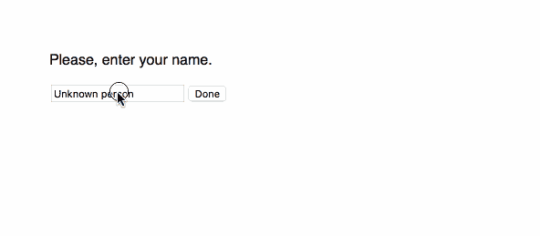

[This wizard](https://github.com/lukaszmakuch/Rosmaro-React-example-Bunny-App) has two paths. There’s no IF for that.

Rosmaro 构建有状态对象的方法是**将绘制的图形与一些编写的代码**结合起来。

该图显示了所有可能的行为以及导致它们发生变化的原因。它是使用可视化编辑器绘制的，这一事实使它成为一个可视化编程工具。

每个行为都被表达为一堆纯函数。一个函数可以返回一些结果以及一个跟随箭头的请求。

Rosmaro 将模型的整个状态存储在一个可插拔的存储机制中。它可以是任何东西，从普通的 JavaScript 对象到 NoSQL 数据库。它还使用悲观锁定来防止进入不一致的状态。

我想给你看的例子是关于一个王子，当他吃披萨的时候变成了一只青蛙。

首先打开 [Rosmaro 编辑器](https://rosmaro.js.org/editor/)。然后，点击*加载*按钮开始一个新的项目。


添加主图形。

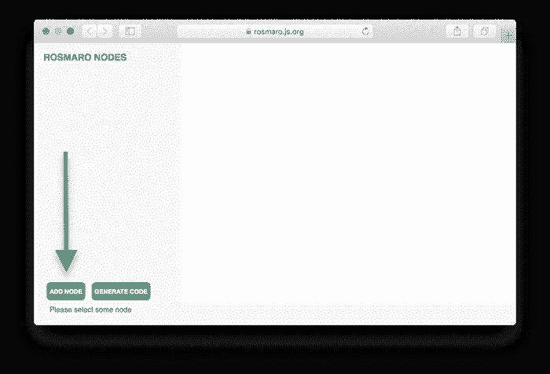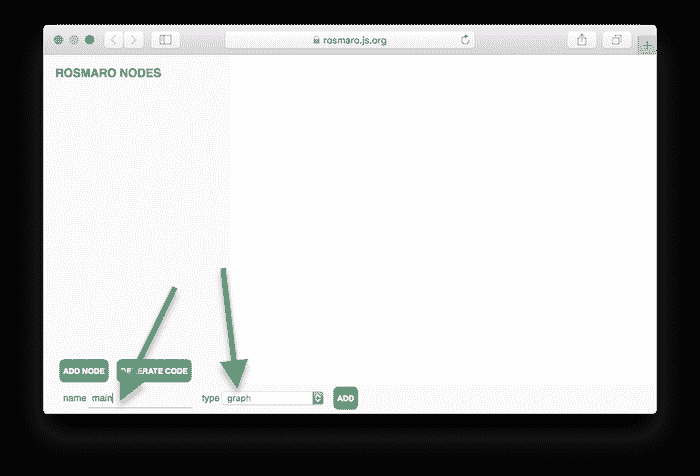

点击*新建节点*。

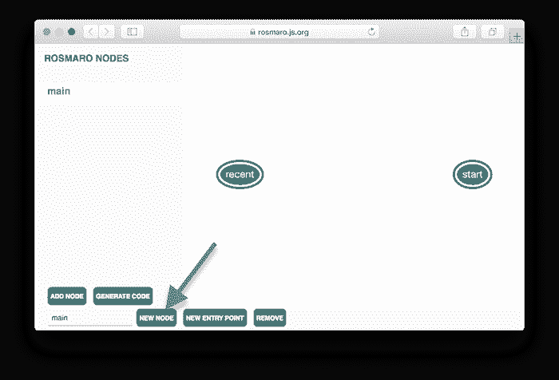

添加一个名为 *Prince* 的本地节点。

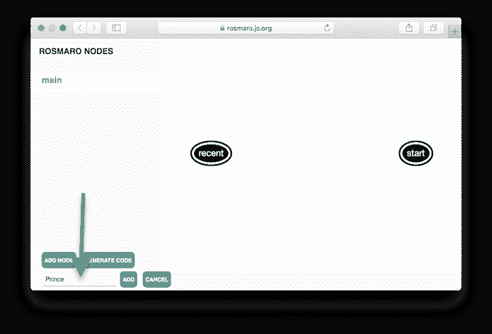

然后，添加一个名为 *Frog* 的本地节点。

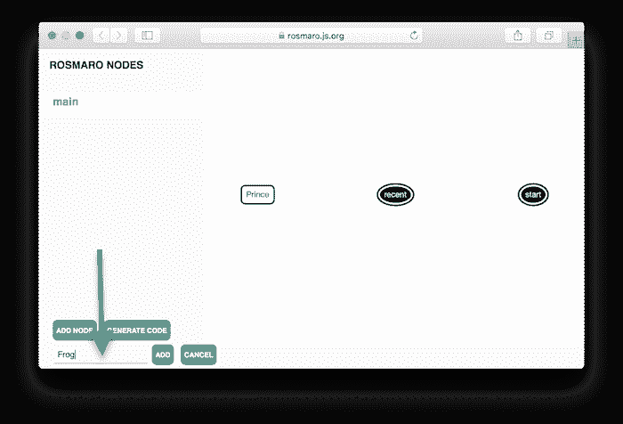

将鼠标光标放在*开始*入口点上，画一个箭头指向*王子*节点。然后，从*王子*到*青蛙*画一个箭头，称之为*吃了披萨*。最后，点击*添加节点*。

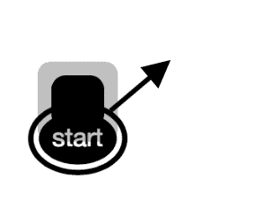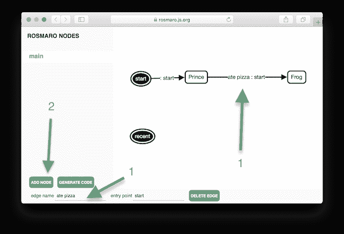

加一片叶子叫*王子*。

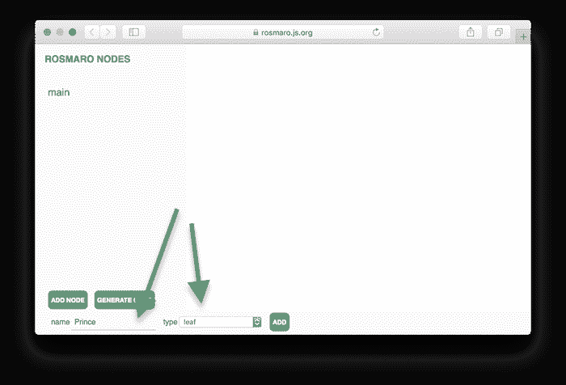

然后，加上一片叫*青蛙*的叶子。

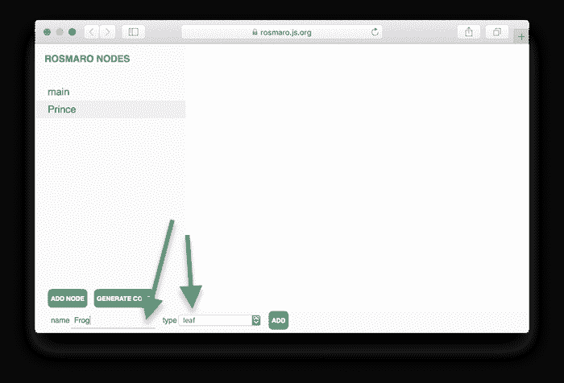

为了完成主图，将本地节点与最近添加的叶子相关联。

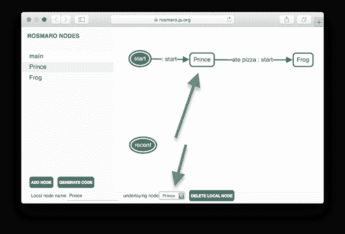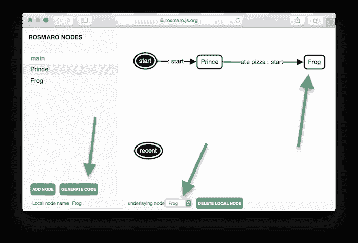

图表准备好了。点击按钮*生成代码*。

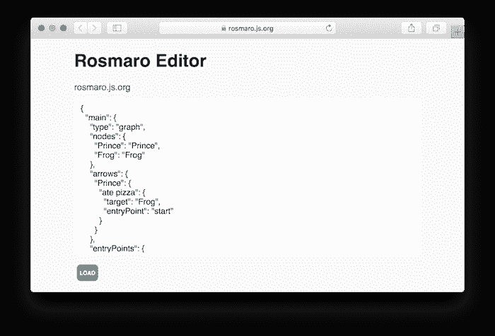

是时候写点 JavaScript 了。首先，您需要获得所有的依赖项。

```
npm i rosmaro rosmaro-in-memory-storage rosmaro-process-wide-lock --save
```

然后，您需要导入并调用它们。

生成的图形可以作为 JSON 文件导入，也可以直接粘贴到代码中。为了使这个例子尽可能简单，我建议将其粘贴到代码中。

青蛙当然是比王子简单的生物。实现它的行为很容易。每次我们让青蛙介绍自己，它都会说“兔子！Ribbit！”

王子不仅介绍自己，还注意他吃的东西。他可能会吃一个日式炒面，一切都很好。但是一旦他吃了一个比萨饼，他就会沿着箭头方向*吃比萨饼*。

是时候把所有的处理程序放在一起了。

模型准备好了。下面是完整的代码:

对*自我介绍*方法的相同调用返回不同的值。返回值取决于过去发生的事件。它证明了*模型*对象是有状态的。

被诅咒王子的代码在 GitHub 上。它只利用了基本的 Rosmaro 特性。在开发真正的应用程序时，你会想要使用更先进的技术。其中一些包括子图、动态正交区域和上下文对象。

你可以从 Rosmaro 的官方文档中了解更多关于 ROS maro 的信息。