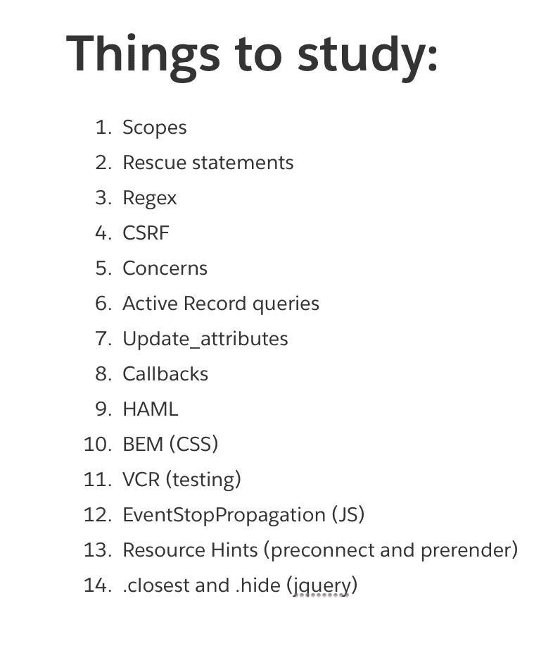
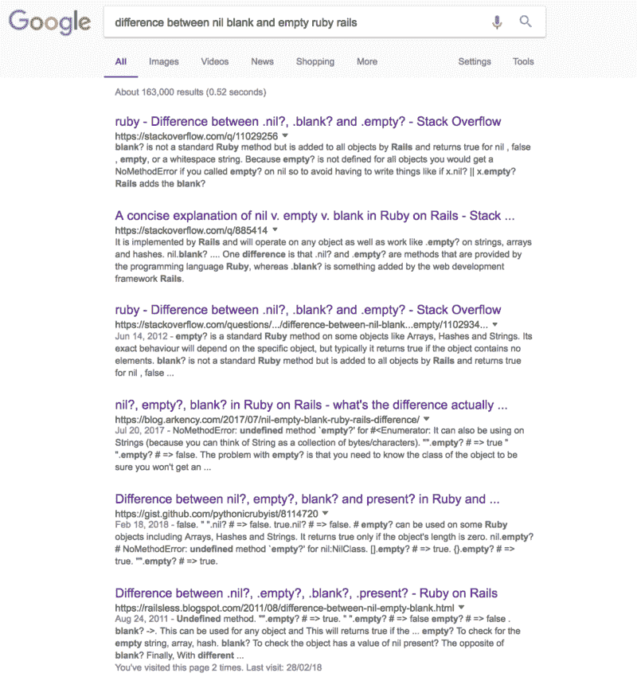
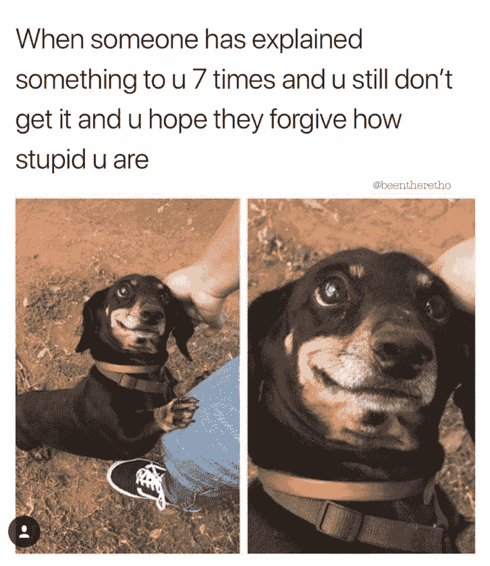
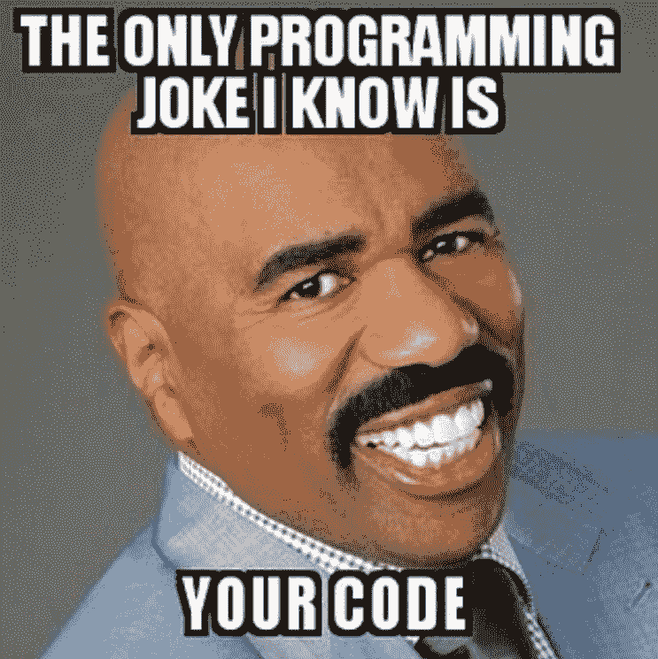
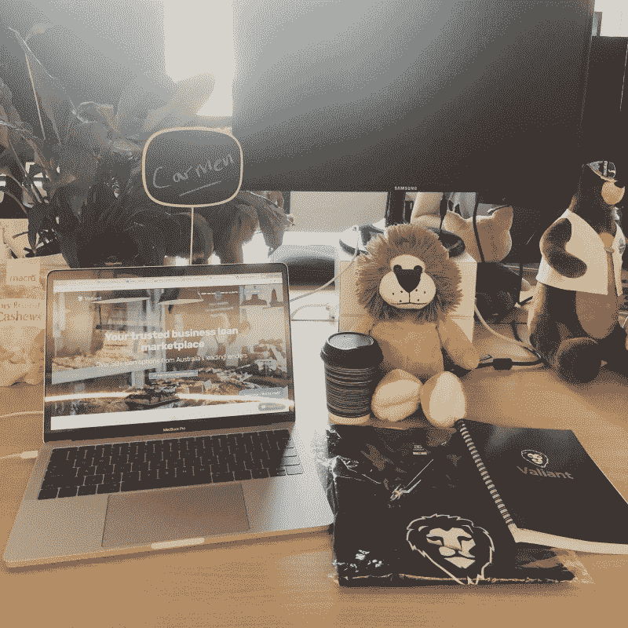

# 我在软件工程实习期间学到了什么

> 原文：<https://www.freecodecamp.org/news/10-things-i-learnt-during-my-software-engineering-internship-bb88369cb13c/>

卡门·钟

# 我在软件工程实习期间学到了什么


Photo by [J. Kelly Brito](https://unsplash.com/photos/PeUJyoylfe4?utm_source=unsplash&utm_medium=referral&utm_content=creditCopyText) on [Unsplash](https://unsplash.com/search/photos/learn?utm_source=unsplash&utm_medium=referral&utm_content=creditCopyText)

作为我在 [Coder Academy](https://coderacademy.edu.au/) 的编码训练营的一部分，我被安排在 [Valiant Finance](https://valiant.finance/) 做软件工程实习生，这是澳大利亚 [Fintech](http://fintechawards.net/) 年度创业奖(2017)的获得者。在我来到这里的四周里，我有了数不清的智力发现:这都要归功于与我一起工作的团队令人难以置信的指导和耐心。

以下是我在实习期间学到的前 10 件事，分为技术课和非技术课。

### 技术的

#### **一丝不苟**

做了七年的公司律师，我一直以关注细节为荣。但是错误确实会发生。

在我实习的第三周，我按 Ctrl + F 在我的文件中找到我正在搜索的一个词。那么我一定是不小心按了空格键，把这个词完全删除了。

令我感到屈辱的是，我没有注意到我做了这件事。它不会抛出明显的错误，否则我们的测试会发现它。相反，如果没有我们的联合创始人里奇敏锐的眼光，它可能会被忽视，并“无声无息地失败”。

为了避免犯我的错误，请查看 GitHub 桌面。它显示了您对文件所做的所有更改，并允许您在提交前最后一次逐行进行梳理。跳过这一部分很容易。但是在你提交/推送之前，花时间最后一次回顾你的改变可以让你在以后的阶段避免严重的心痛和尴尬。


Don’t be Velma!

我再怎么强调对细节的关注也不为过。在某些语言中，一个分号的缺失会让你的代码停滞不前。其他的事情没那么阴险，但还是很讨厌。

即使是简单的事情，比如检查你公司的 Git 提交，看看他们是如何写的——例如，我们使用指定的表情符号来表示提交的内容，大写提交中的第一个词，使用现在时态，不要在结尾添加标点符号——当你偏离一致性的道路时，也可以避免激怒你的同事。

#### **记笔记(并努力学习)**

忘记知识的源泉。

我在 Valiant Finance 的几乎每一天，都感觉自己在用消防水管喝水。从我们的工程主管([克里斯·霍弗](https://twitter.com/krishofer))和我们的联合创始人([里奇·科顿](https://twitter.com/ritchie__c))口中涌出的大量知识和智慧足以让任何人头晕目眩。令我欣慰的是，这两个家伙在教学方式上非常有条理和耐心，所以一切都井井有条。

不过，如果你记笔记，他们会点得更快。

我有一个有条理的笔记本，上面有标题和目录页，帮助我记录我所学的一切。我重复使用的代码被突出显示，我经常使用的部分有黄铜标签。


最重要的是，我有一个周计划器，在那里我记下了我们每天需要处理的所有任务，还有一个非线条笔记本，用于绘制流程图——用于更复杂的编程逻辑——和线框。

最重要的是，我列出了 Ritchie 和 Kris 提到的所有事情，我知道我需要用自己的时间做更多的研究。



#### **不要多此一举**

我发现的一件事是，Ritchie 建立了一个令人难以置信的 CSS 系统，有他自己完全定制的样式表(使用 [BEM 方法](http://getbem.com/introduction/))——和一个能让任何文档爱好者心动的风格指南。

在我熟悉这个系统之前，我想创建一些我认为容易访问和应用的 CSS 类。我开始意识到并尊重的是，我基本上没有必要这样做。几乎在每种情况下，都已经有了一套清晰灵活的风格，我可以随意切换——就像可互换的乐高积木——一切尽在我的指尖。通过创建不必要的样式类，我会弄乱一个结构化的干净的系统，使人们在以后的阶段更难导航。


If you have great Lego blocks, don’t remake them. Focus instead on making things with them.

#### **避免啰嗦**

Ruby on Rails 的一个关键原则是 DRY(不要重复自己)。这是初级 Rails 开发人员从第一天开始就被灌输的东西…但是，哦，斗争是多么真实啊。

我和我的实习生同事负责编写代码，计算用户向平台推荐的人数。每推荐三次，用户将获得 50 美元。逻辑是可管理的，但我们发现，在显示结果时，我们必须考虑一个**朋友**对**许多朋友** 。

我们的代码最初是这样产生的:

```
- if @invite_count == 1
 %p
 You have invited 1 friend to be part of Valiant Finance.
 — if @invite_count > 1
 %p
 You have invited
 %strong #{@invite_count} friends
 to be part of Valiant Finance!

- if (@invite_count % 3) == 0 || (@invite_count % 3) == 1
 %p
 Invite another
 %strong #{3 — (@invite_count % 3)} friends
 to receive $50!
 — if (@invite_count % 3) == 2
 %p
 Invite another
 %strong friend
 to receive $50!
```

当我给里奇看的时候，他告诉我们要研究一下[的复数形式](https://apidock.com/rails/ActionView/Helpers/TextHelper/pluralize)。

介意。
吹的。

这就是我们后来的代码:

```
%p You have invited #{@invite_count} #{“friend”.pluralize(@invite_count)} to be part of Valiant Finance.
 %p
 Invite another
 %strong #{3 — (@invite_count % 3)} #{“friend”.pluralize(3 — (@invite_count % 3))}
 to receive $50!
 %p
```

#### **注意你的编程语言的复杂性**

许多初级 web 开发人员互换使用某些术语，却没有意识到它们的存在——有时很微小，有时不那么微小！—它们之间的差异。我经常在谷歌上搜索`.present?`、`.exists?`和`.any?`之间的区别，这让我很内疚；而`.empty?`、`.nil?`和`.blank?.` 变得更加令人畏缩，因为`.exists?`实际上已经被[淘汰了](https://apidock.com/rails/ActiveRecord/Base/exists%3F/class)。哎呀。



Looks like I’m not the only one who forgets this.

有时候错综复杂的事情几乎不引人注意——在我实习的第一周，我正在输入`Product.all.map(&:name)`。但后来有人告诉我，我可以只使用`Product.pluck(:name).` There **is** 这是两者在效率上的区别——就我实际输入和搜索速度而言都是如此。更多信息，请看这篇文章。

尝试找出在你的编程语言中完成事情的各种方法——如果有多种方法，看看你是否能了解它们之间的区别。

**顶部提示**:询问某些函数/方法/查询之间的差异也是技术面试官最喜欢的打发时间的方式，所以好好学习吧。

### 非技术性的

#### **涉足公司**

听起来很简单，对吧？但是，当你忙于应付许多任务，试图让自己适应一家新公司时，很容易忘记对你周围的人来说很重要的小事。

在我们到公司的第一天，我和另一个实习生被鼓励注册 Twitter。第二天早上上班的火车上，我尽职尽责地建立了一个账户，跟着我们公司的账户，加上几个同事的账户。

鉴于我已经有多个社交媒体账户，我最初不愿意再添加一个。但事实证明这是非常有益的。

我能够及时了解公司的最新消息以及主要合作伙伴的消息，还能查看同事们有趣的推文。我一直在推特上发布关于公司活动和我们团队正在开发的新产品功能的帖子。这是一种参与的简单方式，并且表明你真的关心你工作的地方。


The Valiant Finance pride competing in our in-house Winter Olympics competition.

#### **提问——但更重要的是，倾听**

我们的工程主管克里斯非常友好地告诉我们，“没有愚蠢的问题”，我们被鼓励问任何想到的问题。

另一方面，我坚信有一个愚蠢的问题。通常这些发生在你没有注意的时候，或者当你懒得去思考别人说了什么的时候。提问是很重要的，尤其是当你真的不明白什么的时候。但是听回答更是如此。

花点时间听听别人在说什么，并思考一下。听到别人说的话，并在他们说话时开始在心理上准备回应，这是人的天性。不要这样做。注意别人告诉你的事情。



Don’t be this little guy (unless you’re really, really cute)

#### **知道与谁交谈**

这次实习的一大好处是，我们被鼓励去接触其他团队的成员，讨论他们想要什么样的产品特性，以及我们如何实现它们。我们学会了在某些方面尊重他们的专业知识，在其他方面尊重我们产品团队的判断。

例如，我们的任务是在代理仪表板上构建选项卡，以便将代理提交的线索整齐地分为活动、非活动和已解决。此外，如前所述，我们创建了推荐链接卡。

这两项任务都需要与第三方合作伙伴的负责人联系，以便功能和语言适合经纪人受众。


We worked with the Head of Third Party Partnerships to produce the responsive dashboard tabs, and Refer a Broker feature

话虽如此，有时我们试图构建的东西吸引了公司许多人的极大兴趣，导致了(有时是相互冲突的)输入。在这种时候，我们会听从我们的产品团队领导，他们会给我们指导，同样重要的是，如果其他团队的噪音太大，他们会作为缓冲。

在这些情况下，不要害怕向您的主管寻求帮助——他们通常有更好的装备和更丰富的经验来告诉其他团队，他们要求的是 u̶t̶t̶e̶r̶l̶y̶̶r̶i̶d̶i̶c̶u̶l̶o̶u̶s̶将比预期需要更长的时间来实施，并且因为它是 u̶t̶t̶e̶r̶l̶y̶̶r̶i̶d̶i̶c̶u̶l̶o̶u̶s̶而不是业务关键型的，所以它将被添加到 u̶t̶t̶e̶r̶l̶y̶̶r̶i̶d̶i̶c̶u̶l̶o̶u̶s̶̶l̶i̶s̶t̶开发人员日志的待办事项列表中。

#### **保持谦逊**

因为在 dev 世界中，有太多的方法来剥一只猫的皮，所以很容易陷入一种特定的做事方法，并假设您的方法比其他人的方法都好。

不要误解我的意思——有最佳实践，毫无疑问，每个公司都有好的规则来确保代码的一致性。但是不要因为别人做的事情不符合你习惯的就不去理会。它可能(也可能不会)比你的代码更好。



Don’t be this guy either (unless you’re joking around)

关于这一点:当你搞砸了，知道是时候吃点谦卑的馅饼了。

承认错误，道歉，从错误中吸取教训，不要让它影响你。最后一部分对我来说是最难的。在开头提到的删除错误后，我做了一个星期的噩梦。

#### **玩得开心**

在 Valiant Finance，我们庆祝胜利。我们有一个完整的 Slack 频道，致力于在我们的职业和个人努力中相互鼓励。

我们开展团队建设活动，办公室里有毛绒玩具和狗，周五晚上还会喝点休闲饮料。



The welcome care package we were given on our first day of the internship

这似乎是显而易见的，但人们希望在快乐的人身边工作。当你不在实习公司里结交酒友的时候(如果你在的话，还能加分！)，你想享受在那里的时光——公司也应该希望你这样。实习的全部目的是尝试看看你是否适合这家公司，反之亦然。

试着在实习期间享受生活——但是如果你的工作单调乏味，试着把它变成一个游戏。我是一个经验丰富的鉴赏家，能够让枯燥的工作变得有趣——也许我会在另一篇文章中深入探讨。

如果你作为实习生不开心，那么很有可能，作为全职员工你也会不开心。

没有人希望这样。

非常感谢联合创始人 Ritchie Cotton 和工程主管 Kris Hofer，感谢他们在我在 Valiant Finance 实习期间给予我难以置信的耐心、指导和知识。我从来没有想象过在这么短的时间内学到这么多东西，或者从中获得这么多乐趣。谢谢你们。

在 [Twitter](https://twitter.com/carmenhchung) 上关注我。