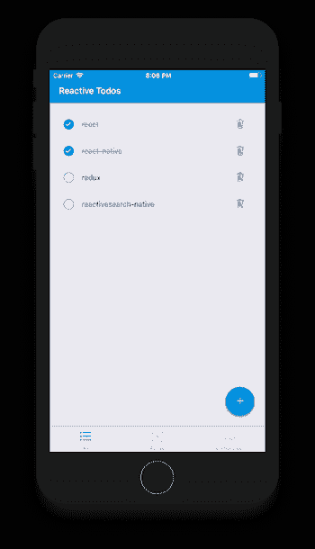
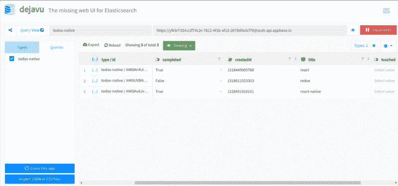
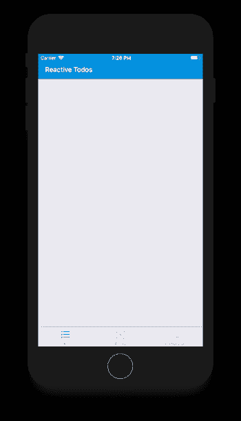
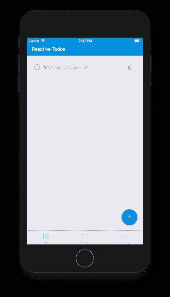
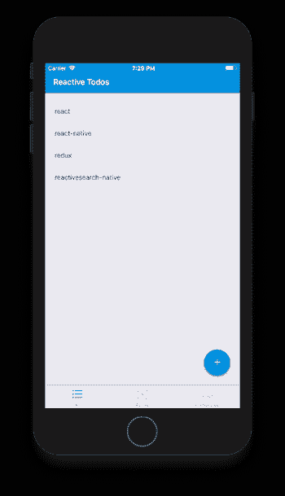
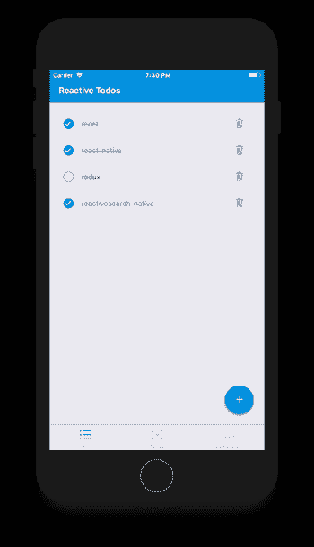

# 如何使用 React Native 构建实时待办事项应用

> 原文：<https://www.freecodecamp.org/news/how-to-build-a-real-time-todo-app-with-react-native-19a1ce15b0b3/>

一个 todo 应用涉及到构建任何数据驱动应用的所有重要部分，包括**C**create、 **R** ead、 **U** pdate 和 **D** elete (CRUD)操作。在这个故事中，我将使用最流行的移动框架之一， **React Native** 构建一个 todo 应用程序。

我将使用[**React search Native**](https://github.com/appbaseio/reactivesearch/tree/dev/packages/native)，这是一个开源库，它提供 React 原生 UI 组件并简化构建数据驱动的应用程序。

以下是我将在这个故事中构建的内容:



Todo App

查看[小吃](https://snack.expo.io/@dhruvdutt/todo)或[博览会](https://expo.io/@dhruvdutt/todos)上的应用程序。

### 什么是 React Native？

以下是医生们所说的:

> React Native 允许您仅使用 JavaScript 构建移动应用程序。它使用与 React 相同的设计，允许您从声明性组件构建丰富的移动 UI。

即使你刚刚开始使用 React 或 React Native，你也应该能够理解这个故事，并构建自己的实时 todo 应用程序。

### 为什么使用 ReactiveSearch？⚛

[React search](https://github.com/appbaseio/reactivesearch)是一个开源的 React 和 React 原生 UI 组件库，是我和[一些了不起的人](https://github.com/appbaseio/reactivesearch/graphs/contributors)共同创作的。它提供了各种 React 本地组件，可以[连接到任何 Elasticsearch](https://opensource.appbase.io/reactive-manual/native/getting-started/reactivebase.html#connect-to-elasticsearch) 集群。

我已经写了另一个关于用 React 和 Elasticsearch 构建 GitHub Repo Explorer 的故事，你可以查看一下 Elasticsearch 的简要概述。即使你没有使用 Elasticsearch 的经验，你也应该能够很好地理解这个故事。

### 设置⚒的事情

我们将在这里使用库的本地版本。

在我们开始构建 UI 之前，我们需要在 Elasticsearch 中创建一个数据存储。ReactiveSearch 适用于任何弹性搜索索引，您可以轻松地[将它用于您自己的数据集](https://opensource.appbase.io/reactive-manual/getting-started/reactivebase.html)。



View my app dataset [here](https://opensource.appbase.io/dejavu/live/#?input_state=XQAAAALwAAAAAAAAAAA9iIqnY-B2BnTZGEQz6wkFs4RH-_LaQFp2SlHxdkdiaJMgDx8HsBmHrHmxFLRm7V1uYmmy_j7CIuOAUjTBNw0KgomWuYOXFddgJRsGIU7fsxTMJHKDeitU2LeOk2yVyC7H5mdOvPQ84QV-WGxMqxGGV7LjU-urZhg0CpMqTT3OZQPUib0tK7qbmGxGDnUaoY_1q4GKLDtvfIuD4EF0ZJHcCe_vWVP-1QtnZklZNaGFkoid1LOlZWFaH_-wziAA&editable=false). You can also clone this to your own app

简而言之，你可以直接使用[我的数据集](https://opensource.appbase.io/dejavu/live/#?input_state=XQAAAAJuAAAAAAAAAAA9iIqnY-B2BnTZGEQz6wkFs4RH-_LaQFp2SlHxdkdiaJMgDx8HsBmHrHmxFLRm7V1uYmmy_j7CIuOAUjTBNw0KgomWuYOXFddgJRsGIU7fsxTMJHKDeitU2LeOk2yVyC7H5mdPqXB8pzL_9FBmAA)或者使用 [appbase.io](https://appbase.io/) 为自己创建一个数据集，这样你就可以创建一个托管的弹性搜索指数(又名 app)。

所有 todos 的结构如下:

```
{
  "title": "react-native",
  "completed": true,
  "createdAt": 1518449005768
}
```

### 启动项目

在我们开始之前，我会推荐安装[纱](https://yarnpkg.com/lang/en/docs/install/)。在 Linux 上，只需添加 yarn 库并通过包管理器运行 install 命令就可以完成。在 Mac 上，你应该先安装[家酿](https://brew.sh/)让事情变得更简单。[这里](https://yarnpkg.com/lang/en/docs/install/)是更详细的纱线安装文件。接下来你可以安装的是[守望者](https://facebook.github.io/watchman/docs/install.html)。这是一个文件监视服务，它将帮助 react-native packager 顺利运行。

我已经用 GitHub 分支[中的](https://github.com/appbaseio-apps/todos-native/tree/base) [create-react-native-app](https://github.com/react-community/create-react-native-app) 设置了 starter 项目。您可以[下载一个 zip 文件](https://github.com/appbaseio-apps/todos-native/archive/base.zip)或者通过运行下面的命令克隆基本分支:？

```
git clone -b base https://github.com/appbaseio-apps/todos-native
```

*   接下来安装依赖项并启动打包程序:

```
cd todos-native && yarn && yarn start
```

*   打包程序启动后，您可以使用 [Expo](https://expo.io/) 应用程序或使用 Android 或 IOS 模拟器在手机上运行该应用程序:



Base setup with all tabs. Clone from [here](https://github.com/appbaseio-apps/todos-native/tree/base).

### 钻研代码？

一旦您从[基础分支](https://github.com/appbaseio-apps/todos-native/tree/base)克隆了代码，您应该会看到如下所示的目录结构:

```
navigation
├── RootComponent.js         // Root component for our app
├── MainTabNavigator.js      // Tab navigation component
screens
├── TodosScreen.js           // Renders the TodosContainer
components        
├── Header.js                // Header component         
├── AddTodo.js               // Add todo input        
├── AddTodoButton.js         // Add todo floating button
├── TodoItem.js              // The todo item         
├── TodosContainer.js        // Todos main container api
├── todos.js                 // APIs for performing writes
constants                    // All types of constants used in app
types                        // Todo type to be used with prop-types
utils                        // Streaming logic goes here
```

让我们来分析一下基本设置:

#### 1.航行

*   连接到 Elasticsearch 的所有必要配置都在`constants/Config.js`中。
*   我们使用[反应-导航](https://reactnavigation.org/)中的[选项卡导航](https://reactnavigation.org/docs/tab-navigator.html)来显示**所有**、**活动**和**已完成**待办事项屏幕。这是由`navigation/RootComponent.js`渲染的。您会注意到,`RootComponent`将所有东西都包装在 ReactiveSearch 的`[ReactiveBase](https://opensource.appbase.io/reactive-manual/getting-started/reactivebase.html)`组件中。该组件为 ReactiveSearch 子组件提供所有必要的数据。您可以在这里连接您自己的 Elasticsearch 索引，只需更新`constants/Config.js`中的配置即可。

导航逻辑出现在`navigation/MainNavigator.js`中。让我们来看看它是如何工作的。[这里的](https://reactnavigation.org/docs/tab-based-navigation.html)是选项卡导航的文档，如果你想参考任何东西。

```
import React from 'react';
import { MaterialIcons } from '@expo/vector-icons';
import { TabNavigator, TabBarBottom } from 'react-navigation';

import Colors from '../constants/Colors';
import CONSTANTS from '../constants';
import TodosScreen from '../screens/TodosScreen';

const commonNavigationOptions = ({ navigation }) => ({
    header: null,
    title: navigation.state.routeName,
});

// we just pass these to render different routes
const routeOptions = {
    screen: TodosScreen,
    navigationOptions: commonNavigationOptions,
};

// different routes for all, active and completed todos
const TabNav = TabNavigator(
    {
        [CONSTANTS.ALL]: routeOptions,
        [CONSTANTS.ACTIVE]: routeOptions,
        [CONSTANTS.COMPLETED]: routeOptions,
    },
    {
        navigationOptions: ({ navigation }) => ({
            // this tells us which icon to render on the tabs
            tabBarIcon: ({ focused }) => {
                const { routeName } = navigation.state;
                let iconName;
                switch (routeName) {
                    case CONSTANTS.ALL:
                        iconName = 'format-list-bulleted';
                        break;
                    case CONSTANTS.ACTIVE:
                        iconName = 'filter-center-focus';
                        break;
                    case CONSTANTS.COMPLETED:
                        iconName = 'playlist-add-check';
                }
                return (
                    <MaterialIcons
                        name={iconName}
                        size={28}
                        style={{ marginBottom: -3 }}
                        color={focused ? Colors.tabIconSelected : Colors.tabIconDefault}
                    />
                );
            },
        }),
        // for rendering the tabs at bottom
        tabBarComponent: TabBarBottom,
        tabBarPosition: 'bottom',
        animationEnabled: true,
        swipeEnabled: true,
    },
);

export default TabNav;
```

*   `TabNavigator`函数接受两个参数，第一个是路由配置，第二个是`TabNavigator`配置。在上面的代码片段中，我们传递了在底部显示选项卡导航栏的配置，并为每个选项卡设置了不同的图标。

#### 2.TodosScreen 和 TodosContainer

`screens/TodosScreen.js`中的`TodosScreen`组件包装了`components/TodosContainer.js`中的主`TodosContainer`组件，我们将在那里为应用添加各种组件。根据我们是否在**所有**、**活动、**或**已完成**选项卡上，`TodosContainer`将显示过滤后的数据。

#### 3.用于创建、更新和删除待办事项的 API

用于 Elasticsearch 上 CUD 操作的 API 见`api/todos.js`。它包含三个简单的方法`add`、`update`和`destroy`，这些方法适用于`constants/Config.js`中指定的任何弹性搜索指数。需要记住的重要一点是，我们创建的每个 todo 项都有一个唯一的`_id`字段。我们可以使用这个`_id`字段来更新或删除现有的待办事项。

对于我们的应用程序，我们只需要三种方法来添加、创建或删除待办事项。但是，您可以在[文档](http://docs.appbase.io/javascript/api-reference.html)中找到关于 API 方法的详细解释。

### 构建组件和用户界面？

让我们开始添加一些组件来完成应用程序的功能。

#### 1.添加待办事项

我们将使用来自`[native-base](http://docs.nativebase.io/)`的`[Fab](https://docs.nativebase.io/Components.html#fabs-def-headref)`来呈现一个用于添加待办事项的浮动按钮。


```
const AddTodoButton = ({ onPress }) => (
  <Fab
      direction="up"
      containerStyle={{}}
      style={{ backgroundColor: COLORS.primary }}
      position="bottomRight"
      onPress={onPress}
  >
      <Icon name="add" />
  </Fab>
);
```

现在你可以在`components/TodosContainer.js`中使用这个组件了。

```
import AddTodoButton from './AddTodoButton';
...
export default class TodosContainer extends React.Component {
  render() {
    return (
      <View style={styles.container}>
        ...
        <AddTodoButton />
      </View>
    );
  }
}
```

一旦我们添加了按钮，我们将会看到类似这样的内容:


After adding the AddTodoButton

现在，当有人点击这个按钮时，我们需要显示添加 todo 的输入。让我们在`components/AddTodo.js`中添加代码。

```
class AddTodo extends Component {
  constructor(props) {
    super(props);
    const { title, completed, createdAt } = this.props.todo;
    this.state = {
      title,
      completed,
      createdAt,
    };
  }

  onSubmit = () => {
    if (this.state.title.length > 0) this.props.onAdd(this.state);
    return null;
  };

  setStateUtil = (property, value = undefined) => {
    this.setState({
      [property]: value,
    });
  };

  render() {
    const { title, completed } = this.state;
    const { onBlur } = this.props;
    return (
      <View
        style={{
          flex: 1,
          width: '100%',
          flexDirection: 'row',
          alignItems: 'center',
          paddingRight: 10,
          paddingBottom: 5,
          paddingTop: 5,
        }}
      >
        <CheckBox checked={completed} onPress={() => this.setStateUtil('completed', !completed)} />
        <Body
          style={{
            flex: 1,
            justifyContent: 'flex-start',
            alignItems: 'flex-start',
            paddingLeft: 25,
          }}
        >
          <TextInput
            style={{ width: '90%' }}
            placeholder="What needs to be done?"
            autoFocus
            underLineColorAndroid="transparent"
            underlineColor="transparent"
            blurOnSubmit
            onSubmitEditing={this.onSubmit}
            onChangeText={changedTitle => this.setStateUtil('title', changedTitle)}
            value={title}
            autoCorrect={false}
            autoCapitalize="none"
            onBlur={onBlur}
          />
        </Body>
        <TouchableOpacity
          onPress={() => this.props.onCancelDelete}
          style={{ paddingLeft: 25, paddingRight: 15 }}
        >
          <Ionicons
            name="ios-trash-outline"
            color={`${title.length > 0 ? 'black' : 'grey'}`}
            size={23}
          />
        </TouchableOpacity>
      </View>
    );
  }
}
```

这里用的主要组件是`[TextInput](https://facebook.github.io/react-native/docs/textinput.html)`、`[Checkbox](http://docs.nativebase.io/Components.html#checkbox-headref)`和`[Ionicons](https://expo.github.io/vector-icons/)`，道具直截了当。我们用的是`state`中的`title`和`completed`。我们将从`components/TodosContainer.js`中传递道具`todo`、`onAdd`、`onCancelDelete`和`onBlur`。如果您希望取消添加待办事项，这些将帮助我们添加新的待办事项或重置视图。

现在我们可以用渲染`AddTodo`组件所需的更改来更新`components/TodosContainer.js`:

```
...
import AddTodoButton from './AddTodoButton';
import AddTodo from './AddTodo';
import TodoModel from '../api/todos';
...

// will render todos based on the active screen: all, active or completed
export default class TodosContainer extends React.Component {
  state = {
    addingTodo: false,
  };

  componentDidMount() {
    // includes the methods for creation, updation and deletion
    this.api = new TodoModel('react-todos');
  }

  render() {
    return (
      <View style={styles.container}>
        <Header />
        <StatusBar backgroundColor={COLORS.primary} barStyle="light-content" />
        <ScrollView>
          {this.state.addingTodo ? (
            <View style={styles.row}>
              <AddTodo
                onAdd={(todo) => {
                  this.setState({ addingTodo: false });
                  this.api.add(todo);
                }}
                onCancelDelete={() => this.setState({ addingTodo: false })}
                onBlur={() => this.setState({ addingTodo: false })}
              />
            </View>
          ) : null}
        </ScrollView>
        <AddTodoButton onPress={() => this.setState({ addingTodo: true })} />
      </View>
    );
  }
}
```

`AddTodo`组件呈现在`[ScrollView](https://facebook.github.io/react-native/docs/scrollview.html)`组件内。我们还将一个`onPress`道具传递给`AddTodoButton`来切换状态，并基于`this.state.addingTodo`有条件地显示`AddTodo`组件。传递给`AddTodo`的`onAdd`属性也在`api/todos.js`使用`add` API 创建了一个新的 todo。

单击 add 按钮后，我们将看到如下添加 todo 的输入:



Adding a todo

#### 2.显示待办事项

添加完 todo 后，它会被添加到 Elasticsearch(我们在`constants/Config.js`中配置的)。所有这些数据都可以通过使用 [ReactiveSearch 本地](https://github.com/appbaseio/reactivesearch/tree/dev/packages/native)组件实时查看。

该库提供了超过 10 个原生的 UI 组件。对于我们的 todo 应用程序，我们将主要利用 [ReactiveList](https://opensource.appbase.io/reactive-manual/native/components/reactivelist.html) 组件来显示 todos 的状态。

让我们添加`ReactiveList`组件并显示我们的 todos。我们将在`components/TodosContainer.js`中添加这个组件以及使其工作的必要方法。下面是`ReactiveList`的使用方法:

```
 ...
import { ReactiveList } from '@appbaseio/reactivesearch-native';
...

export default class TodosContainer extends React.Component {
  render() {
    return (
      <View style={styles.container}>
        <Header />
        <StatusBar backgroundColor={COLORS.primary} barStyle="light-content" />
        <ScrollView>
          <ReactiveList
            componentId="ReactiveList"
            defaultQuery={() => ({
              query: {
                match_all: {},
              },
            })}
            stream
            onAllData={this.onAllData}
            dataField="title"
            showResultStats={false}
            pagination={false}
          />
          ...
        </ScrollView>
        <AddTodoButton onPress={() => this.setState({ addingTodo: true })} />
      </View>
    );
  }
}
```

我们还没有添加`onAllData`方法，但是让我们了解一下我们在这里使用的道具:

*   `componentId` —组件的唯一标识符。
*   `defaultQuery`:列表初始应用的查询。我们将使用`match_all`来显示默认情况下的所有待办事项。
*   `stream`:是流式传输新的结果更新还是仅显示历史结果。通过将此设置为`true`，我们现在还可以监听实时的 Todo 更新。我们稍后将添加与流相关的逻辑。
*   `onAllData` —回调函数，接收当前待办事项列表和流(新待办事项和任何更新)，并返回 React 组件或 JSX 进行渲染。下面是语法的样子:

```
<ReactiveList
  onAllData(todos, streamData) {
    // return the list to render
  }
  ...
/>
```

你可以在 ReactiveList 的[文档页面](https://opensource.appbase.io/reactive-manual/result-components/reactivelist.html)上阅读更多关于所有这些道具的详细信息。

为了看到一些东西，我们需要从`onAllData`回调中返回一个 JSX 或 React 组件。为此，我们将使用 React Native 的 [FlatList](https://facebook.github.io/react-native/docs/flatlist.html) ，它由[文本](https://facebook.github.io/react-native/docs/text.html)组件组成。在下一步中，我们将添加自定义的`TodoItem`组件。

```
...
import { ScrollView, StyleSheet, StatusBar, FlatList, Text } from 'react-native';
import CONSTANTS from '../constants';
...

export default class TodosContainer extends React.Component {
  ...
  onAllData = (todos, streamData) => {
    // filter data based on "screen": [All | Active | Completed]
    const filteredData = this.filterTodosData(todos);

    return (
      <FlatList
        style={{ width: '100%', top: 15 }}
        data={filteredData}
        keyExtractor={item => item._id}
        renderItem={({ item: todo }) => (
            <Text>{todo.title}</Text>
        )}
      />
    );
  };

  filterTodosData = (todosData) => {
    const { screen } = this.props;

    switch (screen) {
      case CONSTANTS.ALL:
        return todosData;
      case CONSTANTS.ACTIVE:
        return todosData.filter(todo => !todo.completed);
      case CONSTANTS.COMPLETED:
        return todosData.filter(todo => todo.completed);
    }

    return todosData;
  };

  render() {
    ...
  }
}
```



Integrating ReactiveList with onAllData

#### 3.将添加到项目

接下来，我们将创建一个单独的组件 **TodoItem** ，用于显示每个待办事项，其中将包含待办事项的所有必要标记，如[复选框](https://docs.nativebase.io/Components.html#checkbox-headref)、[文本](https://facebook.github.io/react-native/docs/text.html)和删除[图标](https://docs.nativebase.io/Components.html#icon-def-headref)。这是在`components/TodoItem.js`中:

```
class TodoItem extends Component {
  onTodoItemToggle = (todo, propAction) => {
    propAction({
      ...todo,
      completed: !todo.completed,
    });
  };

  render() {
    const { todo, onUpdate, onDelete } = this.props;

    return (
      <View style={styles.row}>
        <View
          style={{
            flex: 1,
            width: '100%',
            flexDirection: 'row',
            alignItems: 'center',
            paddingRight: 10,
            paddingVertical: 5,
          }}
        >
          <TouchableOpacity
            onPress={() => this.onTodoItemToggle(todo, onUpdate)}
            style={{
              flex: 1,
              width: '100%',
              flexDirection: 'row',
            }}
          >
            <CheckBox
              checked={todo.completed}
              onPress={() => this.onTodoItemToggle(todo, onUpdate)}
            />
            <Body
              style={{
                flex: 1,
                justifyContent: 'flex-start',
                alignItems: 'flex-start',
                paddingLeft: 25,
              }}
            >
              <Text
                style={{
                  color: todo.completed ? 'grey' : 'black',
                  textDecorationLine: todo.completed ? 'line-through' : 'none',
                }}
              >
                {todo.title}
              </Text>
            </Body>
          </TouchableOpacity>
          <TouchableOpacity
            onPress={() => onDelete(todo)}
            style={{ paddingLeft: 25, paddingRight: 15 }}
          >
            <Ionicons
              name="ios-trash-outline"
              color={`${todo.title.length > 0 ? 'black' : 'grey'}`}
              size={23}
            />
          </TouchableOpacity>
        </View>
      </View>
    );
  }
}
```

这个组件从它的 props 中获取`todo`以及`onDelete`和`onUpdate`，它们分别用于更新和删除 todo 项。我们使用我们正在使用的组件的`onPress`道具在必要的地方使用这些。

接下来，我们可以`import`并在`components/TodosContainer.js`中的`onAllData`中使用`TodoItem`组件。我们将把`todo`作为道具传递给`update`和`destroy`的 API 方法，它们将被`TodoItem`组件使用。

```
class TodosContainer extends Component {
  ...
  onAllData = (todos, streamData) => {
    ...
    return (
      <FlatList
        ...
        renderItem={({ item: todo }) => (
          <TodoItem 
            todo={todo}
            onUpdate={this.api.update} 
            onDelete={this.api.destroy}
          />
        )}
      />
    );
  }
}
```



After adding TodoItem in TodosContainer

#### 4.流式数据更新

你可能已经注意到，待办事项显示得很好，只是如果不刷新应用程序，你就无法查看更新的待办事项。在这最后一步，我们将把拼图中缺失的部分拼起来。

在上一节中，我们为`ReactiveList`组件添加了一个`onAllData`方法。`onAllData`的第二个参数接收流更新，我们将利用它来始终保持 todos 更新。下面是更新后的`onAllData`方法在`components/TodosContainer.js`中的样子。

```
import Utils from '../utils';
...

export default class TodosContainer extends React.Component {
  ...
  onAllData = (todos, streamData) => {
    // merge streaming todos data along with current todos
    const todosData = Utils.mergeTodos(todos, streamData);

    // filter data based on "screen": [All | Active | Completed]
    const filteredData = this.filterTodosData(todosData);

    return (
      <FlatList
        style={{ width: '100%', top: 15 }}
        data={filteredData}
        keyExtractor={item => item._id}
        renderItem={({ item: todo }) => (
            <TodoItem todo={todo} onUpdate={this.api.update} onDelete={this.api.destroy} />
        )}
      />
    );
  };
  ...
}
```

`mergeTodos`方法出现在`utils/index.js`中。它是这样工作的:

```
class Utils {
  static mergeTodos(todos, streamData) {
    // generate an array of ids of streamData
    const streamDataIds = streamData.map(todo => todo._id);

    return (
      todos
        // consider streamData as the source of truth
        // first take existing todos which are not present in stream data
        .filter(({ _id }) => !streamDataIds.includes(_id))
        // then add todos from stream data
        .concat(streamData)
        // remove todos which are deleted in stream data
        .filter(todo => !todo._deleted)
        // finally sort on the basis of creation timestamp
        .sort((a, b) => a.createdAt - b.createdAt)
    );
  }
}

export default Utils;
```

当创建、删除或更新 todo 对象时，`streamData`接收它们的数组。如果一个对象被更新，它包含一个设置为`true`的`_updated`键。类似地，如果一个对象被删除，它包含一个设置为`true`的`_deleted`键。如果创建了一个对象，它不包含这两者。利用这些点，我们添加了`mergeTodos`功能。

有了这个，你应该能够实时看到待办事项的变化！如果你有一个额外的设备/模拟器运行相同的应用程序，两者都将流新的更新。？

### 有用的链接

1.  Todos app [demo](https://snack.expo.io/@dhruvdutt/todo) 、[世博链接](https://expo.io/@dhruvdutt/todos)、[首发项目](https://github.com/appbaseio-apps/todos-native/tree/base)和[最终源代码](https://github.com/appbaseio-apps/todos-native)
2.  重新启动搜索 GitHub repo
3.  反应搜索[文档](https://opensource.appbase.io/reactive-manual/native)

希望你喜欢这个故事。如果你有任何想法或建议，请告诉我，玩得开心！

* * *

你可以在 twitter 上关注我的最新消息。我也开始在我的个人[博客](https://divyanshu013.dev/)上发布更多最近的帖子。

*特别感谢*到 [Dhruvdutt Jadhav](https://www.freecodecamp.org/news/how-to-build-a-real-time-todo-app-with-react-native-19a1ce15b0b3/undefined) 帮助我完成这个故事和 Todos 应用程序。