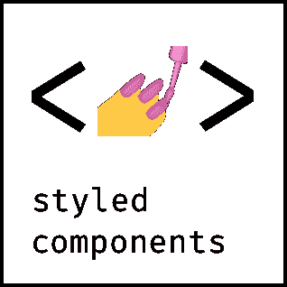
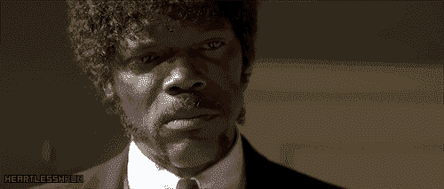

# 如何在没有模板文字的情况下使用样式化组件

> 原文：<https://www.freecodecamp.org/news/using-styled-components-without-template-literals-75496476e73d/>

杰克·威斯勒

# 如何在没有模板文字的情况下使用样式化组件



oh you fancy, huh

如果您过去使用过`styled-components`，您可能已经看到了使用`styled` API 声明组件的默认方式(根据文档):

```
import styled from 'styled-components'
```

```
const Button = styled.button`  background: palevioletred;   color: #fff;`
```

这里没什么令人震惊的。文档使用这种模式，如果你在`styled-components`上查看任何材料，你可能会看到完全相同的东西。

嗯，在过去的几周里，我在一些利用`styled-components`的图书馆里看到了不同的模式，但是我没有看到太多关于它的信息。这是:

```
const Button = styled('button')([],  'background: palevioletred',  'color: #fff')
```

这很有趣，我想探索一下。

### 它是如何工作的？

如果你读过[马克斯·斯托伊伯的](https://medium.com/@mxstbr)帖子[风格化组件背后的魔力](https://mxstbr.blog/2016/11/styled-components-magic-explained/)，他会详细介绍他广受欢迎的 CSS 库的内部运作。`styled-components`的`styled` API 依赖于标记的模板文字，这可能是大多数人使用它的方式。

但是，这不是使用`styled` API 声明组件的唯一方式。这是这篇文章背后的关键思想，但现在看起来可能还不清楚。那么，要回答这个问题，*它是如何工作的呢？*，我们首先需要深入一点标签化的模板文字。

#### 标记的模板文字

让我们对模板文字和带标签的模板文字做一个重要的区分。*有什么区别？*

根据 Mozilla 的说法，**模板文字**是:

> "允许嵌入表达式的字符串文字."

这些字符串可以是多行的:

```
const multiLiner = `  Look Ma,  2 lines!`
```

它们还可以包含嵌入式表达式，这是它们支持*插值*的另一种说法:

```
const food = 'burger'
```

```
const str = 'Mmmm! That is a tasty ${food}!
```



pulp fiction ya dig

`${ This here }`是插值。可以把它们看作 JavaScript 表达式的占位符。

**另一方面，带标签的模板文字**是简单的模板文字，用于调用函数，而不是括号内普通的逗号分隔值:

```
// regular function call
```

```
myFunc(1, 2, 3)
```

```
// tag function call
```

```
myFunc`1, 2, 3`
```

上面`myFunc`的第二个版本被称为**标签函数**。

`myFunc`的两个调用点传递参数的方式使它们与众不同。您已经知道了一个常规的函数调用是如何传递参数的，但是我不期望您知道标记函数是如何传递参数的。

Max [在他的文章中非常好地总结了这一点](https://mxstbr.blog/2016/11/styled-components-magic-explained/)，这是*关于标记模板文字你必须了解的*的事情，所以我将通过使用他创建的相同函数来总结它是如何工作的:

```
const logArgs = (...args) => console.log(...args)
```

上面的函数使用了 *spread…rest* 运算符。使用`…args` 语法将函数的参数收集到一个名为`args`的数组中。这被称为**静止**。你可以把它看作是把剩余的参数“收集”到一个名为`args`的数组中。当您不知道函数可能有多少个参数时，这很有用。

它的兄弟，**传播**，发生在我们使用`console.log(...args)`将参数记录到控制台时。我们实际上是“展开”了`args`数组的内容。

这两个操作符帮助我们直观地看到传递给`logArgs`的是什么。让我们检查一下以前面描述的两种方式调用该函数的结果:

```
logArgs(1, 2, 3)
```

```
// -> 1
```

```
// -> 2
```

```
// -> 3
```

```
logArgs`1, 2, 3`
```

```
// -> ["1, 2, 3"]
```

像平常一样调用这个函数就能达到我们的预期。它将`args`数组展开成单独的值，并将每个值记录到控制台。

另一方面，使用带标签的模板文本调用`logArgs`会记录一个数组。这是我们的第一课:

标记的模板文本将一个字符串值数组作为第一个参数传递给 tag 函数。

当我们包括插值时，事情变得更加有趣:

```
const food = 'burger'
```

```
logArgs`Mmmm! That is a tasty ${food}!`
```

```
// -> ["Mmmm!  That is a tasty ", "!"]
```

```
// -> "burger"
```

`logArgs`仍然输出一个字符串值数组作为它的第一个参数，但是如果标记的模板文本有一个插值，那么插值中的表达式将作为下一个参数传递。

当有多个插值时会发生什么？

```
const food = 'burger'
```

```
const adj = 'tasty'
```

```
logArgs`Mmmm! That is a ${adj} ${food}!`
```

```
// -> ["Mmmm!  That is a ", " ", "!"]
```

```
// -> "tasty"
```

```
// -> "burger"
```

我们想要多少插值就有多少插值，每个插值都会被相应地传递。这是第二课:

如果插值存在于带标签的模板文字中，它们包含的表达式将作为附加参数传递给标签函数。

让我们看看带标签的模板文字如何处理插值函数:

```
logArgs`Mmmm! That is a tasty ${() => 'burger'}`
```

```
// -> ["Mmmm!  That is a tasty", "!"]
```

```
// -> () => "burger"
```

函数本身作为一个参数包含在内。这就是`styled-components`的精髓。通过捕获这样的函数，库可以执行它并做它需要做的事情，主要是将结果值合并回数组中的字符串值。

### 将我们新发现的知识结合在一起

现在我们知道了带标签的模板文字是如何工作的，让我们更深入地理解“样式化的”API:

```
const Button = styled.button`  background: ${props => props.primary ? 'red' : 'white'};  color: black;`
```

`styled.button`是一个标签函数。如果我们要记录这个函数的参数，我们会看到:

```
logArgs`  background: ${props => props.primary ? 'red' : 'white'};  color: black;`
```

```
// -> ["background: ", "; color: black;"]
```

```
// -> props => props.primary ? "red" : "white"
```

你看到这里的力量了吗？难怪`styled-components`作为 CSS-in-JS 解决方案如此受欢迎。标记的模板文字不仅允许我们自然地编写多行 CSS，还允许库通过这些插值函数操纵样式，给我们的组件一种动态的感觉。

### 那么另一种模式是如何工作的呢？

啊，是的。这就是你在这里的原因，不是吗？早些时候，我展示了我最近看到的使用`styled` API 的另一种方式:

```
const Button = styled('button')([],  'background: palevioletred',  'color: #fff')
```

首先，要明白`styled.button`和`styled('button')`的处理方式是一样的。它们是可以互换的。

其次，这里没有带标签的模板文字操作。但是，既然我们知道`styled`支持他们，*就知道它如何期待自己的论点*。这是主要的关键？。

记住两条规则:

1.  标记的模板文本将一个字符串值数组作为第一个参数传递给 tag 函数。
2.  如果插值存在于带标签的模板文字中，它们包含的表达式将作为附加参数传递给标签函数。

因此 tag 函数期望一个字符串值数组作为它的第一个参数，插值表达式也是如此。

在上面的模式中，我将其命名为*“空数组模式”*，参数是:

```
// -> []
```

```
// -> 'background: palevioletred'
```

```
// -> 'color: #fff'
```

第一个参数是一个数组，满足第一条规则。是的，数组中没有字符串值，但这完全没问题。附加参数是字符串，根据定义，它们是产生值的表达式，因此它们满足第二条规则。

我们已经模拟了带标签的模板文字的行为，但并没有真正使用它们。

### 包扎

最终，这两种模式会产生相同的价值。我发现很难发现的是为什么你会想用一个而不是另一个。我想我可以看到这样一种情况，使用带标签的模板文字，你有多个插值，为了代码可读性，你可以选择*空数组模式*:

```
// as tagged template literal
```

```
const Button = styled.button`  background: ${ props => props.background };  color: ${ props => props.color };`
```

```
// as Empty Array Pattern
```

```
const Button = styed.button([], props => ({  background: props.background,  color: props.color}))
```

我很想听听对这些模式有经验的人的见解，以及每种模式的利弊！

这是我自己的博客中的一篇交叉文章。？

在[推特](https://twitter.com/jakewies)上打招呼？