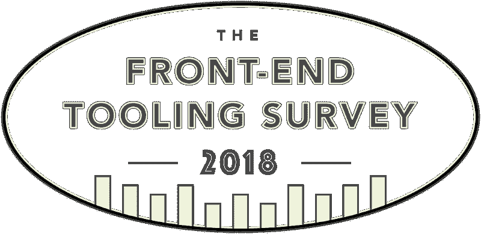
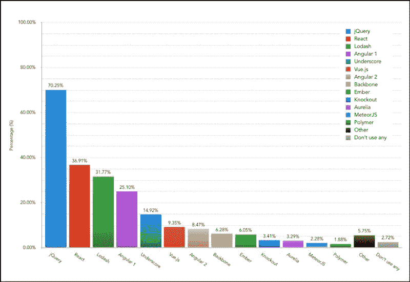

# 启动 2018 年前端工具调查

> 原文：<https://www.freecodecamp.org/news/launching-the-front-end-tooling-survey-2018-927bf975fdf0/>

阿什利·沃森-诺兰

# 启动 2018 年前端工具调查

前端工具调查是为了收集信息，并揭示整个 web 开发行业的工具习惯。

**TL；博士**:参加[今年的调查](http://ashn.uk/survey-2018)。

#### 一点背景知识

18 个月前，5，254 名开发人员参加了 2016 年前端工具调查，[调查结果显示了我们正在使用的工具的一些有趣变化](https://ashleynolan.co.uk/blog/frontend-tooling-survey-2016-results)。

当时，整个行业的 React 知识飞速发展，而 Sass 仍然是迄今为止最流行的 CSS 预处理器。与此同时，像 Vue.js、Jest 和 PostCSS 这样的工具在过去的 12 个月里开始被越来越多的人采用。

但自那以后，情况发生了怎样的变化(或没有变化)？我们现在使用什么工具，与 2016 年的结果相比如何？有什么新工具出现了，值得关注吗？

#### 我们的工装习惯改变了吗？

当调查在 2016 年进行时，与 2015 年的结果相比，观察到了许多有趣的结果。

当被问及“您目前在项目中最常用的 JavaScript 库和/或框架是什么？”，React 获得的响应(36.91%)比 AngularJS(为了清楚起见，在调查中称为 Angular 1)和 Angular 2 的总和(33.57%)多。与 2015 年相比，这是一个明显的转变，当时 AngularJS 收到的回复数量是 React 的两倍多。

Results from question 13 of the 2016 survey showing the JavaScript libraries and frameworks used most frequently by developers

当查看跨库和框架的结果时，jQuery 显然仍然非常受欢迎，70.25%的开发人员说他们经常在他们的项目中使用它。当被调查者被要求说出他们认为最重要的 JavaScript 库或框架时，jQuery 也名列榜首，有 32.11%的人回答。

在 CSS 工具领域，情况每年都更加一致，Sass 显然仍然是最受欢迎的预处理器。然而，深入观察结果，PostCSS 等工具和 CSS-in-JS 技术(如 CSS 模块)的受欢迎程度有所提高。这些工具会在行业中得到更多的关注吗？

在工具领域的其他领域，也有明显的领先者，Webpack、ESLint 和 Mocha 分别在 JavaScript 模块捆绑、林挺和测试方面领先。

看到所有这些工具的使用水平在 18 个月内发生了怎样的变化将会非常有趣。

#### 有什么新鲜事？

根据反馈，我添加了关于 CSS 框架和 JavaScript 类型的问题，以检查哪些工具在这些领域处于领先地位。

今年的调查中还有一个新问题，旨在了解一些最新 CSS 技术的知识水平，如 CSS 网格和自定义属性。

除此之外，调查一直像往常一样简洁——所以熟悉的问题被调整，以包括任何越来越受开发人员欢迎的新工具。

#### 参加吧！

和前几年一样，这次调查只需要几分钟就可以完成，我真的很感谢每一个回复。简单来说，调查收到的回复越多，结果就越有代表性。

调查将在三月底结束，之后我将把结果和分析写成一系列文章。如果您想知道何时会发生这种情况，请在 Twitter 上关注我，或者您可以在调查结束时留下您的电子邮件，以便在调查发布后接收信息。

你还在等什么？[现在就开始填写调查吧](http://ashn.uk/survey-2018)！