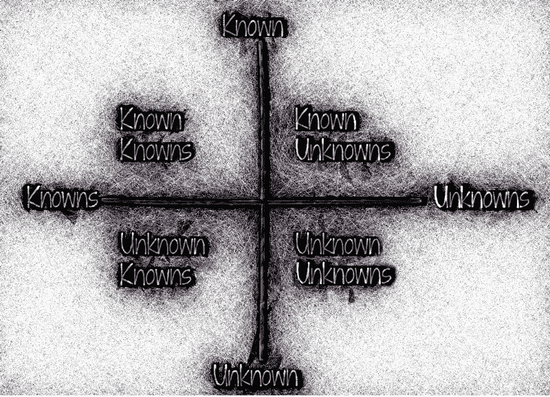

# 未知的设计知识

> 原文：<https://www.freecodecamp.org/news/the-unknown-knowns-of-design-3828f124197b/>

作者 Lukasz Lysakowski

# 未知的设计知识

#### 唐纳德·拉姆斯菲尔德的名言如何应用于设计

### 介绍

似乎几乎每天都有新的科技产品被颠覆的新闻，其颠覆方式是其创造者从未想象过或打算过的。作为一名技术服务的设计师，这些故事的一贯弹幕让我思考。作为设计师，我们如何防止工作中不可预见的后果？在考虑这个话题时，我想起了唐纳德·拉姆斯菲尔德的名言“未知的已知”。我意识到它是解决这些后果的框架。

### 首先，拉姆斯菲尔德的“未知的已知”的历史

在 911 恐怖袭击之后，愤怒驱使美国及其领导人实施报复。阿富汗和伊拉克因其直接和间接支持恐怖组织的历史而成为报复的焦点。结果，美国领导人认为两国都将被入侵。

入侵阿富汗是一个更直接的推销。因为控制这个国家的塔利班也为恐怖袭击的策划者提供庇护。入侵伊拉克的理由站不住脚，因为伊拉克没有直接卷入恐怖袭击。

美国领导人认为入侵是正当的。美国领导人辩称，伊拉克拥有大规模杀伤性武器，并愿意向恐怖分子提供这些武器。但这一论点是基于站不住脚的证据。

2002 年 2 月 12 日，在入侵伊拉克之前，美国国防部长唐纳德·拉姆斯菲尔德就证实伊拉克向恐怖组织提供大规模杀伤性武器的站不住脚的证据接受了质询。唐纳德·拉姆斯菲尔德给了一个臭名昭著的回答来回避这个问题:

> 我对那些说某事还没发生的报道很感兴趣，因为正如我们所知，有已知的已知；有些事情我们知道我们知道。我们也知道有已知的未知；也就是说，我们知道有些事情我们不知道。但也有未知的未知——那些我们不知道自己不知道的。——Via[维基百科](https://en.wikipedia.org/wiki/There_are_known_knowns)

当然，回答是愤世嫉俗的，拉姆斯菲尔德回避了入侵的真正原因。这也避免了他给伊拉克人民和美国军人带来的灾难。

这句话深深印在我的脑海里。我不知道该拿它怎么办，但偶尔我会把它翻出来再读一遍。最后，当我开始思考关于设计的问题时，这句话开始和我有了关联。

### 拉姆斯菲尔德的名言如何应用于设计

#### 已知的知识

“有些事情我们知道我们知道。”

正确的以人为中心的设计过程需要用户的输入和反馈。设计师和用户研究人员通过研究来理解用户的问题。作为回报，他们发现了解决问题的成功标准。研究方法是多样的。它可以包括用户访谈、实地观察、调查和定量跟踪。这些对于理解问题及其解决方案至关重要。当一个设计师实现了一个用户研究的设计过程，他们的工作就变得基于他们所知道的事情。

如果设计师没有对问题进行充分的研究，或者没有理解解决方案是否对最终用户有益，那么设计师就是在已知的未知中工作。

#### 已知的未知

**“也就是说，我们知道有一些我们不知道的事情”**

作为设计师，当我们知道我们没有完全实现以人为中心的设计过程时，已知的未知就会发生。我们知道，我们要么不了解问题的根源，要么我们没有花足够的时间来测试解决方案。我们知道，我们潜在的解决方案缺乏明智的选择。作为设计师，我们必须提出这个问题，并采取行动来回答这些未知的问题。

启动一个设计而不回答一个已知的未知问题可能会危及项目、公司、最终用户，甚至你自己。作为设计师，你需要把开放性的问题解释清楚，因为你不想浪费大家的时间和金钱，不想对自己或他人造成伤害。

#### 未知的未知

**“我们不知道的我们不知道”**

接下来是两个困难的象限。首先是未知的未知，你如何发现你自己都不知道的已知？我不知道答案，但我确实认为作为设计师，我们可以通过寻找新的方法来扩展我们的视角来解决这个问题。

增加我们视角的一个简单方法是多看一些技术/设计方面的文章。科幻小说可能是一个很好的类型，因为科幻小说经常推测未来。科幻小说对科技变革的负面报道和正面报道一样多。

作为设计师，我们也需要与人交谈，才能对研究感到舒服。与人相处更舒适的一个方法是去认识我们舒适区之外的人，甚至可以与陌生人交谈。另一个想法是走一条不同的路去学校或工作。此外，旅行是一个很好的重置方式。

在科技行业，我们倾向于通过积极的视角看待我们的工作，关注它的好处(包括设计师)。但我们也必须看到我们产品和服务的负面影响。正如我之前提到的，要发现我们工作的负面结果，我们必须打破我们的日常惯例。我们必须用新的不同的方法来处理我们的过程。否则我们会对未知的和无意的后果视而不见。

#### 未知的知识

**“你以为你知道的事情，原来你并不知道”**

“未知的已知”是最难解决的象限。你如何发现你认为你知道的其实是错的？这是一个矛盾，像所有的矛盾一样，很难解决。

作为设计师，我们有时认为自己无所不知，尤其是在涉及到终端用户的时候。但是设计师不是超人。那么，作为设计师，我们如何在不理解的情况下解决自认为知道的问题呢？

类似于未知的未知，我相信我们可以通过走出我们的集体思维来解决这个问题。我们需要走出我们的社交圈。我们需要扩展我们的兴趣和我们所做的事情。我们需要和与我们直接社交圈不同经历的人交谈。

在工作中，我们需要赞助招聘不属于我们网络的人。我们还需要雇佣视角不同的人。作为设计师，我们也需要接触不同的团队成员，完全不同团队的人。他们的经历将告诉我们，一个产品和服务是如何被使用的，或者可以以我们作为设计师无法想象的方式被使用。

#### 结论

用户研究是人性化设计的核心。以人为中心的设计是指导设计师创造解决用户需求的产品的框架。

为了理解用户需求，设计师必须首先通过实践用户研究方法来定义问题。该框架允许设计者根据定性和定量输入，而不是仅仅根据他们的个人假设来确定潜在的解决方案。

此外，为了防止未知的未知和未知的已知，我们必须超越我们的舒适区。我们可以通过多读书来达到这个目的。我们可以联系我们社交圈之外的人，雇佣有不同经历的人。作为设计师，我们的目标是拓宽我们的视角，抢先发现未知。

#### 埃罗尔·莫里斯和未知的已知

如果你仍然对这个话题感到好奇，埃罗尔·莫里斯详细地探究了这句话，它的意思，以及它的说话者。他为《纽约时报》出版了一个三集系列，并执导了《未知的已知的》。预告片令人惊叹地展示了拉姆斯菲尔德驾驭语言和意义的能力。

[**【拉姆斯的确定性(上)**](https://opinionator.blogs.nytimes.com/2014/03/25/the-certainty-of-donald-rumsfeld-part-1/)
[*四种人:热心而无知识；没有热情的知识；既没有知识也没有热情；既热情又…*opinionator.blogs.nytimes.com](https://opinionator.blogs.nytimes.com/2014/03/25/the-certainty-of-donald-rumsfeld-part-1/)

如果你喜欢这篇文章，请在下面鼓掌。谢谢你。