# 查看我的递归可视化指南(因为一张图片胜过 1000 个单词)

> 原文：<https://www.freecodecamp.org/news/recursion-visually-explained-bec8cca14d9b/>

在本文中，我将(几乎)完全用可视化表示来解释递归。我将展示而不是解释每个递归函数调用是如何与初始函数调用的整体交互的——换句话说，每个部分是如何连接到整体的。

一些细节:

*   代码是用 Python 写的
*   蓝框代表该功能的当前范围
*   连接线是函数返回的内容

请使用代码作为参考，因为我不去详细运行它。

我们将着眼于三个问题:寻找一个字符串的变位，合并排序，和河内塔。它们逐渐变得更加微妙，所以要小心！

我将在下面讨论递归的更多细节。

### 字谜

```
def anagrams(s):
    if s == "":
        return [s]
    else :
        ans = []
    for w in anagrams(s[1: ]):
        for pos in range(len(w) + 1):
            ans.append(w[: pos] + s[0] + w[pos: ])
    return ans

anagrams("abc")

# returns ['abc', 'bac', 'bca', 'acb', 'cab', 'cba']
```

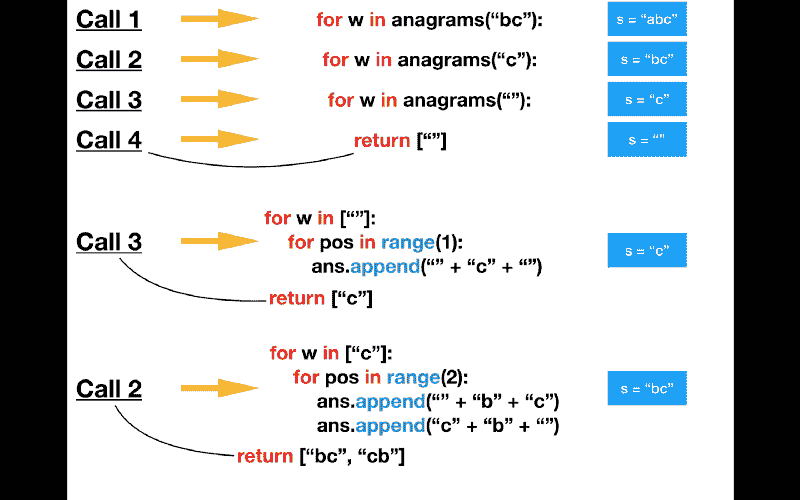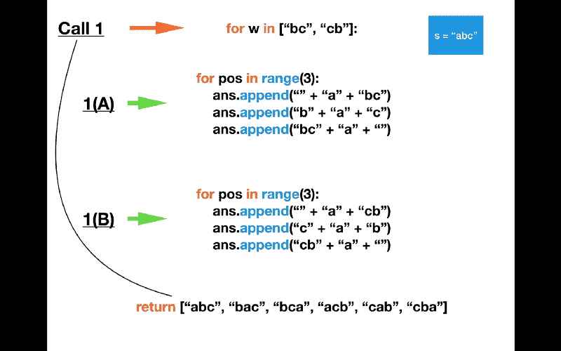

anagramursion

以上是对调用栈的一个很好的介绍。注意每个先前的调用是如何等待递归调用的返回值的。

还要注意变量`ans`的值是如何在初始函数调用(1)中被追加的。

### 合并排序

```
def merge(lst1, lst2, lst3):
    i1, i2, i3 = 0, 0, 0
    n1, n2 = len(lst1), len(lst2)
    while i1 < n1 and i2 < n2:
        if lst1[i1] < lst2[i2]:
            lst3[i3] = lst1[i1]
            i1 = i1 + 1
        else:
            lst3[i3] = lst2[i2]
            i2 = i2 + 1
        i3 = i3 + 1

    # unequal length of lists? Check both
    while i1 < n1: 
        lst3[i3] = lst1[i1]
        i1 = i1 + 1
        i3 = i3 + 1

    while i2 < n2:
        lst3[i3] = lst2[i2]
        i2 = i2 + 1
        i3 = i3 + 1

def mergeSort(nums):
    n = len(nums)
    if n > 1:
        m = n // 2
        nums1, nums2 = nums[:m], nums[m:]
        mergeSort(nums1)
        mergeSort(nums2)
        merge(nums1, nums2,nums)

numbers = [7, 4, 6, 2, 8]
mergeSort(numbers)

print(numbers)
# returns sorted numbers (function altered underlying data structure)
```

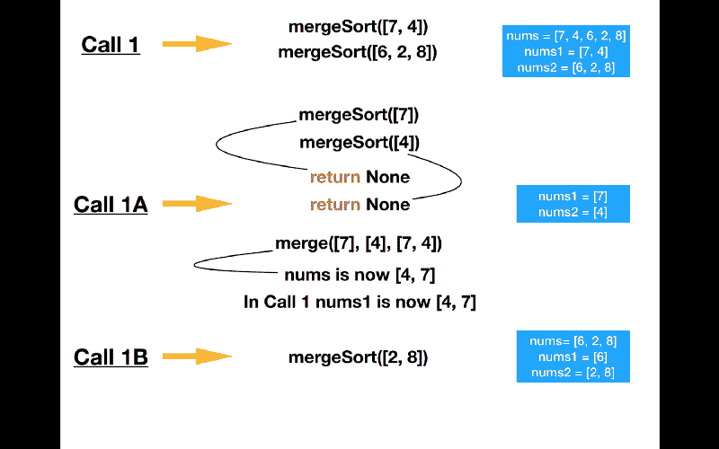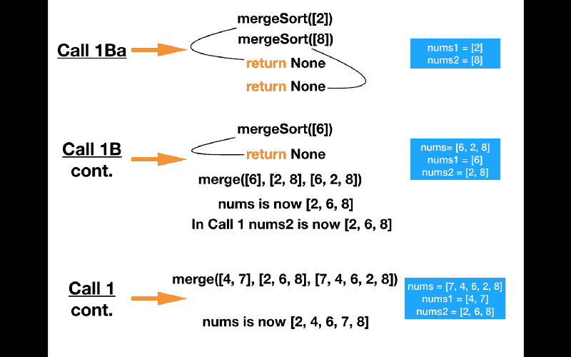

recursamerged

再次注意每个调用的运行顺序。要理解 merge 是如何工作的，请仔细观察它。你基本上有三个指针和两个排序的一半的初始列表，它们不断地被比较。这个比较过程中的最小数字被设置在初始列表中所指向的索引处(从索引 0 开始)。

如果你不熟悉 Python，请注意以下几点。当一个函数不返回任何值时，它返回值`None`。您可以在我的图中看到`None`的频繁返回值，因为在`mergeSort`中没有显式的返回语句。

另外，请注意函数调用中的列表输入是如何变化的，也就是说 Python 在调用函数时没有创建列表的副本。

### 河内塔

这里有一个小故事作为旁注——我发现这是对河内塔的一个颇有诗意的介绍:

> “在世界上一个偏远地区的某个地方，有一座非常虔诚的修道院。僧侣们被赋予了为宇宙计时的神圣任务。万物之初，僧人们得到一张桌子，上面支撑着三根立柱。其中一根柱子上有一叠 64 个同心的金色圆盘。这些圆盘有不同的半径，堆叠成美丽的金字塔形状。僧侣们负责将圆盘从第一根柱子移动到第三根柱子。当僧侣们完成他们的任务时，所有的东西都将化为灰烬，宇宙也将终结。”— *约翰·泽尔，Python 编程:计算机科学导论(2004)*

```
def moveTower(n, source, dest, temp):
    if n == 1:
        print("Move disk from", source, "to", dest+".")
    else:
        moveTower(n-1, source, temp, dest)
        moveTower(1, source, dest, temp)
        moveTower(n-1, temp, dest, source)

 def hanoi(n):
    moveTower(n, "A", "C", "B")
```

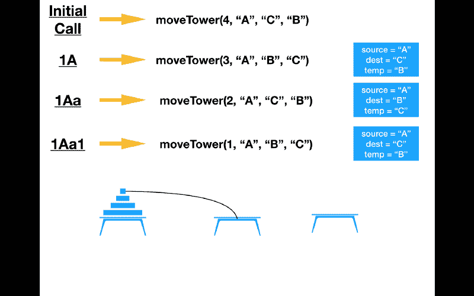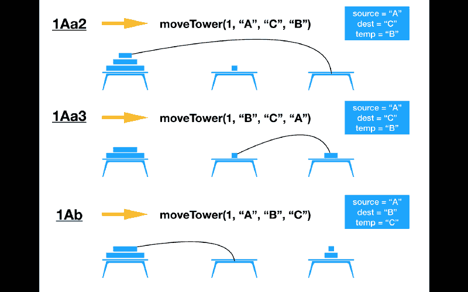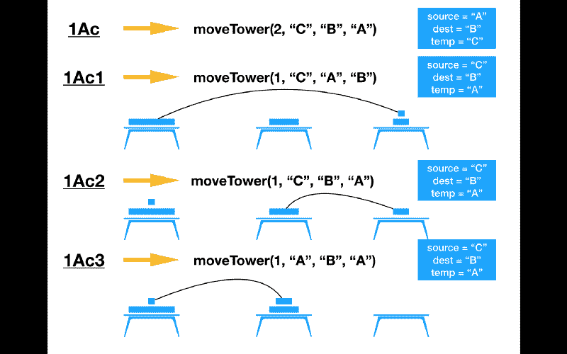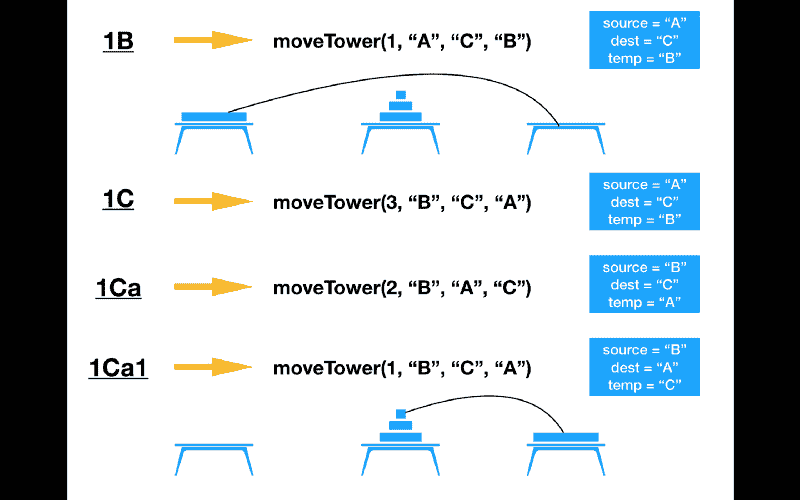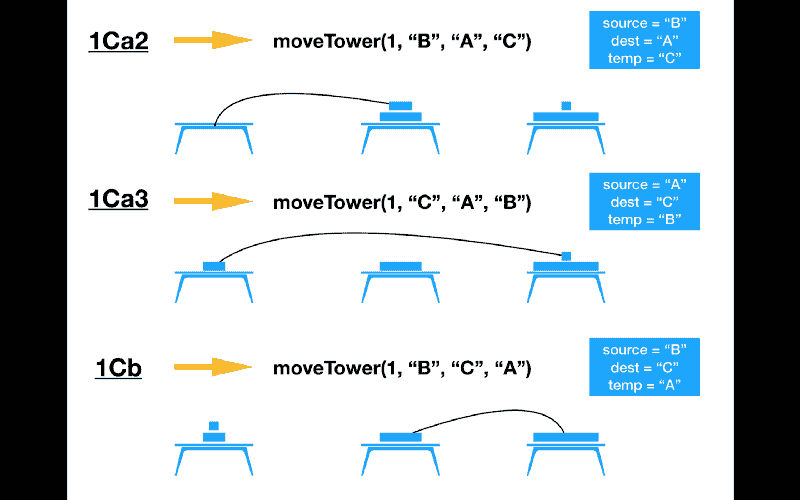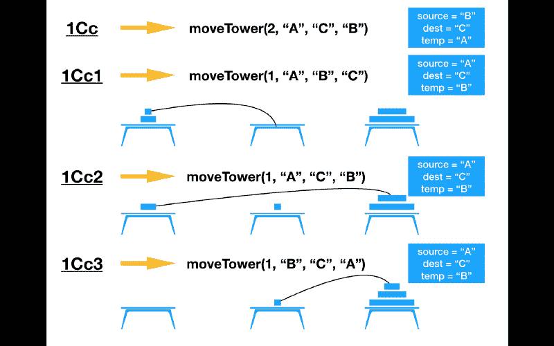

hanoision

方块的移动是基于一个数学原理。

来自[维基百科的文章](https://en.wikipedia.org/wiki/Tower_of_Hanoi):

1.  将*m*1 圆盘从**源**移动到**温度**钉。这使得磁盘 *m* 成为源 peg 上的顶部磁盘。
2.  将圆盘 *m* 从**源**移动到**目标**钉。
3.  将我们刚刚放置在备用磁盘上的*m*1 磁盘从 **temp** 移动到 **dest** peg，这样它们就被放置在磁盘 *m* 的顶部，而不会违反规则。

但是如何理解这个原则呢？好吧，看看这个。

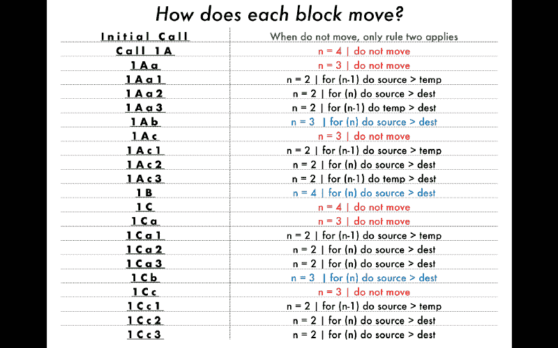

exactitude

请注意:除了规则 2(蓝色文本)运行时，这三个规则重复(黑色文本)，因为算法没有达到其基本情况。

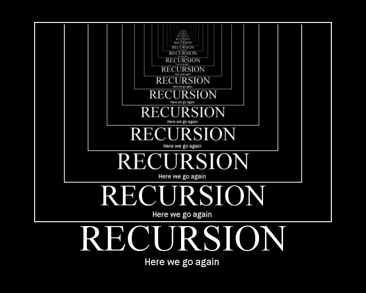

basically

#### 关于递归的一句话

本文是能够解决递归问题的第一步。我创建这个是为了帮助读者理解递归是如何工作的，以及它的真实情况。对于每个问题，注意我是如何对每个函数调用和返回值进行排序的。这与计算机读取代码的方式相同。

递归的基本概念是这样的:

调用递归函数调用的函数必须等待递归函数调用完成，然后才能继续其进程。

所以如果递归函数调用更多的递归函数，那么它也必须等待这些递归函数返回。在某种程度上，递归只是让函数在继续之前等待它们调用的函数返回一些东西。

如果你渴望在递归问题解决的领域中成长，那么你必须学习数学。他们是同一个人。但是研究数学超出了本文的范围。这篇[维基百科文章](https://en.wikipedia.org/wiki/Mathematical_induction)是一个很好的入门。

就是这样。我必须完全感谢 David M. Reed 的[使用 Python 和 C++](https://www.amazon.com/gp/product/1590282337/ref=oh_aui_detailpage_o01_s00?ie=UTF8&psc=1) 的数据结构和算法，以及 John Zelle，因为那段精彩的引言和算法就是从那里挖掘出来的。

这是一个很好的空间视图，因为递归感觉有点像。

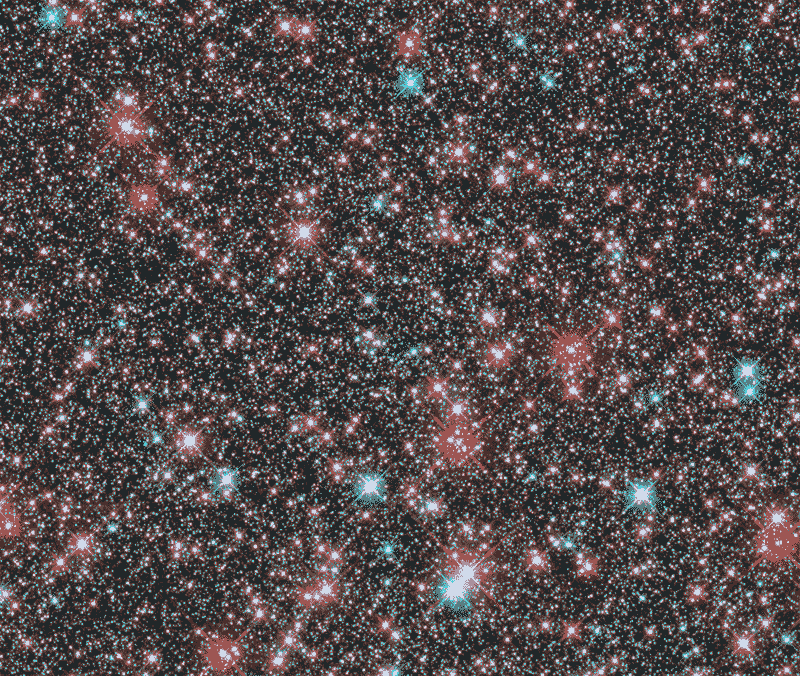