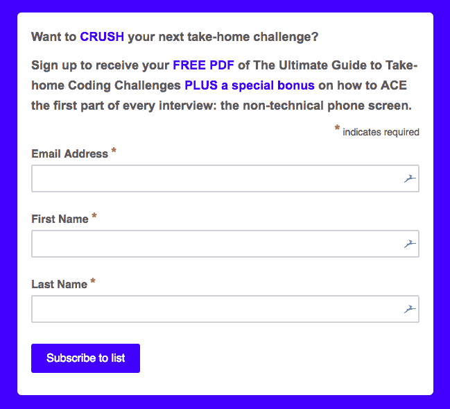

# 带回家的编码挑战的基本指南

> 原文：<https://www.freecodecamp.org/news/the-essential-guide-to-take-home-coding-challenges-a0e746220dd7/>

简·菲利普斯

# 带回家的编码挑战的基本指南


#### **简介**

嗨，我是简。我写这个指南是因为我想帮助其他有非传统背景的人成功应对带回家的编码挑战。请阅读它，做笔记，应用材料，并让我知道你的结果。你可以发电子邮件到 jane@fullstackinterviewing.com 和我联系。

本指南是为那些在技术面试过程中接受了带回家的编码挑战并希望以最好的方式解决它的人准备的。这个基本指南是一个更长的[带回家的编码挑战终极指南](https://www.fullstackinterviewing.com/2018/02/02/the-ultimate-guide-to-kicking-ass-on-take-home-coding-challenges.html)的精华版本，它更详细，从头到尾都是一个示例挑战。

所以，如果你刚刚收到一个挑战，并急于开始，从这里开始，然后当你想更深入地学习材料时，查看[完整指南](https://www.fullstackinterviewing.com/2018/02/02/the-ultimate-guide-to-kicking-ass-on-take-home-coding-challenges.html)。祝你好运！

### **在进行带回家的编码挑战时要避免犯的错误**

对于带回家的挑战，你可能会犯几个错误。其中一些是容易纠正的小错误，而另一些会让你感到沮丧，无法完成任务。我想先解决这些错误，这样当你有一个带回家的挑战时，你就知道不应该做什么。

以下是你可能犯的四个错误:

**1。时间管理和范围蔓延**

**2。试图一次学习太多新东西**

**3。做出过多假设**

**4。马上开始编码**

让我们详细看看每一个。

**1。时间管理和范围蔓延**

时间估计是编程中最难的问题之一，即使是经验丰富的工程师也难以解决。这在几个方面对带回家的挑战产生了影响。

首先，一些挑战伴随着“估计时间”。我通常忽略这些，因为它们很少基于现实。其次，有些挑战是无限的。许多人，尤其是新开发人员，会想要添加大量的功能，因为他们认为这会给人留下深刻印象。事实上，如果你保持范围相对狭窄，但完成你开始做的每一件事，会更令人印象深刻。在这种情况下，做好一件事比做不好一百万件事要好。

一个很好的问题是:什么算“超越”和什么算“范围蔓延”我的经验法则是，如果你的想法完成或改进了任务的要求，这可能是一个好主意，但如果它看起来无关紧要或“很酷”，这可能是范围蔓延。但是，正如我稍后描述的，总是先让它工作。

**2。试图一次学习太多新东西**

虽然带回家的编码挑战可能是一个很好的学习机会，但也有可能需要**太多的**学习。如果你面临一个挑战，你必须使用一种特定的语言或框架，但你并不熟悉它，不要通过在此基础上学习新的东西来增加额外的复杂性。例如，如果你正在为一个全栈应用程序使用一个新的后端框架，坚持使用你已经熟悉的前端框架。

如果你的挑战是语言/框架不可知论者，但是你一直渴望尝试一些新技术，那么就选择一个来试验。在阅读文档、正确设置挑战以及习惯任何新语法之间，您将会忙得不可开交。即使学习一件事也会消耗你大量的时间，所以我强烈建议每次挑战只限于一项新技术。

**3。做出过多假设**

作为一名开发人员，如果你做了太多的假设，你一定会构建出一个不符合需求的应用程序，或者用户体验很差。当给定一组带回家挑战的要求时，总是花时间回顾这些要求，并确保你完全理解它们。如果你有任何问题，随时问。

首先，这表明当你不太明白一些事情时，你愿意寻求帮助，这是一个开发人员需要展示的重要特质。第二，许多公司会故意给你一些模糊或不具体的产品要求，以观察你在这些情况下的反应。他们实际上是在测试你理解可能存在缺口的需求的能力。

所以，当你有疑问时，问问题。问问题也是一个信号，表明你对挑战感兴趣。

**4。马上开始编码**

你可能犯的最后一个错误是立即开始编码。我保证如果你这样做，你会后悔的。为什么？两个原因:

**没有适当的计划，你的代码会受到影响**

如果没有首先进行组织，并确保您完全理解所有的技术需求，您可能会发现自己遗漏了边缘案例或重写了部分功能。我知道这似乎违背直觉，但如果你提前计划，实际上会节省时间。

**你将转动轮子，尝试正确设置你的应用程序**

尤其是对于新开发人员来说，初始应用设置可能是带回家的编码挑战中最困难的部分之一。这不是你每天都要做的事情，所以通常需要一些研究和阅读文档来重新熟悉这个过程，并确保你以最好的方式进行。

所以，这就是你要避免犯的错误的总结。你会发现这些也适用于你作为开发人员的日常工作。在下一节中，我们将深入探讨如何在编写一行代码之前进行组织。

### **变得有条理:在写一行代码之前如何计划**

现在该去工作了！但是，现在还不是写代码的时候。

为什么？

因为，正如您将看到的，许多工作实际上发生在您编写一行代码之前。这可能看起来违反直觉，但是同样，你花在预先计划上的时间越多，你花在编写代码上的时间就越少。

所以，现在你已经有了你的编码挑战，你已经准备好开始计划过程了。以下是我建议的六个步骤:

**1。了解需求并提出任何问题**

**2。确定您需要做出的技术决策**

**3。技术设计&白板**

**4。测试计划**

**5。应用设置计划**

**6。组织你的任务**

**1。了解需求并提出任何问题**

首先，你需要确保你完全、绝对、100%理解项目的需求。如果对要求的任何部分不清楚，您可以联系您的联系人并提出问题。

有时候，公司会故意模糊他们的要求，以观察你如何处理问题。在这种情况下，最好是提出问题，因为这表明你正在思考问题，而不仅仅是做出假设和根据模糊的规范构建应用程序。

**2。确定您需要做出的技术决策**

您的下一步将是确定您需要做出的技术决策。预先列出你所有的技术决策，并在开发应用程序之前考虑这些决策，会给你很大的帮助。这不仅会减少以后解决问题的时间，还会让你提前做出大的决定，而不是试图同时关注大的方面和小的细节。

**3。技术设计&白板**

现在是时候规划你的应用程序的其余部分了。对于任何你需要画出来的东西，现在是最好的时机。一开始就考虑这些决策有两个目的:

*   在构建应用程序时，您将能够参考这些绘图和您的原始计划。然后，如果你在任何一点卡住了，你可以随时回到你的笔记。
*   稍后，当您与工程师讨论您的编码挑战时，当他们问您为什么做出某些设计或架构决策时，您可以使用这些笔记作为参考。

一旦你想通并回答了一些更大的设计和架构问题，下一步就是研究。如果你计划使用一项新技术或你有点生疏的东西，利用这段时间搜索文档和其他资源。

**4。测试计划**

在编写一行代码之前，另一个非常重要的步骤是制定一个测试计划。尽管您不会得到关于这个测试计划的同行反馈，但是它将帮助您从不同的角度看待这个挑战，确保您满足所有的需求。通过在开始编码之前仔细思考并写出测试计划，你能够头脑风暴出你应该在你的代码中考虑的可能的边缘情况，并且你将使用它作为以后测试你的应用的基础。

**5。应用设置计划**

如果你是从零开始启动一个应用程序，弄清楚是否有任何生成器可以让你的应用程序设置更容易、更快。应用程序设置是带回家的编码挑战中最困难的部分之一，因为这是开发人员很少做的事情。最佳实践总是在变化，因此很容易忘记如何去做。此外，当第一次使用特定的技术组合来设置应用程序时，将所有的东西配置好并正确地协同工作可能会很有挑战性。

如果您没有使用生成器，阅读文档和查找工作示例是您可以采取的两个最重要的步骤。如果您遇到困难，能够使用一个工作示例并将其与您自己的应用程序进行比较将会对您有所帮助。

**6。组织你的任务**

开始编码前的最后一步是分解和组织你的任务。分解你的任务是必要的，因为这将有助于你在应对挑战时保持在正确的轨道上，并给你一个执行的游戏计划。注意，在这里你不应该是一个完美主义者，因为道路上总会有意想不到的坎坷。

以下是一个经典井字游戏应用程序的任务列表示例:

```
- Understand requirements- Choose technologies- Brainstorm test plan- Hello World app setup- Build board with HTML/CSS- Implement Tic Tac Toe gameplay with Javascript- Add reset button- Make board responsive- Add ability to add additional boards- Error handling & tests- Code cleanup- README
```

其中一些任务可以进一步分解成更小的步骤。例如，为了用 Javascript 实现井字游戏，下面是一些较小的任务:

```
- Add a click handler to each square that logs a message- Get click handler to add an X to the square that is clicked- Get clicks to alternate between X and O- Don’t allow a square to be clicked more than once- Implement a function to find the winner and end the game- Handle a tie game
```

#### **3。编写测试:只管去做！**

测试可能是压倒性的，因为有如此多的不同类型的测试:验收测试、集成测试和单元测试，更不用说测试驱动开发和特别测试了。

为什么您应该在您的带回家的编码挑战中包含测试？很简单:你的测试会让你的提交大放异彩。

首先，添加测试表明你知道或者愿意学习另一种技术/框架。这也表明你对你正在构建的东西拥有所有权，因为你有责任确保它能正常工作。测试还表明你已经考虑了边缘情况，这是许多新工程师经常忽略的。

许多公司非常重视测试。有些人不会告诉你他们期待你的编码挑战的测试，但是如果你遗漏了他们，他们会自动拒绝你。因此，我的建议是，无论遇到什么样的挑战，都要编写测试。这不仅会让你成为一个更好的开发人员，而且对于那些不期待测试的公司来说，你会更加突出！

你如何着手编写一个测试？首先，创建一个计划。以下是我对如何提出正确的测试用例的 80/20 建议:

**1。测试快乐路径**

对于经典的井字游戏来说，快乐之路是从一个空棋盘开始，一直玩到 X 赢。

**2。想想快乐之路的变化**

快乐之路的一个变化是如果 O 赢了，或者有一场平局。

**3。想到边缘案例**

一个边缘情况是如果一个玩家试图在同一个方格里移动不止一次。

**4。测试任何复杂的东西**

寻找获胜者的算法是这个例子中最复杂的部分。

下面是一个示例测试计划:

```
- Test that the initial state of the board is correct (i.e. board is visible and empty)- Test that a move can be played- Test that moves alternate between X and O- Test that a move can be played to a square only once- Test that a winner can be found in a row- Test that a winner can be found in a column- Test that a winner can be found in a diagonal- Test that a draw can be found
```

所以，现在轮到你了。想想你的应用，作为基线，想想你能写的 5-10 个测试。

#### **4。让它工作，然后让它漂亮，然后让它快**

这一部分的标题很好地总结了这一点，但是当你着手构建你的挑战时，你应该按照这个顺序遵循这三个步骤:

**1。让它工作**

**2。让它变漂亮**

**3。快点**

**1。让它工作**

当你面临一个带回家的编码挑战时，无论你做什么，挑战中最关键的部分是让它工作。如果你提交了一个有着漂亮用户界面的应用程序，即使你的应用程序不工作或者不能满足所有的要求也没关系。因为构建符合规范的功能是你作为开发人员未来工作的一个关键方面，你首先需要关注应用程序的功能，并把它放在首位。

如果你时间不多或者快没时间了，这也是关键。编码挑战可能是一大堆工作，尤其是如果你想更进一步，以确保你能进入下一轮面试。但是，我可以保证，如果你的应用程序不能正常工作或缺少一些关键组件，你将无法进入下一轮。

因此，如果你正在构建一个前端应用程序，这意味着首先要专注于让它工作，最后才是样式/UI。如果您正在构建一个后端或全栈应用程序，在尝试将您的代码重构为最优雅的解决方案之前，专注于让它工作，然后才担心优化。

即使你最终没有时间回去重构你的代码或设计你的用户界面，拥有一个可用的应用程序更重要。你可以随时与面试官谈论你将如何改进你的应用程序，重构你的一些代码甚至可能是下一轮面试的一部分。

**2。让它变漂亮**

“美化”在这里有两种解释。一个是让代码漂亮，另一个是让 UI 漂亮。有几种方法可以让代码变得漂亮。首先，确保缩进是一致的，你的代码是可读的。第二，如果你要以一种快速、简单的方式工作，考虑一下如何在不使它过于复杂的情况下，将它重构为一个更优雅的解决方案。

如果你正在做一个前端或全栈的挑战，你也可以把 UI 做得漂亮一些作为这一步的一部分。无论你是使用一个库还是为你的应用程序编写你自己的定制风格，让用户界面看起来不错会让你的面试官看到你在构建一个功能时考虑了用户体验。

对于一些更前端的挑战，你会得到一个特定的模型来匹配。在这些情况下，确保你的细节精确到最后一个像素是非常重要的。你的部分职责可能包括将设计师的模型翻译成用户界面，因此公司希望了解你是如何完成这些任务的。

**3。快点**

一旦你让你的应用程序工作，让它漂亮(在代码，用户界面，或两者)，可能是时候让它更快了！这就是理解性能和 BigO 符号派上用场的地方。

您应该检查一下您的代码，看看是否有任何地方增加规模可能是一个问题。例如，您是否在某处使用了双 For 循环？如果你循环的数组变得很长怎么办？

如果你考虑到这些边缘情况，你就可以提出改进代码的计划。将已经运行的东西设为`O(n)`并将它设为`O(1)`将表明你在构建东西时考虑的是性能。

### **如何让你的代码大放异彩**

当面临带回家的编码挑战时，许多人会考虑如何构建一个有效的应用程序，但就此打住。在这一节中，我将回顾一个工程师在审查你的代码时会寻找的东西，这样你就可以将你的挑战提升到一个新的水平，让你的代码闪闪发光。

当工程师审查你的代码时，他们会寻找一些不同的东西。他们可能会试着运行你的应用程序来玩一玩，看看它是如何工作的。之后，他们会深入实际代码，看看你是如何组织你的应用架构和读取单个文件中的代码的。

有几件事可以让你的代码脱颖而出。您希望您的代码是:

*   易读的
*   容易理解
*   组织良好
*   干净(适当缩进，没有语法错误和不必要的空白)

除了正念之外，这些都是不需要太多努力就能做好的基础。现在让我们来讨论三个更复杂的代码风格问题:

**1。如何给事物命名**

**2。如何有效使用评论**

**3。如何在编写代码时格式化代码**

**1。如何给事物命名**

命名是编程中最难的问题之一。给事物命名的关键之一是确保你以一种不熟悉代码的其他开发人员可以很容易理解的方式来命名它们。

对于函数，想想函数到底在做什么。这个函数是用来检查一行井字游戏棋盘上是否有赢家的吗？那么一个伟大的名字就是`checkRow`。你的函数是处理点击井字游戏棋盘上的方块吗？那么一个伟大的名字将是`handleClick`。

一个小提示:如果你发现自己因为不停地停下来想一个完美的名字而失去了心流，把你的过程分成两步。首先，用任何名字写工作代码(比如`foo`、`bar`和`baz`)。然后进行第二次测试来改进它们。

**2。如何有效使用评论**

添加注释是捕捉您在编写特定代码时所想的一个很好的方式。这对您或者将来遇到您的代码并需要理解它、调整它或重写它的任何人都是有用的。

把注释看作是给你的代码增加清晰度。但是，注意，因为有评论太多这种事。

以下是您最可能不需要注释的地方:

*   当你声明一个变量时
*   当你声明一个函数时

不要这样做:

变量或函数名应该足以准确解释它的作用。如果你需要一个评论来解释它，那么你需要给它一个更好的名字！

下面是一些注释有用的例子:

*   超文本标记语言
*   半铸钢ˌ钢性铸铁(Cast Semi-Steel)
*   技术上复杂的代码行

首先，我们来说说 HTML。标记似乎是不言自明的，对吗？那么，你为什么需要评论呢？假设你有一个很长的 HTML 文件，里面有很多的`<d` iv > s，注释可以很好的通知`which` < /div >标签关闭哪些部分。

在 CSS 中，如果一个文件中有很多样式，注释是划分样式的好方法。这样，当您稍后回到代码并想要进行更改时，就更容易找到您需要更新的那一部分的样式。

每当您硬编码任何数学或添加任意数量的像素作为边距、填充等等时，CSS 中的注释也非常有用。注释对于解释这种特定于您的应用程序的事情非常有用。

注释的最佳用途之一是当你写的代码在技术上很难或者不直观的时候。你应该总是尽可能地追求简单易懂的代码。然而，有时您会有令人困惑的代码——可能您将一堆方法链接在一起或者使用了复杂的正则表达式——这将有助于解释注释中发生了什么。

您几乎已经完成了学习如何让您的代码发光！只差一步了。

**3。如何在编写代码时格式化代码**

当涉及到代码时，我对格式非常执着。而且，不仅仅是我。你会发现最好的工程师也关心格式良好、干净的代码。为什么？第一，读起来容易多了！编码真的很有挑战性，所以当代码更容易阅读时，我们作为开发人员的工作就变得容易多了。此外，编写干净的代码向你的面试官传达了一个信息，那就是你以编写代码为荣，对于许多团队来说，这是一件大事。

那么，你如何确保坚持代码风格的人会认可你的代码呢？在您处理编码挑战时，有一些简单的技巧可以使用，以确保最终结果出来是干净的，并且您不必在最后花时间重新格式化所有内容。

*   选择制表符或空格，并在整个应用程序中保持一致(例如，一些文件中没有 2 个空格，其他文件中有 4 个空格)
*   适当缩进你的代码，以保持可读性，而不是到处都是
*   去掉尾部的空格！空白有时会造成破坏，所以最好在编写代码时去掉它。
*   在整个应用程序中保持语法一致。如果你使用棉绒，这将更容易，但需要设置一个。如果你没有时间设置一个，请注意。不要在你的 app 里有的地方用 ES5，有的地方用 ES6。挑一个坚持下去！
*   当您使用完不必要的日志和调试语句时，请删除它们！除非日志记录是应用程序的一部分，否则您需要移除构建应用程序时使用的任何临时语句。
*   总是在每个文件的末尾留一个换行符

就是这样！这很简单，一旦你养成了这样做的习惯，不仅你的代码更容易阅读，而且其他人也更容易阅读和维护。许多新开发人员没有接触过太多的代码维护，但是相信我，当你不得不清理别人写的代码时，如果它是有条理地开始的，你会更感激。转发吧！

下面是一个格式错误的代码示例:

下面是相同代码的一个示例，但是格式清晰，可读性更好:

### **如何让你的挑战更上一层楼**

这里有 3 个想法可以让你的编码挑战更上一层楼:

**1。奖金**

**2。UI/UX 设计(针对前端或全栈挑战)**

**3。数据验证和错误处理**

**1。奖金**

不是所有的编码挑战都有奖金，但是如果你有，你的目标是得到一份工作，那就去做吧！为什么？这很简单。如果你在编码挑战中超越自我，这将表明一旦你被这家公司聘用，你将超越自我。完成奖金要求对面试官来说是一个很高的能力触发器。

**2。UI/UX 设计(针对前端或全栈挑战)**

一些前端或全栈挑战会提到 UI/UX 设计作为奖励，但如果他们不这样做，付出一些努力，使 UI 看起来很好，易于使用，将有很大的帮助。您可以添加自己的自定义 CSS，或者插入一两个库来使您的样式更加简单。如果你使用一个库，只要确保你理解它是如何工作的，足以解释你是如何使用它的。

**3。数据验证和错误处理**

数据验证和错误处理是生产应用中的关键组件。添加其中一个(或两个都添加！)将有助于你脱颖而出。许多开发人员是编码新手，以前没有在生产代码库中工作过，对这两者都没有太多的接触，所以如果你为边缘情况添加错误处理，这将表明你考虑了很多不同的情况。

### **如何写一篇精彩的自述**

您可能已经写完了代码，但还没有写完——是时候写自述文件了。

**为什么你应该加入自述文件**

阅读材料非常重要，无论是对专业开发人员，还是对带回家的求职者。包含自述文件表明您关心文档。

文档有助于在团队中传播知识，并作为代码的补充。为您的“带回家的挑战”准备文档可以确保任何人(或未来的您)都可以清楚地理解您所构建的代码，而无需任何猜谜游戏。

您的自述文件也是确保每个查看您的挑战的人尽可能获得最轻松体验的关键。最后，您的自述文件是向评审者证明您成功满足挑战要求的一种方式。

**如何写你的自述**

写一份精彩的自述并不难，你会因此从众多应聘者中脱颖而出。以下是我建议你包括的五个部分:

**1。安装说明**

**2。讨论使用的技术**

**3。证明你符合要求的部分**

**4。如果有奖金，一部分证明你满足他们**

**5。对于算法和数据结构，时间和空间复杂度**

**1。安装说明**

写自述的时候，不要做任何假设。写出在本地运行应用程序的所有步骤，并亲自测试。这包括从 Github 克隆 repo、运行安装命令和启动服务器。此外，请确保包含您正在使用的软件版本。这将确保审查您的代码的开发人员在设置和运行您的应用程序时有一个无缝的体验，如果他们碰巧遇到了任何版本问题，他们将在自述文件中获得他们需要的所有信息。

**2。讨论使用的技术**

这一部分听起来很简单——列出你使用过的所有技术，包括框架和库。如果你必须在你的带回家的挑战中找到一个特定功能的库，在这里提到它，并包括一个文档的链接。

**3。证明你符合要求的部分**

通常你带回家的挑战会有一些需求规格，所以确保在你的自述文件中包含一个描述需求和你如何满足需求的部分。在某些情况下，你可以拿着给你的产品规格，写一个简短的说明，说明你是如何满足列表中的每个要求的。在其他情况下，你可以简单地加入一小段解释你是如何满足要求的。如何做完全取决于你，只要确保你包括它。

**4。如果有奖金，一部分证明你满足他们**

与上面的要求部分类似，您需要突出显示您在完成带回家挑战时获得的任何奖金。如果你试图获得奖金，但却找不到合适的工作，那么自述文件也是解决这个问题的好地方。你可以讨论你尝试过的方法，以及哪些方法有效，哪些无效。

**5。对于算法和数据结构，时间和空间复杂度**

如果你不得不写任何算法或数据结构作为你带回家的挑战的一部分，包括你最终算法的时空复杂性是有帮助的。这可以用大 O 符号来完成。

最后一个建议:用 markdown 写你的自述文件，这样看起来更好！这将证明你知道(或愿意学习)另一种语言，这种语言对于全职开发人员来说很方便。

**下面是一个井字游戏应用程序的自述示例:**

### **点击发送前的最后步骤**

现在你已经写好了你的自述文件，你几乎可以点击发送了！在你这样做之前，花点时间用下面的清单仔细检查你所有的工作:

*   重新阅读带回家的挑战说明，以确保你没有错过任何要求
*   检查你的应用程序代码，确保它光彩照人
*   运行你的应用程序的自动化测试，确保它们都通过了
*   手动测试你的应用程序，确保一切正常
*   从您的自述文件中测试您的应用安装说明
*   为方便起见，开始起草电子邮件，并将您的自述文件复制到其中
*   如果需要，请确保附上代码的 zip 文件
*   给你在公司的联系人写一封电子邮件

你的邮件可以简短而甜蜜——我总是喜欢强调一些我喜欢的挑战或我学到的东西。这里有一个例子:

```
Hi <NAME>,
```

```
I hope you had a great week! I had fun diving back into React with this challenge. Here is my Github repo and I’ve included my README below. Please let me know if you have any questions.
```

```
Just so you know, I’m interviewing with a few other companies and I just received an offer yesterday — I need to get back to them next week. Of course, I am excited about the opportunity at <COMPANY NAME>, so I’m looking forward to hearing from you!
```

```
Thanks,<NAME>
```

请注意，你应该只提到面试其他公司或提供最后期限，如果两者都是事实的话。我觉得你应该诚实坦率地面对自己的处境，同时在未来潜在的薪酬谈判中保持优势。

现在，最后，点击发送！

### **结论**

我希望这个基本指南对你有所帮助，并且你学到了一些可以应用到带回家的挑战或者日常工作中的东西。如果您有任何意见、问题或其他反馈，请随时联系我们。你可以打 jane@fullstackinterviewing.com 的电话找到我。

此外，如果你喜欢这个指南，并想了解更多，请随时注册我的电子邮件列表:

