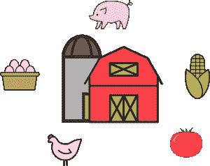
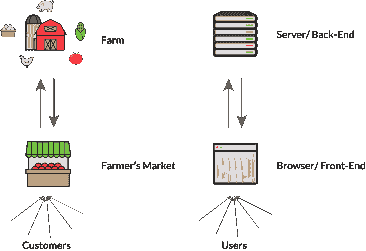
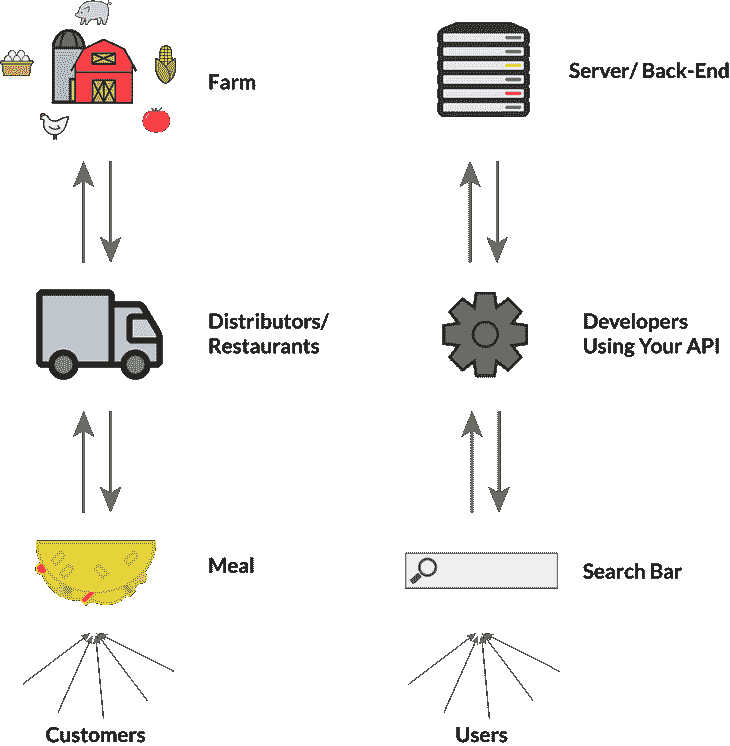
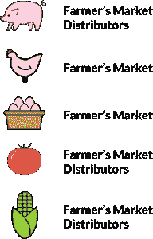
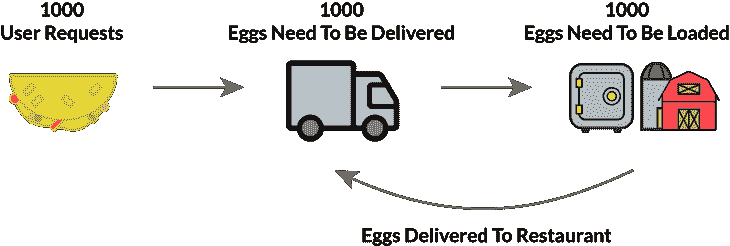
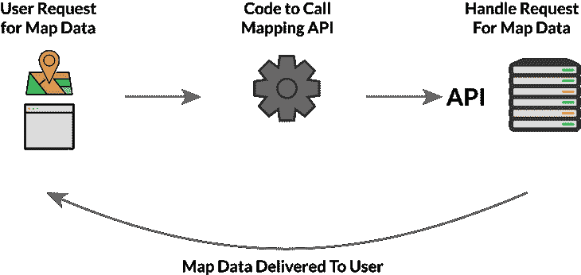
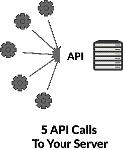
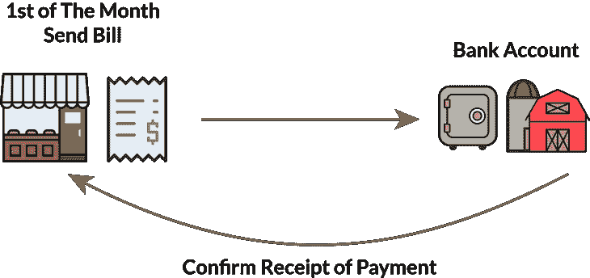
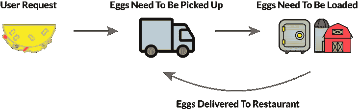

# 通过从你的农场销售商品来解释 Web APIs

> 原文：<https://www.freecodecamp.org/news/web-apis-explained-by-selling-goods-from-your-farm-84aaf99cfc78/>

凯文·科诺年科

# 通过从你的农场销售商品来解释 Web APIs

如果你去过农贸市场或农场，那么你就能理解应用编程接口(API)的概念。

如果您是 web 开发的新手，您可能会经常听到“API”这个术语。

“我等不及那家公司发布他们的公共 API 了！”

“那家公司的 API 混乱不堪。”

“他们的 API 中有数据的端点吗？”

如果您不熟悉 SOAP、HTTP 和 XML 等概念，理解应用程序编程接口(API)的概念可能会非常困难。

所以，我想找到一种方法来解释 web APIs 作为一个整体的工作方式，这样当你进入本质的技术细节时，你就会明白它们是如何结合在一起的。

在本教程中，您是一个农场的主人，该农场销售五种产品:鸡肉、猪肉、鸡蛋、西红柿和玉米。

为了理解本教程，你只需要理解服务器端代码(后端)和客户端代码(前端)的区别。如果你还不熟悉服务器和客户端，你可以阅读我的[指南的开头来获取/发布](https://blog.codeanalogies.com/2018/01/15/ajax-basics-explained-by-working-at-a-fast-food-restaurant/)。

### GUI 和 API 之间的区别

让我们从熟悉的网络使用方式开始。像 Chrome 一样，web 浏览器是图形用户界面(GUI)的一个例子。作为用户，你可以与一个用户友好的工具互动，以完成任务，如预订航班或搜索谷歌。

GUI 允许网站访问者以受控和结构化的方式与服务器上的代码进行交互。

作为一个农场主人，这有点像你在自己的土地上设立的农场摊位或你在农贸市场的摊位。

你不能只是把你的货物堆在谷仓里，让游客进来，然后指望赚钱。相反，你需要设立一个摊位，这样参观者可以很快了解你的可用商品和价格。

这是客户与你的努力工作“互动”的方式。他们不需要了解种植过程，或者你使用的设备，或者加工过程。他们只看到最终产品。

请注意每位顾客是如何体验一对一互动的。当他们到达你的摊位时，他们只是在看你农场的产品。

### 那么什么是 API 呢？

除了直接向消费者销售产品，还有其他方式。你也可以卖给经销商和当地的餐馆，这样你的产品就可以包含在不同的菜肴中，或者在杂货店出售。

这是消费者“体验”你的产品的一种新方式。当然，当他们在当地餐馆点早餐时，他们可能不知道煎蛋卷里是谁的鸡蛋，但他们仍然在“使用”你的产品。

但是，从你作为农场主的角度来看，你有一个完全不同的销售流程和供应链。现在，你不需要为消费者精心安排一个展位。相反，你可能需要在你的谷仓里增加一个货运间，这样经销商和餐馆就可以把他们的卡车开过来装货。为了更大的销售，你也需要包装你的货物。

这类似于 API 的概念。当您构建一个 API 时，您可以让其他开发人员访问您的数据并在他们的应用程序中使用它。

就像餐馆顾客可以通过吃煎蛋卷“体验”你的鸡蛋一样，网站用户可以通过网站上的小工具或其他公司服务器上的代码在其他人的网站上“体验”你的产品。

现在，我们有了一个新的互动层次。你的经销商和餐馆顾客可能会通过参观农场与你进行一对一的互动，但他们随后在销售产品时会让成千上万的顾客接触到你的产品。

作为农场所有者，您仍然必须设置流程，以便能够成功地为这些分销商服务。类似地，API 是一种结构化的方式，其他人可以利用您的服务器端代码。作为开发人员，您仍然拥有完全的控制权。

在上图中，我使用了一个搜索小部件作为例子，但是实际上，几乎任何东西都可以用来访问 API。这只是网站用户体验第三方 API 的常见方式的一个例子。其他常见的包括:

*   映射工具
*   支付处理
*   气象资料

### 通过 API 可以访问什么？

比方说，你想开始把你农场的鸡蛋卖给经销商和餐馆。您需要在您的农场中设置一系列流程来支持这一点:

1.  鸡蛋的大量储存
2.  每月向客户收费的会计处理
3.  将鸡蛋装上卡车的装运区。

在你建立所有这些流程之前，你首先需要决定你是否准备好接受大量鸡蛋订单。你有足够的母鸡来每周生产正确数量的鸡蛋吗？如果你不这样做，你可能会给你的系统带来太大的压力，当你用完鸡蛋的时候会让你的顾客失望。

API 开发人员建立了**端点**，允许其他开发人员从他们的数据库中访问特定的数据。上面的例子是一个“eggs”端点。如果你没有在第一时间创建一个，那么客户就不能从你这里购买鸡蛋。

您可以为农场的每种产品设置特定的端点，包括鸡肉、猪肉、鸡蛋、西红柿和玉米。有些可能只能通过农贸市场(GUI)获得，因为您不确定是否准备好扩大生产以满足经销商的需求。

这是 API 和开源数据库之间的一个区别。在开源数据库中，一切都可以被查询和访问。当您为后端设置 API 时，您创建的端点只显示特定的数据。

就像分销商现在可以与你的农场交互一样，其他公司的开发人员也可以与你的 API 交互。一旦他们编写了从您的服务器访问数据的代码，他们的网站访问者就可以根据您的数据获得新的体验。

### 跟踪单个 API 调用

假设您决定在您的农场为鸡蛋设置一个**端点**。当地一家餐馆想购买 1000 个鸡蛋，以满足其每周收到的 1000 份煎蛋卷订单。

注意我们的 **API 调用**实际上是如何从用户请求开始的？根据描述，这可能有点违背直觉。

当一些触发发生时，一个单独的 **API 调用**发生，由另一个开发人员编写的代码在一个特定的**端点**向你的 API 发送一个**请求**。您的 API 必须根据您的服务器端代码提供响应。

在这种情况下，触发器是 1000 个鸡蛋的订单。餐厅经理已经与一个农场——你的农场——建立了关系。而且，您的农场已经建立了一次运送 1000 个鸡蛋的流程。

因此，1000 个鸡蛋的订单来了，您的农场提供了响应:1000 个鸡蛋。

请记住，可能有 100 家其他餐馆与您的农场建立了关系，其中 10 家可能会同时发送**请求**！这就是可伸缩性发挥作用的地方。您需要决定您的服务器是否准备好处理这种需求。但这是另一个教程的主题！

如果你有一个可以在谷歌地图等其他网站上使用的地图应用程序，这是上述序列的技术版本。

1.  另一个站点上的某个用户使用了您的地图应用程序，并采取了需要来自您的服务器的数据的操作。
2.  另一个站点上的开发人员已经编写了代码，该代码将根据用户的动作创建一个对您的 API 的**请求**
3.  **API 调用**进来，你的服务器发送一个**响应。**

当然，可能还有 1000 个其他 web 应用程序正在使用您的映射小部件，所以您需要为所有这些 API 调用做好准备！

### GET 和 POST 的示例

如果你需要阅读，这里有一个关于 GET 和 POST 的快速复习。

到目前为止，在我们的农场示例中，我们的小场景中的请求类似于 GET 请求。由于餐馆顾客的请求，餐馆必须派一辆卡车到你的农场去取鸡蛋。

但是发布请求呢？在现实世界中，脸书 API 允许其他应用程序的用户创建帖子，然后该应用程序可以直接将这些帖子发送到脸书，立即上线。

在某些情况下，如社交媒体 API，允许最终用户从第三方应用程序直接发布到社交平台可能是有意义的。

但这里有另一个例子。Amazon API 允许在线商店所有者以编程方式将他们的产品发布到 Amazon 的 Marketplace。在这种情况下，独立在线商店所有者团队中的开发人员也可以在 Amazon 上创建一个存在。因此，API 不涉及任何类型的最终用户或网站访问者。

在我们的农场示例中，这有点像您处理每月账单的方式。在餐馆和经销商整个月都来你的农场购买产品后，你在月底给他们寄一份账单，详细说明他们必须支付的款项。

就像餐馆必须建立自己的流程以确保他们在正确的时间收集鸡蛋一样，他们也必须有一个按时付款的流程。这可能涉及到他们的会计师。假设会计知道他们必须在每月的第一天付给你钱。

现在，用户/客户如何触发 POST 请求？想象一下，每当有人点了来自你农场的食物，餐馆会立即给你付款。如果一个人点了一份 5 美元的煎蛋卷，其中 2 美元来自你农场的鸡蛋，餐馆会立即把这 2 美元打到你的银行账户上。如果这是一个 web 应用程序，这种级别的通信可能行得通，但因为这是一个农业示例，所以有点不切实际。

### 服务器场和 Web 应用程序的区别

正如您在最后一个例子中看到的，我们的小农场供应链和 API 调用之间有一个主要的区别。时机。

仅仅是因为现实世界的逻辑…我们不能指望与大多数 API 调用的即时性相匹配，即使步骤大体上是相同的。

让我们看看本教程前面的 GET 请求示例。

这在 web 开发术语中意味着什么。

1.  用户采取了触发请求的操作
2.  服务器端的代码对端点进行 API 调用
3.  API 提供特定的信息

但是如果我们把它比作现实世界的农场:

1.  用户点了一份煎蛋卷
2.  餐馆派一辆卡车去你的农场取鸡蛋。
3.  鸡蛋被送到餐馆，放在煎蛋卷里

把一辆卡车送到一个农场去做人类所知的最新鲜的煎蛋卷是不切实际的。但是，步骤还是一样的。所以我只想提一下这种时间上的差异。

但是，当用户使用 web 应用程序触发请求时，他们通常会得到几乎即时的响应。

### “开放你的 API”是什么意思？

那么让我们回到最初的问题:当一个公司“开放他们的 API”意味着什么？

这意味着他们的服务器上有有价值的数据，他们现在可以通过特定的**端点**披露这些数据。该公司可以决定其他公司的开发者如何访问他们的数据，但与此同时，他们正在以结构化的方式广泛提供这些数据。

在我们的农场类比中，这是当你的农场决定将你的产品卖给经销商和餐馆，并建立内部系统来处理大量订单时的点。

### 喜欢这个教程吗？

如果你喜欢这篇教程，你可能会喜欢我的其他 web 开发主题的可视化指南。在 [CodeAnalogies 博客](https://codeanalogies.com/)上进一步阅读，或者注册 hear 获取最新教程: