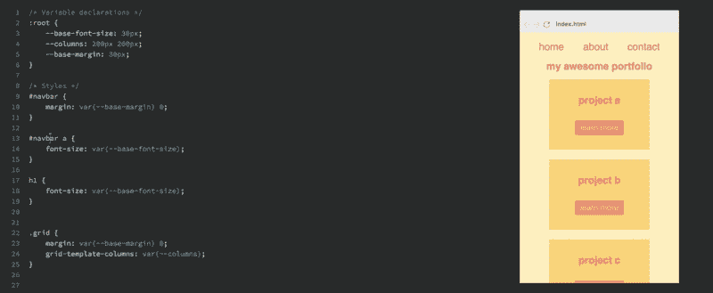
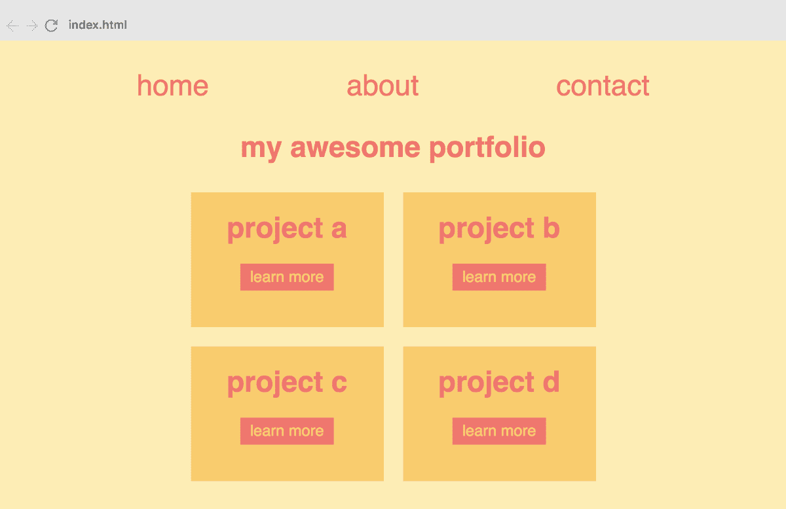
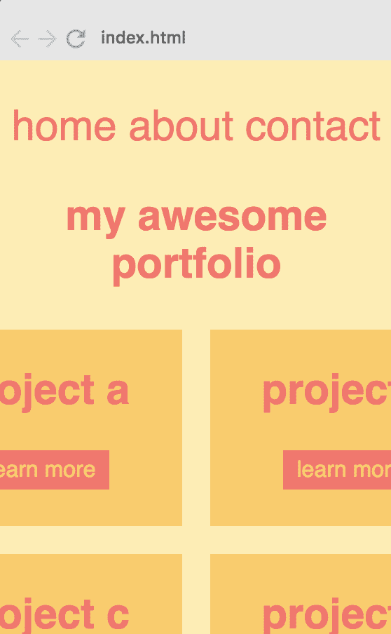
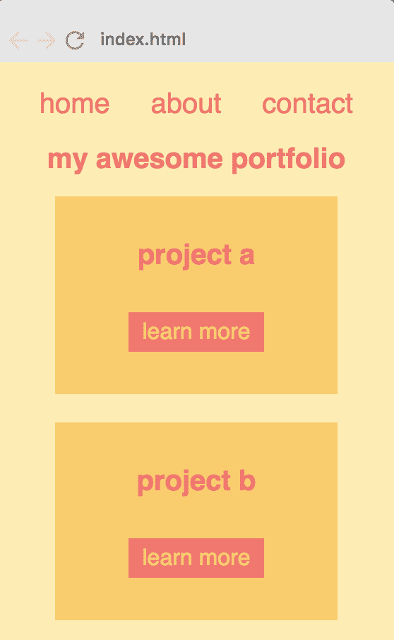

# CSS 变量教程:如何让你的 HTML 响应 CSS 变量

> 原文：<https://www.freecodecamp.org/news/how-to-make-responsiveness-super-simple-with-css-variables-8c90ebf80d7f/>



[Learn how to create the following responsiveness with CSS Variables.](https://scrimba.com/g/gcssvariables?utm_source=freecodecamp.org&utm_medium=referral&utm_campaign=gcssvariables_tutorial_article)

#### 2019 年如何打造响应式网站的快速教程。

如果你以前没有听说过 CSS 变量，这是 CSS 的一个新特性，它给了你样式表中变量的能力，而不需要做任何设置。

本质上，CSS 变量允许您跳过设置样式的老方法:

```
h1 {  
  font-size: 30px;  
}

navbar > a {  
  font-size: 30px;  
}

…in favour of this:

:root {  
  --base-font-size: 30px;  
}

h1 {  
  font-size: var(--base-font-size);  
}

navbar > a {  
  font-size: var(--base-font-size);  
} 
```

虽然语法可能看起来有点奇怪，但这给了你一个明显的好处，你可以通过改变`--base-font-size`变量来改变整个应用程序的字体大小。

如果你想正确地学习 CSS 变量，请查看 Scrimba 上的[我的免费互动 CSS 变量课程](https://scrimba.com/g/gcssvariables?utm_source=freecodecamp.org&utm_medium=referral&utm_campaign=gcssvariables_tutorial_article):


**课程包含八个互动截屏。**

或者，如果您想了解本课程的更多信息，您也可以阅读下面的文章，了解您将学到的内容:

[想学习 CSS 变量？这是我的免费 8 部分课程！](https://medium.freecodecamp.org/want-to-learn-css-variables-heres-my-free-8-part-course-f2ff452e5140)

现在，让我们来看看这项新技术如何让您在构建响应式网站时更加轻松。

#### 设置

我们将增加投资组合网站的响应能力，如下所示:



在桌面上看起来很漂亮。然而，正如你在下面的左图中看到的，这种布局在移动设备上并不好用。



**最初在手机上是什么样子。**



**我们希望它是什么样子。**

在右图中，我们对样式做了一些改动，以使其在手机上更好地工作。以下是我们所做的工作:

1.  **重新排列**网格，使其垂直堆叠，而不是横跨两列。
2.  **将整个布局向上移动**
3.  按比例缩小字体

为此，我们需要更改以下 CSS:

```
h1 {  
  font-size: 30px;  
}

#navbar {  
  margin: 30px 0;  
}

#navbar a {  
  font-size: 30px;  
}

.grid {  
  margin: 30px 0;  
  grid-template-columns: 200px 200px;  
} 
```

更具体地说，我们需要在媒体查询中进行以下调整:

*   将`h1`的字体大小缩小到 20px
*   将`#navbar`上下的边距减小到 15px
*   将`#navbar`内的字体大小缩小到 20px
*   将`.grid`上方的边距减少到 15px
*   将`.grid`从两列改为一列

注意:当然，在这个应用程序中有更多的 CSS，甚至在这些选择器中。然而，出于本教程的考虑，我已经去掉了在媒体查询中没有改变的所有内容。检查[这个 Scrimba 游乐场](https://scrimba.com/c/cwJmLhn?utm_source=freecodecamp.org&utm_medium=referral&utm_campaign=cssvariables_tutorial_article)以获得完整的代码。

#### 老办法

没有 CSS 变量，所有这些都是可能的。但是这需要不必要的代码量，因为上面的大多数要点在媒体查询中需要它们自己的选择器，如下所示:

```
@media all and (max-width: 450px) {  

  navbar {  
    margin: 15px 0;  
  }  

  navbar a {  
    font-size: 20px;  
  }  

  h1 {  
    font-size: 20px;  
  }

  .grid {  
    margin: 15px 0;  
    grid-template-columns: 200px;  
  }

} 
```

#### 新的方式

现在让我们看看如何用 CSS 变量解决这个问题。首先，我们宁愿存储我们在变量内部重用或更改的值:

```
:root {  
  --base-font-size: 30px;  
  --columns: 200px 200px;  
  --base-margin: 30px;  
}

And then we’ll simply use these variables across the app:

#navbar {  
  margin: var(--base-margin) 0;  
}

#navbar a {  
  font-size: var(--base-font-size);  
}

h1 {  
  font-size: var(--base-font-size);  
}

.grid {  
  margin: var(--base-margin) 0;  
  grid-template-columns: var(--columns);  
} 
```

有了这个设置后，我们可以简单地更改媒体查询中的变量值:

```
@media all and (max-width: 450px) {  
  :root {  
    --columns: 200px;  
    --base-margin: 15px;  
    --base-font-size: 20px;  
} 
```

这比我们以前吃的干净多了。我们只针对`:root`，而不是指定所有的选择器。

我们已经将媒体查询从四个选择器减少到一个，从十三行 T2 减少到四个。

这只是一个简单的例子。想象一个成熟的网站，例如，`--base-margin`控制了应用程序周围的大部分自由空间。与用复杂的选择器填充媒体查询相比，翻转它的值要容易得多。

综上所述，CSS 变量绝对是响应性的未来。如果你想一劳永逸地学习这项技术，我建议你查看我在 Scrimba 上的免费课程。

你很快就会成为 CSS 变量大师:)

感谢阅读！我是 Per Borgen， [Scrimba 的前端开发人员和联合创始人。](http://scrimba.com?utm_source=freecodecamp.org&utm_medium=referral&utm_campaign=gcssvariables_tutorial_article)如果您有任何问题或意见，请随时通过 Twitter 联系[我。](https://twitter.com/perborgen)

* * *

感谢阅读！我的名字叫 Per Borgen，我是最简单的学习编码方法——Scrimba 的联合创始人。如果你想学习建立专业水平的现代网站，你应该看看我们的[响应式网页设计训练营](https://scrimba.com/g/gresponsive?utm_source=freecodecamp.org&utm_medium=referral&utm_campaign=gcssvariables_tutorial_article)。


[Click here to get to the advanced bootcamp.](https://scrimba.com/g/gresponsive?utm_source=freecodecamp.org&utm_medium=referral&utm_campaign=gcssvariables_tutorial_article)