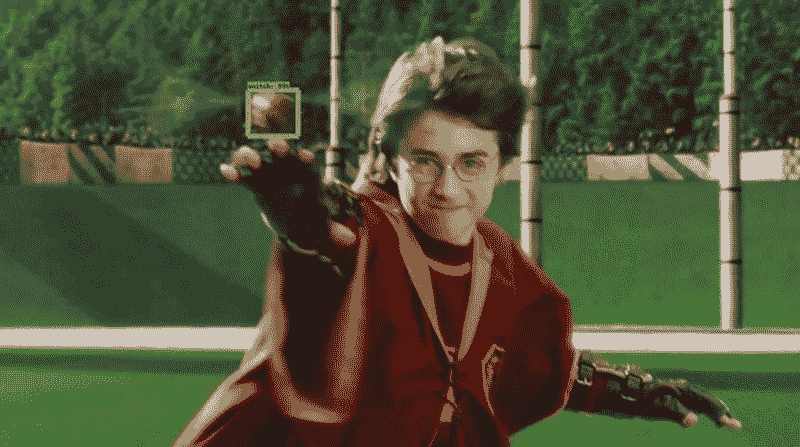
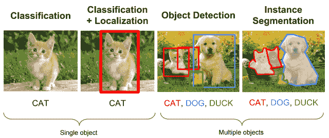
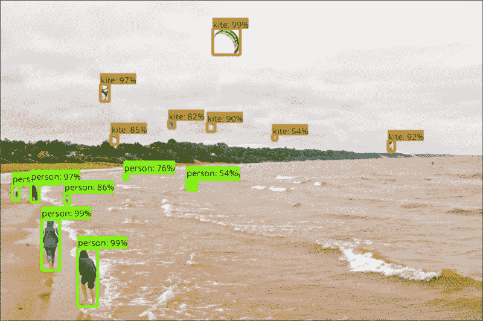
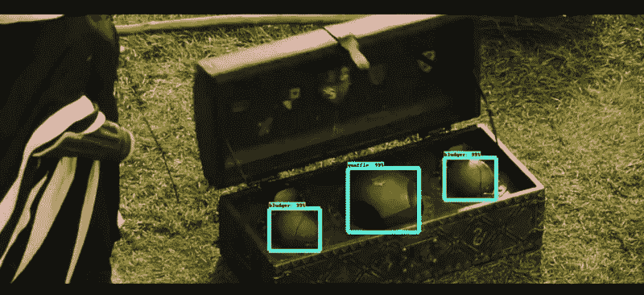
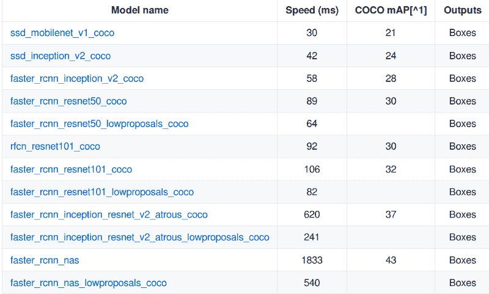

# 如何使用 TensorFlow 对象检测 API 玩魁地奇

> 原文：<https://www.freecodecamp.org/news/how-to-play-quidditch-using-the-tensorflow-object-detection-api-b0742b99065d/>

作者 Bharath Raj

# 如何使用 TensorFlow 对象检测 API 玩魁地奇



Is TensorFlow a better seeker than Harry?

深度学习从未停止让我惊讶。它对几个领域产生了深远的影响，大大超越了基准。

今天，使用卷积神经网络(CNN)进行图像分类相当容易，特别是随着功能强大的前端包装器的出现，如带有 TensorFlow 后端的 Keras。但是，如果你想识别一个图像中的多个对象呢？

这个问题被称为“目标定位和检测”这比简单的分类要困难得多。事实上，直到 2015 年，使用 CNN 的图像定位都非常缓慢和低效。如果你感兴趣，请查看 Dhruv 的这篇[博客文章](https://blog.athelas.com/a-brief-history-of-cnns-in-image-segmentation-from-r-cnn-to-mask-r-cnn-34ea83205de4),阅读深度学习中对象检测的历史。



Source: CS231n Lecture 8 (2016)

听起来很酷。但是很难编码吗？

不要担心， [TensorFlow 的对象检测 API](https://github.com/tensorflow/models/tree/master/research/object_detection) 前来救援！他们已经为你做了大部分的重活。您需要做的只是准备数据集并设置一些配置。你可以训练你的模型，然后用它进行推理。

TensorFlow 还提供预训练模型，在 MS COCO、Kitti 或 Open Images 数据集上进行训练。如果你只是想把它用于标准的物体检测，你可以这样使用它们。缺点是，它们是预先定义的。它只能预测由数据集定义的类。



TensorFlow’s Object Detection API at work

但是，如果您想检测可能的类列表中的**而不是**的东西，该怎么办呢？这就是这篇博文的目的。我将指导你创建你自己的目标探测程序，使用一个有趣的哈利波特世界中的魁地奇的例子！(对于所有《星球大战》粉丝，这里有一个[类似的博客帖子](https://medium.freecodecamp.org/tracking-the-millenium-falcon-with-tensorflow-c8c86419225e) t，你可能会喜欢)。

### 入门指南

首先克隆我的 GitHub 库，在这里找到了。这将是您的基本目录。这篇博文中引用的所有文件都可以在资源库中找到。

或者，您可以克隆 TensorFlow [模型 repo](https://github.com/tensorflow/models) 。如果您选择后者，您只需要名为“slim”和“object_detection”的文件夹，因此可以随意删除其余的文件夹。不要重命名这些文件夹中的任何东西(除非你确定它不会弄乱代码)。

### 属国

假设您安装了 TensorFlow，您可能需要安装更多的依赖项，这可以通过在基本目录中执行以下命令来实现:

```
pip install -r requirements.txt
```

API 使用 Protobufs 来配置和训练模型参数。在使用它们之前，我们需要编译 Protobuf 库。首先，您必须使用下面的命令安装 Protobuf 编译器:

```
sudo apt-get install protobuf-compiler
```

现在，您可以使用以下命令编译 Protobuf 库:

```
protoc object_detection/protos/*.proto --python_out=.
```

您需要将基本目录的路径和瘦目录附加到 Python path 变量中。请注意，您必须在每次打开新终端时完成这一步。您可以通过执行下面的命令来实现。或者，您可以将它添加到您的~/中。bashrc 文件来自动化这个过程。

```
export PYTHONPATH=$PYTHONPATH:`pwd`:`pwd`/slim
```

### 准备输入

我的动机很简单。我想用 TensorFlow 造一个魁地奇找球手。具体来说，我想写一个程序来定位每一帧的金色飞贼。

但后来，我决定加大赌注。试着识别魁地奇中使用的所有移动设备怎么样？



Quidditch has three (unique) moving objects. Two Bludgers, One Quaffle and One Snitch.

我们首先准备 **label_map.pbtxt** 文件。这将包含所有目标标签名称以及每个标签的 ID 号。请注意，标签 ID 应该从 1 开始。这是我在项目中使用的文件的内容。

```
item { id: 1 name: ‘snitch’}
```

```
item { id: 2 name: ‘quaffle’}
```

```
item { id: 3 name: ‘bludger’}
```

现在，是收集数据集的时候了。

好玩！或者无聊，这取决于你的品味，但它仍然是一个平凡的任务。

我通过对哈利波特视频剪辑中的所有帧进行采样来收集数据集，使用的是我使用 OpenCV 框架编写的一小段代码。完成后，我使用另一段代码从数据集中随机抽取了 300 张图片。代码片段可以在我的 GitHub [repo](https://github.com/thatbrguy/Object-Detection-Quidditch) 的 **utils.py** 中找到，如果你也想这么做的话。

你没听错。只有 300 张图片。是的，我的数据集并不大。那主要是因为我承担不起注释大量图像的费用。如果你愿意，你可以选择像亚马逊土耳其机械公司这样的付费服务来为你的图片添加注释。

### 释文

每个图像定位任务都需要地面实况注释。这里使用的注释是带有 4 个坐标的 XML 文件，这些坐标表示对象周围边界框的位置及其标签。我们使用 Pascal VOC 格式。一个示例注释如下所示:

```
<annotation>  <filename>182.jpg</filename>  <size>    <width>1280</width>    <height>586</height>    <depth>3</depth>  </size>  <segmented>0</segmented>  <object>    <name>bludger</name>    <bndbox>      <xmin>581</xmin>      <ymin>106</ymin>      <xmax>618</xmax>      <ymax>142</ymax>    </bndbox>  </object>  <object>    <name>quaffle</name>    <bndbox>      <xmin>127</xmin>      <ymin>406</ymin>      <xmax>239</xmax>      <ymax>526</ymax>    </bndbox>  </object></annotation>
```

您可能会想，“我真的需要经历在 XML 文件中手工输入注释的痛苦吗？”绝对不行！有一些工具可以让你使用图形用户界面在对象上画方框并给它们加注释。好玩！ **LabelImg** 对于 Linux/Windows 用户来说是一款优秀的工具。或者， **RectLabel** 对于 Mac 用户来说是个不错的选择。

在开始收集数据集之前，请注意几个脚注:

*   注释完图像文件后，不要重命名它们。这段代码试图使用 XML 文件中指定的文件名(LabelImg 会自动用图像文件名填充)来查找图像。另外，确保你的**图像**和 **XML** 文件具有与**相同的名称**。
*   在开始注释之前，确保**将**图像调整到期望的大小**。如果您稍后这样做，注释将没有意义，并且您将不得不调整 XML 中的注释值。**
*   LabelImg 可能会向 XML 文件输出一些额外的元素(比如<pose>、<truncated>、<path>)。您不需要删除它们，因为它们不会干扰代码。</path></truncated></pose>

万一你搞砸了什么， **utils.py** 文件有一些实用函数可以帮助你。如果你只是想试试魁地奇，你可以下载我的注释数据集。两者都可以在我的 GitHub [库](https://github.com/thatbrguy/Object-Detection-Quidditch)中找到。

最后，创建一个名为 **trainval** 的文本文件。它应该包含所有图像/XML 文件的名称。例如，如果您的数据集中有 img1.xml、img2.xml 和 img1.xml、img2.xml，那么 trainval.txt 文件应该如下所示:

```
img1img2
```

将你的数据集分成两个文件夹，即**图像**和**注释**。将 **label_map.pbtxt** 和 **trainval.txt** 放入你的注释文件夹中。在 annotations 文件夹中创建一个名为 **xmls** 的文件夹，并将所有 XML 文件放入其中。您的目录层次结构应该如下所示:

```
-base_directory|-images|-annotations||-xmls||-label_map.pbtxt||-trainval.txt
```

API 接受 **TFRecords** 文件格式的输入。不用担心，借助一个小的实用函数，您可以轻松地将当前数据集转换成所需的格式。使用 my repo 中提供的 **create_tf_record.py** 文件将数据集转换成 TFRecords。您应该在基本目录中执行以下命令:

```
python create_tf_record.py \    --data_dir=`pwd` \    --output_dir=`pwd`
```

程序执行完毕后，你会发现两个文件， **train.record** 和 **val.record** 。标准数据集划分为 70%用于训练，30%用于验证。如果需要，您可以在文件的 main()函数中更改分割分数。

### 训练模型

咻，这是一个相当长的准备过程。末日快到了。我们需要选择一个本地化模型进行培训。问题是，有太多的选择。每一种在速度或准确性方面性能不同。你必须为合适的工作选择合适的型号。如果你想了解更多关于权衡的信息，这篇[文章](https://arxiv.org/abs/1611.10012)是一本好书。

简而言之，固态硬盘速度很快，但可能无法以相当高的精度检测到较小的物体，而速度更快的 RCNNs 相对较慢，体积更大，但精度更高。

TensorFlow 物体检测 API 已经为我们提供了一堆[预先训练好的模型](https://github.com/tensorflow/models/blob/master/research/object_detection/g3doc/detection_model_zoo.md)。强烈建议使用预先训练的模型来初始化训练。它可以大大减少训练时间。



A bunch of models pre-trained on the MS COCO Dataset

下载其中一个模型，并将内容提取到您的基本目录中。由于我更注重准确性，但也希望有一个合理的执行时间，我选择了 ResNet-50 版本的 Faster RCNN 模型。提取后，您将收到模型检查点、冻结的推理图和 pipeline.config 文件。

还有最后一件事！您必须在 **pipeline.config** 文件中定义“培训作业”。将文件放在基本目录中。真正重要的是文件的最后几行——您只需要将突出显示的值设置到各自的文件位置。

```
gradient_clipping_by_norm: 10.0  fine_tune_checkpoint: "model.ckpt"  from_detection_checkpoint: true  num_steps: 200000}train_input_reader {  label_map_path: "annotations/label_map.pbtxt"  tf_record_input_reader {    input_path: "train.record"  }}eval_config {  num_examples: 8000  max_evals: 10  use_moving_averages: false}eval_input_reader {  label_map_path: "annotations/label_map.pbtxt"  shuffle: false  num_epochs: 1  num_readers: 1  tf_record_input_reader {    input_path: "val.record"  }}
```

如果你有为你的模型设置最佳超参数的经验，你可以这样做。创作者在这里给出了一些相当简短的指导方针。

您现在可以开始训练您的模型了！执行以下命令启动培训作业。

```
python object_detection/train.py \--logtostderr \--pipeline_config_path=pipeline.config \--train_dir=train
```

我的笔记本电脑 GPU 无法处理模型大小(Nvidia 950M，2GB)，所以我不得不在 CPU 上运行它。在我的设备上，每步大约需要 7-13 秒。经过大约 10，000 个令人痛苦的步骤后，这个模型达到了相当好的精确度。在它达到 20，000 步后，我停止了训练，仅仅是因为它已经花了两天时间。

通过将“fine_tune_checkpoint”属性从 model.ckpt 修改为 model.ckpt-xxxx，可以从检查点恢复训练，其中 xxxx 表示已保存检查点的全局步骤数。

### 导出用于推理的模型

如果不能用于物体检测，训练模型又有什么意义呢？API 又来救援了！但是有一个问题。他们的推理模块需要一个冻结的图形模型作为输入。不过不要担心:使用下面的命令，您可以将训练好的模型导出到一个冻结的图模型。

```
python object_detection/export_inference_graph.py \--input_type=image_tensor \--pipeline_config_path=pipeline.config \--trained_checkpoint_prefix=train/model.ckpt-xxxxx \--output_directory=output
```

整洁！您将获得一个名为**frozen _ inference _ graph . Pb**的文件，以及一些检查点文件。

你可以在我的 [GitHub repo](https://github.com/thatbrguy/Object-Detection-Quidditch) 中找到一个名为 **inference.py** 的文件。您可以使用它来测试或运行您的对象检测模块。代码非常简单明了，类似于创建者展示的对象检测演示。您可以通过键入以下命令来执行它:

```
python object_detection/inference.py \--input_dir={PATH} \--output_dir={PATH} \--label_map={PATH} \--frozen_graph={PATH} \--num_output_classes={NUM}
```

用相应文件/目录的文件名或路径替换突出显示的字符 **{PATH}** 。将 **{NUM}** 替换为您为模型定义的要检测的对象数量(在我的例子中，是 3)。

### 结果

看看这些视频，亲自看看它的性能！第一个视频展示了该模型区分所有三个物体的能力，而第二个视频则展示了其作为探索者的非凡能力。

我得说相当令人印象深刻！区分魁地奇物体的头部确实有问题。但是考虑到我们的数据集的大小，性能是相当不错的。

训练它太长时间会导致大量的过度拟合(它不再是大小不变的)，尽管它减少了一些错误。您可以通过拥有更大的数据集来克服这个问题。

感谢您阅读本文！如果你有，就按那个按钮！希望它能帮助你创建你自己的物体检测程序。如果您有任何问题，可以通过 LinkedIn 联系我，或者发邮件给我(bharathrajn98@gmail.com)。