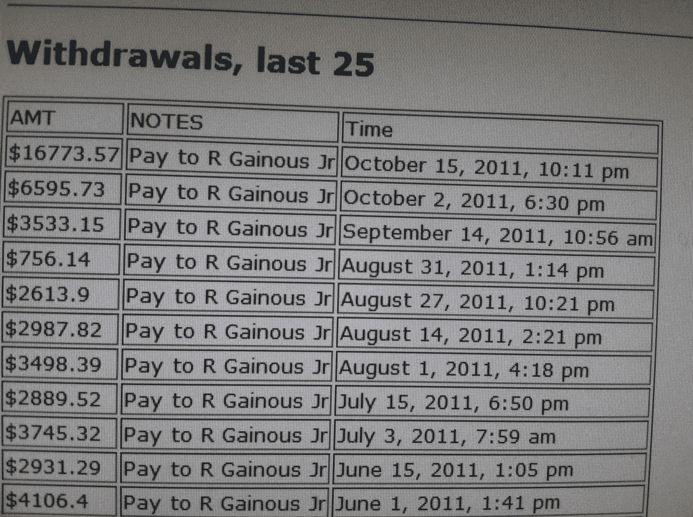
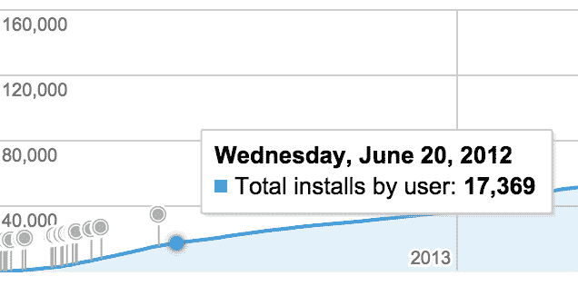

# 我 16 岁时是如何赚到 20 万美元的

> 原文：<https://www.freecodecamp.org/news/how-i-made-200-000-when-i-was-16-years-old-304f0e87cfb6/>

作者:RJ

大约三年前，我发表了一个[故事](https://medium.com/tech-product-and-life/my-high-school-app-got-250k-downloads-heres-the-story-d37361c2f27?source=your_stories_page---------------------------)，讲述了我在高中时创建的 Twitter 应用 [Follow](https://medium.com/tech-product-and-life/my-high-school-app-got-250k-downloads-heres-the-story-d37361c2f27?source=your_stories_page---------------------------) 如何在两年内达到 15 万次下载。在那篇文章中，我提到了关于我如何进入软件行业的更大的故事。嗯，在这里。

九年前的今天(哇！)我得到了我的第一个远程 gig 写作软件。我没有正式的头衔或任何东西，但我在用 Java 写脚本。给你一些视角， ****10 年前我 9 年级，13 岁**** ，凭着短短三个月的自学编码经验。在接下来的几年里，我的总收入将达到 20 万美元左右。我是这样做的。

## 从游戏到编码

这一切都是从我发现自己迷失在游戏世界开始的。大多数时候，我会把大部分时间花在玩《使命召唤》、《战争机器》、《江湖》和其他我能找到的游戏上。我所有的朋友每天都会聚在一起玩这些游戏，我们慢慢地从一天中的大部分时间呆在户外转移到在线玩。

其中最令人上瘾的游戏是**。没过多久，我就迷上了这个流行的网络角色扮演游戏。**

**对于那些不知道它是用 Java 构建的人来说。在无数次等待游戏加载之后，我对 Java 的兴趣被激起了，这让我陷入了软件开发的兔子洞。**

**每次谷歌搜索，我都开始意识到，如果我知道如何编写代码，我就可以构建自己的软件。光是这个想法就让我大吃一惊。这只是开始，在接下来的一个月里，我对编程的兴趣继续增长。**

**在我意识到 Java 的强大后不久，我在网上找到了一本叫[**21 天自学 Java**](https://www.amazon.com/Sams-Teach-Yourself-Covering-Android/dp/0672335743)的书。我下载了 Eclipse 并开始使用。这本书吸引了我，虽然我仍然是一个狂热的游戏玩家，但我发现自己每天都越来越喜欢我的新爱好。**

**放学后，我会回家，做家务，玩游戏，像时钟一样编码。没过多久，我就把新的编程技能派上了用场。我编写了扫描文档的脚本，构建了随机 GUI，甚至编写了完成数学作业的软件。**

**在我生命的那个时刻，就像拥有了一种无人知晓的超能力。兴奋之余，我跟朋友说我在学 Java，劝他跟我学。他对此不屑一顾，继续玩游戏。在那一刻，我知道我将独自一人做软件，所以我继续我自己的 ****没有人知道——甚至我的家人**** 也不知道。**

## **深入挖掘编程**

**几个月过去了，我开始对自己在江湖中的进展速度感到沮丧。所以，我开始寻找骗子。令我惊讶的是，有许多宏、机器人和脚本，你可以全天候运行，自动为你玩游戏。这让我着迷。我尝试了我能找到的每一个机器人，但发现大多数都是垃圾。我继续这样做，直到我偶然发现了一个提供免费机器人客户端的社区。它甚至可以运行自定义脚本。我加入论坛时并不知道在几个月内，我的整个生活将会改变。**

**这个社区是像我这样的孩子梦寐以求的！在一个月的时间里，我至少尝试了 20 个脚本。有些人砍柴，有些人打怪物，还有一些人替你做任务。这些机器人能够在没有任何监督的情况下自动完成的事情令人惊讶。**

**我注意到这些脚本是用 Java 编写的，但没有考虑过尝试制作一个。在使用那些作弊软件后不久，我的账号就因为 botting 以外的原因**被永久封禁(只是我运气好)。我完全崩溃了。我记得在我的房间里，我几乎要哭了，因为我花了很多时间的账户被封了。我恳求制作《江湖》的公司 [Jagex](http://www.jagex.com/) 解除禁令，但他们不肯，我也不走运。****

## ****把柠檬变成柠檬水****

****整整一个星期，我都很生气、难过，还有些困惑。出于显而易见的原因，我感到愤怒和悲伤——我失去了一些对我有价值的东西。但是，我也很迷茫。我现在该怎么办？我会如何度过我的时间？我该怎么告诉我的朋友？****

****有许多问题，但我没有答案。没过多久，我突然意识到，我决定建立一个新账户。我的想法是，我可以使用我发现的作弊手段来提升我的原始账户统计数据，而且要快。我的任务是回到我跌倒的地方，但是有一个问题。****

****我之前的账号有很高的战斗统计，当时社区里没有多少机器人可以为你战斗。所以我去找了。我偶然发现了一个可以和鸡战斗的机器人，我心想:为什么只有鸡？为什么不是任何怪物？****

****我查看了代码，这时我意识到，只要稍加修改，你就可以制造一个可以与游戏中任何怪物战斗的机器人。凭借我新学到的编程技能和一些额外的创造力，我创建了 GenericFighter，这是第一个一体化的战斗机器人。****

****经过一些修饰和测试后，我确信 GenericFighter 已经准备好了。我设置它来战斗的任何怪物都被完美地拿下了，我不仅很高兴使用它，而且还将其发布到社区。****

****几周之内，它成了论坛上最受欢迎的机器人之一，我的 Runescape 账户数据也上升了。我收到了很多赞扬，但这并没有结束。我开始收到功能请求和错误报告。我迷上了编程，构建人们喜爱的产品的冲动让我坚持下去。****

****这种情况持续了几个月。对机器人的维护迫使我变得更擅长编写代码，这最终使我获得了更深入的 Java 知识。在这个时间点上，我完全没有意识到大局。我不知道论坛的创始人有一个让事情更上一层楼的计划。****

## ****我沉迷于代码。人们注意到了。****

****我开始花更少的时间玩游戏，大部分时间在开发我的机器人上。我很努力，人们也注意到了。一天，社区的创始人找到了我。他们正在为机器人建立一个高端市场，机器人制造商可以在那里出售他们的脚本。我持怀疑态度，但我决定加入这项事业。不久之后，我与 RSBots.net 的所有者合作，推出了一款名为 AutoFighter Pro 的高级机器人。****

 ****[https://www.youtube.com/embed/eF-mG2pRxhk?feature=oembed](https://www.youtube.com/embed/eF-mG2pRxhk?feature=oembed)**** 

****与其他脚本相比，AutoFighter Pro 以 12.99 美元的低价出售。我不会深入探讨作者、商人和创始人之间如何分配资金的细节。但我要说的是，从 2009 年 6 月初到 2011 年 10 月底，AutoFighter Pro 的销量超过了 3 万台。你算算。****

****

Last 25 Withdrawals**** 

****销售额每月都在增长，几乎没有下降的趋势。随着平台的扩大，创始人邀请了更多的作者和商家来销售剧本。这个曾经紧密团结的团体变得更大了，竞争也变得异常激烈。****

****没过多久，作者们就开始复制他人的脚本，并在功能、可用性和价格上展开竞争。你不仅要被迫编码，还要推销你自己和你的产品。我很快认识到在比赛中每个细节都很重要。****

****我当时并不知道，但我在产品经理和工程师的角色之间保持平衡。我听取用户反馈，规划功能，参与论坛，并不断推出新的更新——这是常态。****

****在这场比赛中，停机是不可接受的。用户运行这些机器人不仅是为了个人使用，他们的业务也依赖于它们。出售 GP(江湖的货币)和高 stat 账户是一个普遍现象，你必须努力工作来满足需求。****

## ****天堂的烦恼****

****从大一暑假到大四开学，我的生活由一整天的上学，一个小时的杂务，一个晚上的编码组成。在某种程度上，这影响了我在学校的表现，因为我太专注于制造更好的产品。编码成了我的首要任务，我把所有的时间都倾注在 AutoFighter Pro 上。****

****当它被说和做的时候，它可以同时与多个怪物战斗，自动治疗你，自动回应真实的人类玩家，以及许多独特的功能。但是你可能已经猜到了，这不会永远持续下去。****

 ****[https://www.youtube.com/embed/3xbhfX58D7A?feature=oembed](https://www.youtube.com/embed/3xbhfX58D7A?feature=oembed)**** 

****在出售剧本大约一年后，有一场针对创始人的[诉讼](https://www.scribd.com/document/78898058/Jagex-vs-Impulse-Software-Agreement-for-Judgment)。他们又努力打了一年，但最终在我 17 岁生日前几天输掉了官司。这导致所有出售高级机器人的网站及其论坛被关闭。****

****老实说:当我刚开始的时候，我没打算告诉任何人我在做什么。我很兴奋，因为事情开始了，但我也很紧张，因为我不知道我需要做什么。****

****我先告诉了谁？我告诉了我妈妈。她的反应？好奇，有点困惑，还有点担心。她不明白我到底在做什么，我是怎么入行的，也不明白为什么有人会为此买单。我爸也有同样的反应，但是他们为我高兴，只要我受到法律保护，所以他们支持。直到高中毕业，我都没有告诉过别人。****

****在这一点上，你可能想知道，像我这样的孩子用那些钱做什么？举几个例子: ****我帮助清理家庭债务，带家人去迪士尼世界，投资自己**** 。事后看来，对我和我的家人来说，这个机会来得再好不过了。那是在上一次美国经济衰退期间，像那段时间的数百万其他人一样，我们也有自己的挣扎——但我很自豪地说，这减轻了打击。****

## **游戏和编程改变了我的生活。**

**

Play Store stats for Follow.** 

**从那以后，我一直在编码、设计和管理产品。在我停止开发机器人后不久，我利用额外的空闲时间学习了 Android 开发。**

**2012 年 2 月，我推出了 [Follow](https://play.google.com/store/apps/details?id=com.mvt.twitter) ，这是一款 Twitter 应用，可以追踪哪些人没有关注你，哪些人没有关注你，哪些人关注了你。短短几个月内，这款应用的下载量就达到了 2 万次。我写过[如何达到 15 万次下载](https://medium.com/@rodneyg/150k-downloads-the-high-school-project-that-blew-up-db389a7ce1c9)，今天已经超过 20 万次下载。**

**在大学三个学期后，我退学创办了一家产品公司。我们希望为小型企业和初创企业打造产品，并发布我们自己的内部产品。我们的第一个项目是 Runn，这是一款面向大学的按需交付应用。我们在[韦恩州立大学校园](http://www.modeldmedia.com/startupnews/runndetroit031114.aspx)进行了一次测试，引起了很多反响，并让我们[给马克·库班](https://medium.com/tech-product-and-life/how-i-almost-closed-a-deal-with-mark-cuban-with-only-an-e-mail-d7eda956a7a7)发了封电子邮件，洽谈了一笔投资。**

**两年后，我们停止了在 Runn 上的工作，并专注于其他机会。除了我自己的企业之外，我还在一些伟大的公司做过工程设计: [Nexient](http://nexient.com/) 、[福特](http://ford.com/)、[尼玛实验室](http://nimasensor.com/)、 [Gigster](http://www.gigster.com/) 和 [Bird](https://bird.co/) 。**

**我现在在圣塔莫尼卡，从事[联合设计](http://www.hashtagcodesigned.com/)的工作——一个创意技术工作室和生活方式品牌。我很幸运有机会把我童年最喜欢的爱好作为职业，我无法想象做其他任何事情。**

**感谢阅读！**