# 我从一个在一周内赢得 3000 颗星的旧 GitHub 项目中学到了什么

> 原文：<https://www.freecodecamp.org/news/what-i-learned-from-an-old-github-project-that-won-3-000-stars-in-a-week-628349a5ee14/>

按吐司 UI

# 我从一个在一周内赢得 3000 颗星的旧 GitHub 项目中学到了什么

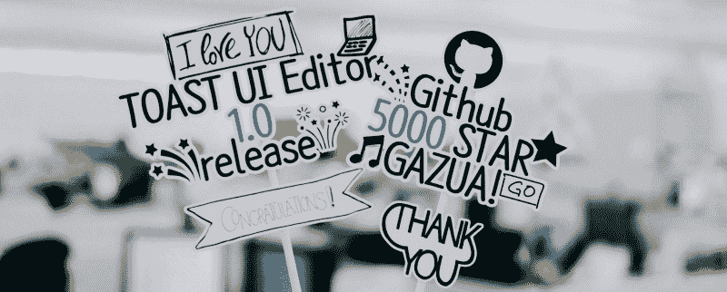

Hooray! 5,000 Stars!

### 一个孤独的开源

三年来，我们一直在开发一个 [Markdown WYSIWYG Editor](https://github.com/nhnent/tui.editor) 项目，2015 年 3 月首次提交。2017 年 12 月 30 日上班发布 1.0 版本，发布到 [npm](https://www.npmjs.com/package/tui-editor) 。

那时候的储存库就像年底办公室里的空气一样安静。一个几个月发布一次的问题，它似乎试图说“这个项目是开源的。”在三年多的时间里，它收到了 160 颗 GitHub 星，很难预料会有拉取请求。

不奇怪。甚至从[谷歌](https://github.com/google)和[脸书](https://github.com/facebook)开始，就有没有贡献者的开源项目。我想你们中的一些人可能经历过失望，因为你宝贵的开放源码除了空无一物之外一无所有。此外，我们习惯于使用 [GitHub](https://github.com/) 作为我们的免费 Git 库。不是吗？

从 1.0 版本开始，我想让更多的人了解这个项目。我相信这个项目比它当时看起来更有价值。我做了一些事情来实现它，结果它在 4 天内获得了 2000 颗星，在一周内获得了 3000 颗星！现在它有超过 5500 颗星和完整的问题和拉请求。这件事只发生了一个月。

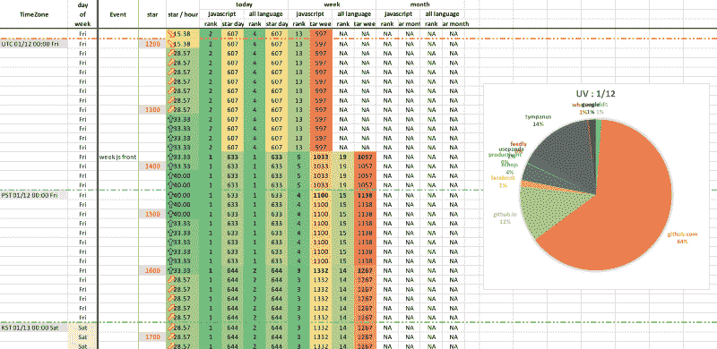

Yes. I tried to record everything that seemed important. ?

我写这篇文章是为了分享我上个月的经历。可能的话我也会给你看我录下的数字。希望能帮到你，让你的开源项目充满贡献者。

### 一个好的自述文件可以获得星星

尽管近三年来我们一直在开发我们的编辑器，但似乎没有人对此感兴趣。这是不可避免的，因为文件很差。

即使是洗衣机，你也会想看一遍说明书。你应该为你的项目提供更多的文档。

自述文件描述了该项目的本质。演示显示它已经可以使用了。例子应该是各种需求的第一步。教程应该帮助任何人开始。

如果你错过了这些文档中的任何一个，用户就会放弃你的项目。推出源代码并不能让你的项目成为开源项目。

在这些文档中，自述文件起着最重要的作用。仅仅列举几个文件是不够的。你，我，还有大部分开发者都很懒。大多数访问者只会在自述文件上向下滚动两次，如果不感兴趣就离开。因此，自述文件应该提供开发人员需要您的项目的原因。

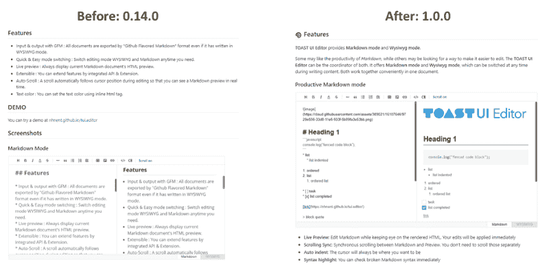

TOAST UI Editor README.md for 0.14.0 and 1.0.0

让我们看看更新自述文件带来了什么不同。GitHub 明星其实对访客来说不过是书签而已。但是 GitHub 星的数量告诉你有多少访问者对你的项目感兴趣。

下面的表格是我在发布 TOAST UI 编辑器 1.0 前后记录的明星和独立访客的数量。

没有添加功能或设计更新。只有对文档的更新——大部分在自述文件中——和一些重构。以下数字完全来自自述文件中的更改。

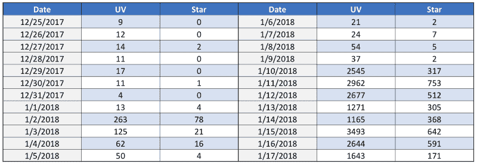

Number of Unique Visitors and Stars. Documents update on 12/30/2017

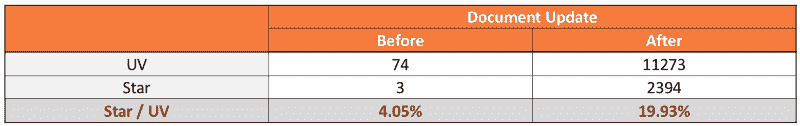

Star/UV is almost 5x after updating README

如果我们从项目一开始就有记录，那就更好了。但我只是记录了这些数字来检查趋势。在这一点上我无能为力。所以，让我们看看这些数字，我会把它留给你的直觉。

在更新自述文件之前，大约 4%的访问者给了一颗星。令人惊讶的是，在更新自述文件后，大约 20%的访问者给了一颗星。通过更新自述文件，这个项目从访问者那里收到了几乎**五倍多的星星**！

大家都说自述文件很重要。但是谁知道会有如此巨大的不同呢？看到这个我也很惊讶。如果你想在一个项目上有贡献者，你应该写一个漂亮的有吸引力的自述文件。

你可以很容易地在谷歌上找到关于如何写一个好的自述文件的文章。研究 [Awesome Readme](https://github.com/matiassingers/awesome-readme) 上列出的其他项目中的 Readme 也是一个好主意。

### 在社区里传播消息

我们的项目每天大约有 10 个访问者。如果你在你的文档上下了很大功夫，是时候让人们了解你的项目了。

当然，最好是由别人而不是你来宣传你的项目。但是你必须自己开始。如果你的项目没有链接到任何地方，它就不会出现在谷歌搜索中。没有人会知道你的项目存在。

#### **一有机会就谈论你的项目**

在 [StackOverflow](https://stackoverflow.com/) 和 [Quora](https://www.quora.com/) 上回答问题。与[脸书群体](https://www.facebook.com/groups/)中的人交谈。提交到[黑客新闻](https://news.ycombinator.com/)和 [Reddit](https://www.reddit.com/) 的链接。并要求[时事通讯](http://javascriptweekly.com/issues/368)发布你的项目。

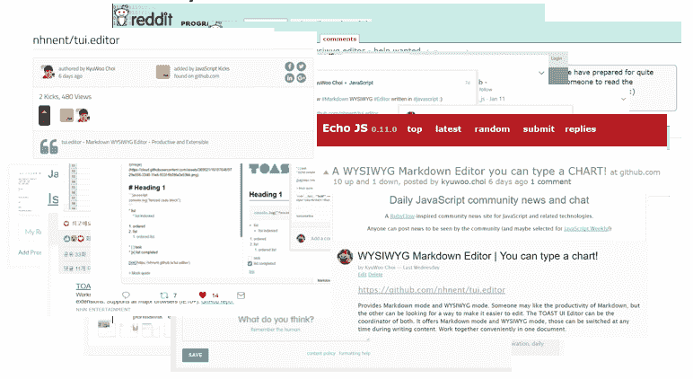

Tell them what your project is.

你也可以请求社区帮助你的项目，并告诉他们你的项目。

但是，不要盲目地给他们发垃圾邮件。社区和媒体有不同的个性。在不了解每个社区的情况下向您的项目发送垃圾邮件可能会导致您的帖子被删除或被忽略。在最坏的情况下，你可能会被禁止进入那些社区，或者你的项目可能会得到一个坏名声。

积极参与每个社区，了解他们。了解社区不仅有利于公关。你从他们那里学到的东西也会对你的项目有所帮助。

一天，一个推销员告诉我:

> "让你的客户参与到你的工作中是获得忠诚客户的最好方法."

我百分之百同意这一点。我认为我们应该为我们的工作做同样的事情。

当我更新自述文件时，我要求他们查看该文档。值得庆幸的是，有两个人在阅读了新的 README 后发送了一个 pull 请求。我敢肯定，他们两个对我们的项目比其他任何来访者都更感兴趣。我打赌他们也在我们的项目上打了一颗星。

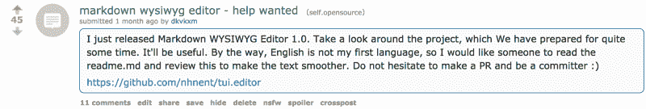

Thank you guys ?

### 了解 GitHub 探索

GitHub 是获得你的贡献者的最好地方。如果你的项目在 GitHub 上，不要看太远，先多了解一下。在 GitHub 的顶部，你总能找到一个菜单，伴随着一只可爱的章鱼。[探索](https://github.com/explore)才是我们应该注意的。该页面向开发者展示了有用且有趣的开源项目。

Explore 让你有机会向 2400 万 GitHub 用户展示你的项目。这就是为什么你应该在 GitHub 上维护你的开源项目。

其他服务也很棒，不要误会。很长一段时间以来，我一直使用 BitBucket 来私下管理个人项目。GitLab 也有一些非常好的功能，这些功能近年来对我来说比 GitHub 更好。然而，开源项目必须在 GitHub 上维护，以获得 Explore 的访问者。

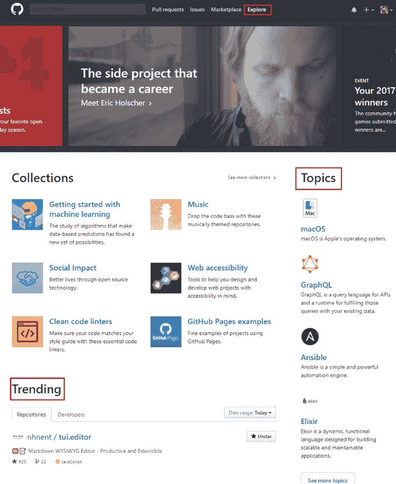

GitHub Explore Trending & Topics

看看有什么样的项目，发现那些项目的好的部分，以及当前的趋势如何。如果你还没有看到探索页面，是时候去看看了。在这里你可以了解到你需要做些什么来使你的项目变得更好。

当你打开这个页面时，你会看到[收藏](https://github.com/collections)、[主题](https://github.com/topics)和[趋势](https://github.com/trending)标签——每一个都列出了不错的开源项目。其中，我们将研究趋势和主题。我们不能帮助收集，因为它是由 GitHub 策划的。

### 来自 GitHub Trending 的访客激励

Explore 主页中的趋势部分显示了该周在所有语言中获得最高星级的项目。爬上去真的很难。

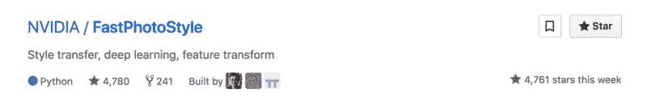

Trending Main 1st with 4,761 stars this week. You’ll need luck to take this place.

但你不必放弃。缩小语言和日期范围，然后查看排名较低的项目。你的项目也会达到一个现实的数字。

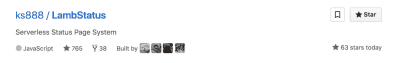

Trending Today JavaScript 25th with 63 stars today. You can do this too.

通过把你所在的每一个社区都包括进来，把注意力集中在某几天内的访客上。如果你能收集到足够多的明星，你的项目也能上流行榜。您获得的星级取决于您的项目语言、星期几等等。

如果你发布了一个新的项目或者给项目增加了新的特性，这是一个绝佳的时机。即使你的项目排名靠后，也不要失望。你的项目仍然会吸引更多的访问者。根据你的排名，把趋势部分看作是对访问者的激励。

Unique Visitors on Jan. 10, Jan. 11

上图是 1 月 10 日我在各个社区传播消息后，GitHub Insight 访客的分类。GitHub Insight 中的参考站点会给出两周的值，因此您需要进行一些计算来获得您想要的数字。

1 月 10 日，也就是第一天，几乎所有的来访者都来自我所在的社区。幸运的是，图表中 GitHub.com 的一小部分显示我们的编辑在趋势列表中。第二天，1 月 11 日，GitHub 已经带来了一半的流量。登上流行榜是一个很好的激励。

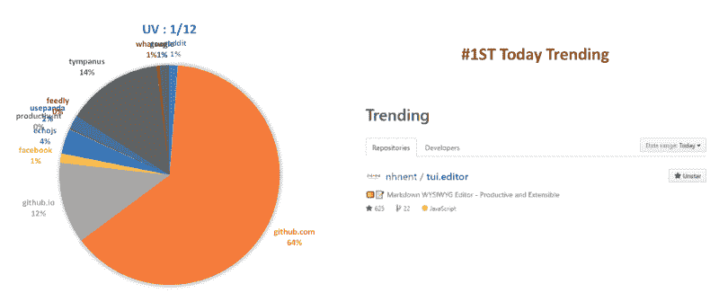

Unique Visitors on Jan. 12.

第二天，1 月 12 日，编辑被记录为所有语言的今日第一大趋势。大多数访问者来自 GitHub。从这一天起，从我自己写的帖子里来的访客大大减少了。另一方面，随着知名度的提高，访问者从意想不到的推荐人那里出现。

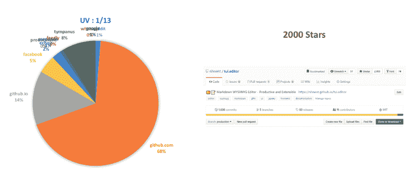

Unique Visitors on Jan. 13.

第二天，1 月 13 日，大多数访问者来自 GitHub。编辑在这一天记录了 2000 颗星，在社区上发布后的第四天。尽管自那以后增长有所下降，一个月后，这个月的[趋势](https://github.com/trending?since=monthly)仍然带来了新的游客。

### 来自 GitHub 主题的稳定访问者

主题按照主题中星号的顺序显示项目。

这意味着一旦你的项目有足够多的明星被列在一个主题上，它仍然可以让访问者通过这个主题，即使你的项目没有从趋势中列出。

来自主题列表的访客没有来自趋势列表的访客多。但还是值得的。

Project Topics in Repository Page

我看到了很多没有主题的项目。看看上面的图片，看看你可以在你的项目中设置主题。你可以设置任何你想要的话题。

然而，GitHub 管理着一个名为[特色主题](https://github.com/topics)的列表。因此，最好从特色话题中选择相关话题，以获得更多的访问者。

GitHub Explore All Featured Topics & Popular Topics

此外，根据主题的不同，需要列在最上面的明星数量也有很大的不同。

以 JavaScript 话题为例。有恐龙大小的项目像 FreeCodeCamp (hello guys？)，BootStrap，React，Vue 等等。这使得你的项目更难进入这个列表。

GitHub Explore JavaScript Topic. Your project will never beat freeCodeCamp. ?

我们编辑以 5.4k 星排在 Markdown 话题第 10 位。看一下题目，选择竞争不太激烈的题目。

### 你的项目描述最好的一行

Project Description in Repository Page

我们再来找一下上图中的描述。你的项目的项目描述是什么？我把对我们编辑的描述写成了标题的一个长版本(这是一个坏主意)。你想出你的路线了吗？然后我们来看下一张图。

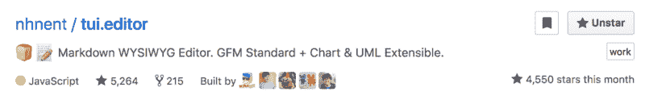

A Project on Trending & Topics List

这是我们的项目在趋势和主题上的样子。试着从游客的角度来看。有组织，有名字，有投稿人图片，等等。决定是否点击的唯一有用信息是描述。

描述应该是描述你的项目的最好的一行。

### 一锤定音

写文档。积极参与社区活动。利用 GitHub 的工具。

我在这篇文章中分享的技巧将帮助你作为一个开源项目做得更好(除了获得更多的明星)。

但是如果没有你的项目本身的价值，光靠那些技巧是不能让你的项目受欢迎的。我希望这篇文章能帮助你找到你的项目值得的贡献者。

我有机会写这篇文章是因为以前的维护者([石人](https://github.com/shiren)，[俊焕](https://github.com/junghwan-park))为这个项目做了很好的工作。我相信这个项目已经有了今天的价值。本文中的技巧帮助我们完成了剩下的部分。

上个月，作为一名开发人员，我有了一次真正特殊的经历。感谢 [TOAST UI 家族](https://github.com/nhnent?q=tui)和 [Dooray！团队](https://dooray.com/)感谢大家的支持！

如果你对 [TOAST UI 编辑器](https://github.com/nhnent/tui.editor)感兴趣，我推荐你试试 [Dooray！](https://dooray.com/)也是。它随编辑器提供，对不到 100 个合作者免费。让吐司 UI 编辑器陪着你？

[**共事愉快，杜雷！**](https://dooray.com/)
[*邮件、问题跟踪和聊天，任何人都可以轻松发布自己的任务，并与客人和项目成员协作。*dooray.com](https://dooray.com/)[**nhn ent/tui . editor**](https://github.com/nhnent/tui.editor)
[*tui . editor—？？Markdown 所见即所得编辑器。thub.com 标准+图表&UML extensible . gi*GFM](https://github.com/nhnent/tui.editor)

最初发布于 [Toast Meetup](http://meetup.toast.com/posts/141) 由 [KyuWoo Choi 撰写？](https://www.freecodecamp.org/news/what-i-learned-from-an-old-github-project-that-won-3-000-stars-in-a-week-628349a5ee14/undefined)