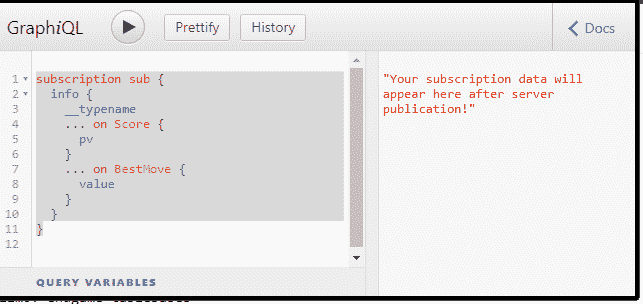
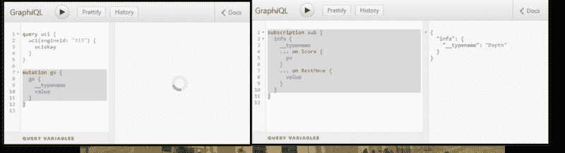
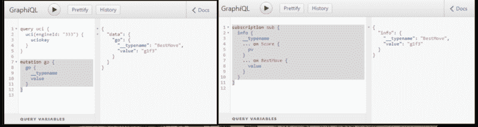

# 模仿通用象棋接口的 GraphQL 包装器

> 原文：<https://www.freecodecamp.org/news/mocking-a-graphql-wrapper-around-the-universal-chess-interface-1c5bb1acd821/>


Photo by [Samuel Zeller](https://unsplash.com/@samuelzeller?utm_source=ghost&utm_medium=referral&utm_campaign=api-credit) / [Unsplash](https://unsplash.com/?utm_source=ghost&utm_medium=referral&utm_campaign=api-credit)

通用国际象棋接口(UCI)已经存在了很长时间，并被许多国际象棋引擎使用。GraphQL 带来了什么？

最近，我和一个象棋网站的所有者通过电子邮件进行了交流，他问我对 UCI 和 websockets 了解多少。这让我更仔细地观察了 UCI，并思考如何以及为什么要用 GraphQL 模式来包装它。

### 通用象棋界面

UCI[已经存在了十多年](http://wbec-ridderkerk.nl/html/UCIProtocol.html)，它基于象棋引擎和它的客户端之间的标准 I/O 消息传递(通常是一个图形用户界面)。客户端向象棋引擎提交消息，引擎**可能** 发回响应。我说**可能**是因为 UCI 不要求对一些传入象棋引擎的消息做出响应。

引擎**也可能** 发回不止一个响应。在游戏分析过程中，引擎会发回**信息**包，详细说明它的想法。客户端说出起始位置，告诉它“开始”，引擎继续运行，直到到达一个**最佳移动位置。在这个过程中，引擎会传回它正在思考的信息。**

UCI 规范很简短，你不需要对它有很深的理解就能看出它是如何工作的——而且到目前为止它工作得很好，那么为什么还要对它瞎折腾呢？

如果引擎驻留在远程服务器上，那么只需打开一个 websocket，像平常一样进行操作。这当然行得通，但是看看稍微不同的做法的利弊也无妨。

### 象棋引擎对象棋服务器

我想从模拟 UCI 服务开始。下一步将是构建一个功能性的原型，并且，像往常一样，不难找到一个 Node.js 包来帮助完成大部分工作。

其中一个比较流行的引擎叫做 [Stockfish](https://stockfishchess.org/) 。有人已经把它从 C++移植到 JavaScript，这样引擎就可以完全在 Node.js 中运行。

就是这么简单:

*   创建并刻录到文件夹中
*   `npm init`
*   `npm install stockfish`
*   `node node_modules/stockfish/src/stockfish.js`

现在您处于 Stockfish 命令 shell 中，可以开始输入命令了。

首先要做的是通过键入`uci`启动 UCI 界面。您应该会得到这样的回应:

```
id name Stockfish.js 8
id author T. Romstad, M. Costalba, J. Kiiski, G. Linscott

option name Contempt type spin default 0 min -100 max 100
option name Threads type spin default 1 min 1 max 1
option name Hash type spin default 16 min 1 max 2048
option name Clear Hash type button
option name Ponder type check default false
option name MultiPV type spin default 1 min 1 max 500
option name Skill Level type spin default 20 min 0 max 20
option name Move Overhead type spin default 30 min 0 max 5000
option name Minimum Thinking Time type spin default 20 min 0 max 5000
option name Slow Mover type spin default 89 min 10 max 1000
option name nodestime type spin default 0 min 0 max 10000
option name UCI_Chess960 type check default false
option name UCI_Variant type combo default chess var chess var giveaway var atomic var crazyhouse var horde var kingofthehill var racingkings var relay var threecheck
option name Skill Level Maximum Error type spin default 200 min 0 max 5000
option name Skill Level Probability type spin default 128 min 1 max 1000
uciok
```

它显示选项设置为什么，然后返回`**uciok**`，表示界面准备就绪。下一步是设置选项，然后调用`**isready**`，当引擎响应`**readyok**`时，就可以开始分析一个棋位了。

我实际上不会在我的模拟实现中使用这个引擎，但是如果我想使用一个真实的引擎来检查一个命令做了什么，它确实很方便。

在真实的服务器实现中，我会为每个客户端启动一个引擎(或者更多)。GraphQL 帮助我定义了一个 API，它将支持运行多个引擎的多个客户端。

### GraphQL

对于这个模拟，我将 UCI 组件分成了具有调用/响应性质的 HTTP 请求和用于处理流响应的 websocket 订阅。这意味着只有当用户想要订阅关于引擎所想的详细信息时，套接字才是打开的。此外，我可以改进我在客户机上接收的 **info** 消息的数量和类型，从而使套接字流量最小化。

#### **每个命令得到一个响应**

因为客户机-服务器交互(在大多数情况下)是通过不可靠的 HTTP 进行的，所以客户机(在浏览器上运行)知道它的消息到达了服务器是很重要的。例如，UCI 命令`**setoption**`没有根据规范发回响应。

这对于基于可靠套接字的接口来说很好，但对于 HTTP 请求来说就不那么好了。GraphQL 确保每个接收到的请求都有一个响应，即使只是确认请求已被接收。

#### **每个命令及其参数都是类型安全的**

GraphQL 接口是基于模式的，而 UCI 接口不是(它们基于规范中的描述性文本)。如果一个客户端发送一个无效的命令，象棋引擎服务器应该永远不会处理它。通过在 GraphQL 中根据类型定义 UCI，我可以在错误的命令到达引擎之前，在 API 级别(在 GraphQL 中)拦截它。

#### **GraphQL 解析器可以将响应分解成 JSON 结构**

JavaScript 是互联网的语言，GraphQL 返回 JSON 响应。通过让 GraphQL 解析器获取 UCI 响应并以细粒度和结构化的方式将其分解，减轻了客户端的 UCI 响应解析任务。

#### **我可以使用 Apollo GraphQL 工具轻松模拟我的 API**

在设计一个 API 之后，但是在开始实现之前，先检查一下使用模拟的 API 外观是很有用的。graphql-tools 包让 T2 变得简单而轻松。您甚至可以将模拟与真正的解析器混合，为您提供 API 迭代实现的选项。

#### 我可以通过 GraphiQL 服务与 API 交互

Graph 是一种交互式服务，可以在 GraphQL 服务器上运行。这对于基于模拟或实现对 API 进行专门测试是很方便的。

### 开始嘲笑吧！

让我们先来看看依赖关系:

```
"dependencies": {
    "apollo-server-express": "^1.3.2",
    "babel-cli": "^6.26.0",
    "babel-preset-env": "^1.6.1",
    "express": "^4.16.2",
    "graphql": "^0.12.3",
    "graphql-subscriptions": "^0.5.7",
    "graphql-tag": "^2.7.3",
    "graphql-tools": "^2.21.0",
    "stockfish": "^8.0.0",
    "subscriptions-transport-ws": "^0.9.5"
  },
  "devDependencies": {
    "casual": "^1.5.19",
    "randexp": "^0.4.8"
  },
```

我称这个服务器为 **chessQ** ，服务器本身将基于`**apollo-server-express**`，阿波罗集团的 GraphQL 服务器实现。前面提到的`**stockfish.js**`包是作为嵌入式引擎包含在内的。虽然这个 mock 没有使用它，但它是供参考的。在一个真实的实现中，人们可能会[访问一个外部运行的引擎](https://www.npmjs.com/package/node-uci)。

包括用于帮助模拟的`casual`和`randexp`。最后，`**graphql-subscriptions**`和`**subscriptions-transport-ws**`将处理从我们的 mock 返回的流消息，同时它将假装进行分析。

### chessQ 模式

首先，我要说的是，我还没有花时间来完善这个模式，所以把它当作一个初稿。它是功能性的，但随着我继续开发它，它可能会改变。在本文的最后，我将链接到一个稳定的分支，它对应于这里描述的内容。我不会深入研究代码的细节，但会在适当的地方链接到 GitHub 中的相关源代码。小心那些。

首先是定义顶层查询[。这些是客户端的入口点:](https://github.com/JeffML/chessQ/blob/chessQ-mock/schema.js)

```
type Query {
    createEngine: EngineResponse
    uci(engineId: String!): UciResponse!
    register(engineId: String!, name: String, code: String): String
    registerLater(engineId: String!): String
    setSpinOption(engineId: String!, name: String!, value: Int!): String!
    setButtonOption(engineId: String!, name: String!): String!
    setCheckOption(engineId: String!, name: String!, value: Boolean!): String!
    setComboOption(engineId: String!, name: String!, value: String!): String!
    quit(engineId: String!): String!
    isready(engineId: String!): String!
  }
```

`createEngine`请求将返回一个[引擎响应](https://github.com/JeffML/chessQ/blob/chessQ-mock/readySchema.js)，其中包含一个引擎实例标识符，用于后续请求:

```
{
  "data": {
    "createEngine": {
      "engineId": "46d89031-03c3-4851-ae97-34e4b5d1d7c6"
    }
  }
}
```

`**uci**` 请求将返回一个 [UciResponse](https://github.com/JeffML/chessQ/blob/chessQ-mock/optionsSchema.js) 详细说明当前选项设置。在 GraphQL 模式中，每种类型的选项(微调、检查、按钮和组合)都有自己的特定字段:

```
interface Option {
    name: String!
    type: String!
  }

type SpinOption implements Option {
    name: String!
    type: String!
    value: Int!
    min: Int!
    max: Int!
  }

type ButtonOption implements Option {
    name: String!
    type: String!
  }

type CheckOption implements Option {
    name: String!
    type: String!
    value: Boolean!
  }

type ComboOption implements Option {
    name: String!
    type: String!
    value: String!
    options: [String!]!
  }
```

一个模拟的`uci query`可能是:

```
query uci {
  uci(engineId: "46d89031-03c3-4851-ae97-34e4b5d1d7c6") {
    uciokay
    options {
      name
      type
      ... on SpinOption {
        value
        min
        max
      }
    }
  }
}
```

回应是:

```
{
  "data": {
    "uci": {
      "uciokay": true,
      "options": [
        {
          "name": "Porro tempora minus",
          "type": "check"
        },
        {
          "name": "Id ducimus",
          "type": "combo"
        },
        {
          "name": "Aliquam voluptates",
          "type": "button"
        },
        {
          "name": "Voluptatibus illo ullam",
          "type": "spin",
          "value": 109,
          "min": 0,
          "max": 126
        },
        {
          "name": "Temporibus et nisi",
          "type": "check"
        }
      ]
    }
  }
}
```

从技术上讲，这些命令中的一些可以被认为是突变，而不是查询，因为它们改变了引擎的状态。但是 GraphQL 中的变化主要是关于连续的执行顺序，这并不适用于这种情况:任何选项都可以以任何顺序设置。

最终，每个引擎实例将需要维护其[状态](https://github.com/JeffML/chessQ/blob/chessQ-mock/readySchema.js)的一些指示(在这个模拟中没有实现)。这些可能是:

```
enum eEngineState {
    CREATED
    INITIALIZED
    READY
    RUNNING
    STOPPED
  }
```

例如，如果在发动机状态为`**READY**`之前发送了`**go**` 命令，那么这将是一个错误。

#### 就绪模式

当引擎准备好时，三个新命令是可能的:

*   告诉引擎一个新游戏开始了
*   `position`:告诉引擎起始位置(以及从该位置开始的任何移动)
*   `go`:启动发动机！

在发出`**go**`命令之前，客户端可以选择订阅通过 websocket 流入的任何 [**信息**消息](https://github.com/JeffML/chessQ/blob/chessQ-mock/schema.js)(否则，当引擎完成时，将只有一个`BestMove` HTTP 响应)。

关于如何使用 [graphql-subscriptions](https://github.com/apollographql/graphql-subscriptions) 建立订阅服务的细节可以在其他地方找到，所以这里我将重点放在模式和解析器实现上。

该模式定义了可用的`Subscriptions`类型。对于这个模拟，只有一个:

```
type Subscription {
    info: Info
  }
```

与`Option`类型一样，`Info`类型是几个特定信息结构的联合:

```
type Score {
    cp: Int!
    depth: Int!
    nodes: Int!
    time: Int!
    pv: [Move!]!
  }

type Depth {
    depth: Int!
    seldepth: Int!
    nodes: Int
  }

type Nps {
    value: Int!
  }

type BestMove {
    value: Move!,
    ponder: Move
  }

union Info = Score | Depth | Nps | BestMove
```

这些`Info`消息的确切含义与本次讨论无关。重要的是要知道它们以任何顺序出现，除了最后的`BestMove`消息。

客户端使用如下所示的`subscription`请求订阅 info 消息:

```
subscription sub {
  info {
    ... on Score {
      pv
    }
    ... on BestMove {
      value
    }
  }
}
```

有一个解析器来处理`Subscription`请求，它使用`**graphql-subscriptions**`包中的方法:

```
import {PubSub, withFilter} from 'graphql-subscriptions';
...

resolvers: 
...
Subscription: {
      info: {
        subscribe: withFilter(() => pubsub.asyncIterator(TOPIC), (payload, variables) => {
          return true
        })
      }
    }...
```

在这个订阅解析器中，传递给`withFilter`的函数会将每条消息传递回去。但是真正的订阅解析器可以根据客户端传入的参数进行更好的识别。

#### 看到它的实际应用

您可以在 GraphiQL 中进行查询、变异和订阅，因此不需要编写用于测试目的的客户端。有一个问题是，一旦请求订阅，GraphiQL 将进入“订阅”模式，并且不会愉快地响应进一步的命令。

解决方案是在浏览器中打开两个 GraphiQL 选项卡，一个用于发布查询和变化，另一个用于监听订阅的消息。

下载 [chessQ](https://github.com/JeffML/chessQ/tree/chessQ-mock) 包，运行`npm install`，然后运行`npm run dev`。chessQ 模拟应用程序现在应该正在运行。

打开两个标签页到[http://localhost:3001/graphiql](http://localhost:3001/graphiql)。

在一个选项卡中，输入:

```
subscription sub {
  info {
    __typename
    ... on Score {
      pv
    }
    ... on BestMove {
      value
    }
  }
}
```

您将看到一条消息，内容如下:

```
"Your subscription data will appear here after server publication!"
```



Ready to receive!

为了生成消息，有一个`**go**` 解析器(如下所示)遍历一组[静态信息消息](https://github.com/JeffML/chessQ/blob/chessQ-mock/InfoGenerator.js)并逐个发布它们。因为订阅者窗格**一次只会显示一条消息**，所以有一个简单的`sleep`实现可以减缓消息传递的速度，这样您就可以看到它们飞快地飞过:

```
function sleep(ms) {
  return new Promise(resolve => {
    setTimeout(resolve, ms)
  })
}
...

resolvers: {...

Mutation: {
      go: async () => {
        let info;
        for (info of InfoGenerator()) {
          pubsub.publish(TOPIC, {info})
          await sleep(1000)
        }
        return info;
      }
    },...
```

最后，在非订阅选项卡中，用`**go**`开始分析:

```
mutation go {
  go {
    __typename
    value
  }
}
```

当这个选项卡等待显示`BestMove`的`go`响应时，`subscription`选项卡将捕捉信息消息并逐个显示它们。



Info messages coming in…



Analysis complete!

### 进一步的想法

在从模拟转向实现之前，有几点需要注意:

本例中使用的简单发布/订阅机制既不健壮也不可伸缩。没关系，因为 graphql-subscription 有 [Redis](https://redis.io/) 和 [RabbitMQ](https://github.com/cdmbase/graphql-rabbitmq-subscriptions) 实现。还可以定义更精细的订阅规范，并向订阅者提供关于接收哪些消息的细粒度控制。

在这个模拟中，没有太多考虑管理 websocket 生命周期，如果服务于大量用户，这是需要考虑的事情。

本文的所有源代码都可以在[这里](https://github.com/JeffML/chessQ/tree/chessQ-mock)找到。