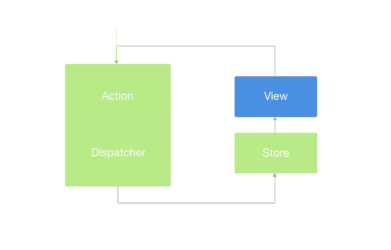
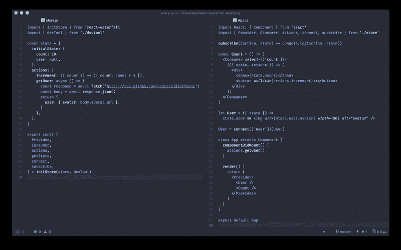
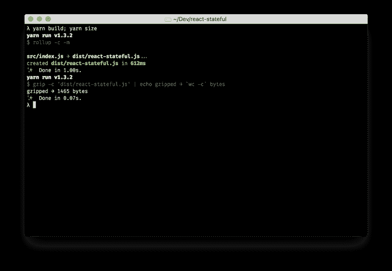

# 用新的 React 上下文 API 替换 Redux

> 原文：<https://www.freecodecamp.org/news/replacing-redux-with-the-new-react-context-api-8f5d01a00e8c/>

迪迪埃·法郎

# 用新的 React 上下文 API 替换 Redux

React 16.3 附带的新上下文 API 非常简洁。它是按照过去几个月流行的*渲染道具风格*建造的。让我们来探索一下:

很漂亮，对吧？让我们进一步研究类似 Flux 的实现。

### 什么是通量？

来自杰出的陈静的这个演讲彻底改变了我们今天对应用的看法。如果你想知道通量作为一个概念是什么，[看看这里](https://github.com/facebook/flux/blob/master/examples/flux-concepts/README.md)。

A basic Flux representation

一个图书馆已经将这一概念大众化:丹·阿布拉莫夫的 [Redux](https://redux.js.org/basics) 和其在 2015 年 React Europe 上的传奇时间旅行演示。

### 履行

有了上面的 **createContext()** API 示例，我们已经有了单向的**商店→视图**。

我们需要的是**动作**和**调度员**来动态更新商店。如果我们的动态存储只是一个根 React 组件的状态会怎么样？

我们刚刚将状态和动作作为提供者的值进行了传递。而现在我们可以用 ***<消费者*** / >来搞定。

我创建了一个库，在保持高性能的同时，拥有我们使用这个数据流所需的一切。

### [反应-瀑布](https://github.com/didierfranc/react-waterfall)

Example repository available [**here**](https://github.com/didierfranc/react-stateful-example)

只需从[**react-瀑布**](https://github.com/didierfranc/react-waterfall) 导入 **initStore** ，设置你的**初始状态，**并采取一些行动: **(state，…arg) → stateChunk** — 就可以了。

创建的**商店**给你一些很酷的东西，比如:

*   上面介绍的增强型**提供商**和**消费者**
*   **动作**(也可以从**消费者**处访问)
*   **getState()** 获取当前状态
*   **connect()()** 将状态和动作映射到组件道具
*   **subscribe()** 对状态变化做出反应

如果您需要更深层次的选择器和/或记忆的计算数据，您当然可以使用 [**重新选择**](https://github.com/reactjs/reselect) **。**看看这个例子[这里](https://github.com/didierfranc/react-waterfall/blob/v3/examples/reselect/src/store/selectors.js)。

如果你想要**时间旅行，**有可能吗？以刚刚运行的 t [为例。](https://github.com/didierfranc/react-stateful-example)实施是正确的 h [ere。](https://github.com/didierfranc/react-stateful-example/blob/master/src/devtool.js)

### 与 Redux 的比较

ℹ️ Redux Devtools 在 4.0.0 版本中已经默认集成了，你什么也不用做，它就能工作。

**优点**

*   更易于实施
*   重量和性能
*   带有状态块的清除程序操作返回(如在 setState 中)

**缺点**

*   它只适用于反应^16.3

### 你想试试吗？

我，我，我，我，我，我，我，我，我，我，我，我，我，我，我，我，我，我一个，一个，一个，一个，一个，一个，一个，一个，一个，一个，一个，一个，一个，一个，一个，一个，一个，一个，一个，一个，一个，一个，一个，一个，一个，一个，一个，一个，一个，一个，一个，一个，一个，一个，一个，一个，一个，一个，一个，一个，一个，一个，一个，一个，一个，一个，一个，一个，一个，一个，一个，一个，一个，一个-好吧

> 纱线添加反应-瀑布

？

### 更大的

如果你对新的 **React** 感兴趣，关键特性不要错过 [***“当 React 变成了(甚至更多)异步”***](https://medium.com/@DidierFranc/when-react-has-become-even-more-asynchronous-37a55c3a3d3) ***。***

如果你不想错过我的任何一篇文章，*在 twitter 上关注我[@ DidierFranc](http://twitter.com/didierfranc)*