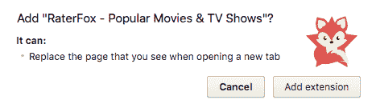
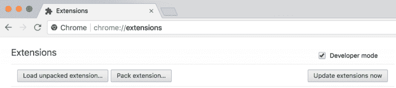
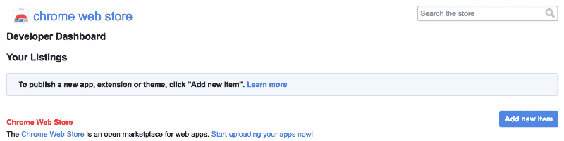

# 如何在 20 分钟内创建并发布一个 Chrome 扩展

> 原文：<https://www.freecodecamp.org/news/how-to-create-and-publish-a-chrome-extension-in-20-minutes-6dc8395d7153/>

杰克王子

# 如何在 20 分钟内创建并发布一个 Chrome 扩展


Photo by Mikes Photos: [https://www.pexels.com/photo/acoustic-amplifier-artist-audio-114820/](https://www.pexels.com/photo/acoustic-amplifier-artist-audio-114820/)

有没有想过创建一个 Chrome 扩展会是什么样子？我在这里告诉你这有多简单。遵循这些步骤，你的想法就会变成现实，你马上就能在 Chrome 网上商店发布一个真正的扩展。

### 什么是 Chrome 扩展？

Chrome extensions 允许你在 Chrome 浏览器中添加功能，而无需深入研究本地代码。这太棒了，因为你可以用 web 开发人员非常熟悉的核心技术——HTML、CSS 和 JavaScript——为 Chrome 创建新的扩展。如果你曾经建立过一个网页，你将能够比你吃午饭还快地创建一个扩展。你唯一需要学习的就是如何通过 Chrome 公开的一些 JavaScript APIs 给 Chrome 添加一些功能。

如果你还没有构建网页的经验，我建议你先去一些免费资源中学习如何编码，比如 [freeCodeCamp](https://www.freecodecamp.org/) 。

### 你想建什么？

在你开始之前，你应该有一个大概的想法。这不需要一些新的突破性的想法，我们可以只是为了好玩。在这篇文章中，我将告诉你我的想法，以及我如何将它实现到一个 Chrome 扩展中。

### 这个计划

我已经使用了一段时间的 Chrome 扩展，它允许我在默认标签中有漂亮的[背景图片。后来我把它换成了](https://unsplash.com/)[的 Muzli](https://muz.li/) Chrome 扩展，把默认标签变成了来自网络的设计新闻和图片。

让我们使用这两个扩展作为灵感来构建一些新的东西，但这一次，是为了电影爱好者。我的想法是，每次打开新标签页时，显示一个电影的随机背景图像。在 scroll 上，它应该变成流行电影和电视节目的一个很好的提要。所以让我们开始吧。

### **第一步:设置东西**

第一步是创建一个名为`manifest.json`的清单文件。这是一个 JSON 格式的元数据文件，包含诸如扩展的名称、描述、版本号等属性。在这个文件中，我们告诉 Chrome 这个扩展要做什么，以及它需要什么权限。

对于电影扩展，我们需要有控制**活动标签**的权限，所以我们的`manifest.json`文件看起来像这样:

```
{ “manifest_version”: 2, “name”: “RaterFox”, “description”: “The most popular movies and TV shows in your   default tab. Includes ratings, summaries and the ability to watch trailers.”, “version”: “1”, “author”: “Jake Prins”,
```

```
"browser_action": {   "default_icon": "tab-icon.png",   “default_title”: “Have a good day” },
```

```
“chrome_url_overrides” : {  “newtab”: “newtab.html”},
```

```
 “permissions”: [“activeTab”]}
```

正如你所看到的，我们说`newtab.html`将是每次打开一个新标签页时应该呈现的 HTML 文件。要做到这一点，我们需要有控制**活动标签**的权限，所以当用户试图安装扩展时，他们将被警告该扩展需要的所有权限。



`manifest.json`中另一个有趣的事情是浏览器的动作。在这个例子中，我们用它来设置标题，但是还有更多选项。例如，要在你点击地址栏内的应用图标时显示一个弹出窗口，你需要做的就是这样:

```
“browser_action”: {  “default_popup”: “popup.html”, },
```

现在，`popup.html`将呈现在弹出窗口中，该窗口是为响应用户点击浏览器动作而创建的。这是一个标准的 HTML 文件，因此您可以自由控制弹出窗口显示的内容。只需将您的一些魔法放在一个名为`popup.html`的文件中。

### 第二步:测试它是否有效

下一步是创建`newtab.html`文件并放入一个“`Hello world`”:

```
<!doctype html><html>  <head>    <title>Test</title>  </head>  <body>    <h1>Hello World!</h1>  </body></html>
```

为了测试它是否工作，在你的浏览器中访问`chrome://extensions`，确保右上角的**开发者模式**复选框被选中。



Chrome Developer mode

点击 **Load unpacked extension** ，选择您的扩展文件所在的目录。如果扩展是有效的，它将立即被激活，所以你可以打开一个新的标签来查看你的“你好世界”。

### 第三步:让事情变得美好

现在我们已经有了第一个功能，是时候让它变得更好了。我们可以简单地通过在我们的扩展目录中创建一个`main.css`文件并将其加载到我们的`newtab.html`文件中来样式化我们的新选项卡。对于您想要包含的任何活动功能，包含 JavaScript 文件也是如此。假设您之前已经创建了一个网页，现在您可以使用您的魔法向您的用户展示您想要的任何内容。

### **完成计划**

我进一步完成电影扩展所需要的是 HTML、CSS 和 JavaScript，所以我认为深入研究代码是不相关的，但我想快速浏览一遍。

我是这样做的:

对于我的想法，我需要一些漂亮的背景图像，所以在 JavaScript 文件中，我使用了 [TMDb API](https://www.themoviedb.org/) 来获取一些流行的电影，将它们的背景图像放入一个数组中。每当页面加载时，它会从数组中随机选取一个图像，并将其设置为页面的背景。为了让这个页面更有趣，我还在右上角添加了当前日期。更多信息，它允许用户点击背景，导致访问电影的 [IMDb](http://www.imdb.com/) 页面。

当用户试图向下滚动时，我用一个不错的流行电影提要替换了屏幕。我使用相同的 API 来构建带有图像、标题、评级和投票数的电影卡片。然后，点击其中的一张卡片，它会显示一个预览按钮来观看预告片。

### **结果**

现在有了这个小小的`manifest.json`文件和一些 HTML、CSS 和 JavaScript，你打开的每个新标签看起来都更有趣了:


View the end result [here](https://chrome.google.com/webstore/detail/raterfox-popular-movies-t/pbmdibcifmempicdafabdakcoamfobik).

### 步骤 4:发布您的扩展

当你的第一个 Chrome 扩展看起来不错并且工作正常时，就该把它发布到 Chrome 商店了。只需点击[此链接](https://chrome.google.com/webstore/developer/dashboard)进入你的 Chrome 网络商店仪表板(如果你没有登录，会被要求登录你的谷歌账户)。然后点击`**Add new item**`按钮，接受条款，您将进入上传扩展的页面。现在压缩包含您的项目的文件夹，并上传该 ZIP 文件。



Chrome Web Store

成功上传文件后，您将看到一个表单，您应该在其中添加一些关于您的扩展名的信息。可以添加图标，详细描述，上传一些截图等等。

确保你提供一些漂亮的图片来展示你的项目。商店可以利用这些图片来宣传你的开创性项目。您提供的图像越多，您的扩展功能就越突出。您可以通过点击`**Preview changes**`按钮预览您的扩展在网络商店中的外观。当你对结果满意时，点击`**Publish changes**`就可以了，大功告成！

现在进入 Chrome 网上商店并通过标题搜索你的扩展(在它出现之前可能需要一些时间)。如果你有兴趣，你可以在这里找到我的。

剩下唯一要做的就是获得一些用户。所以你可能想在社交媒体上分享一篇关于你的生活改变 Chrome 扩展的帖子。告诉你的朋友去看看。将其添加到 [ProductHunt](https://www.producthunt.com/posts/raterfox) 中。别忘了在评论中分享你的项目。我很好奇你想出了什么！

### **结论**

作为一名 web 开发人员，在短时间内创建一个 Chrome 扩展是非常容易的。你所需要的只是一些 HTML、CSS、JavaScript 以及如何通过 Chrome 提供的一些 JavaScript APIs 添加功能的基本知识。你的初始设置可以在 20 分钟内发布到 Chrome 网上商店。构建一个新的、有价值的或者看起来不错的扩展需要更多的时间。但这一切都取决于你！

发挥你的创造力，想出一些有趣的东西，如果你陷入困境，优秀的 Chrome 扩展[文档](https://developer.chrome.com/extensions)可能会帮你解决问题。

你还在等什么？是时候开始开发你自己的 Chrome 扩展，把你的想法变成现实了。

不要忘记在评论中分享你的项目，如果这篇文章对你有用，请点击拍手按钮。如果你有时间并且想成为一个英雄，给我的分机一个积极的评价。那将是高度赞赏的！

有问题或反馈吗？请在评论中告诉我！

感谢阅读！希望这些信息是有帮助的。在 Medium 上关注我，获取更多技术相关文章，或者在 Twitter 和 Instagram @jakeprins_nl 上关注我。