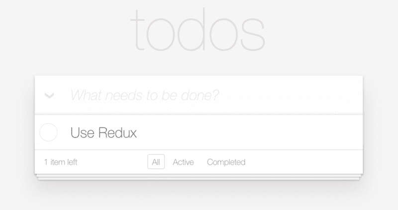
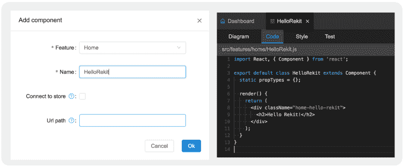
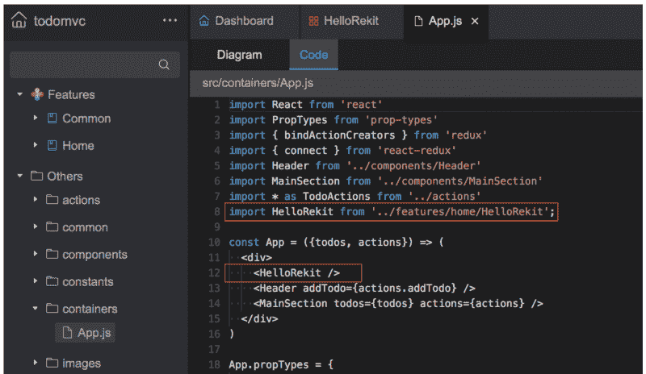
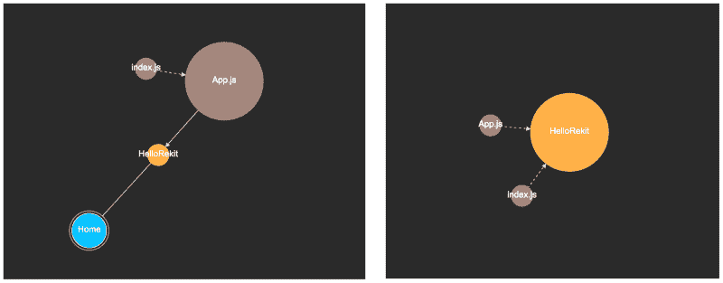
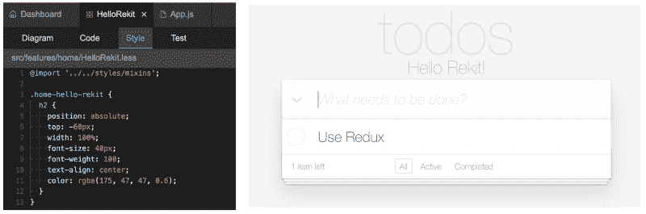
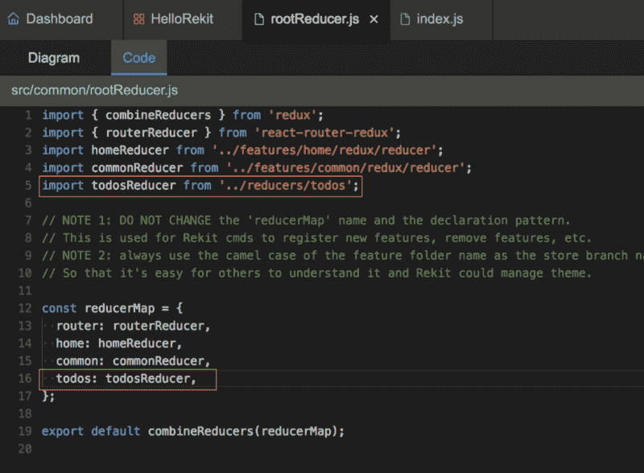
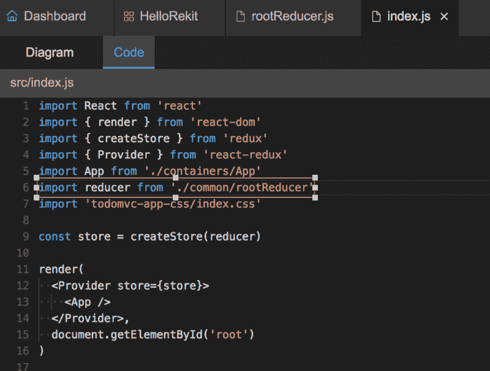
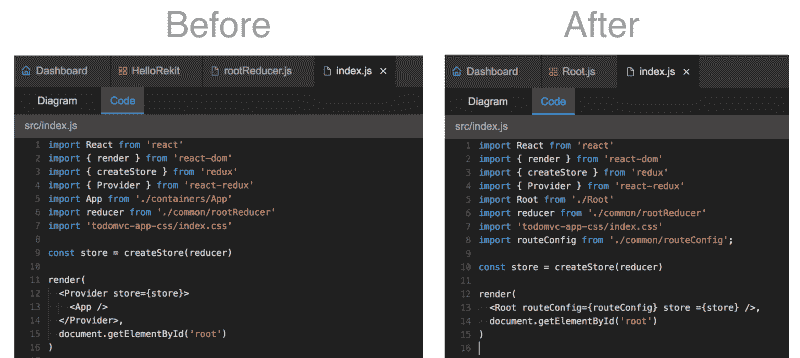
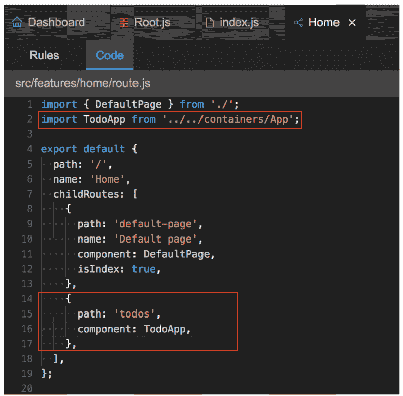
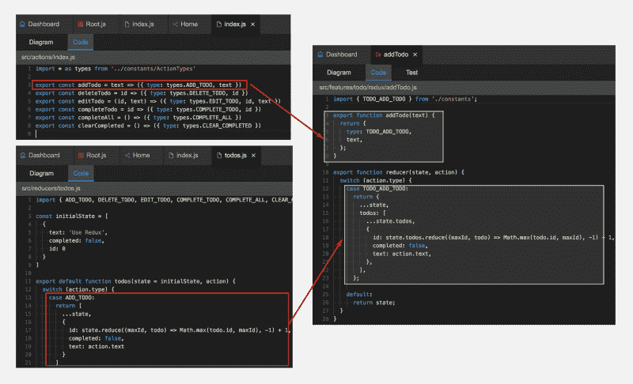

# 了解如何在现有的 React 项目中使用 Rekit Studio

> 原文：<https://www.freecodecamp.org/news/using-rekit-studio-in-an-existing-react-project-39713d9667b/>

作者奈特·王

# 了解如何在现有的 React 项目中使用 Rekit Studio


Picture original from [unsplash](https://unsplash.com/photos/hGV2TfOh0ns)

我在[的上一篇文章](https://medium.com/@nate_wang/introducing-rekit-studio-a-real-ide-for-react-and-redux-development-baf0c99cb542)中介绍了 [Rekit Studio](https://github.com/supnate/rekit) ，从那以后很多人都对在现有的 React 项目中使用它感兴趣。本文将介绍如何做到这一点。学习如何迁移实际上就是学习 Rekit 如何工作。因此，这不仅是迁移指南，也是 Rekit 工作原理的介绍。

考虑将 Rekit Studio 添加到现有项目中实际上比迁移它更好，因为您不需要一次重构所有现有代码来 Rekit。您可以使用 Rekit 编写新代码，并保留旧代码——您的项目不会被破坏。然后你可以在需要的时候重构旧代码。也许你想看看全功能的依赖关系图，或者用 Rekit Studio 编辑一个旧的组件。

我们将以 [Redux 的 TodoMVC 实现](https://github.com/reactjs/redux/tree/master/examples/todomvc)为例，所以你可能需要先检查一下它的[源代码](https://github.com/reactjs/redux/tree/master/examples/todomvc)。它是由 [create-react-app](https://github.com/facebook/create-react-app) 创建的，这是一个官方且非常受欢迎的 react 样板文件。如果您的项目也是由这个样板文件创建的，那么这篇文章会更有用。

#### 先决条件

您的项目使用 Rekit 只有三个先决条件:

1.  反应 v0.14+
2.  Redux
3.  ES6 模块

为了能够迁移，项目应该基于 React，Redux。如果你的项目没有使用 React 路由器也没关系。但是您可能需要一个适配器来使用 React Router 的 [JSON API](https://github.com/ReactTraining/react-router/tree/master/packages/react-router-config) ，因为 Rekit 使用它作为路由配置。这使得 Rekit 知道如何创建/更新/删除和显示路由规则。

Rekit 使用 Babel 使用的解析器 [Babylon](https://github.com/babel/babylon) 来解析 ES6 模块，以进行重构和依赖关系绘图。所以它暂时不支持 TypeScript 或 Flow 项目。

### 1.安装 rekit-core 和 rekit-studio

Rekit Studio 和 [Rekit CLI](http://rekit.js.org/docs/cli.html) 都使用`[rekit-core](http://rekit.js.org/docs/core.html)`来管理项目元素。首先将它们安装到您的项目中:

```
yarn add rekit-core rekit-studio --dev
```

或使用 npm:

```
npm install rekit-core rekit-studio --save-dev
```

### 2.将重建文件夹结构/文件复制到项目中

Rekit 项目具有特殊的文件夹结构。要为您的项目快速创建它，请创建一个干净的 Rekit 应用程序，并将文件夹/文件复制到您的项目中。

```
npm install rekit --globalrekit create my-app --clean
```

然后将这两个文件夹复制到您的项目中:

*   src/
*   工具/

请记住，这将与您的文件夹相冲突:对于文件夹，只需合并它们。对于文件，不要替换你的任何文件，记住哪些文件有冲突——然后手动合并或重命名它们(我将在后面介绍)。

### 3.启动 Rekit Studio

Rekit 使用`tools/server.js`下的脚本来启动 dev 服务器和 Rekit Studio。对于一个现有的项目，你应该已经有自己的开发服务器和建设脚本。所以我们需要合并它们。

Rekit 的 server.js 中有 4 个函数:

*   **startDevServer** :读取 webpack 配置，启动 webpack 开发服务器。
*   **buildDevDll** :使用 [Webpack dll 插件](https://webpack.js.org/plugins/dll-plugin/)将第三方库构建到 Dll 中，以提高 Webpack 的开发性能。
*   **startStudioServer** :用 Rekit Studio 中间件启动一个 [Express](https://expressjs.com/) 服务器
*   **startBuildServer** :启动一个 Express 服务器来验证构建的 bundle。

您可以编辑 server.js 来启动您的开发服务器，也可以通过复制 startStudioServer 函数来启动 Rekit Studio 来编辑您自己的`npm start`脚本。

对于 Redux 的 TodoMVC 示例，脚本 starts dev server 是`scripts/start.js`，我们通过在底部附加以下代码来编辑它，以启动 Rekit Studio:

或者，你也可以像`start_rekit_studio.js`一样把上面的脚本保存为一个单独的文件，然后用 node 执行它，而不是把它插入到你现有的脚本中。

如果还没有安装，我们需要添加必要的 dep:

```
yarn add express express-history-api-fallback --dev
```

或使用 npm:

```
npm install express express-history-api-fallback --save-dev
```

并在 package.json 中配置 Rekit Studio 端口:

```
{   ...   "rekit": { "studioPort": 6090 },   ...}
```

请注意，package.json 中的“rekit”属性是必需的，因为 Rekit 使用它来检测 Rekit 项目。

仅此而已。然后就可以用`npm start`启动 Rekit Studio 了(假设在你的 npm 启动脚本中启动 Studio)！为它访问 [http://localhost:6090](http://localhost:6090) 。TodoMVC 应用程序本身也可以运行。仍然访问 [http://localhost:3000](http://localhost:3000) 获取应用程序:



我们没有改变任何东西，但是 Rekit Studio 现在运行落后了。

### 开始用 Rekit Studio 写代码吧！

一旦 Rekit Studio 启动，您就可以使用它来编写代码。请记住，Rekit 只是帮助编写标准的 React、Redux 代码，因此您可以在项目中不受任何限制地使用它。例如，让我们在 Rekit Studio 的 home 特性下创建一个组件`HelloRekit`，并将默认文本编辑为“Hello Rekit！”



现在我们有一个 React 组件:`src/features/home/HelloRekit.js`。然后通过编辑作为应用程序根组件的`src/containers/App.js`在 TodoMVC 应用程序中使用它。你可以在 Rekit Studio 的`others`文件夹中找到它。打开它，只添加两行代码:



保存文件，然后您甚至可以看到依赖关系图，尽管`App.js`不是由 Rekit 创建的:



需要记住的一点是，当导入一个模块时，您应该使用物理路径，而不是项目浏览器中显示的逻辑路径。

然后打开 TodoMVC 应用程序，您可以看到 HelloRekit 组件已经显示出来:


虽然没有那么漂亮，因为我们还没有添加样式，它工作得很好！

### 整合风格

现在，让我们将 Rekit 管理的样式集成到您的项目中。目前，Rekit 只支持 [Less](http://lesscss.org/) 或 [Sass](https://sass-lang.com/) 作为 CSS transpiler。您需要配置您的 bundler(网络包、汇总等)。)来支持:以 Less 和 Webpack 为例，将`src/styles/index.less`添加到`config/webpack.config.dev.js`中的条目:

```
entry: [  ...,  'src/styles/index.less',  ...],
```

请注意，Rekit 在`src/styles/reset.css`中使用了一些默认样式，这些样式不应该用于现有的项目。所以只需移除`src/styles/index.less`中的`@import`行。

然后将 Less-loader 添加到 TodoMVC 应用程序的`oneOf`下的配置中。如果您的项目已经使用了较少的，那么它可能是不必要的。

```
{  test: /\.less$/,  loader: 'style-loader!css-loader!less-loader'}
```

如有必要，安装越来越少的装载机:

```
yarn add less@2.3.1 less-loader --dev
```

请注意，Less-loader 现在只兼容 Less @2.3.1，而不是最新的 3.0.1。

样式的所有配置都已完成，现在让我们向组件 HelloRekit 添加一些样式，看看结果:



我们可以看到，Rekit 管理的样式已经被现有项目使用。

### 集成冗余

接下来让我们集成现有的 Redux 代码来重新生成。每个 Redux app 都有一个根缩减器。关键是将 Rekit 的 reducer 与现有的合并。超级简单！对于 TodoMVC 应用程序，只需导入`src/reducers/todos.js`到 Rekit 的根 reducer `src/common/rootReducer.js`:



然后通过编辑`src/index.js`在 TodoMVC 应用程序中使用这个根缩减器:



好的，您可以使用 Rekit 来管理新的 Redux 动作和 reducers。现在自己用 Rekit 创建一个动作，试试吧！

### 集成反应路由器

如上所述，Rekit 以 JSON 格式管理路由规则。根路由配置文件是`src/common/routeConfig.js`，它从每个特性的`src/features/<feature-name>/ro` ute.js 加载路由规则。当创建一个具有某个 URL 路径的组件时，Rekit 更新`s the ro` ute.js 文件以插入路由规则。

所以没必要使用 React Router——可以使用任何能够消费 JSON 的 API 定义的规则的路由器库。在 Rekit 应用程序中，`src/Root.js`是在 JSX 处理 JSON 规则以生成 React 路由器 v4 声明的地方。

由于 TodoMVC app 不使用路由器，所以我们就用 Rekit 的默认方式。首先将`react-router-dom`和`react-router-redux`安装到您的项目中(如果尚未安装的话):

```
yarn add react-router-dom react-router-redux@next --dev
```

然后你需要接触 TodoMVC app 的两个文件:

1.  更新`src/index.js`来渲染 Root.js 而不是`src/containers/App.js`。



注意，Root.js 已经使用了来自`react-redux`的 Provider 作为组件，所以在 index.js 中不再需要它。

2.更新`src/features/home/route.js`以添加一个匹配 TodoMVC 组件`src/containers/App.js`的 URL 路径的规则:



您不必向 home 的 route.js 添加规则。它可以属于任何要素，甚至是根 routeConfig.js。

现在你可以通过这个 URL 访问 todo app:[http://localhost:3000/todos](http://localhost:3000/todos)。我们可以看到 TodoMVC 的容器组件 App.js 现在由 React Router 管理。

我们已经完成了 React 路由器的迁移。这只是 TodoMVC 的样本代码。对于您的应用程序，方法是相似的。如果您还使用 React Router v4，那么只需使用 root . js——否则编写自己的适配器来使用 Rekit 的路由配置 JSON。

### 单元测试

Rekit Studio 使用脚本`tools/run_test.js`通过测试文件模式运行单元测试，因此您不应该重命名或移动它。例如，使用此命令测试主页功能:

```
node run_test.js features/home/**/*.test.js
```

该脚本使用 [Mocha](https://mochajs.org/) 运行测试，使用 [nyc](https://github.com/istanbuljs/nyc) 生成测试覆盖报告。如果你使用其他的测试框架，比如 [Jest](https://facebook.github.io/jest/) ，编辑这个脚本来运行你自己的测试。

### 建设

Rekit Studio 使用脚本`tools/build.js`来构建项目。所以你不应该重命名或移动它。您所需要做的就是将您的构建脚本放入这个脚本中，这样您就可以通过 Rekit Studio 的 GUI 开始构建了。

### 重置设置完成

目前，我们已经将 Rekit 添加到一个现有的项目中。这意味着您可以开始使用 Rekit Studio 编写新代码，并保持旧代码不变。该项目应该仍然像以前一样运行良好。

但是正如我上面提到的，我们可能需要重构旧代码，以便它可以由 Rekit 管理。接下来，让我们看看如何进行迁移。

### 在特征中思考

Rekit 的关键能力之一是将复杂的应用程序分成松散耦合的特性。特性是一个高层次的概念，我曾经在这里介绍过架构[。对于您的应用程序，您还应该考虑创建功能来管理现有代码，而不是将所有代码放入单个功能中。](https://medium.com/@nate_wang/feature-oriented-architecture-for-web-applications-2b48e358afb0)

### 迁移组件

每个组件由三个文件组成:

1.  Component.js:应该总是直接放在一个特性文件夹下:`src/features/<feature-name/Component`。射流研究…
2.  Component.less/scss:应该总是直接放在一个特征文件夹下:`src/features/<feature-name/Component.l` ess
3.  Component.test.js:应该在 tests 文件夹:`tests/features/<feature-name>/Component.t` est.js 中

文件的位置和命名模式应该遵循 Rekit 的约定，这里的[描述了这些约定，以便 Rekit 可以在必要时重构它们。Rekit 通过检查功能文件夹 imports 下的模块是否有反应来检测组件。](http://rekit.js.org/docs/namings.html)

每个组件的根 DOM 节点应该有一个唯一的 CSS 类名。在 Rekit 中，模式是`<feature-name>-<compon` ent-name >。它总是在烤肉串盒里。kebabCase 函数。使用 Rekit 重命名组件时，此类名将自动更新。

在记住这些规则的同时，您可以将组件移动到特征文件夹中。然后 Rekit Studio 可以将它加载到项目浏览器中，并使用元素编辑器(带有针对组件不同部分的选项卡)对其进行编辑。

你可以在这里查看最终结果[，看看 Rekit 是如何为 TodoMVC 应用组织组件的。](https://github.com/supnate/rekit-todomvc)

### 迁移操作和减少器

与 Redux 的官方例子相比，Rekit 使用了一种不同的方法来组织 Redux 动作和减少器(在这里[描述了](https://medium.com/@nate_wang/a-new-approach-for-managing-redux-actions-91c26ce8b5da))。所以你需要把你的`actions.js`和`reducers.js`分割成不同的文件。每个文件都有一个动作及其缩减器。最简单的方法是通过 Rekit Studio 创建一个动作，然后将旧的动作/缩减器逻辑移入其中。

动作名称和动作类型常量也应该以 Rekit 方式命名为[，以便 Rekit 可以重构它们。例如，这张图片显示了如何将`addTodo`动作迁移到 Rekit 方式:](http://rekit.js.org/docs/namings.html)



你不需要改变你的商业逻辑。把它们放在新的地方。使用这种方法，您将能够更容易地管理 Redux 操作/reducer。

你也可以在这里查看最终结果[，看看 Rekit 是如何为 TodoMVC 应用组织动作的。](https://github.com/supnate/rekit-todomvc)

### 摘要

我不得不承认，将 Rekit 添加到现有项目中比我最初想象的要容易得多。你不需要改变你的 web pack/roll up/package 配置，你如何构建/测试你的项目，或者你如何启动你的应用程序。但是只要确保 Rekit 分三步在您的项目中运行:

1.  创建 Rekit 理解的文件夹结构/基本样板文件
2.  将`rekit-core` `rekit-studio`添加到您的项目中。
3.  创建脚本以启动 Rekit Studio

现在您可以使用 Rekit Studio 编写新代码了！

本文以 TodoMVC 应用程序为例进行迁移。您的项目可能要复杂得多，因此在迁移时您可能会遇到一些其他问题。如果你有，请在评论中提出你的问题，我会尽力帮你解决。谢谢！