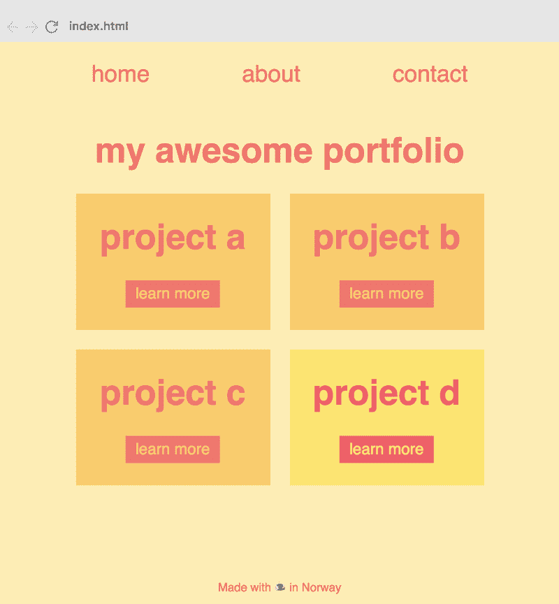

# 如何用 CSS 变量轻松创建主题

> 原文：<https://www.freecodecamp.org/news/how-to-easily-create-themes-with-css-variables-2d0f4cfa5b9a/>

CSS 变量的最佳用例之一是主题创建。我的意思不仅仅是改变整个应用程序的主题，因为这可能不是你经常需要做的事情。更重要的是能够轻松创建特定于组件的主题。

例如，这可能是当您需要将电子商务产品标记为添加到购物车的*时。或者你的网站有一个管理部分，其中包括一个较暗的侧边栏部分。*

CSS 变量使你能够以一种比以前更简单、更灵活的方式做到这一点。在这篇文章中，我将解释具体的方法。

我还在免费的 8 集 CSS 变量课程中创建了一个关于主题创建的截屏。如果你有兴趣了解课程的更多信息，请查看[这篇文章](https://medium.freecodecamp.org/want-to-learn-css-variables-heres-my-free-8-part-course-f2ff452e5140)。

### 设置

我们将以一个投资组合网站为例。我们的目标是能够突出我们投资组合中的一个项目，以便它从人群中脱颖而出。从技术上来说，我们将通过向我们想要展示的特定项目添加一个类来做到这一点。

以下是投资组合网站最初的样子:


我不打算讨论这个网站的 HTML，因为它非常简单，而且我假设你了解 HTML。然而，如果你对摆弄代码感兴趣，我在这里为它创建了一个 Scrimba 游乐场。

现在，让我们直接进入 CSS。这是我们开始使用 CSS 变量之前的样式表:

```
html, body {  
  background: #ffeead;  
  color: #ff6f69;  
}

h1, p {  
  color: #ff6f69;  
}

#navbar a {  
  color: #ff6f69;  
}

.item {  
  background: #ffcc5c;  
}

button {  
  background: #ff6f69;  
  color: #ffcc5c;  
} 
```

如你所见，我们在这里只用了三种颜色:`#ffeead`、`#ff9f96`和`#ffcc5c`。然而，我们正在大量重复使用它们。所以这是 CSS 变量的完美用例。

要开始使用它，我们首先需要声明我们的变量。我们将在`:root`伪类中这样做:

```
:root {  
  --red: #ff6f69;  
  --beige: #ffeead;  
  --yellow: #ffcc5c;  
} 
```

然后，我们将简单地用变量替换十六进制值:

```
html, body {  
  background: var(--beige);  
  color: var(--red);  
}

h1, p {  
  color: var(--red);  
}

#navbar a {  
  color: var(--red);  
}

.item {  
  background: var(--yellow);  
}

button {  
  background: var(--red);  
  color: var(--yellow);  
} 
```

现在我们在 CSS 中拥有了变量的力量，这意味着我们可以简单地将`--red`更改为其他内容，它将在整个站点中更新。

如果你正在努力理解这里发生的事情，请查看我的[5 分钟学会 CSS 变量的文章](https://medium.freecodecamp.org/learn-css-variables-in-5-minutes-80cf63b4025d)，或者报名参加[课程。](https://scrimba.com/g/gcssvariables?utm_source=freecodecamp.org&utm_medium=referral&utm_campaign=gcssvariables_create_themes)

### 创建主题

现在让我们创建主题。我们希望能够向我们的四个项目条目之一添加一个`.featured`类，从而使该条目从其他条目中脱颖而出。具体来说，我们将把红色改为`#ff5564`，黄色改为`#ffe55b`。

下面是它在标记中的样子:

```
<div class="item **featured**">  
  <h1>project d</h1>  
  <button>learn more</button>  
</div> 
```

这种变化会影响四个不同位置的样式:

*   `<div>`的背景颜色
*   `<h1>`的颜色
*   `<button>`的背景颜色
*   `<button>`的颜色

#### 老办法

我们之前解决这个问题的方法是为`.featured`项中的每个元素创建一个定制的 CSS 选择器，如下所示:

```
.featured {  
  background: #ffe55b;  
}

.featured > h1 {  
  color: #ff5564;  
}

.featured > button {  
  background: #ff5564;   
  color: #ffe55b;  
} 
```

这种方法不太灵活。如果你要在你的投资组合项目中添加另一个元素，你也必须为它们编写特定的选择器。

#### 新的方式

然而，有了 CSS 变量，事情就变得简单多了。我们将简单地覆盖`.featured` a 类中的变量，如下所示:

```
.featured {  
  --yellow: #ffe55b;  
  --red: #ff5564;  
} 
```

当 CSS 变量被继承时，`.featured`中引用`--red`或`--yellow`的所有元素现在都使用局部值，而不是全局值。因此`<button>`或`<h1>`元素自动使用变量的本地值。

这就是它在页面上的表现。



如你所见,“项目 d”看起来与其他项目有些不同。

整洁，还是什么？

试想一下，如果我们正在构建一个更复杂的组件，例如，一个电子商务应用程序中的一个产品项目，情况会是怎样。它可能包括标题、副标题、段落、图片、标题、按钮、评分等等。简单地翻转一些变量的值，而不是为每个后代创建定制的选择器，这要容易得多，也更灵活。

如果你有兴趣了解更多关于这项技术的知识，请查看我在 Scrimba 上的免费的 8 部分交互式 CSS 变量课程。

* * *

感谢阅读！我的名字叫 Per Borgen，我是最简单的学习编码方法——Scrimba 的联合创始人。如果你想学习建立专业水平的现代网站，你应该看看我们的[响应式网页设计训练营](https://scrimba.com/g/gresponsive?utm_source=freecodecamp.org&utm_medium=referral&utm_campaign=gcssvariables_create_themes)。


[Click here to get to the advanced bootcamp.](https://scrimba.com/g/gresponsive?utm_source=freecodecamp.org&utm_medium=referral&utm_campaign=gcssvariables_create_themes)