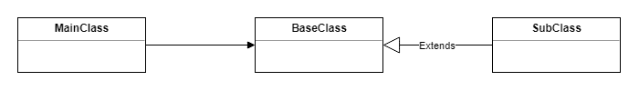

# 固体原理介绍

> 原文：<https://www.freecodecamp.org/news/kriptofolio-app-series-part-1/>

#### Kriptofolio app series - Part 1

软件总是处于变化的状态。每个变更都会对整个项目产生负面影响。因此，最重要的是在实施所有新变革的同时，防止可能造成的损害。

有了“Kriptofolio”(以前的“我的加密硬币”)应用程序，我将一步一步地创建许多新的代码，我想以一种良好的方式开始这样做。我希望我的项目是坚实的质量。首先，我们需要理解创建现代软件的基本原则。他们被称为坚实的原则。这么朗朗上口的名字！？

### 系列内容

*   [简介:2018–2019 年打造现代 Android 应用的路线图](https://www.freecodecamp.org/news/kriptofolio-app-series)
*   第 1 部分:坚实原则的介绍(你在这里)
*   第 2 部分:如何开始构建你的 Android 应用:创建模型、UI 和 XML 布局
*   第 3 部分:关于架构的一切:探索不同的架构模式以及如何在你的应用中使用它们
*   [第四部分:如何用 Dagger 2](https://www.freecodecamp.org/news/kriptofolio-app-series-part-4) 在你的应用中实现依赖注入
*   [第 5 部分:使用 refuge、OkHttp、Gson、Glide 和协程处理 RESTful Web 服务](https://www.freecodecamp.org/news/kriptofolio-app-series-part-5)

### 原则口号

**SOLID** 是助记首字母缩略词。它有助于定义五个基本的面向对象设计原则:

1.  单一责任原则
2.  **O** 关笔原理
3.  **L** 伊斯科夫替代原理
4.  I 界面分离原理
5.  **D** 依赖反转原理

接下来，我们将逐一讨论它们。对于每一个，我将提供坏代码与好代码的例子。这些例子是使用 Kotlin 语言为 Android 编写的。

### 单一责任原则

> 一个类应该只有一个责任。

每个类或模块应该负责应用程序提供的一部分功能。所以当它处理一件事情的时候，应该只有一个主要的理由去改变它。如果你的类或模块做不止一件事，那么你应该把这些功能分开。

为了更好地理解这个原理，我举一把瑞士军刀作为例子。这把刀除了它的主要刀刃之外，它的多种功能也是众所周知的。它内部集成了其他工具，如螺丝刀、开罐器和许多其他工具。

你自然会问，为什么我建议用这把刀作为单一功能的例子？但是请想一想。这把刀的另一个主要特点是可移动性，同时是口袋大小。因此，即使它提供了一些不同的功能，它仍然符合其主要目的，即足够小，可以舒适地随身携带。

编程也有同样的规则。当你创建你的类或模块时，它必须有一些主要的全局目的。同时，当你试图通过分离功能来简化一切时，你不能过分夸大。所以记住，保持平衡。


一个经典的例子是构建 RecyclerView 小部件适配器时常用的方法`onBindViewHolder`。

？错误代码示例:

```
class MusicVinylRecordRecyclerViewAdapter(private val vinyls: List<VinylRecord>, private val itemLayout: Int) 
 : RecyclerView.Adapter<MusicVinylRecordRecyclerViewAdapter.ViewHolder>() {
    ...
    override fun onBindViewHolder(holder: ViewHolder, position: Int) {
        val vinyl = vinyls[position]
        holder.itemView.tag = vinyl

        holder.title!!.text = vinyl.title
        holder.author!!.text = vinyl.author
        holder.releaseYear!!.text = vinyl.releaseYear
        holder.country!!.text = vinyl.country
        holder.condition!!.text = vinyl.condition

        /**
         *  Here method violates the Single Responsibility Principle!!!
         *  Despite its main and only responsibility to be adapting a VinylRecord object
         *  to its view representation, it is also performing data formatting as well.
         *  It has multiple reasons to be changed in the future, which is wrong.
         */

        var genreStr = ""
        for (genre in vinyl.genres!!) {
            genreStr += genre + ", "
        }
        genreStr = if (genreStr.isNotEmpty())
            genreStr.substring(0, genreStr.length - 2)
        else
            genreStr

        holder.genre!!.text = genreStr
    }
    ...
}
```

？良好的代码示例:

```
class MusicVinylRecordRecyclerViewAdapter(private val vinyls: List<VinylRecord>, private val itemLayout: Int) 
 : RecyclerView.Adapter<MusicVinylRecordRecyclerViewAdapter.ViewHolder>() {
    ...
    override fun onBindViewHolder(holder: ViewHolder, position: Int) {
        val vinyl = vinyls[position]
        holder.itemView.tag = vinyl

        holder.title!!.text = vinyl.title
        holder.author!!.text = vinyl.author
        holder.releaseYear!!.text = vinyl.releaseYear
        holder.country!!.text = vinyl.country
        holder.condition!!.text = vinyl.condition

        /**
         * Instead of performing data formatting operations here, we move that responsibility to
         * other class. Actually here you see only direct call of top-level function
         * convertArrayListToString - new Kotlin language feature. However don't be mistaken,
         * because Kotlin compiler behind the scenes still is going to create a Java class, and
         * than the individual top-level functions will be converted to static methods. So single
         * responsibility for each class.
         */

        holder.genre!!.text =  convertArrayListToString(vinyl.genres)
    }
    ...
}
```

牢记单一责任原则而专门设计的代码将接近我们将要讨论的其他原则。

### 开闭原理

> 软件实体应该对扩展开放，但对修改关闭。

这个原则表明，当你编写所有的软件部分，如类、模块和函数时，你应该使它们对扩展开放，但对任何修改关闭。那是什么意思？

假设我们创造了一个工人阶级。如果我们需要添加新功能或做一些更改，应该没有必要调整该类。相反，我们应该能够通过创建新的子类来扩展该类，在该子类中，我们可以轻松地添加所有新的必要功能。特性应该总是以子类可以覆盖的方式被参数化。

让我们看一个例子，我们将创建一个特殊的`FeedbackManager`类来为用户显示不同类型的定制消息。

？错误代码示例:

```
class MainActivity : AppCompatActivity() {

    lateinit var feedbackManager: FeedbackManager

    override fun onCreate(savedInstanceState: Bundle?) {
        super.onCreate(savedInstanceState)
        setContentView(R.layout.activity_main)

        feedbackManager = FeedbackManager(findViewById(android.R.id.content));
    }

    override fun onStart() {
        super.onStart()

        feedbackManager.showToast(CustomToast())
    }
}

class FeedbackManager(var view: View) {

    // Imagine that we need to add new type feedback message. What would happen?
    // We would need to modify this manager class. But to follow Open Closed Principle we
    // need to write a code that can be adapted automatically to the new requirements without
    // rewriting the old classes.

    fun showToast(customToast: CustomToast) {
        Toast.makeText(view.context, customToast.welcomeText, customToast.welcomeDuration).show()
    }

    fun showSnackbar(customSnackbar: CustomSnackbar) {
        Snackbar.make(view, customSnackbar.goodbyeText, customSnackbar.goodbyeDuration).show()
    }
}

class CustomToast {

    var welcomeText: String = "Hello, this is toast message!"
    var welcomeDuration: Int = Toast.LENGTH_SHORT
}

class CustomSnackbar {

    var goodbyeText: String = "Goodbye, this is snackbar message.."
    var goodbyeDuration: Int = Toast.LENGTH_LONG
}
```

？良好的代码示例:

```
class MainActivity : AppCompatActivity() {

    lateinit var feedbackManager: FeedbackManager

    override fun onCreate(savedInstanceState: Bundle?) {
        super.onCreate(savedInstanceState)
        setContentView(R.layout.activity_main)

        feedbackManager = FeedbackManager(findViewById(android.R.id.content));
    }

    override fun onStart() {
        super.onStart()

        feedbackManager.showSpecialMessage(CustomToast())
    }
}

class FeedbackManager(var view: View) {

    // Again the same situation - we need to add new type feedback message. We have to write code
    // that can be adapted to new requirements without changing the old class implementation.
    // Here the solution is to focus on extending the functionality by using interfaces and it
    // follows the Open Closed Principle.

    fun showSpecialMessage(message: Message) {
        message.showMessage(view)
    }
}

interface Message {
    fun showMessage(view: View)
}

class CustomToast: Message {

    var welcomeText: String = "Hello, this is toast message!"
    var welcomeDuration: Int = Toast.LENGTH_SHORT

    override fun showMessage(view: View) {
        Toast.makeText(view.context, welcomeText, welcomeDuration).show()
    }
}

class CustomSnackbar: Message {

    var goodbyeText: String = "Goodbye, this is snackbar message.."
    var goodbyeDuration: Int = Toast.LENGTH_LONG

    override fun showMessage(view: View) {
        Snackbar.make(view, goodbyeText, goodbyeDuration).show()
    }
}
```

开闭原则总结了我下面要讲的下两个原则的目标。所以让我们继续。

### 利斯科夫替代原理

> 程序中的对象应该可以用其子类型的实例替换，而不改变程序的正确性。

这一原理是以芭芭拉·里斯科夫的名字命名的，她是一位杰出的计算机科学家。这个原则的总体思想是，对象应该可以被其子类型的实例替换，而不改变程序的行为。

假设你的应用程序中有`MainClass`，它依赖于`BaseClass`，它扩展了`SubClass`。简而言之，遵循这个原则，当你决定将`BaseClass`实例改为`SubClass`实例时，你的`MainClass`代码和你的应用程序应该可以无缝地工作，不会有任何问题。



为了更好地理解这个原理，让我用`Square`和`Rectangle`继承给你一个经典的、容易理解的例子。

？错误代码示例:

```
class MainActivity : AppCompatActivity() {

    override fun onCreate(savedInstanceState: Bundle?) {
        super.onCreate(savedInstanceState)
        setContentView(R.layout.activity_main)

        val rectangleFirst: Rectangle = Rectangle()
        rectangleFirst.width = 2
        rectangleFirst.height = 3

        textViewRectangleFirst.text = rectangleFirst.area().toString()
        // The result of the first rectangle area is 6, which is correct as 2 x 3 = 6.

        // The Liskov Substitution Principle states that a subclass (Square) should override
        // the parent class (Rectangle) in a way that does not break functionality from a
        // consumers’s point of view. Let's see.
        val rectangleSecond: Rectangle = Square()
        // The user assumes that it is a rectangle and try to set the width and the height as usual
        rectangleSecond.width = 2
        rectangleSecond.height = 3

        textViewRectangleSecond.text = rectangleSecond.area().toString()
        // The expected result of the second rectangle should be 6 again, but instead it is 9.
        // So as you see this object oriented approach for Square extending Rectangle is wrong.
    }
}

open class Rectangle {

    open var width: Int = 0
    open var height: Int = 0

    open fun area(): Int {
        return width * height
    }
}

class Square : Rectangle() {

    override var width: Int
        get() = super.width
        set(width) {
            super.width = width
            super.height = width
        }

    override var height: Int
        get() = super.height
        set(height) {
            super.width = height
            super.height = height
        }
}
```

？良好的代码示例:

```
class MainActivity : AppCompatActivity() {

    override fun onCreate(savedInstanceState: Bundle?) {
        super.onCreate(savedInstanceState)
        setContentView(R.layout.activity_main)

        // Here it is presented a way how to organize these Rectangle and Square classes better to
        // meet the Liskov Substitution Principle. No more unexpected result.
        val rectangleFirst: Shape = Rectangle(2,3)
        val rectangleSecond: Shape = Square(3)

        textViewRectangleFirst.text = rectangleFirst.area().toString()
        textViewRectangleSecond.text = rectangleSecond.area().toString()
    }
}

class Rectangle(var width: Int, var height: Int) : Shape() {

    override fun area(): Int {
        return width * height
    }
}

class Square(var edge: Int) : Shape() {

    override fun area(): Int {
        return edge * edge
    }
}

abstract class Shape {
    abstract fun area(): Int
}
```

在写下你的等级之前，一定要思考。正如您在这个例子中看到的，现实生活中的对象并不总是映射到相同的 OOP 类。你需要找到一种不同的方法。

### 界面分离原理

> 许多特定于客户端的接口比一个通用接口要好。

甚至名字听起来都很复杂，但是原理本身还是比较好理解的。它指出，永远不应该强迫客户端依赖它不使用的方法或实现它不使用的接口。一个类需要被设计成具有最少的方法和属性。当创建一个界面时，不要把它做得太大。相反，把它分成更小的接口，这样接口的客户将只知道相关的方法。

为了理解这个原则，我用蝴蝶和人形机器人创建了一个坏与好的代码例子。？


？错误代码示例:

```
/**
 * Let's imagine we are creating some undefined robot. We decide to create an interface with all
 * possible functions to it.
 */
interface Robot {
    fun giveName(newName: String)
    fun reset()
    fun fly()
    fun talk()
}

/**
 * First we are creating butterfly robot which implements that interface.
 */
class ButterflyRobot : Robot {
    var name: String = ""

    override fun giveName(newName: String) {
        name = newName
    }

    override fun reset() {
        // Calls reset command for the robot. Any robot's software should be possible to reset.
        // That is reasonable and we will implement this.
        TODO("not implemented")
    }

    override fun fly() {
        // Calls fly command for the robot. This is specific functionality of our butterfly robot.
        // We will definitely implement this.
        TODO("not implemented")
    }

    override fun talk() {
        // Calls talk command for the robot.
        // WRONG!!! Our butterfly robot is not going to talk, just fly! Why we need implement this?
        // Here it is a violation of Interface Segregation Principle as we are forced to implement
        // a method that we are not going to use.
        TODO("???")
    }
}

/**
 * Next we are creating humanoid robot which should be able to do similar actions as human and it
 * also implements same interface.
 */
class HumanoidRobot : Robot {
    var name: String = ""

    override fun giveName(newName: String) {
        name = newName
    }

    override fun reset() {
        // Calls reset command for the robot. Any robot's software should be possible to reset.
        // That is reasonable and we will implement this.
        TODO("not implemented")
    }

    override fun fly() {
        // Calls fly command for the robot.
        // That the problem! We have never had any intentions for our humanoid robot to fly.
        // Here it is a violation of Interface Segregation Principle as we are forced to implement
        // a method that we are not going to use.
        TODO("???")
    }

    override fun talk() {
        // Calls talk command for the robot. This is specific functionality of our humanoid robot.
        // We will definitely implement this.
        TODO("not implemented")
    }
}
```

？良好的代码示例:

```
/**
 * Let's imagine we are creating some undefined robot. We should create a generic interface with all
 * possible functions common to all types of robots.
 */
interface Robot {
    fun giveName(newName: String)
    fun reset()
}

/**
 * Specific robots which can fly should have their own interface defined.
 */
interface Flyable {
    fun fly()
}

/**
 * Specific robots which can talk should have their own interface defined.
 */
interface Talkable {
    fun talk()
}

/**
 * First we are creating butterfly robot which implements a generic interface and a specific one.
 * As you see we are not required anymore to implement functions which are not related to our robot!
 */
class ButterflyRobot : Robot, Flyable {
    var name: String = ""

    override fun giveName(newName: String) {
        name = newName
    }

    override fun reset() {
        // Calls reset command for the robot. Any robot's software should be possible to reset.
        // That is reasonable and we will implement this.
        TODO("not implemented")
    }

    // Calls fly command for the robot. This is specific functionality of our butterfly robot.
    // We will definitely implement this.
    override fun fly() {
        TODO("not implemented")
    }
}

/**
 * Next we are creating humanoid robot which should be able to do similar actions as human and it
 * also implements generic interface and specific one for it's type.
 * As you see we are not required anymore to implement functions which are not related to our robot!
 */
class HumanoidRobot : Robot, Talkable {
    var name: String = ""

    override fun giveName(newName: String) {
        name = newName
    }

    override fun reset() {
        // Calls reset command for the robot. Any robot's software should be possible to reset.
        // That is reasonable and we will implement this.
        TODO("not implemented")
    }

    override fun talk() {
        // Calls talk command for the robot. This is specific functionality of our humanoid robot.
        // We will definitely implement this.
        TODO("not implemented")
    }
}
```

### 从属倒置原则

> 一个人应该“依赖抽象，而不是具体。”

最后一个原则声明高级模块不应该依赖于低级模块。两者都应该依赖于抽象。抽象不应该依赖于细节。细节应该依赖于抽象。

该原则的主要思想是模块和类之间没有直接的依赖关系。试着让它们依赖于抽象(例如接口)。

更简单地说，如果你在另一个类中使用一个类，这个类将依赖于注入的类。这违背了校长的想法，你不应该这样做。您应该尝试解耦所有的类。

？错误代码示例:

```
class Radiator {
    var temperatureCelsius : Int = 0

    fun turnOnHeating(newTemperatureCelsius : Int) {
        temperatureCelsius  = newTemperatureCelsius
        // To turn on heating for the radiator we will have to do specific steps for this device.
        // Radiator will have it's own technical procedure of how it will be turned on.
        // Procedure implemented here.
        TODO("not implemented")
    }
}

class AirConditioner {
    var temperatureFahrenheit: Int = 0

    fun turnOnHeating(newTemperatureFahrenheit: Int) {
        temperatureFahrenheit = newTemperatureFahrenheit
        // To turn on heating for air conditioner we will have to do some specific steps
        // just for this device, as air conditioner will have it's own technical procedure.
        // This procedure is different compared to radiator and will be implemented here.
        TODO("not implemented")
    }
}

class SmartHome {

    // To our smart home control system we added a radiator control.
    var radiator: Radiator = Radiator()
    // But what will be if later we decide to change our radiator to air conditioner instead?
    // var airConditioner: AirConditioner = AirConditioner()
    // This SmartHome class is dependent of the class Radiator and violates Dependency Inversion Principle.

    var recommendedTemperatureCelsius : Int = 20

    fun warmUpRoom() {
        radiator.turnOnHeating(recommendedTemperatureCelsius)
        // If we decide to ignore the principle there may occur some important mistakes, like this
        // one. Here we pass recommended temperature in celsius but our air conditioner expects to
        // get it in Fahrenheit.
        // airConditioner.turnOnHeating(recommendedTemperatureCelsius)
    }
}
```

？良好的代码示例:

```
// First let's create an abstraction - interface.
interface Heating {
    fun turnOnHeating(newTemperatureCelsius : Int)
}

// Class should implement the Heating interface.
class Radiator : Heating {
    var temperatureCelsius : Int = 0

    override fun turnOnHeating(newTemperatureCelsius: Int) {
        temperatureCelsius  = newTemperatureCelsius
        // Here radiator will have it's own technical procedure implemented of how it will be turned on.
        TODO("not implemented")
    }
}

// Class should implement the Heating interface.
class AirConditioner : Heating {
    var temperatureFahrenheit: Int = 0

    override fun turnOnHeating(newTemperatureCelsius: Int) {
        temperatureFahrenheit = newTemperatureCelsius * 9/5 + 32
        // Air conditioner's turning on technical procedure will be implemented here.
        TODO("not implemented")
    }
}

class SmartHome {

    // To our smart home control system we added a radiator control.
    var radiator: Heating = Radiator()
    // Now we have an answer to the question what will be if later we decide to change our radiator
    // to air conditioner. Our class is going to depend on the interface instead of another
    // injected class.
    // var airConditioner: Heating = AirConditioner()

    var recommendedTemperatureCelsius : Int = 20

    fun warmUpRoom() {
        radiator.turnOnHeating(recommendedTemperatureCelsius)
        // As we depend on the common interface, there is no more chance for mistakes.
        // airConditioner.turnOnHeating(recommendedTemperatureCelsius)
    }
}
```

### 简单总结一下

如果我们思考所有这些原则，我们可以注意到它们是相辅相成的。遵循坚实的原则会给我们带来很多好处。他们将使我们的应用程序可重用、可维护、可扩展、可测试。

当然，完全遵循所有这些原则并不总是可能的，因为在编写代码时，一切都取决于个人情况。但是作为一个开发者，你至少应该知道它们，这样你才能决定什么时候应用它们。

### 贮藏室ˌ仓库

这是我们学习和计划项目而不是编写新代码的第一部分。这里有一个到第 1 部分分支提交的链接，它基本上是项目的“Hello world”初始代码。

#### [在 GitHub 上查看源代码](https://github.com/baruckis/Kriptofolio/tree/Part-1)

我希望我能够很好地解释坚实的原则。欢迎在下面留下评论。

* * *

***aěIū！感谢阅读！我最初于 2018 年 2 月 23 日为我的个人博客 www.baruckis.com[发表了这篇文章。](https://www.baruckis.com/android/kriptofolio-app-series-part-1/)***