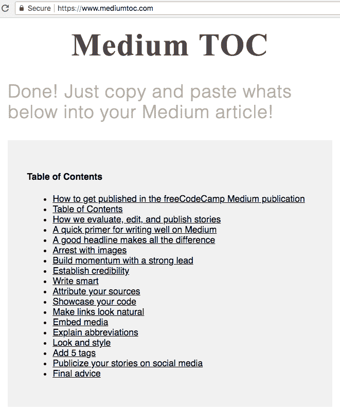
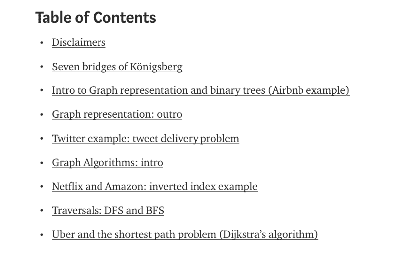
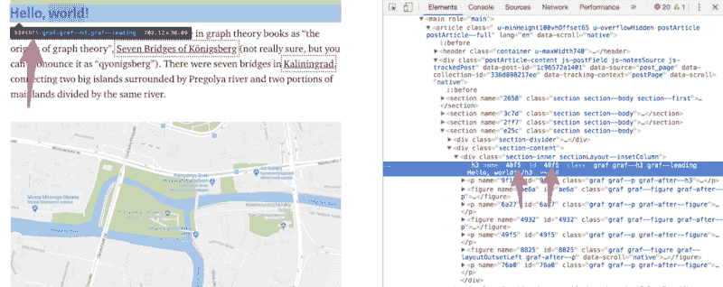

# 如何链接到你的 Medium 文章中的特定段落(2018 目录法)

> 原文：<https://www.freecodecamp.org/news/how-to-link-to-a-specific-paragraph-in-your-medium-article-2018-table-of-contents-method-e66595fea549/>

**2018 年 2 月 26 日更新**:freeCodeCamp 社区的一名成员刚刚构建了一个工具，让这个过程变得极其方便。我推荐你[使用他的网站](https://www.mediumtoc.com/)，而不是使用我在这篇文章中描述的方法。



A screenshot from [mediumtoc.com](https://www.mediumtoc.com/)

我将向您展示如何为您的中型文章制作一个漂亮的超链接目录。这在你的媒体文章中会是这样的:



每个链接都会跳转到文章的特定部分。对于你的读者来说，这是一个重要的可用性改进。尤其是如果你的文章足够长，需要多次阅读才能完成。

在 [freeCodeCamp 媒体出版物](https://medium.freecodecamp.org)上，我们经常发布 20 分钟、40 分钟甚至 60 分钟的文章。我们发现这些目录非常有用。

请注意，我在本文中分享的技术在移动设备上有不同的结果。所以我们希望 Medium 在未来正式加入这个功能。

### 证明这是可行的

通过点击[这个链接](https://medium.com/p/e66595fea549#ddca)，你将回到这篇文章的这个部分。

### 所以你应该这么做。

媒体上的每个标题都是自己的 HTML 元素，有自己的`id`。

要获得标题的`id`，您需要右键单击它，然后单击“inspect”

这将打开你的浏览器的开发者工具。这看起来是这样的:



现在您只需要获得与 HTML 元素相关联的 4 位十六进制代码。在这种情况下，“你好，世界！”航向是`48f5`。

现在，您可以使用该代码创建一个直接链接到该标题的特殊链接。这些链接遵循以下结构:

`https://medium.com/p/[article ID]#[4-digit hexadecimal code]`

*   **商品 ID** 是介质商品的 12 位十六进制代码。这些代码中的一个存在于每个媒体 URL 中。例如，您正在阅读的这篇文章的文章 ID 是`e66595fea549`。继续——检查浏览器的地址栏，您应该会在 URL 中看到这段代码。这个代码是你文章的通用标识符，它永远不会改变——即使你改变你文章的标题或在媒体出版物上发表。
*   **4 位十六进制代码**是您从开发者工具中获得的代码(在本例中为`48f5`)。

这是我之前用来链接回我的“证明这是可行的”部分的 URL:

```
https://medium.com/p/e66595fea549#ddca
```

### 让我们建立一个目录！

这是我之前给你看的目录。每个链接都将链接到同一篇文章的不同部分:

#### 目录

*   [免责声明](https://medium.com/p/1c96572a1401#0239)
*   [柯尼斯堡的七座桥](https://medium.com/p/1c96572a1401#48f5)
*   [图形表示和二叉树介绍(Airbnb 示例)](https://medium.com/p/1c96572a1401#0374)
*   [图形表示:outro](https://medium.com/p/1c96572a1401#fb0c)
*   [Twitter 示例:推文交付问题](https://medium.com/p/1c96572a1401#0cd4)
*   [图形算法:简介](https://medium.com/p/1c96572a1401#fb0c)
*   [网飞和亚马逊:倒排索引示例](https://medium.com/p/1c96572a1401#cdde)
*   [遍历:DFS 和 BFS](https://medium.com/p/1c96572a1401#45f6)
*   [优步和最短路径问题(Dijkstra 算法)](https://medium.com/p/1c96572a1401#aa4d)

### Chrome 扩展使这个过程更容易

作为对这篇文章的回应，[卡杜·德·卡斯特罗·阿尔维斯](https://www.freecodecamp.org/news/how-to-link-to-a-specific-paragraph-in-your-medium-article-2018-table-of-contents-method-e66595fea549/undefined) [创建了一个 Chrome 扩展](https://github.com/castroalves/medium-anchor-url-generator)，使得从不同段落中提取 id 成为一个更加直接的过程。

### 仅此而已。玩得开心，写得开心！

如果你觉得这篇文章有帮助，你应该在 Twitter 上关注我。我只发关于编程和技术的微博，不会浪费你的时间:)