# 如何用图思考:图论及其应用的说明性介绍

> 原文：<https://www.freecodecamp.org/news/i-dont-understand-graph-theory-1c96572a1401/>

作者:瓦尔丹·格里戈良

# 如何用图思考:图论及其应用的说明性介绍

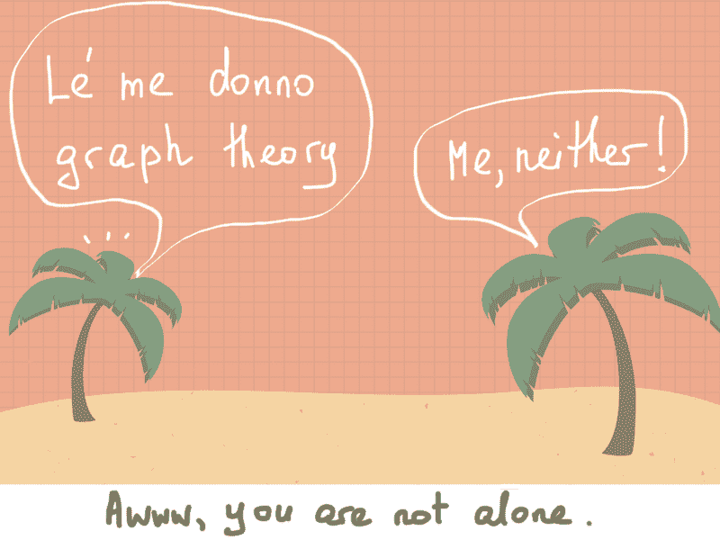

Graph theory can be difficult to understand

图论代表了计算机科学中最重要和最有趣的领域之一。但同时它也是最容易被误解的(至少对我来说是这样)。

理解、使用和思考图表使我们成为更好的程序员。至少我们应该这么想。图是一组顶点 V 和一组边 E，组成一个有序对 G=(V，E)。

在尝试学习图论和实现一些算法时，我经常陷入困境，只是因为它太无聊了。

理解事物的最好方法是理解它的应用。在本文中，我们将展示图论的各种应用。但更重要的是，这些应用程序将包含详细的插图。所以，让我们开始吧。

虽然这种方法可能看起来过于详细(对于经验丰富的程序员来说)，但是请相信我，作为曾经尝试理解图论的人，详细的解释总是比简洁的定义更受欢迎。

所以，如果你一直在寻找一个“绝对不可思议的傻瓜的图论和它的一切教程”，那么你来对地方了。或者至少我希望如此。所以，让我们开始吧。

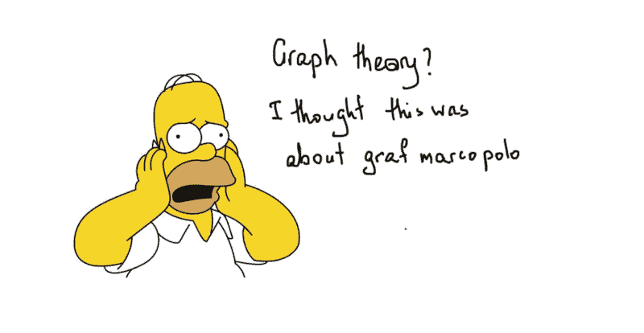

He meant Monte Cristo

### 目录

*   [免责声明](https://medium.com/p/1c96572a1401#0239)
*   [柯尼斯堡的七座桥](https://medium.com/p/1c96572a1401#48f5)
*   图形表示:简介
*   [图形表示和二叉树介绍(Airbnb 示例)](https://medium.com/p/1c96572a1401#0374)
*   [图形表示:Outro](https://medium.com/p/1c96572a1401#fb0c)
*   [Twitter 示例:推文交付问题](https://medium.com/p/1c96572a1401#0cd4)
*   [图形算法:简介](https://medium.com/p/1c96572a1401#fb0c)
*   [网飞和亚马逊:倒排索引示例](https://medium.com/p/1c96572a1401#cdde)
*   [遍历:DFS 和 BFS](https://medium.com/p/1c96572a1401#45f6)
*   [优步和最短路径问题(Dijkstra 算法)](https://medium.com/p/1c96572a1401#aa4d)

### 放弃

**免责声明 1:** *我不是 CS、算法、数据结构，尤其是图论方面的专家。我没有参与本文讨论的公司的任何项目。这些问题的解决方案并不是最终的，还可以大大改进。如果您发现任何问题或不合理的地方，我们非常欢迎您发表评论。如果你在上述公司工作，或者参与了相应的软件项目，请给出实际的解决方案(这对其他人会有帮助)。对所有其他有耐心的读者来说，这是一篇相当长的文章。*

**免责声明 2:** *本文在提供信息的风格上有些不同。有时它可能看起来有点偏离主题，但耐心的读者最终会发现自己对大局有了完整的理解。*

**免责声明 3** : *这篇文章是为广大程序员写的。虽然我的目标读者是初级程序员，但我希望有经验的专业人士也会对它感兴趣。*

### 柯尼斯堡的七座桥

先说我以前经常在讨论“图论的起源”的图论书里碰到的东西，柯尼希斯堡的[七桥](https://en.wikipedia.org/wiki/Seven_Bridges_of_K%C3%B6nigsberg)(不太确定，但是你可以把它读成“qyonigsberg”)。在[加里宁格勒](https://en.wikipedia.org/wiki/Kaliningrad)有七座桥，连接着被普雷戈利亚河环绕的两个大岛和被同一条河分开的大陆的两个部分。

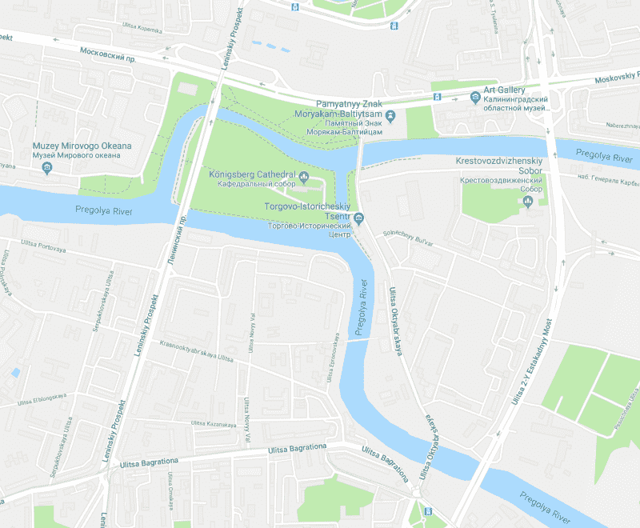

[Our area of interest](https://www.google.com.au/maps/@54.7066964,20.5100082,16z)

在 18 世纪，这里被称为柯尼斯堡(普鲁士的一部分)，上面的地区有更多的桥。柯尼斯堡的桥的问题或者只是一个脑筋急转弯，就是要能够只穿过七座桥一次就能穿过这座城市。那时候他们还没有网络连接，所以应该是娱乐性的。这是 18 世纪柯尼斯堡七座桥的插图。


Seven bridges of Königsberg

试试看。看看你是否能穿过这座城市，每座桥只穿过一次。

*   不应有任何未跨越的桥梁。
*   每座桥不得跨越一次以上。

如果你熟悉这个问题，你就知道这是不可能的。尽管你已经足够努力了，现在你可能会更加努力，但你最终会放弃。


Leonhard Euler (photo from Wikipedia)

有时候放弃得快也是有道理的。欧拉就是这样解决这个问题的——他很快就放弃了。他没有试图解决这个问题，而是采用了一种不同的方法，试图证明不可能只穿过一次每座桥就穿过这座城市。

让我们试着去理解欧拉是怎么想的，他是怎么想出解决方案的(如果没有解决方案，还是需要一个证明)。这在这里是一个真正的挑战，因为走过这样一位德高望重的数学家的思维过程有点不光彩。(令人肃然起敬，以至于克努特和他的朋友们将他们的书《T1》献给了 T2·莱昂哈德·欧拉。我们宁愿假装“像欧拉一样思考”。让我们从想象不可能开始。


有四个不同的地方，两个岛屿和大陆的两部分。和七座桥。有趣的是，我们可以发现连接岛屿或大陆的桥梁数量是否存在某种模式(我们将使用术语“陆地”来指代四个不同的地方)。

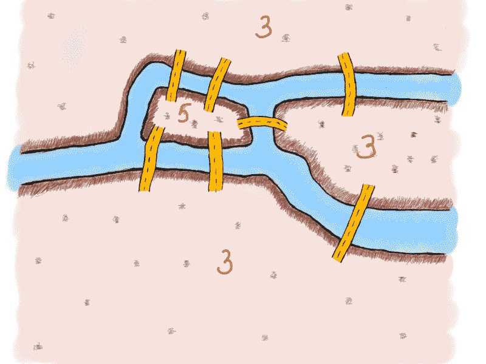

Number of bridges

乍一看，似乎有某种模式。每块土地上都有奇数座桥相连。如果你必须每座桥过一次，那么你可以进入一片有 2 座桥的土地并离开它。


Examples of 2 bridge lands

从上面的插图中很容易看出，如果你通过一座桥进入一片土地，你总是可以通过第二座桥离开这片土地。每当第三座桥出现时，一旦你通过穿过所有的桥进入一片土地，你将不能离开它。如果你试图把这个推理推广到一块土地上，你将能够证明，在桥的数量为偶数的情况下，离开这块土地总是可能的，而在桥的数量为奇数的情况下，则不可能。在脑子里试一下！

让我们添加一个新桥，看看整体连接的桥的数量如何变化，以及它是否解决了问题。

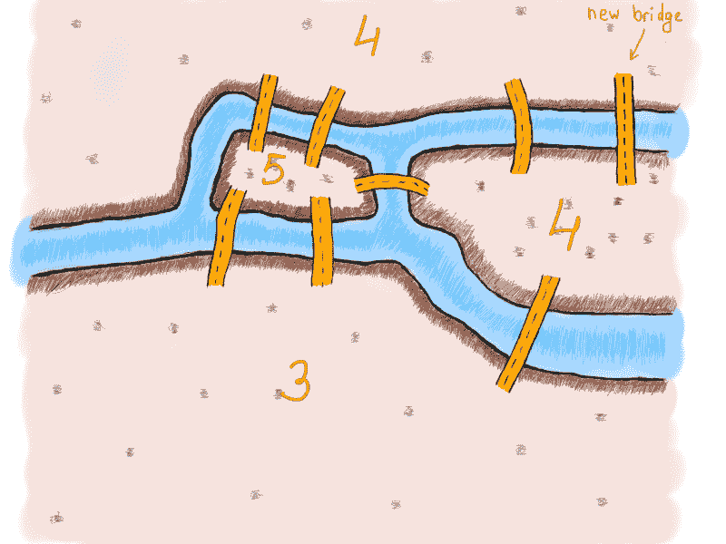

Notice the new bridge

现在我们有两个偶数(4 和 4)和两个奇数(3 和 5)的桥连接四块土地，让我们画一个新的路线，加上这个新桥。

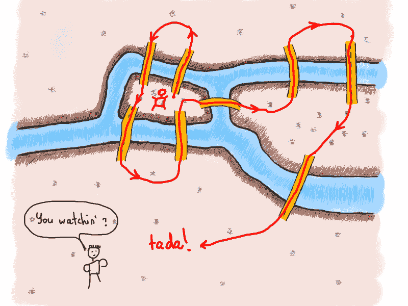

Wow

我们看到偶数和奇数桥的数量在决定解决方案是否可行时起了作用。这里有个问题。桥的数量解决问题了吗？应该一直都是偶数吗？原来是**而不是**这样的情况。欧拉就是这么做的。他发现了一种方法来证明桥的数量很重要。更有趣的是，有奇数个相连桥梁的**地块**的数量也很重要。那时，欧拉开始把陆地和桥梁“转换”成我们所知的图形。下面是表示柯尼斯堡桥问题的图表(注意，我们“临时”添加的桥不在那里)。

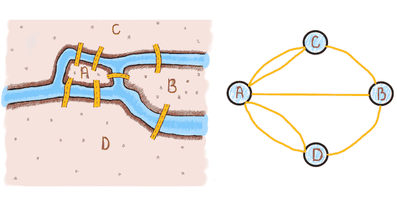

Lines are a bit twisty

需要注意的一件重要事情是问题的概括/抽象。每当你解决一个具体问题的时候，最重要的是把类似问题的解决方法一般化。在这种特殊情况下，欧拉的任务是推广桥梁跨越问题，以便能够在未来解决类似的问题，即世界上所有的桥梁。形象化也有助于从不同的角度看待问题。下图是上述柯尼斯堡桥问题的不同表现。

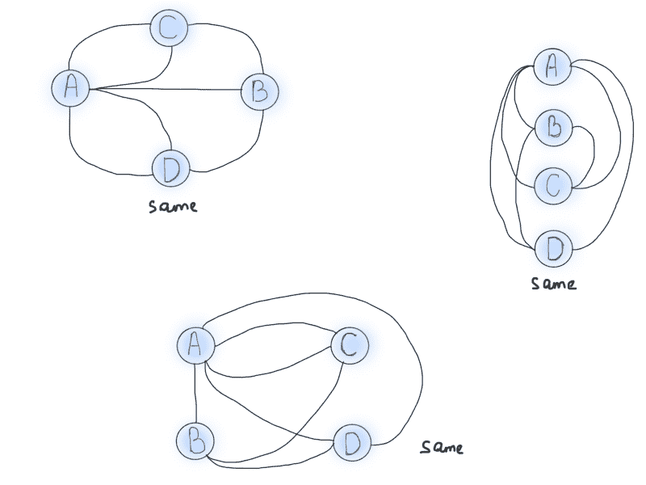

所以，是的，视觉图形是描绘问题的一个很好的选择。但是现在我们需要找出柯尼斯堡问题是如何用图来解决的。注意每圈出来的线数。是的，让我们像经验丰富的专业人士那样命名它们，从现在起我们将称之为圆、**顶点**和连接它们的线、**边**。你可能见过字母符号， **V** 代表(仇杀？)顶点， **E** 为边。

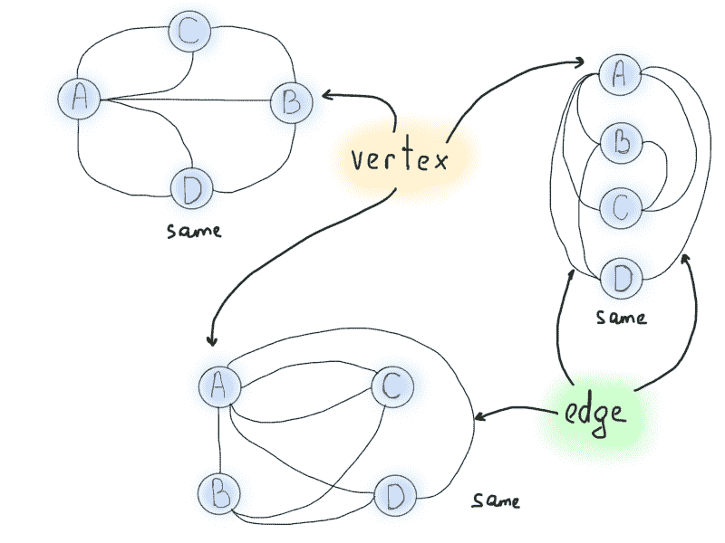

接下来重要的是一个**顶点**的所谓**度**，连接到该顶点的边数**事件**。在上面的例子中，连接到陆地的桥的数量可以表示为图顶点的度数。

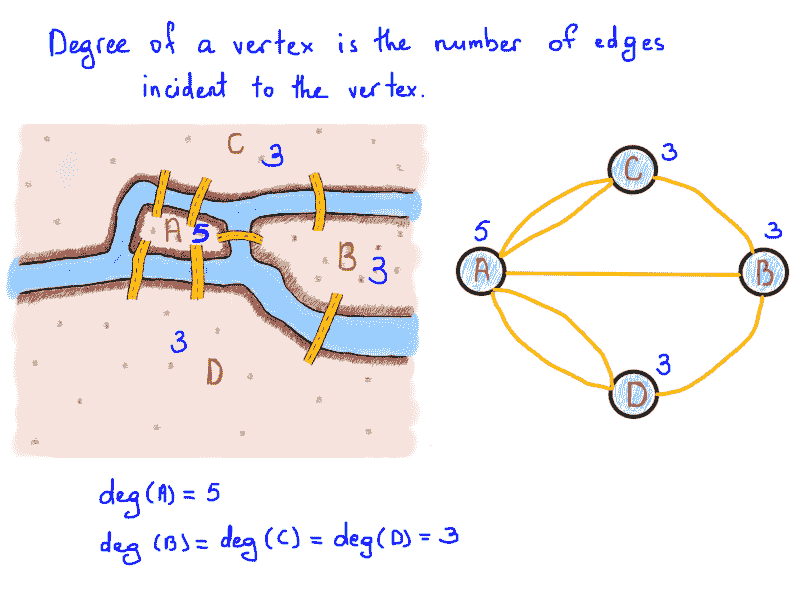

在他的努力中，Euler 证明了遍历图(城市)穿越每条边(桥)一次且仅一次的可能性严格依赖于顶点(陆地)的度数。由这样的边组成的路径被称为(为了纪念他)欧拉路径。欧拉路径的长度是边的数量。准备好一些严厉的语言。？

> 有限无向图 G(V，E)的欧拉路径是指 G 的每条边在其上出现一次的路径。如果 G 有一条欧拉路径，则称它为欧拉图。[1]

> **定理**。一个有限无向连通图是一个欧拉图当且仅当**恰好有两个**顶点是**奇数度**或**所有的**顶点都是**偶数度**。在后一种情况下，图的每条欧拉路径都是回路，而在前一种情况下，没有一条是回路。[1]

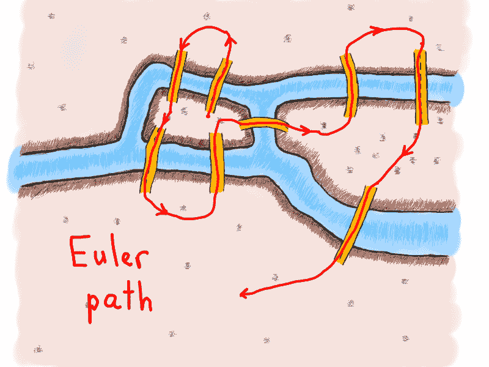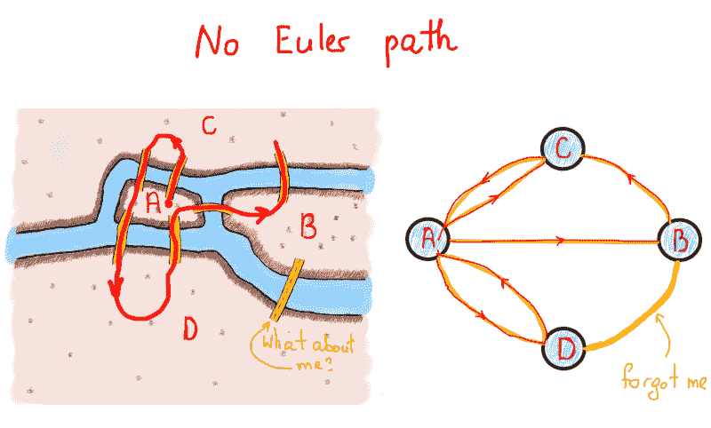

Exactly two vertices have an odd degree in the illustration at the left, and all vertices are of an odd degree in illustration at the right

我用“欧拉路径”而不是“欧拉路径”只是为了与参考书籍[1]的定义保持一致。如果你认识区分欧拉路径和欧拉路径，以及欧拉图和欧拉图的人，让他们知道留下评论。

首先，我们来明确一下上面定义和定理中的新名词。

*   **无向图** -没有特定边方向的图。
*   **有向图** -边有特定方向的图。
*   **连通图** -不存在不可达顶点的图。每对顶点之间一定有一条路径。
*   **不连通图** -有不可达顶点的图。每对顶点之间没有路径。
*   **有限图** -节点和边数有限的图。
*   **无限图形** -一个图形，其中图形的一端在一个特定的方向上延伸到无穷远。

我们将在接下来的段落中讨论其中的一些术语。

图可以是有向的，也可以是无向的，这是图的有趣性质之一。你一定见过一个流行的脸书 vs Twitter 的有向和无向图的例子。脸书友谊关系可以容易地表示为无向图，因为如果爱丽丝是鲍勃的朋友，那么鲍勃也一定是爱丽丝的朋友。没有方向，两者都是彼此的朋友。

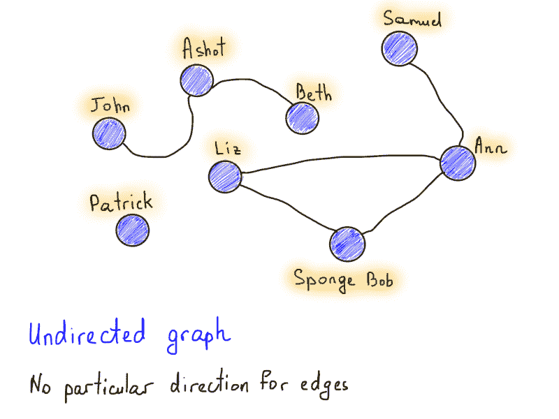

Undirected Graph

还要注意标记为“Patrick”的顶点，它有点特殊(他没有朋友)，因为它没有任何关联边。它仍然是图的一部分，但在这种情况下，我们会说这个图是不连通的，它是一个**不连通的图**(同样适用于“约翰”、“阿肖特”和“贝丝”，因为它们相互连接，但与其他图分离)**。**在一个**连通的**图中没有不可达的顶点，每对顶点之间一定有一条路径。

与脸书的例子相反，如果爱丽丝在推特上关注鲍勃，那并不要求鲍勃也关注爱丽丝。所以一个“跟随”关系必须有一个方向指示器，显示哪个顶点(用户)有一个有向边(跟随)到另一个顶点。


现在，知道了什么是**有限** **连通** **无向图**之后，让我们回到欧拉图:

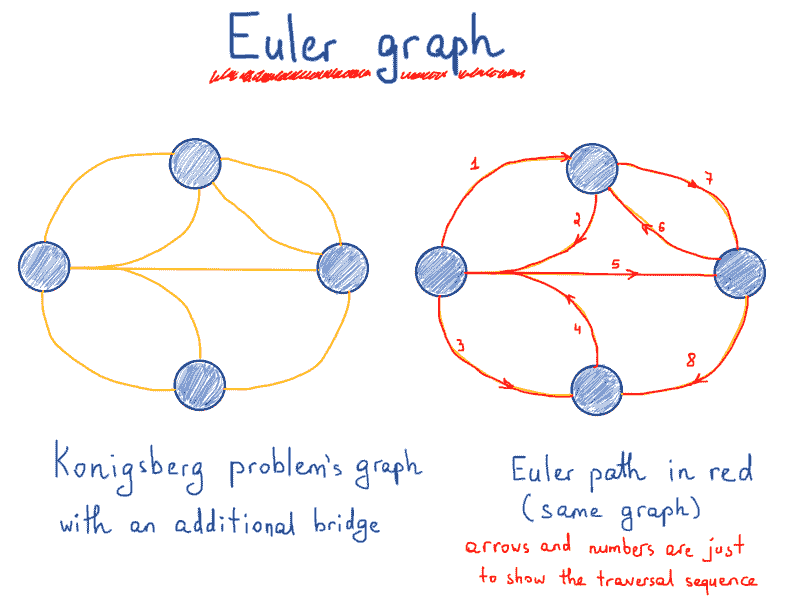

那么，我们当初为什么要讨论柯尼斯堡桥问题和欧拉图呢？嗯，这并不无聊，通过调查问题和前述解决方案，我们触及了图形背后的元素(顶点、边、有向、无向)，避免了枯燥的理论方法。不，我们还没有完成欧拉图和上面的问题。？

我们现在应该转向图形的计算机表示，因为这是我们程序员感兴趣的话题。通过在计算机程序中表示一个图，我们将能够设计一种算法来追踪图的路径，并因此找出它是否是欧拉路径。在此之前，试着想一个欧拉图的好的应用(除了摆弄桥梁)。

### 图形表示:简介

现在这是一个相当繁琐的任务，所以要有耐心。还记得数组和链表之争吗？如果需要快速的元素访问，请使用数组；如果需要快速的元素插入/删除，请使用列表，等等。我几乎不相信你曾经纠结于“如何表示列表”这样的事情。在图形的情况下，实际的表示真的很麻烦，因为首先你应该决定如何准确地表示一个图形。相信我，你不会喜欢的。邻接表，邻接矩阵，也许是边列表？扔硬币。

你应该使劲扔，因为我们从一棵树开始。你一定至少见过一次二叉树(或简称 BT)(以下不是二叉树**搜索**树)。

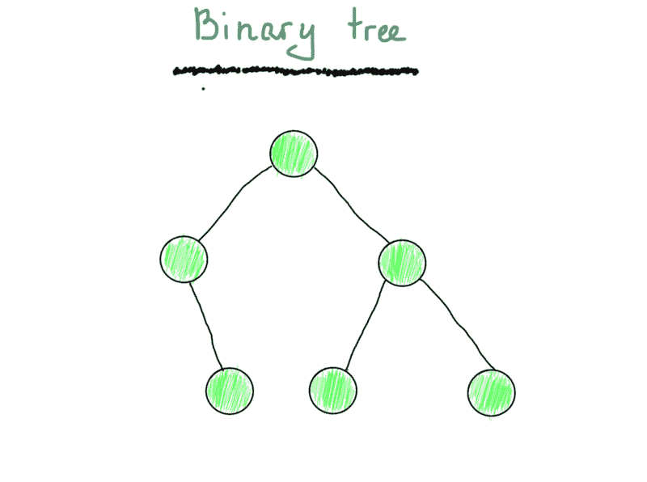

Just a sample

因为它由顶点和边组成，所以它是一个图。您可能还记得二叉树最常见的表示方式(至少在教科书中)。

对于已经熟悉二叉树的人来说，这可能显得太基础了，但是我仍然必须举例说明，以确保我们在同一页上(注意，我们仍然在处理伪代码)。

如果你不熟悉树木，请仔细阅读上面的伪代码，然后按照下图中的步骤操作。

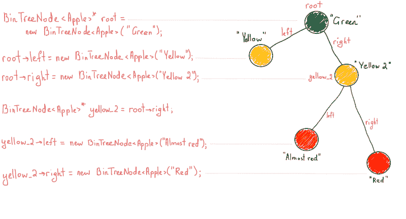

Colors are just for bright visualization

而二叉树是节点的简单“集合”,每个节点都有左右子节点。二叉查找树更有用，因为它应用了一个允许快速键查找的简单规则。二分搜索法树(BST)按排序顺序保存它们的键。您可以自由地用您想要的任何规则实现您的 BT(尽管它可能会根据规则改变它的名称，例如，min-heap 或 max-heap)。对 BST 最重要的期望是它满足**二分搜索法**属性(这就是这个名字的由来)。每个节点的键必须是**大于其左子树中的任意键**并且**小于其右子树中的任意键**。

我想指出一个关于“大于”的非常有趣的观点，这对于理解 BST 的功能至关重要。每当您将该属性更改为“大于或等于”时，您的 BST 将能够在插入新节点时保存重复的键，否则它将只保留具有唯一键的节点。你可以在网上找到非常好的关于二分搜索法树的文章。我们不会提供二叉查找树的完整实现，但为了保持一致，我们将在这里演示一个简单的二叉查找树。

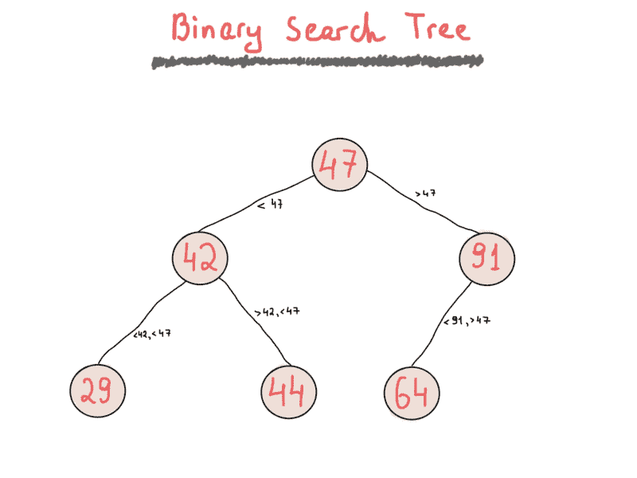

### 图形表示和二叉树介绍(Airbnb 示例)

树是非常有用的数据结构。您可能没有在项目中从头开始实现树。但是你可能已经使用过了，甚至没有注意到。让我们看一个人工但有价值的例子，并尝试回答“为什么”的问题，“为什么首先使用二叉查找树”。

正如你已经注意到的，在二叉查找树有一个“搜索”。所以基本上，所有需要快速查找的东西，**应该放在二叉查找树中。“应该”并不意味着必须，编程中要记住的最重要的事情是用合适的工具解决问题。在很多情况下，简单的 O(N)查找链表可能比 O(logN)查找的 BST 更好。**

通常我们会使用 BST 的库实现，在 C++中很可能是 std::set 或 std::map。然而，在本教程中，我们可以自由地**重新发明**我们自己的轮子。BST 几乎可以在任何通用编程语言库中实现。你可以在你喜欢的语言的相应文档中找到它们。接近一个“现实生活中的例子”，这里是我们将尝试解决的问题- Airbnb 房屋搜索。


A glimpse on Airbnb Homes Search

我们如何尽可能快地用一堆过滤器基于一些查询来搜索房屋？这是一项艰巨的任务。如果我们考虑到 Airbnb 存储了[400 万个房源](https://press.atairbnb.com/app/uploads/2017/08/4-Million-Listings-Announcement-1.pdf)，这就变得更难了。

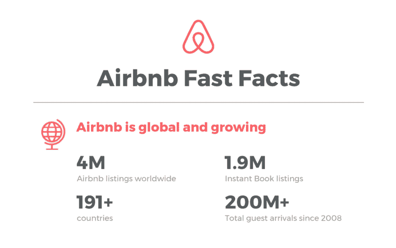

因此，当用户搜索房屋时，他们有可能“接触”存储在数据库中的 400 万条记录。当然，搜索结果仅限于网站主页上显示的“热门列表”,用户几乎从来没有足够的好奇心去查看数百万的列表。我没有任何关于 Airbnb 的分析，但我们可以在编程中使用一个强大的工具，叫做“假设”。所以我们会假设单个用户最多查看~1K 家就找到了好的家。

这里最重要的因素是实时用户的数量，因为它对数据结构和数据库选择以及整个项目架构都有影响。显而易见，如果总共只有 100 个用户，那么我们可能一点也不担心。

相反，如果用户总数，尤其是实时用户的数量远远超过百万阈值，我们必须非常明智地考虑每个决定。“每个”都用得恰到好处，这就是为什么公司在努力提供卓越服务的同时雇佣最好的人。

谷歌、脸书、Airbnb、网飞、亚马逊、Twitter 和许多其他公司都在处理海量数据，而每秒向数百万实时用户提供数百万字节数据的正确选择是从雇佣正确的工程师开始的。这就是为什么我们这些程序员在可能的面试中纠结于这些数据结构、算法和问题解决，因为他们需要的只是工程师有能力以最快、最有效的方式解决这样的大问题。

这是一个用例。一个用户访问主页(我们仍在谈论 Airbnb ),试图筛选出最合适的房屋。我们将如何处理这个问题？(注意，这个问题是后端的，所以我们不会关心前端或网络流量或 http 上的 https 或 home cluster 上的 Amazon EC2 等等)。

首先，我们已经熟悉了程序员库存中最强大的工具之一(谈论假设而不是抽象)，让我们从几个假设开始:

*   我们正在处理完全适合内存的数据。
*   我们的内存足够大。

大到可以装，嗯，多少？这是个好问题。需要多少内存来存储实际数据。如果我们正在处理 400 万个单元的数据(再次假设)，并且如果我们可能知道每个单元的大小，那么我们可以很容易地得出所需的内存大小，即 4M * sizeof(one_unit)。

让我们考虑一个“家”对象及其属性。实际上，让我们在解决我们的问题时至少考虑那些我们将处理的属性(一个“家”是我们的单元)。我们将用一些伪代码将其表示为 C++结构。您可以很容易地将其转换为 MongoDB 模式对象或任何您想要的对象。我们只讨论属性名和类型(试着考虑使用位域或位集来节省空间)。

上述结构并不完美(显然)并且有许多假设和/或不完整的部分。我只是查看了 Airbnb 的过滤器，并设计了应该存在的属性列表，以满足搜索查询。这只是一个例子。

现在我们应该计算每个`AirbnbHome`对象将占用多少内存字节。

*   **Home name** - `name`是一个支持多语言名称/头衔的`wstring`，这意味着每个字符将占用 2 个字节(如果我们使用其他语言，我们可能不在乎字符大小，但在 C++ `char`中是 1 字节字符，`wchar`是 2 字节字符)。快速浏览一下 Airbnb 的列表，我们可以假设房屋的名称应该包含多达 100 个字符(尽管大多数情况下是 50 个字符左右，而不是 100 个)，我们将假设最大值为 100 个字符，这将产生大约 200 字节的内存。`uint`是 4 个字节，`uchar`是 1 个字节，`ushort`是 2 个字节(同样，在我们的假设中)。
*   照片(据我所知，这种假设对 Airbnb 来说最有可能是真的，但同样，亚马逊 S3 也只是一种假设)
*   **照片网址** -我们有这些照片网址，考虑到网址没有标准的大小限制，但事实上有一个众所周知的限制 **2083** 个字符，我们将把它作为任何网址的最大大小。因此，考虑到每个家庭平均有 5 张照片，这将需要大约 10Kb。
*   **照片 id**——让我们重新考虑一下这个问题。通常存储服务使用相同的基本 URL 提供内容，比如`http(s)://s3.amazonaws.com/<bucket>/&l`t；对象>，也就是说，有一个构建 URL 的通用模式，我们只需要存储实际的照片 ID。假设我们使用某个惟一 ID 生成器，它返回一个 20 字节的惟一字符串 ID，其中包含照片对象和特定照片的 URL 模式 `looks like https://s3.amazonaws.com/some-know-bucket/<u` nique-photo-id >。这给了我们很好的空间效率，所以为了存储五张照片的字符串 id，我们只需要 100 字节的内存。
*   **主机 ID**——同样的“技巧”(如上)也可以用`host_id`来完成，也就是说，作为主机的用户 ID 占用 20 个字节的内存(*实际上，我们可以只对用户使用整数 ID，但是考虑到一些 DB 系统，比如 MongoDB，有相当特定的唯一 ID 生成器，我们假设一个 20 字节长的字符串 ID 作为一些“中间”值，只需稍加修改就可以适用于几乎任何 DB 系统。Mongo 的 ID 长度是 24 字节*。最后，我们将一个大小为 32 位的位集作为一个 4 字节对象，一个大小在 32 到 64 位之间的位集作为一个 8 字节对象。注意假设。在这个例子中，我们对任何表示枚举的属性使用了 bitset，但是它可以接受多个值，换句话说，就是一种多选复选框。


Airbnb House Amenities

**便利设施** -每个 Airbnb 家庭都有一个可用便利设施的列表，例如“熨斗”、“洗衣机”、“电视”、“wifi”、“衣架”、“烟雾探测器”，甚至“笔记本电脑友好工作区”等等。可能有超过 20 个便利设施，我们坚持 20 个，只是因为这是 Airbnb 过滤器页面上可过滤的便利设施的数量。如果我们对便利设施保持适当的排序，Bitset 可以为我们节省一些空间。例如，如果一个家庭有所有上述设施(见截屏中勾选的设施)，我们将只在位集中的相应位置设置一个位。

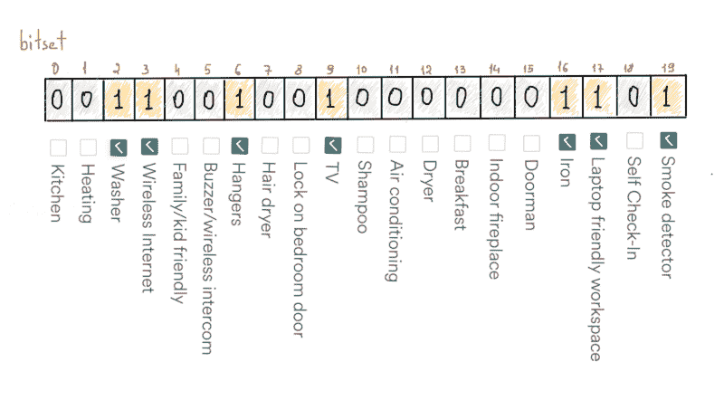

Bitset allows to save 20 different values using just 20 bits

例如，检查家中是否有“洗衣机”:

或者更专业一点:

您可以尽可能地改进代码(并修复编译错误)。我们只是想在这个问题环境中强调位集背后的思想。

*   **家规、家庭类型**——同样的想法(我们为便利设施领域实现的)适用于“家规”、“家庭类型”等。
*   **国家代码、城市名称**——最后是国家代码和城市名称。正如上面代码的注释中提到的(参见备注)，我们不会存储纬度和经度以避免地理空间查询(*另一篇文章的主题*)。相反，我们保存国家代码和城市名称，以通过位置缩小搜索范围(为了简单起见，省略了街道，请原谅)。[国家代码](https://en.wikipedia.org/wiki/Country_code)可以用 2 个字符、3 个字符或 3 个数字来表示，我们将保存一个数字表示，并用一个`ushort`来表示。(联合国)幸运的是，城市比国家多得多，所以我们不能使用“城市代码”(尽管我们可以制定一个供内部使用)。相反，我们将存储实际的城市名称，为城市名称和超级特定的情况平均保留 50 个字节，如[taumatawhakatangihangakoauotamateaturipukakapikimaungahoronukupokaiwhenuakitanatahu](https://en.wikipedia.org/wiki/Taumatawhakatangihangakoauauotamateaturipukakapikimaungahoronukupokaiwhenuakitanatahu)(85 个字母的城市)。我们最好使用一个额外的布尔变量来指示这是那个特定的超长城市(不要试图去发音)。记住字符串和向量的内存开销。我们将在结构的最终大小上增加额外的 32 个字节(以防万一)。我们还将假设我们在 64 位系统上工作，尽管我们为`int`和`short`选择了非常紧凑的值。

因此， **420** +字节，开销为 **32** 字节， **452** 字节，考虑到你们中的一些人可能会痴迷于对齐因子，让我们将其四舍五入为 **500 字节**。所以每个“home”对象占用多达 500 字节，对于所有 home 列表(*列表计数和实际 home 计数可能会有些混乱，如果我弄错了就告诉我*)，500 字节* 400 万= 1.86GB ~ **2GB** 。似乎有道理。我们在构造结构的时候做了很多假设，使得在内存中保存更便宜，我真的期望超过 2gb，如果我在计算中犯了错误，让我知道。不管怎样，向前看，无论我们要用这些数据做什么，我们都需要至少 2 GB 的内存。如果你厌倦了，就去解决它。我们才刚刚开始。

现在任务最困难的部分。为这个问题选择正确的数据结构(尽可能高效地过滤列表)并不是最困难的任务。最困难的任务是(对我来说)通过一堆过滤器来搜索列表。如果只有一个搜索关键字(只有一个过滤器)，我们会很容易解决它。假设用户唯一关心的是价格，那么我们所需要的就是找到价格在给定范围内的`AirbnbHome`物品。如果我们用一个二叉查找树来做这个，下面是它可能的样子。

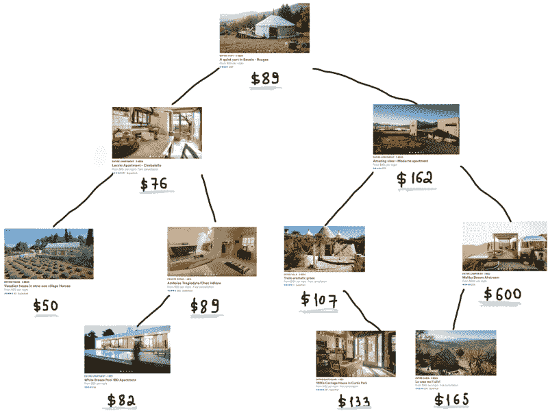

如果你想象所有 400 万个物体，这棵树会变得非常非常大。顺便说一下，内存开销也会增加，因为我们使用了 BST 来存储对象。由于每个父树节点都有两个指向其左右子节点的额外指针，因此每个子节点指针总共有 8 个额外字节(假设是 64 位系统)。对于 400 万个节点，它总计为 **~62 Mb** ，与 2Gb 的对象数据相比，这看起来相当小，尽管这不是我们可以轻易“忽略”的东西。

到目前为止，最后一个图中的树显示，任何项目都可以在 O(logN)复杂度中轻松找到。如果你对 big-ohs 不熟悉或不确定，我们将在下面澄清，否则跳过复杂性小节。

算法复杂性 -让我们长话短说，因为在下一篇文章中会有一个长而详细的解释:“算法复杂性和软件性能:丢失的手册”。在大多数情况下，找到算法的大 O 复杂度是比较容易的。首先要注意的是，我们总是考虑最坏的情况，即一个算法产生一个积极结果(解决问题)的最大运算次数。

假设一个数组有 100 个未排序的元素。要进行多少次比较才能找到一个元素(还要考虑到所需的元素可能会丢失)？这将需要多达 100 次比较，因为我们应该将每个元素的值与我们正在寻找的值进行比较。尽管元素可能是数组中的第一个元素(导致单一比较)，我们将只考虑最坏的可能情况(元素要么丢失，要么位于数组的最后一个位置)。

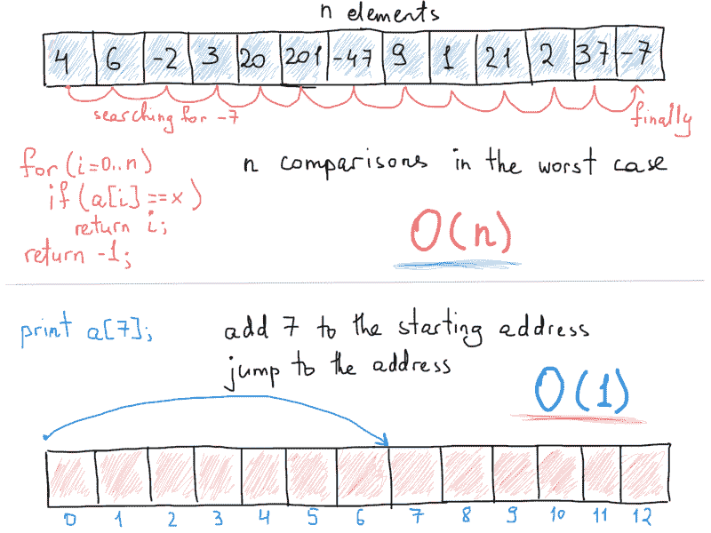

“计算”算法复杂度的要点是在运算的**数量**和输入的**大小**之间找到一个**依赖关系**，例如上面的数组有 100 个元素，运算的数量也是 100，如果数组元素(它的输入)的数量将增加到 1423，查找任何元素的操作数量也将增加到 1423(最坏的情况)。因此，在这种情况下，输入和操作数之间的细线很明显，这就是所谓的**线性**，操作数的增长与数组输入的增长一样多。成长。这是复杂性的关键点，我们说在未排序的数组中搜索一个元素需要 O(N)时间是为了强调找到它的过程将需要多达 N 次操作(甚至多达 N 次操作乘以某个常量值如 3N)。另一方面，访问数组中的任何元素需要一个常数时间，即 O(1)。这是因为数组的结构。它是一个连续的数据结构，包含相同类型的元素(mind JS 数组)，所以“跳转”到一个特定的元素只需要计算它与数组的第一个元素的相对位置。

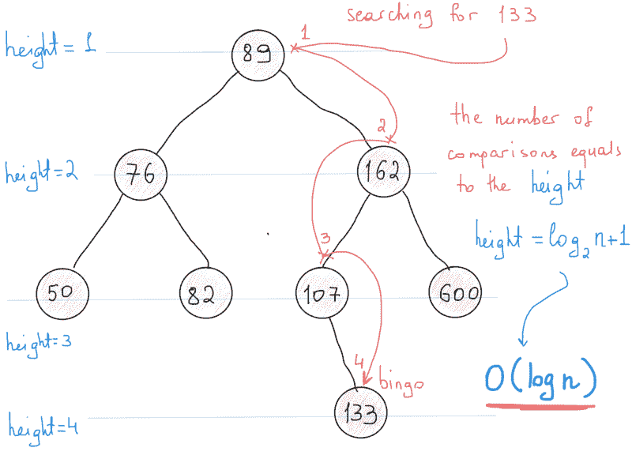

有一点非常清楚。二叉查找树按排序顺序保存其节点。那么在二叉查找树中搜索一个元素的算法复杂度是多少呢？我们应该计算找到一个元素所需的运算次数(在最坏的情况下)。

看上面的插图。当我们从根开始搜索时，第一次比较可能导致三种情况，

1.  找到了节点。
2.  如果所需的元素小于节点的值，则比较继续到节点的左侧子树
3.  如果我们搜索的值大于节点的值，比较将继续到节点的右子树。

在每一步，我们将需要考虑的节点的大小减少一半。在 BST 中查找元素所需的操作(即比较)数量等于树的高度。树的高度是最长路径上的节点数。在这种情况下是 4。而高度是[base 2] logN + 1，如图所示。所以搜索的复杂度是 O(logN + 1) = O(logN)。这意味着在 400 万个节点中搜索某个东西，在最坏的情况下需要 log4000000 = ~ **22** 次比较。

**回树** -二叉查找树中的元素访问时间为 O(logN)。为什么不用哈希表？哈希表有固定的访问时间，这使得几乎在任何地方使用哈希表都是合理的。

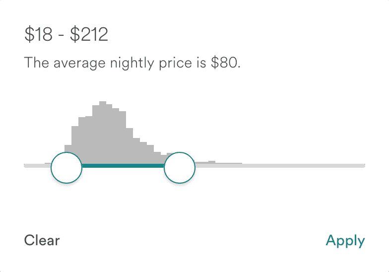

在这个问题中，我们必须考虑一个重要的要求。我们必须能够进行范围搜索，例如价格从 80 美元到 162 美元的房屋。在 BST 的情况下，只需对树进行有序遍历并保存一个计数器，就可以很容易地得到一个范围内的所有节点。对于 hashtable 来说，这有点昂贵，因此在这种情况下坚持使用 BST 是合理的。

尽管还有另一个地方，让我们重新思考散列表。密度。价格不会“永远”上涨，大多数房屋的价格都在同一区间。请看截图，直方图向我们展示了价格的真实情况，数百万套房屋都在同一范围内(+/-18 美元- $212 美元)，它们的平均价格相同。简单的数组可能会起到很好的作用。假设一个数组的索引是价格，值是房屋列表，我们可以在固定时间内访问任何价格范围(嗯，几乎是固定的)。下面是它的样子(非常抽象):

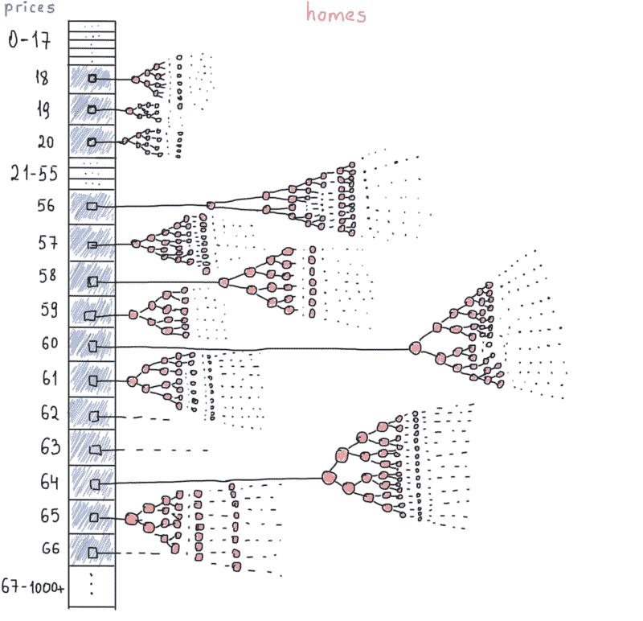

就像散列表一样，我们通过价格来访问每套房子。所有价格相同的房屋都归入一个单独的 BST。如果我们存储 home IDs 而不是上面定义的整个对象(`AirbnbHome` struct ),也会节省一些空间。最可能的情况是将所有 homes full 对象保存在一个 hashtable 中，将 home ID 映射到 home full 对象，并存储另一个 hashtable(或者更好的是一个数组),它将价格与 homes ID 进行映射。

因此，当用户请求一个价格范围时，我们从价格表中获取 home ID，将结果切割成固定大小(即分页，通常在一页上显示大约 10 - 30 个项目)，使用每个 home ID 获取完整的 home 对象。

只需记住另一件事(在背景中想一想)。平衡对于 BST 至关重要，因为这是在 O(logN)中完成树操作的唯一保证。当您按排序顺序插入元素时，BST 不平衡的问题就很明显了。最终，树变成了一个链表，这显然导致了线性时间操作。暂时忘记这一点，假设我们所有的树都完全平衡。再看一下上面的插图。每个数组元素代表一棵大树。如果我们把插图改成这样会怎么样:

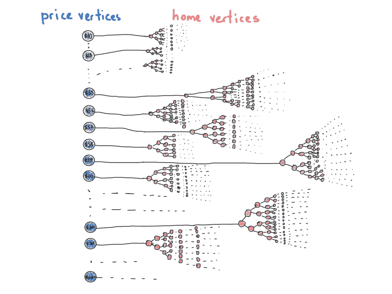

More like a graph

它类似于一个“更真实”的图表。这幅图展示了最隐蔽的数据结构和图形，这将把我们带到下一节。

### 图形表示:Outro

关于图形的坏消息是图形表示没有一个单一的定义。这就是为什么你在图书馆找不到一本`std::graph`。我们已经有机会表示一个名为 BST 的“特殊”图形。关键是，树是图，但图不是树。最后一个例子向我们展示了在一个抽象下我们有许多树，“价格与房屋”和一些顶点在它们的类型上“不同”,价格是只有价格值的图节点，并且引用满足特定价格的房屋 id(房屋顶点)的整个树。它更像是一种混合数据结构，而不是我们习惯于在教科书示例中看到的简单图形。

这是图表示中的关键点，图表示没有固定的和“法律上的”结构(不像 BST，它们使用左/右子指针指定基于节点的表示，尽管您可以用单个数组表示 BST)。你可以用你希望的最方便的方式(对特定问题最方便)来表示一个图，主要是你把它“看”成一个图。我们所说的“查看图表”是指应用特定于图表的算法。

那么一棵 N 叉树呢，它更像一个图。

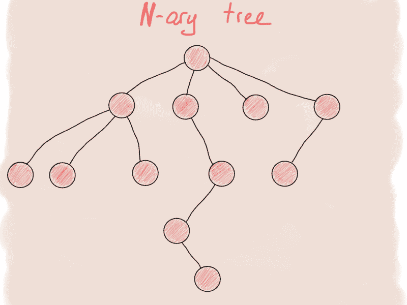

首先想到的表示 N 元树节点的东西是这样的:

这个结构仅仅代表了树的一个节点。完整的树看起来更像这样:

这个类是围绕一个名为`root_`的树节点的抽象。这就是我们建造任何大小的树所需要的。这是树的起点。为了添加一个新的树节点，我们需要为它分配一个内存，并将该节点添加到树的根节点。

一个图很像一棵 N 叉树，只是略有不同。试着发现它。

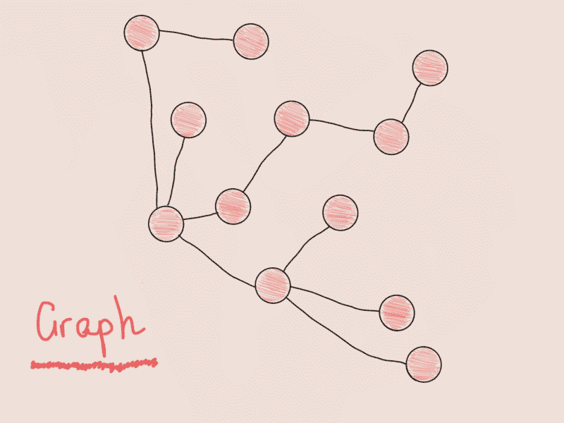

这是图表吗？不。我的意思是是的，但它是前一幅图中的同一棵 N 元树，只是稍微旋转了一下。作为一个经验法则，无论何时你看到一棵树(即使它是一棵苹果树、柠檬树或二叉查找树)，你可以肯定它也是一个图。所以，为一个图形节点(图形顶点)设计一个结构，我们可以得出同样的结构:

这足以构建一个图形吗？嗯，不。原因如下。看看前面两张图，找出不同之处:


Both are graphs

左侧插图中的图形没有单点可以“进入”(与其说是一棵树，不如说是一片森林)，相反，右侧插图中的图形没有不可到达的顶点。听起来很熟悉。

> 当每对顶点之间有一条路径时，一个图就是**连通的**。[ [维基百科](https://en.wikipedia.org/wiki/Connectivity_(graph_theory)) ]

显然，在“价格与房屋”图的每一对顶点之间没有路径(如果从图中不明显，就假设价格彼此不相关)。虽然这只是一个例子，表明我们不能用单个 GraphNode 结构来构造一个图，但有些情况下我们必须处理像这样的不连通图。看一看这个类:

就像 N 元树是围绕单个节点(根节点)构建的一样，连通图也可以围绕根节点构建。据说树是“有根的”，也就是说，它们有一个起点。一个连通图可以被表示为一个有根的树(有几个更多的属性)，这是显而易见的，但是请记住，实际的表示可能因算法而异，因问题而异，即使对于一个连通图也是如此。但是，考虑到图的基于节点的性质，不连接的图可以表示为如下形式:

对于像 DFS/BFS 这样的图遍历，使用树状表示是很自然的。很有帮助。然而，像有效路径跟踪这样的情况需要不同的表示。还记得欧拉图吗？为了追踪一个图的“欧拉性”，我们应该在图中描绘一条欧拉路径。这意味着通过只遍历每条边一次来访问所有顶点，当跟踪完成并且我们有未遍历的边时，那么该图没有欧拉路径，因此不是欧拉图。

还有更快的方法，我们可以检查顶点的度数(假设每个顶点存储其度数)，正如定义所说，如果一个图有奇数度数的顶点，并且不正好有两个，那么它不是一个欧拉图。这种检查的复杂度是 O(|V|)，其中|V|是图顶点的数量。我们可以在插入新边的同时追踪奇/偶度，以将奇/偶度检查增加到 O(1)。快如闪电。没关系，我们只是去描个图，就这样。下面是一个图形的表示和返回路径的 Trace()函数。

小心虫子，到处都是虫子。这段代码包含了很多假设，例如，标签，所以通过一个顶点我们理解了一个字符串标签。当然，你可以很容易地将其更新为你想要的任何东西。在这个例子中并不重要。接下来，命名。正如评论中提到的，VELOGraph 是用于顶点边标签的唯一图形(这是我编的)。关键是，这个图形表示包含一个表，用于映射顶点标签和与该顶点关联的边，以及一个边列表，该列表包含一对顶点(由特定边连接)和一个仅由 Trace()函数使用的标志。看看 Trace()函数的实现。它使用 edge 的标志来标记已经遍历过的边(在任何 Trace()调用之后，标志应该被重置)。

### Twitter 示例:Tweet 传递问题

这是另一种叫做邻接矩阵的表示法，它在有向图中很有用，就像我们在推特粉丝图中使用的一样。


Directed graph

在这个 Twitter 示例中有 8 个顶点。因此，我们只需要用一个|V|x|V|方阵(|V|行数和|V|列数)来表示这个图形。如果从 **v** 到 **u** 有一条有向边，那么 matrix 的【v】【u】就是`true`，否则就是`false`。

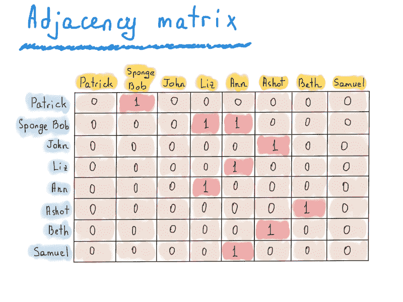

Twitter’s example

如你所见，这个矩阵太稀疏了，它的代价是快速访问。要查看 Patrick 是否跟随海绵宝宝，我们只需检查`matrix["Patrick"]["Sponge Bob"]`的值。要获得 Ann 的关注者列表，我们只需处理整个“Ann”列(标题为黄色)。为了找到谁被海绵宝宝跟踪(听起来很奇怪),我们处理整行“海绵宝宝”。邻接矩阵也可以用于无向图，并且如果存在从 **v** 到 **u** 的边，我们应该将两个值都设置为 1，例如 adj_matrix[v][u] = 1，adj_matrix[u][v] = 1。无向图的邻接矩阵是对称的。

注意，我们可以存储一些“更有用”的东西，比如**边权重**，而不是在邻接矩阵中存储 1 和 0。最好的例子之一可能是带有距离信息的地点图。

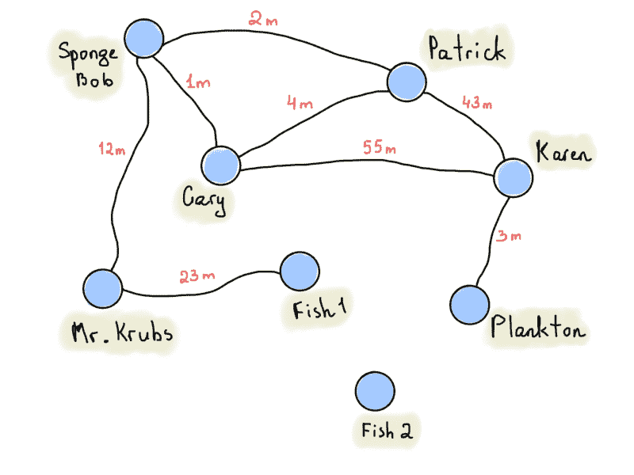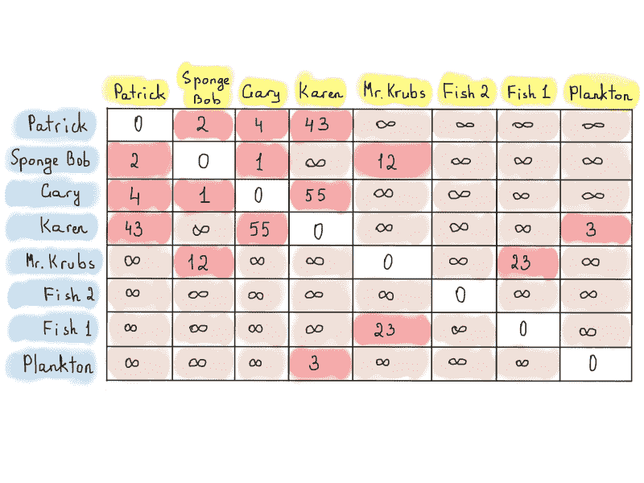

上图表示帕特里克、海绵宝宝和其他人的房子之间的距离(也称为**加权图**)。如果顶点之间没有直接的路线，我们就标上“无限”的符号。这并不意味着根本没有路线，同时也不意味着一定有路线。它可以在应用寻找顶点之间的路径的算法时被定义(有更好的方法来存储顶点和与之相关的边，称为关联矩阵)。


82000Tb. [Photo source](http://www.independent.co.uk/arts-entertainment/tv/news/the-simpsons-death-episode-will-be-bigger-than-game-of-thrones-9304810.html)

虽然邻接矩阵似乎是 Twitter followes 图的一个很好的用途，但为近 3 亿用户(每月活跃用户)保存一个方阵需要 300 * 300 * 1 字节(存储布尔值)。也就是~82000 Tb(太字节)，也就是 1024 * 82000 Gb。嗯，不知道你的家庭集群，我的笔记本电脑没有这么多内存。比特集？一个[位板](https://github.com/vardanator/ultron/blob/master/src/arrays/bitboard.h)可以帮我们一点忙，将所需的大小减少到大约 10000 Tb。还是太大了。如上所述，邻接矩阵过于稀疏。它迫使我们使用比实际需要更多的空间。这就是为什么使用与顶点相关的边的列表可能是有用的。重点是，邻接矩阵允许我们保留“跟随”和“不跟随”信息，而我们所需要的只是知道关于跟随的信息，就像这样:

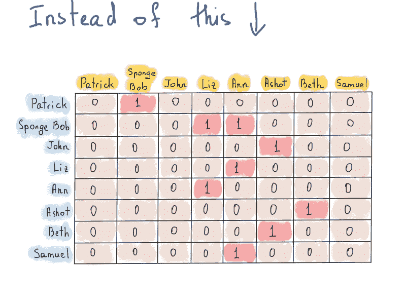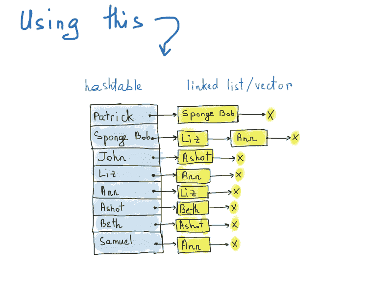

Adjacency matrix vs adjacency list

右边的插图叫做[邻接表](https://en.wikipedia.org/wiki/Adjacency_list)。每个列表描述了图中顶点的邻居集。顺便说一下，作为邻接表的图形表示的实际实现也是不同的(荒谬的事实)。在插图中，我们强调了哈希表的用法，这是合理的，因为任何顶点的访问都将是 O(1)，对于相邻顶点的列表，我们没有提到确切的数据结构，从链表到向量。选择权在你。

关键是，要找出 Patrick 是否跟随 Liz，我们应该访问哈希表(常数时间)并遍历列表中的所有项目，将每个元素与“Liz”元素(线性时间)进行比较。线性时间在这一点上并没有那么糟糕，因为我们只需要循环与“Patrick”相邻的固定数量的顶点。空间复杂度呢，在 Twitter 上用可以吗？我们至少需要 3 亿条哈希表记录，每条记录指向一个向量(选择向量是为了避免链表左/右指针的内存开销),包含多少？这里没有统计数据，只找到平均 707 名推特粉丝(谷歌搜索)。

因此，如果我们考虑每个哈希表记录指向一个 707 个用户 id 的数组(每个用户 id 重 8 个字节)，让我们假设哈希表的开销只是它的键，也是用户 id，所以哈希表本身占用 3 亿* 8 个字节。总的来说，哈希表有 3 亿* 8 字节+每个哈希表键有 707 * 8 字节，也就是 3 亿* 8 * 707 * 8 字节= **~12 Tb** 。嗯，不能说感觉更好，但是的，感觉比 10，000 Tb 好得多。

老实说，我不知道这个 12Tb 是不是一个合理的数字。但是考虑到我在一台具有 32 Gb 内存的专用服务器上花费了大约 30 美元，那么，存储(分片)12 Tb 至少需要 385 台这样的服务器，加上几台控制服务器(用于数据分发控制),总数达到 400 台。所以这将花费我 12K(每月)。

嗯，考虑到数据应该被复制，而且总会出错，我们将把服务器数量增加两倍，然后再增加一些控制服务器，假设我们至少需要 1500 台服务器，这将花费我们每月 45，000 美元。嗯，对我来说肯定不好，因为我几乎不能保持一个服务器，但对 Twitter 来说似乎没问题(与真正的 Twitter 服务器相比，这真的不算什么)。让我们假设它对 Twitter 真的没问题。

现在，我们没事吧？还没有，那只是关于追随者的数据。Twitter 里最主要的是什么？我是说，从技术上讲，它最大的问题是什么？如果你说这是推文的快速传递，你不会是一个人。我肯定会支持那件事。不是很快，而是快如闪电。假设帕特里克在推特上发表了一些关于他对食物的想法，他所有的粉丝都应该在合理的时间内收到这条推特。需要多长时间？我们在这里不做任何假设，并且使用我们想要的任何抽象，但是我们对真实世界的生产系统感兴趣，所以，让我们来挖掘。以下是当有人发微博时通常会发生的情况。

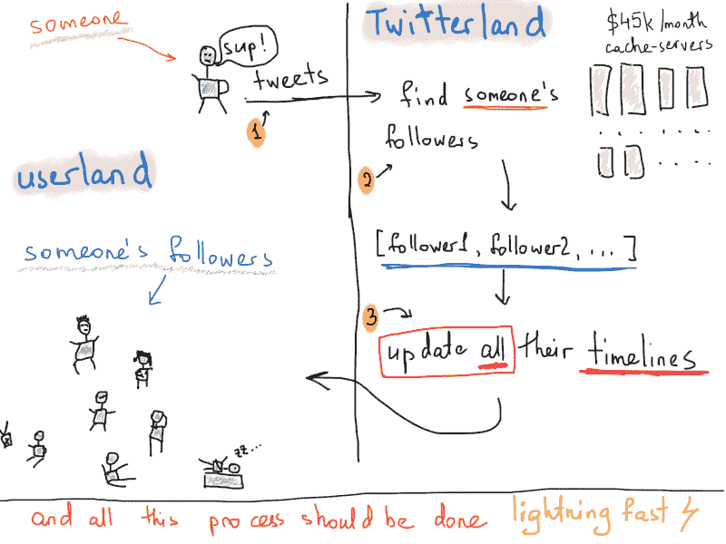

同样，我不太清楚一条推文到达所有关注者需要多长时间，但公开的统计数据告诉我们，每天大约有 5 亿条推文。每日！？

所以上面的过程每天发生 5 亿次。我真的找不到任何关于推特发送速度的东西。我依稀记得一条推文到达所有关注者最多需要 5 秒钟。还要注意“重案”，即粉丝超过百万的名人。他们可能会在推特上发布一些关于他们在海滨别墅的美妙早餐的事情，但是推特非常努力地向数百万粉丝提供这些超级有用的内容。

为了解决 tweet 传递问题，我们并不真的需要追随者的图表，相反，我们需要一个**追随者**的图表。前面的图表(带有一个哈希表和一组列表)允许我们高效地找到所有用户，然后是任何特定的用户。但是它不允许我们有效地找到关注一个特定用户的**所有**用户，在这种情况下，我们必须扫描所有的散列表键。这就是为什么我们应该构建另一个图，这是一个对称的对立面，我们为追随者构建的。这个新图将再次由包含所有 3 亿个顶点的哈希表组成，每个顶点指向一个相邻顶点的列表(结构保持不变)，但这一次，相邻顶点的列表将表示追随者。

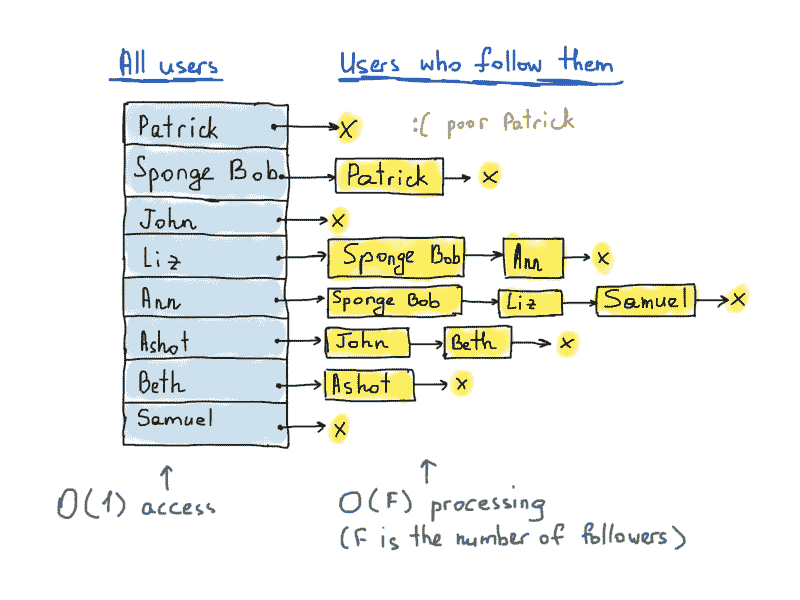

因此，根据这个例子，每当莉兹发推文时，海绵宝宝和安必须在他们的时间线上看到那个推文。实现这一点的一种常见技术是为每个用户的时间线保持独立的结构。在 Twitter 有 3 亿多用户的情况下，我们可以假设至少有 3 亿多条时间线(针对每个用户)。基本上，每当用户发推文时，我们应该获得用户的关注者列表，并更新他们的时间表(将相同的推文插入每个人)。时间轴可以表示为一个链表，或者一个平衡树(tweet datetimes 作为节点键)。

这只是我们从实际时间线表示中抽象出来的一个基本想法，当然，如果我们使用多线程，我们可以使实际交付更快。这对于“重大案件”来说至关重要，因为对于数百万的关注者来说，位于列表末尾的关注者比位于列表前面的关注者处理得更晚。

下面的伪代码试图阐明这种多线程交付思想:

因此，每当关注者刷新他们的时间线，他们就会收到新的推文。

公平地说，我们只是触及了 Airbnb 或 Twitter 真正问题的冰山一角。在 Twitter、Google、脸书、Amazon、Airbnb 等复杂系统中，需要非常长的时间和非常有才华的工程师的辛勤工作才能取得如此巨大的成果。在阅读这篇文章时，请记住这一点。

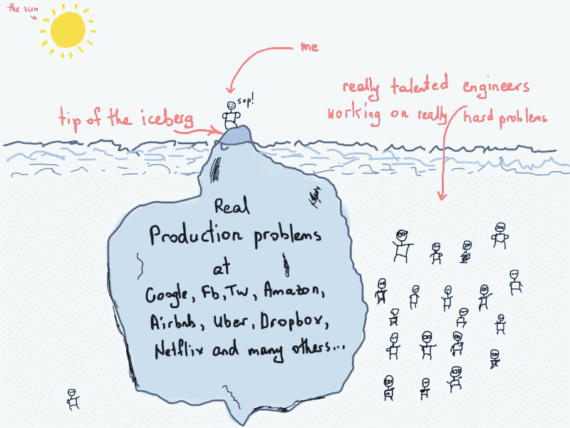

演示 Twitter 的 tweet 交付问题的要点是使用图形，即使我们没有使用任何图形算法，我们只是使用了图形的表示。当然，我们为发送推文编写了伪代码，但这是我们在寻找解决方案的过程中发现的。

我所说的“任何图算法”是指这个列表中的任何算法[。作为大到足以让程序员哭泣的东西，图论和图算法应用程序稍微有点不同。在结束图形表示之前，我们讨论了 Airbnb 房屋和有效过滤，主要明显的是无法使用多个过滤关键字有效过滤房屋。使用图算法可以做些什么吗？嗯，我们不能确定，但至少我们可以试试。如果我们将每个过滤器表示为一个单独的顶点会怎么样？](https://en.wikipedia.org/wiki/List_of_algorithms#Graph_algorithms)

从字面上看，每个过滤器，甚至从 10 美元到 1000 美元+的所有价格，所有城市名称，国家代码，便利设施(电视，Wi-Fi，和所有其他)，成人数量，每个数字作为一个单独的图形顶点。

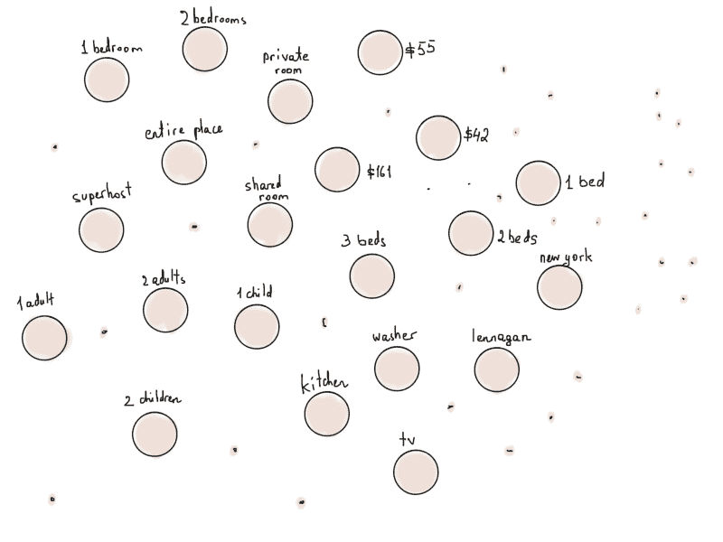

Excerpt of Airbnb filters

如果我们添加“类型”顶点，我们甚至可以使这组顶点更加“友好”,就像连接到所有顶点的“便利设施”代表一个便利设施过滤器。

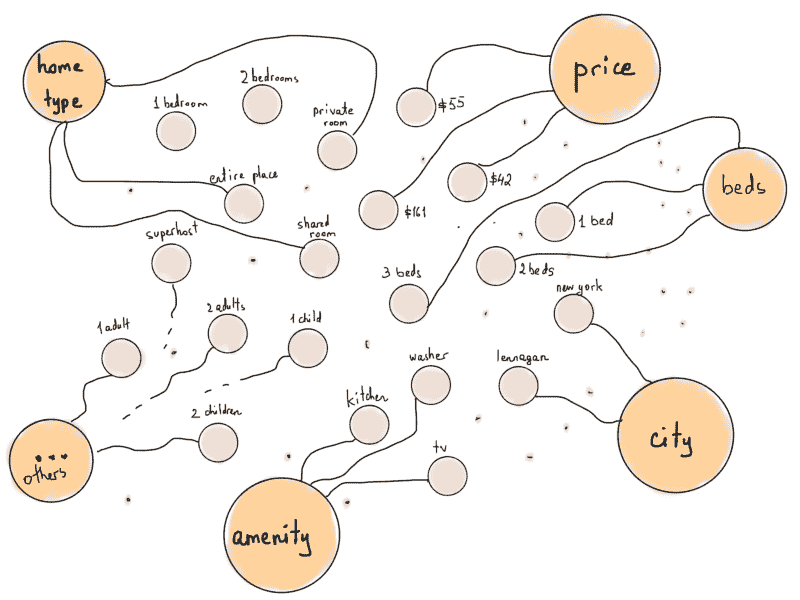

Airbnb filters with types

现在，如果我们将 Airbnb 房屋表示为顶点，然后用“过滤器”顶点连接每个房屋，如果该房屋支持相应的过滤器(例如，如果“房屋 1”的便利设施中有“厨房”，则连接“房屋 1”和“厨房”)，会怎么样？

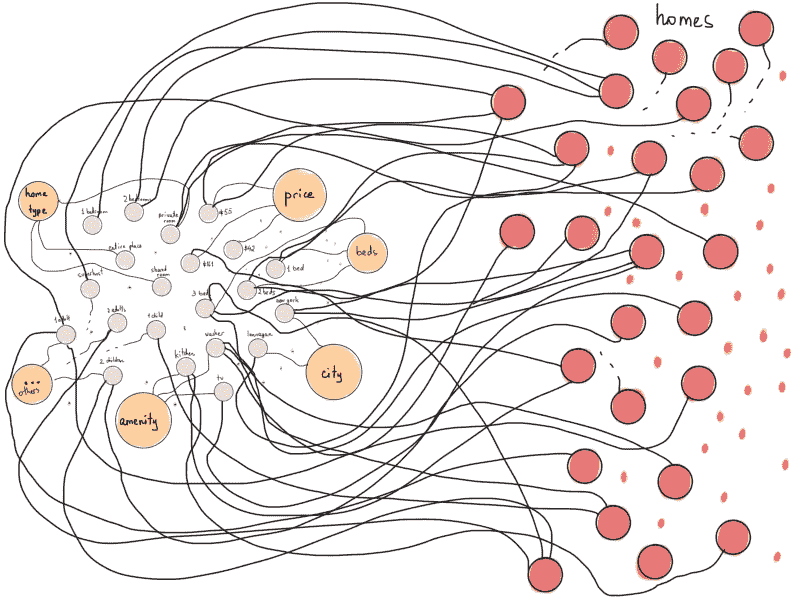

Looks messy

这个图的一个微妙变化使它更像一种特殊类型的图，称为**二分图**。

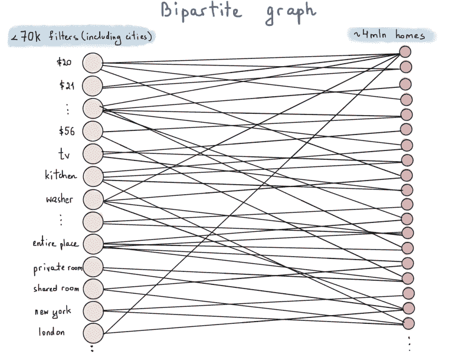

Number of vertices are more than it may appear

二部图或称偶图是这样的图，其顶点可以分成两个不相交且独立的集合，使得每条边将一个集合中的一个顶点连接到另一个集合中的一个顶点。——[维基百科](https://en.wikipedia.org/wiki/Bipartite_graph) 。

在我们的例子中，其中一个集合代表过滤器(我们用 F 表示)，另一个集合是家集合(用 H 表示)。例如，如果有 100，000 个家庭的价格值为$62，那么标记为“$62”的价格顶点将有 100，000 条边与每个家庭顶点相关联。如果我们测量空间复杂度的最坏情况，即每个家庭具有满足所有过滤器的所有属性，那么要存储的边的总量将是 70，000 * 4 百万。如果我们将每条边表示为一对两个 id:{ filter _ id；home_id}，如果我们重新考虑 id，并对过滤器使用 4 字节(int)数字 id，对住宅使用 8 字节(long) id，那么每条边至少需要 12 个字节。因此，存储 70，000 * 400 万个 12 字节的值将需要大约 3Tb 的内存。你知道，我们在计算中犯了一个小错误。

由于 Airbnb 中活跃着 6.5 万个城市( [stats](https://press.atairbnb.com/fast-facts/) )。好消息是，同一个家不能位于多个城市。也就是说，我们与城市配对的边的实际数量是 4 百万(每个家庭位于一个城市中)。因此，我们将计算 70k - 65k = 5 千个过滤器，这意味着我们需要 5000 * 400 万* 12 字节的内存，不到 0.3 Tb。听起来不错。但是是什么给了我们这个二分图呢？最常见的情况是，一个网站/移动请求包含几个过滤器，例如:

```
house_type: "entire_place",adults_number: 2,price_range_start: 56,price_range_end: 80,beds_number: 2,amenities: ["tv", "wifi", "laptop friendly workspace"],facilities: ["gym"]
```

而我们所需要的就是找到上面所有的“过滤顶点”，并处理与这些“过滤顶点”相邻的所有“主顶点”。这让我们想到了一个可怕的话题。

### 图形算法:简介

任何用图形完成的处理都可以归类为“图形算法”。你可以实现一个函数来打印一个图的所有顶点，并将其命名为“ *<你的名字在这里>的顶点打印算法* orithm”。我们大多数人都害怕 textb [ooks 中列出的图形算法(参见这里的完整列表)。让我们尝试应用一个二分图匹配算法，比如 Hopcroft-Karp 算法来解决我们的 Airbnb 房屋过滤问题:](https://en.wikipedia.org/wiki/List_of_algorithms#Graph_algorithms)

> 给定 Airbnb homes (H)和 filters (F)的二分图，其中 H 的每个元素(顶点)可以有 F 的多个相邻元素(顶点)(共享一条公共边)。找出 H 的一个子集，它由与 f 的一个子集的顶点相邻的顶点组成。

令人困惑的问题定义，然而我们现在还不能确定 Hopcroft-Karp 算法是否解决了我们的问题。但我向你保证，这次旅程将教会我们图形算法背后的许多重要思想。而且路程也不是那么短，要有耐心。

*[**霍普克罗夫特**](https://en.wikipedia.org/wiki/John_Hopcroft)**–[卡普](https://en.wikipedia.org/wiki/Richard_M._Karp)算法**是一种算法，它以二分图作为输入，并产生最大基数匹配作为输出——一组尽可能多的边，这些边具有没有两条边共享一个端点的属性——[维基百科](https://en.wikipedia.org/wiki/Hopcroft%E2%80%93Karp_algorithm)。*

熟悉这个算法的读者已经意识到，这并没有解决我们的问题，因为匹配要求没有两条边共享一个公共顶点。

让我们看一个例子，这里只有 4 个过滤器和 8 个 homes(为了简单起见)。

*   住宅用字母 A 到 H 表示，过滤器是随机选择的。
*   家 A 有一个价格(50 美元)，和一张床，(这是我们所有的价格)。
*   从 A 到 H 的所有房子都有 50 美元一晚的价格标签和一张床，但很少有房子有“Wi-Fi”和/或“电视”。

因此，下面的插图试图显示我们应该“返回”哪些家庭，以请求拥有所有四个可用过滤器的家庭(例如，他们每晚花费 50 美元，他们有一张床，还有 Wi-Fi 和电视)。

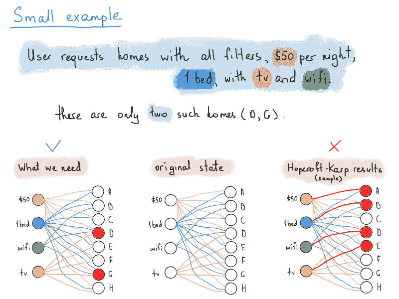

我们的问题的解决方案需要具有公共顶点的边导致不同的归属顶点，这些顶点与同一个过滤器子集相关联，而 Hopcroft-Karp 算法消除了这种具有公共端点的边，并产生了与两个子集中的顶点相关联的边。

看看上面的插图，我们需要的是住宅 D 和 G，它们都满足所有四个过滤值。我们真正需要的是得到所有共享一个公共端点的匹配边。

我们可以为这种方法设计一种算法，但是它的处理时间可能与用户需求无关(用户需求=闪电般的速度，此时此地)。创建一个带有多个排序键的平衡二叉查找树可能会更快，就像一个数据库索引文件，它用一组令人满意的记录映射主/外键。

平衡二分搜索法树和数据库索引将在另一篇文章中讨论，我们将再次回到 Airbnb 主页过滤问题。

Hopcroft-Karp 算法(以及许多其他算法)基于 **DFS** (深度优先搜索)和 **BFS** (广度优先搜索)图遍历算法。老实说，在这里引入 Hopcroft-Karp 算法的实际原因是秘密地切换到图遍历，这更好地从漂亮的图，二叉树开始。

二叉树遍历非常漂亮，主要是因为它们的递归性质。有三种基本的遍历，称为按序、后序和前序(你可以想出自己的遍历算法)。如果你曾经遍历过链表，它们就很容易理解。在链表中，你只需打印当前节点的值(在下面的代码中被命名为`item`)并继续到下一个节点。

二叉树也是如此，你打印节点值(或者你需要做的任何事情),然后继续下一个节点，但是在这种情况下，有“两个下一个”节点，左边和右边。所以你应该对左右两个节点都这样做。但是你有三个不同的选择:

*   **打印**节点值然后转到**左**节点，然后转到**右**节点，或者
*   转到**左**节点，**打印**节点值，然后转到**右**节点，或者
*   转到**左**节点，再转到**右**节点，然后**打印**节点的值。

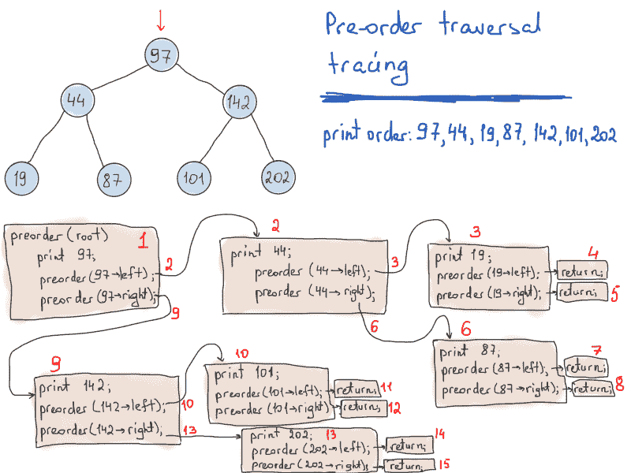

Detailed tracing of pre-order traversal

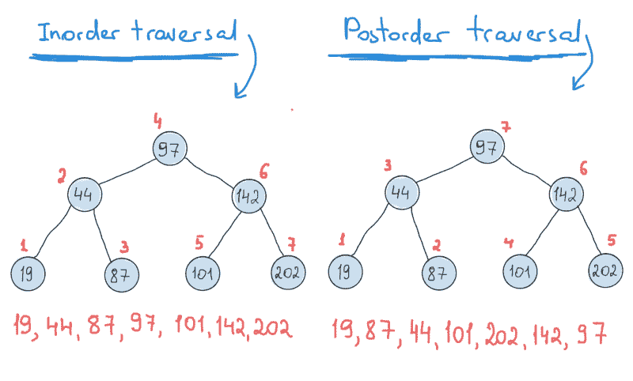

显然，递归函数看起来非常优雅，尽管它们非常昂贵。每次我们递归调用一个函数，意味着我们调用了一个完全“新”的函数(见上图)。我们所说的“新”是指应该为函数参数和局部变量“分配”另一个堆栈内存空间。这就是为什么递归调用是昂贵的(额外的堆栈空间分配和许多函数调用)和危险的(注意堆栈溢出)，显然建议使用迭代实现。在关键任务系统编程中(飞机，NASA 漫游者等等)，递归是完全禁止的(没有统计，没有经验，只是告诉你谣言)。

### 网飞和亚马逊:倒排索引示例

假设我们希望将所有网飞电影存储在一个二叉查找树中，并将电影标题作为排序关键字。因此，每当用户键入类似“Inter”的内容时，我们将返回一个以“Inter”开头的电影列表(例如，“星际穿越”，“拦截者”，“沃尔特·怀特的审问”)。

现在，如果我们将返回标题中包含“Inter”的每部电影(不仅仅是以“Inter”开头的电影)，并且列表将按照电影评级或与特定用户相关的内容进行排序(像惊悚片而不是戏剧)，那就太好了。这个例子的目的是对 BST 进行有效的范围查询。

但像往常一样，我们不会潜入更深的冷水中去发现冰山的其余部分。基本上，我们需要通过搜索关键字进行快速查找，然后获得按某个关键字排序的结果列表，这最有可能是电影评级和/或一些基于用户个性化数据的内部排名。我们会尽可能地坚持 KISK 原则(保持简单，Karl)。

> “KISK”或“让我们保持简单”或“为了简单”，教程作者的一个超级借口，通过带来一个“abc”简单的例子及其伪代码解决方案，甚至可以在你奶奶的笔记本电脑上工作，从实际问题中抽象出来并做出大量假设。

这个问题可以很容易地应用到亚马逊的产品搜索中，因为我们通常通过键入描述我们兴趣的文本(如“图形算法”)在亚马逊中搜索一些东西，并得到按产品评级排序的结果。我还没有在亚马逊的搜索结果中体验过个性化的结果。但我很确定亚马逊也做那种事。所以，把这个副主题的标题改成…

**网飞和亚马逊**网飞提供电影，亚马逊提供产品，我们将它们命名为“项目”，所以每当你阅读“项目”时，就想到网飞的电影或亚马逊的任何(可行的)产品。

最常见的是对商品的标题和描述进行解析(*我们将只坚持标题*)，因此如果一个操作者(通常是一个通过管理仪表板将商品数据插入网飞/亚马逊数据库的*人)将一个新商品插入数据库，它的标题将由某个“商品标题处理器”处理以产生关键词。*

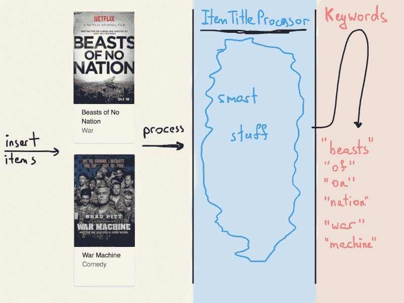

Not the best illustration, I know (and has a typo)

每个项目都有其唯一的 ID，该 ID 与标题中的关键字相关联。这就是搜索引擎在爬全世界的网站时所做的事情。他们分析每个文档的内容，将其标记化(将其分解为称为单词的更小的实体)，并将其添加到一个表中，该表将每个标记(单词)映射到标记“被看到”的文档 ID(网站)。

因此，每当您搜索“hello”时，搜索引擎都会获取所有映射到关键字“hello”的文档(现实要复杂得多，因为最重要的是搜索相关性，这也是 Google Search 如此出色的原因)。因此，网飞/亚马逊的一个类似的表可能是这样的(同样，在阅读商品时，想想电影或产品)。


Inverted index

又是哈希表。是的，我们将为这个**倒排索引** ( *索引结构存储来自内容的映射- [维基百科](https://en.wikipedia.org/wiki/Inverted_index)* )保留一个散列表。哈希表会将一个关键字映射到一组条目。为什么选择 BST？因为我们希望对它们进行排序，同时以连续排序的部分为它们提供服务(响应前端请求)(例如，使用分页的 100 个项目)。这并不能真正展示 BST 的威力。但是让我们假设我们也需要在搜索结果中进行快速查找，假设您想要所有 3 部带有关键字“机器”的明星电影。

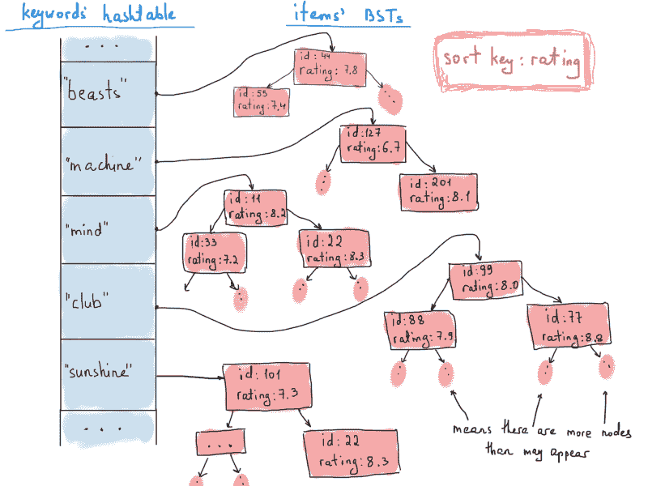

*注意，在不同的树中有重复的项目是没问题的，因为一个项目通常可以用不止一个关键字*找到。

我们将对定义如下的项目进行操作:

每当一个新条目被插入数据库时，标题都会被处理并添加到大索引表中，该表将一个关键字映射到一个条目。可能会有许多项目共享同一个关键字，所以我们将这些项目保存在一个 BST 中，按其评级排序。

当用户搜索某个关键词时，他们会得到一个按评级排序的项目列表。我们如何从一棵树中得到一个排序后的列表？通过进行有序遍历。

下面是`InOrderProduceVector()`的实现可能的样子:

但是，但是…我们首先需要评分最高的项目，我们的有序遍历首先产生评分最低的项目。那是因为它的本性。顺序遍历是“自下而上”的，从最低到最高的项目。为了得到我们想要的，也就是以降序而不是升序排列的列表，我们应该更仔细地看看有序遍历的实现。

我们正在做的是通过左边的节点，然后打印当前节点的值，然后通过右边的节点。最左边的节点是具有最小值的节点。因此，简单地改变实现，首先遍历正确的节点，将使我们看到列表的降序。我们将像其他人那样命名它，一个反向有序遍历。

让我们更新上面的代码(在单个清单中介绍)。警告-前方有虫子！

就是这样。我们可以很快提供商品搜索结果。如上所述，倒排索引主要用于搜索引擎，如 Google。虽然谷歌搜索是一个非常复杂的搜索引擎，但它确实使用了一些简单的想法(尽管过于现代化)来匹配搜索查询和文档，并尽快提供结果。

我们使用树遍历来按排序顺序提供结果。此时，似乎前/中/后顺序遍历已经足够了，但是有时需要另一种类型的遍历。

让我们来解决这个众所周知的编程面试问题，“你如何一层一层地打印一个[二进制]树？”。

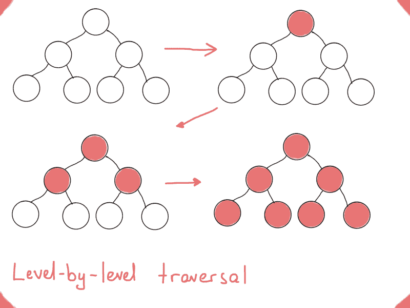

### 旅行:dfs 和 bfs

如果您不熟悉这个问题，请考虑一些数据结构，在遍历树时可以用它们来存储节点。如果我们将树的逐层遍历与上面的其他遍历(前、中、后顺序遍历)进行比较，我们最终会设计出图的两种主要遍历，即深度优先搜索(DFS)和宽度优先搜索(BFS)。

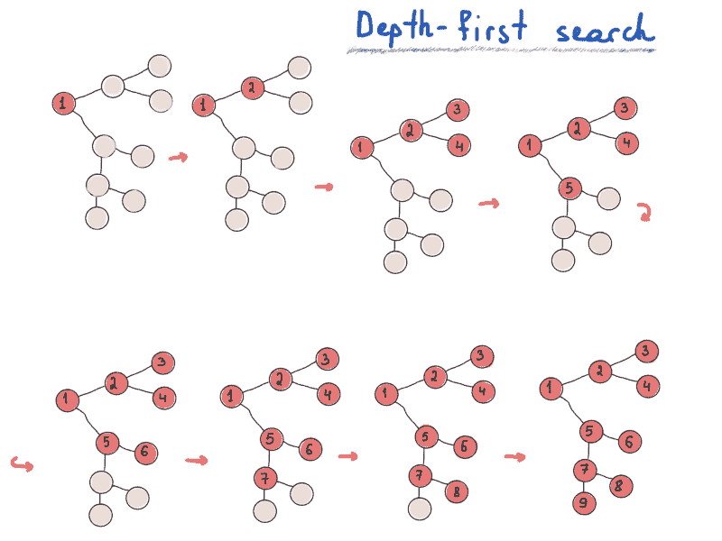

深度优先搜索寻找最远的节点，广度优先搜索首先探索最近的节点。

*   **深度优先搜索**——多行动，少思考。
*   **广度优先搜索**——在走得更远之前，好好看看你的周围。

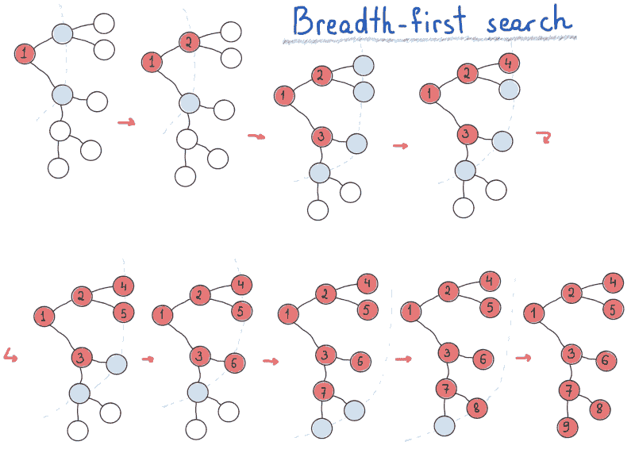

DFS 很像前、中、后顺序遍历。而 BFS 是我们需要的，如果我们想打印一棵树的节点逐层。

为了实现这一点，我们需要一个队列(数据结构)来存储图的“级别”,同时打印(访问)它的“父级别”。在上图中，放置在队列中的节点是浅蓝色的。

基本上，一层一层地，从队列中取出每一层上的节点，在访问每个取出的节点时，我们还应该将它的子节点插入到队列中(用于下一层)。下面的代码很简单，足以理解 BFS 的主要思想。假设该图是连通的，尽管可以对其进行修改以应用于非连通的图。

基本思想很容易在基于节点的连通图表示中显示出来。请记住，图遍历的实现因表示而异。

BFS 和 DFS 是解决图搜索问题的重要工具(*但是要记住还有大量的图搜索算法)*。虽然 DFS 有优雅的递归实现，但迭代实现是合理的。对于 BFS 的迭代实现，我们使用了一个队列，对于 DFS，你需要一个堆栈。图中最常见的问题之一，同时也是你在这篇文章中读到的最可能的原因之一，是寻找图顶点之间的最短路径的问题。这就把我们带到了最后一个思维实验。

### 优步和最短路径问题(Dijkstra 算法)

拥有 5000 万用户和 700 万司机( [source](https://expandedramblings.com/index.php/uber-statistics/) )，对优步的运转至关重要的一件事是以有效的方式匹配司机和乘客的能力。问题从地点开始。

后端应该处理数百万个用户请求，将每个请求发送给附近的一个或多个(通常是更多)驱动程序。虽然将用户请求发送给附近的所有司机更容易，有时甚至更智能，但一些预处理可能会有所帮助。

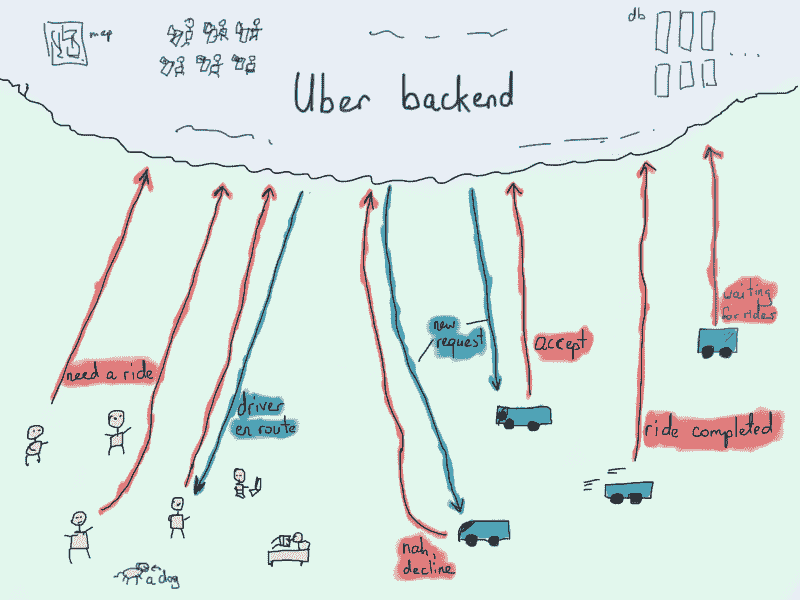

除了处理传入的请求，根据用户坐标找到位置区域，然后找到坐标最近的司机，我们还需要找到合适的司机。为了避免地理空间请求处理(通过将汽车的当前坐标与用户的坐标进行比较来获取附近的汽车)，假设我们已经有了一段包含用户和几辆附近汽车的地图。

大概是这样的:

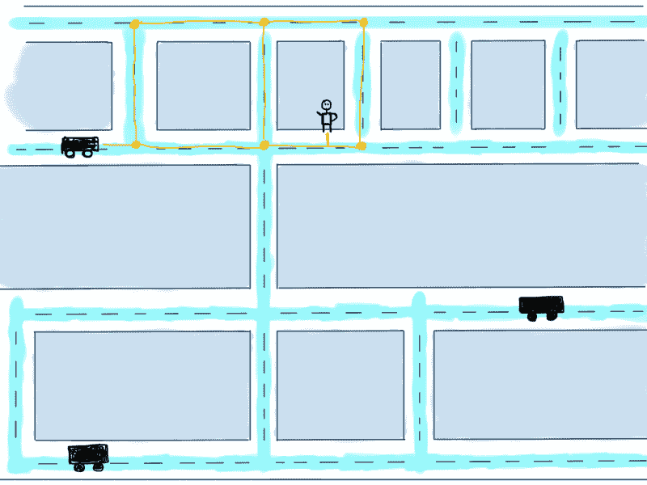

从汽车到用户的可能路径用黄色表示。问题是计算汽车到达用户所需的最小距离，换句话说，就是找到它们之间的最短路径。虽然这更多的是关于谷歌地图而不是优步，我们将尝试解决这个特殊的非常简单的情况，主要是因为通常有不止一个司机的汽车，优步可能想计算最近的最高评级的汽车发送给用户。

对于这个例子，这意味着计算所有三辆车到达用户的最短路径，并决定哪辆车是最佳发送。为了使事情变得简单，我们将只讨论一辆汽车的情况。这里有一些可能的途径来达到用户。

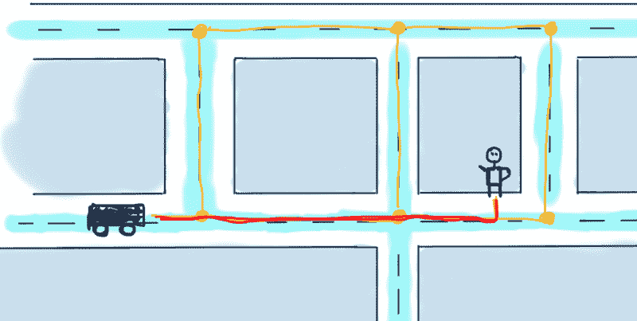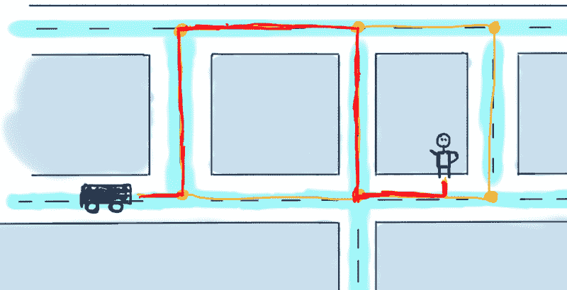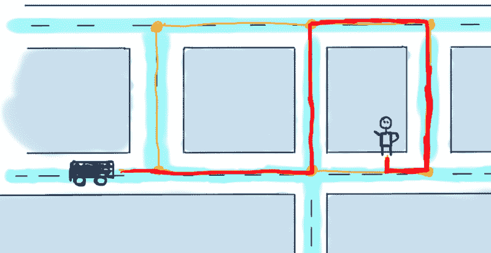

Possible variants to reach the user

切入正题，我们将用图表来表示这一部分:

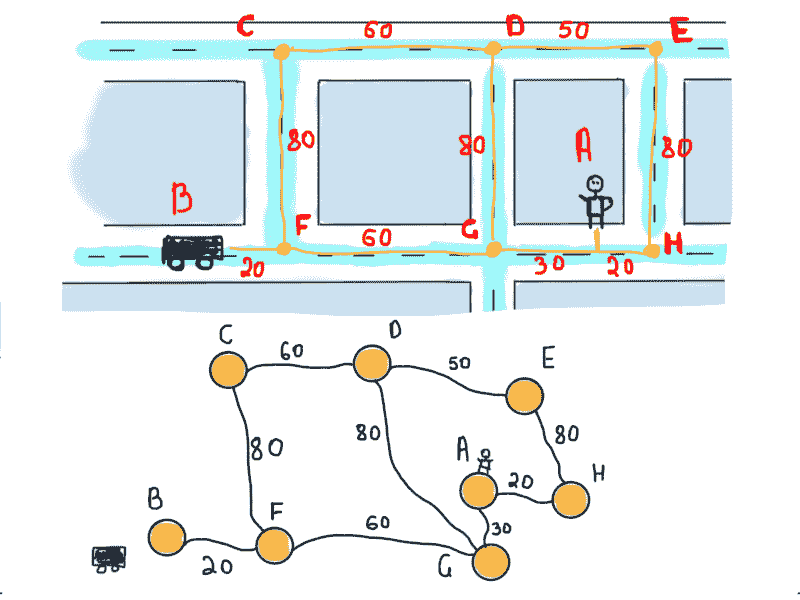

这是一个无向加权图(更具体地说是边加权)。为了找到顶点 B(汽车)和 A(用户)之间的最短路径，我们应该在它们之间找到一条由可能具有最小权重的边组成的路线。你可以自由设计你的解决方案。我们将坚持 Dijkstra 的版本。Dijkstra 算法的以下步骤来自[维基百科](https://en.wikipedia.org/wiki/Dijkstra%27s_algorithm)。

*让我们正在开始的节点称为**初始节点**。设节点 Y 的**距离为从**初始节点**到 Y 的距离，Dijkstra 的算法会分配一些初始距离值，并会尝试逐步提高。***

1.  标记所有未访问的节点。创建一个包含所有未访问节点的集合，称为未访问集合。
2.  给每个节点分配一个暂定的距离值:初始节点设置为零，其他节点设置为无穷大。将初始节点设置为当前节点。
3.  对于当前节点，考虑其所有未访问的邻居，并计算它们通过当前节点的暂定距离。将新计算的暂定距离与当前指定值进行比较，并指定较小的值。例如，如果当前节点 A 被标记为距离 6，并且连接它和邻居 B 的边的长度为 2，那么通过 A 到 B 的距离将是 6 + 2 = 8。如果 B 之前标记的距离大于 8，则将其更改为 8。否则，保持当前值。
4.  当我们考虑完当前节点的所有邻居后，将当前节点标记为已访问，并将其从未访问集中删除。被访问的节点将不再被检查。
5.  如果目的地节点已经被标记为已访问(当计划两个特定节点之间的路线时)或者如果未访问集合中的节点之间的最小暂定距离是无穷大(当计划完整遍历时；当初始节点和剩余的未访问节点之间没有连接时发生)，然后停止。算法已经完成。
6.  *否则，选择标有最小暂定距离的未访问节点，将其设置为新的“当前节点”，并返回步骤 3。*

将这个应用到我们的例子中，我们将从顶点 B(汽车)作为初始节点开始。对于前两步:

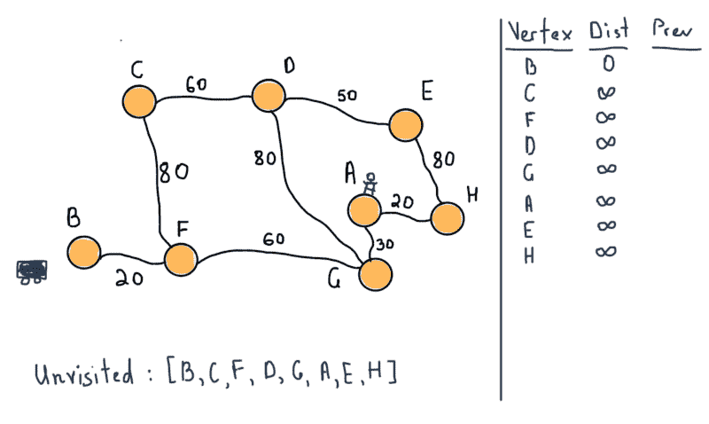

我们的未访问集合由所有顶点组成。另请注意插图左侧的表格。对于所有顶点，它将包含从 B 到前一个顶点(标记为“Prev”)的所有最短距离。例如，从 B 到 F 的距离是 20，前一个顶点是 B。

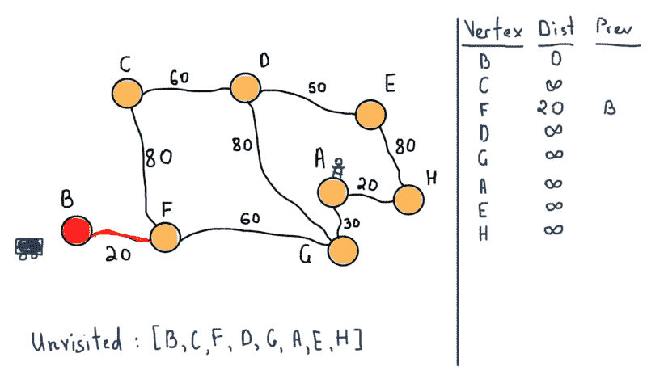

我们将 B 标记为已访问，并将其移动到其邻居 f。


现在，我们将 F 标记为已访问，并选择下一个具有最小暂定距离的未访问节点，即 g。在前面的图示中，节点 C、F 和 G 已经用前面的节点设置了它们的暂定距离，这些节点通向所提到的节点。

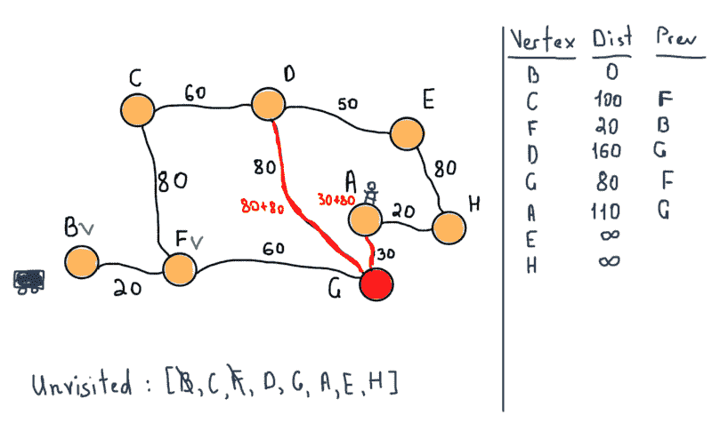

如算法中所述，如果目的地节点被标记为已访问(在我们的例子中，当规划两个特定节点之间的路线时),那么我们可以停止。所以我们的下一步用下面的值停止算法。

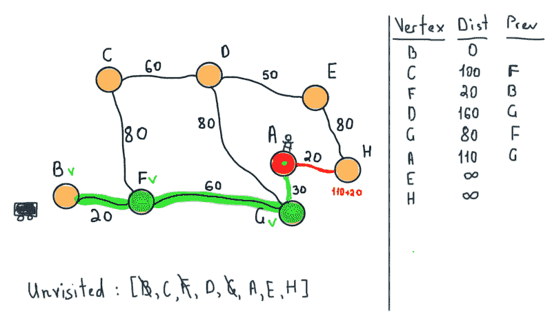

所以我们既有从 B 到 A 的最短距离，也有通过 F 和 G 节点的路由。

这确实是优步潜在问题的最简单的例子，与我们的冰山类比相比，我们正处于冰山一角的顶端。然而，这是探索图论及其应用的真实世界的良好开端。我没有完成我在本文中最初计划的内容，但在不久的将来，很可能会继续下去(也包括数据库索引内部)。

关于图还是有那么多要讲的(还是要学习)。把这篇文章当成另一个冰山一角。如果你已经读到这里，你绝对应该得到一块饼干。别忘了鼓掌分享。谢谢你。

#### 资源

[1] [Sh。偶数、g .偶数、图形算法](https://www.amazon.com/Graph-Algorithms-Shimon-Even-ebook/dp/B00INYG6O4/)

#### 进一步阅读

R. Sedgewick，K. Wayne，算法

t .科尔曼，Ch。雷瑟森，r .里维斯特，c .斯坦，算法简介

机载工程，[机载](https://www.freecodecamp.org/news/i-dont-understand-graph-theory-1c96572a1401/undefined)

网飞科技博客，[网飞科技博客](https://www.freecodecamp.org/news/i-dont-understand-graph-theory-1c96572a1401/undefined)

[Twitter 工程博客](https://blog.twitter.com/engineering/en_us.html)

[优步工程博客](https://eng.uber.com/)