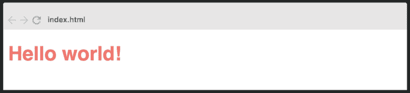
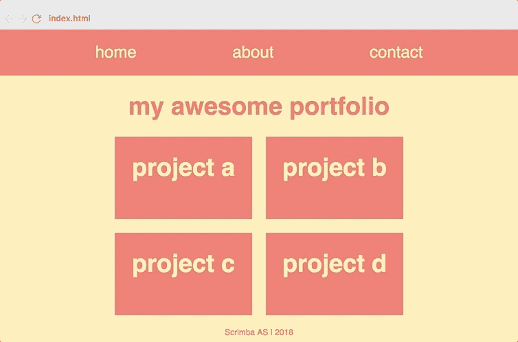
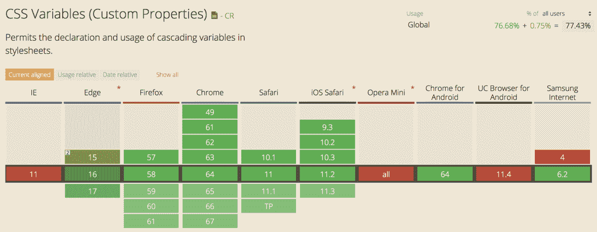

# 5 分钟学会 CSS 变量——初学者教程

> 原文：<https://www.freecodecamp.org/news/learn-css-variables-in-5-minutes-80cf63b4025d/>

CSS 自定义属性(也称为变量)是前端开发人员的一大胜利。它为 CSS 带来了变量的力量，从而减少了重复，提高了可读性和灵活性。

另外，与来自 CSS 预处理程序的变量不同，CSS 变量实际上是 DOM 的一部分，这有很多好处。所以它们本质上就像类固醇上的 SASS 和更少的变量。在本文中，我将向您介绍这项新技术是如何工作的。

我还创建了一个关于 CSS 变量的免费互动 8 部分课程，所以如果你想成为这方面的专家，就去看看吧。

[想学习 CSS 变量？这是我的免费 8 部分课程！](https://medium.freecodecamp.org/want-to-learn-css-variables-heres-my-free-8-part-course-f2ff452e5140)

### 为什么要学习 CSS 变量？

在 CSS 中使用变量有很多原因。最引人注目的一点是它减少了样式表中的重复。


在上面的例子中，为`#ffeead`颜色创建一个变量比我们在这里重复它要好得多:


这不仅会使你的代码更容易阅读，还会给你更多的灵活性，如果你想改变颜色的话。

多年来，SASS 和 LESS 变量确实使这成为可能。然而，CSS 变量有一些很大的好处。

1.  它们不需要任何传输文件就能工作，因为它们是浏览器自带的。因此，您不需要任何设置就可以开始，就像您使用 SASS 和 LESS 一样。
2.  它们生活在 DOM 中，这带来了大量的好处，我将在本文和即将到来的课程中详细介绍。

现在让我们开始学习 CSS 变量吧！

### 声明您的第一个 CSS 变量

要声明一个变量，你首先需要决定这个变量应该在哪个范围内。如果您想让它在全球范围内可用，只需在`:root`伪类上定义它。它匹配文档树中的根元素(通常是`<html>`标签)。

由于变量是继承的，这将使变量在整个应用程序中可用，因为所有 DOM 元素都是`<html>`标签的后代。

```
:root {  
  --main-color: #ff6f69;  
} 
```

如您所见，您可以像设置任何 CSS 属性一样声明变量。但是，变量必须以两个破折号开头。

要访问一个变量，您需要使用`var()`函数，并将变量名作为参数传入。

```
#title {  
  color: var(--main-color);  
} 
```

这将给你的头衔加上`#f6f69`颜色:



### 声明局部变量

您还可以创建局部变量，这些变量只能由声明它的元素及其子元素访问。如果你知道一个变量只在应用程序的特定部分使用，那么这样做是有意义的。

例如，你可能有一个警告框，它使用一种特殊的颜色，这种颜色在应用程序的其他地方没有使用。在这种情况下，避免将其放在全局范围内可能是有意义的:

```
.alert {  
  --alert-color: #ff6f69;  
} 
```

该变量现在可以被其子级使用:

```
.alert p {  
  color: var(--alert-color);  
  border: 1px solid var(--alert-color);  
} 
```

如果您尝试在应用程序的其他地方使用`alert-color`变量，例如在导航条中，它根本不会工作。浏览器会忽略那一行 CSS。

### 更容易对变量做出响应

CSS 变量的一大优势是它们可以访问 DOM。LESS 或 SASS 的情况则不同，它们的变量被编译成常规的 CSS。

实际上，这意味着您可以根据屏幕的宽度来更改变量:

```
:root {  
  --main-font-size: 16px;  
}

media all and (max-width: 600px) {  
  :root {  
    --main-font-size: 12px;  
  }  
} 
```

有了这简单的四行代码，你就可以在小屏幕上更新整个应用程序的主要字体大小。很优雅，是吧？

### 如何用 JavaScript 访问变量

生活在 DOM 中的另一个好处是可以用 JavaScript 访问变量，甚至可以更新它们，例如，基于用户交互。如果你想让你的用户能够改变你的网站(比如调整字体大小)，这是完美的。

让我们继续本文开头的例子。在 JavaScript 中抓取一个 CSS 变量需要三行代码。

```
var root = document.querySelector(':root');  
var rootStyles = getComputedStyle(root);  
var mainColor = rootStyles.getPropertyValue('--main-color');

console.log(mainColor);   
\--> '#ffeead' 
```

要更新 CSS 变量，只需在声明变量的元素上调用`setProperty`方法，并将变量名作为第一个参数，新值作为第二个参数。

```
root.style.setProperty('--main-color', '#88d8b0') 
```

这种主色可以改变你的应用程序的整体外观，所以它非常适合让用户设置你网站的主题。



通过更新单个变量，你可以改变导航条、文本和项目的颜色。

### 浏览器支持

目前，77%的全球网站流量支持 CSS 变量，其中近 90%在美国。我们已经在 Scrimba.com 使用 CSS 变量有一段时间了，因为我们的观众是相当精通技术的，并且大多使用现代浏览器。



好吧，就这样。希望你学到了一些东西！

如果你想正确地学习它，一定要看看我在 Scrimba 的免费 CSS 变量课程。

* * *

感谢阅读！我的名字叫 Per Borgen，我是最简单的学习编码方法——Scrimba 的联合创始人。如果你想学习建立专业水平的现代网站，你应该看看我们的[响应式网页设计训练营](https://scrimba.com/g/gresponsive?utm_source=freecodecamp.org&utm_medium=referral&utm_campaign=gcssvariables_5_minute_article)。


[Click here to get to the advanced bootcamp.](https://scrimba.com/g/gresponsive?utm_source=freecodecamp.org&utm_medium=referral&utm_campaign=gcssvariables_5_minute_article)