# 在 VS 代码中使用 SVG 需要知道的事情

> 原文：<https://www.freecodecamp.org/news/things-you-need-to-know-about-working-with-svg-in-vs-code-63be593444dd/>

看看这个 [VS 代码发布集锦视频](https://code.visualstudio.com/updates/v1_20?WT.mc_id=vscoderelease-medium-buhollan)来自 [Brian Clark](https://twitter.com/_clarkio) 。最后，他展示了如何在 VS 代码中放大图像预览。

[https://www.youtube.com/embed/MWz8y1D3PMQ?feature=oembed](https://www.youtube.com/embed/MWz8y1D3PMQ?feature=oembed)

我认为这是一个有趣的特点。我的意思是，让我们面对现实吧——世界上只有两种人:喜欢放大图像的人和不愿意承认的人。所以我打开了一个项目，我必须测试它，果然，它像广告宣传的那样工作。


我的下一个想法是看看它是否适用于 SVG 图像。因为我喜欢放大 SVG 看它不退化。在我人生的这个阶段，这是一项令人愉快和充实的活动。

原来 VS 代码并没有在编辑器中提供 SVG 文件的可视化预览。这很有道理。SVG 是标记，VS 代码像 XML 一样对待 SVG 文件，XML 只是文本。你需要用 XSLT 把它转换成你可以通过 T2 查看的东西。我刚刚触发了你们一群人，为此，我道歉。

这里有一个关于 XML 的笑话可以缓解你的焦虑:

> XML 就像暴力:如果它不起作用，你就没有充分利用它

> 未知

这让我想知道，如果 VS 代码像对待 XML 一样对待 SVG，有什么扩展可以帮助我在 VS 代码中处理 SVG？原来有不少，有的效果比别人好。这里有几个我最喜欢的在 VS 代码中使用 SVG 的扩展。

### 挽救（saving 的简写）

第一个扩展叫做 [SVG](https://marketplace.visualstudio.com/items?itemName=jock.svg&WT.mc_id=vscoderelease-medium-buhollan) 。

没错。这个人是这个游戏的第一个玩家，他得到了梦寐以求的 SVG 名字。比如那个注册了推特名“伯克”的人。怎么回事，山姆！你还没有发推文…你从来没发过微博！


Sam, if you’re reading this — tweet at me and let’s talk. Seriously. You don’t even want this account!

正如你在这张 GIF 上看到的，Visual Studio 代码对 SVG 的支持是有限的，因为我们知道它像 XML 一样对待 SVG。它知道如何恰当地突出显示标记，但仅此而已。请注意，当我尝试创建这个矩形时，它没有给我任何建议。

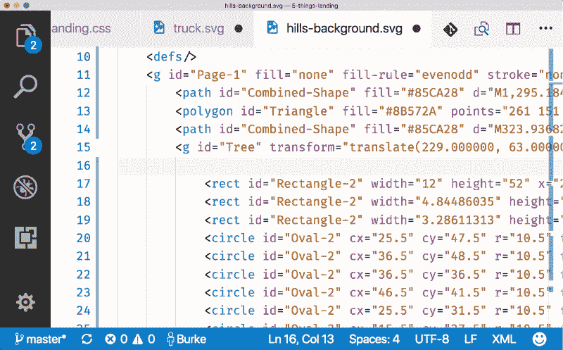

“SVG”扩展的主要功能是为 Visual Studio 代码添加对 SVG 的语言支持。所以现在当我开始输入`rect`时，它会给出我可能想要选择的元素的选项以及它们是什么的描述。

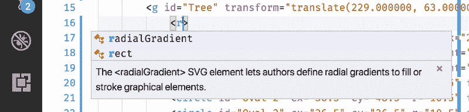

一旦有了元素，它现在也知道了所有可能的属性。

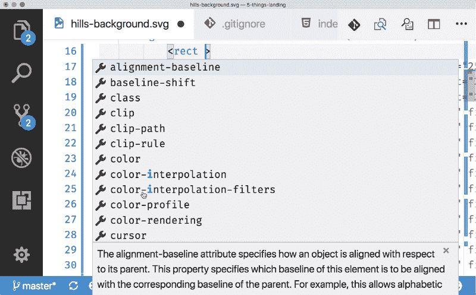

如果这些属性是枚举，它甚至知道其中一些属性的值。

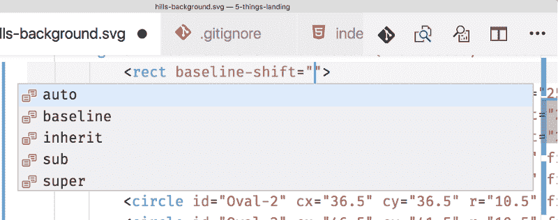

#### 试映

这个扩展还提供了一个“预览”功能，显示带有标记和渲染图像的并排预览。这可以从命令托盘(Ctrl/Cmd + Shift + P)中获得。

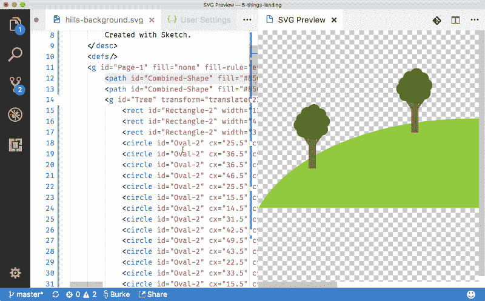

最酷的是，当您键入 SVG 时，预览会实时更新。这为手工构建 SVG 图像提供了一个非常好的沙箱，如果你觉得困难的话。

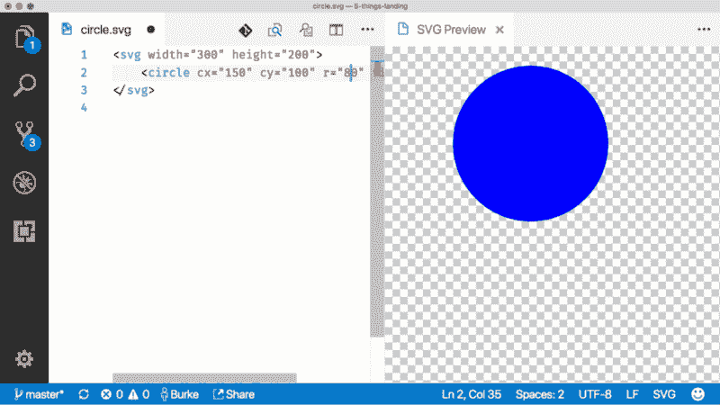

#### 使变小

这个扩展还包括一个 minify 命令，它将使用 SVGO 缩小您的 SVG。以这幅用素描创作的美丽山坡图像为例。是的，都是我自己做的。

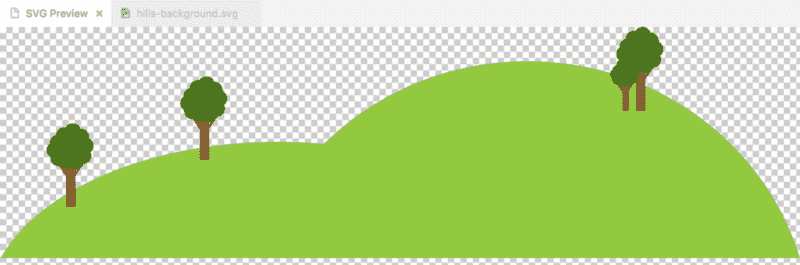

这张图片已经很小了。它在磁盘上的大小约为 9kb。SVG 扩展在命令托盘中提供了一个“Minify”命令(Ctrl/Cmd + Shift + P)。使用该命令可以将图像大小缩小到 5kb。将近一半。相当令人印象深刻。

如果我们在 VS 代码中使用内联 Git 差分，我们可以看到一些 SVGO 正在做的事情。它删除了我们不需要的东西，比如“id”或者一个默认值已经是 0 的参数。还把我的`rect`转换成了`path`。我不知道为什么，但这太有趣了！不管怎样，SVGO。我信任你。做你的事。

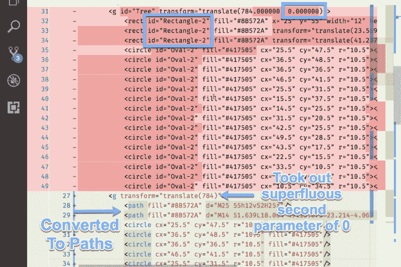

这就是 SVG for VS 代码所做的大部分工作。但是这里还有另一个相关的 SVG 扩展— [**SVG 查看器**](https://marketplace.visualstudio.com/items?itemName=cssho.vscode-svgviewer&WT.mc_id=vscoderelease-medium-buhollan) 。

### SVG 检视器

[**SVG 查看器- Visual Studio market place**](https://marketplace.visualstudio.com/items?itemName=cssho.vscode-svgviewer&WT.mc_id=vscoderelease-medium-buhollan)
[*Visual Studio 代码扩展-Visual Studio 代码 SVG 查看器。*marketplace.visualstudio.com](https://marketplace.visualstudio.com/items?itemName=cssho.vscode-svgviewer&WT.mc_id=vscoderelease-medium-buhollan)

[SVG 查看器](https://marketplace.visualstudio.com/items?itemName=cssho.vscode-svgviewer&WT.mc_id=vscoderelease-medium-buhollan)提供与 SVG 扩展相同的并排图像预览。然而，这个有两个主要优点。首先，只要点击一个`svg`文件，就可以自动打开预览，方法是将下面一行添加到用户首选项文件中。

```
"svgviewer.enableautopreview": true,
```

而且，它会缩小图像以适合窗口。我不知道我是否喜欢这样，但我想我喜欢。我想我更喜欢这张照片，而不是一张我看不到全貌的巨幅照片。

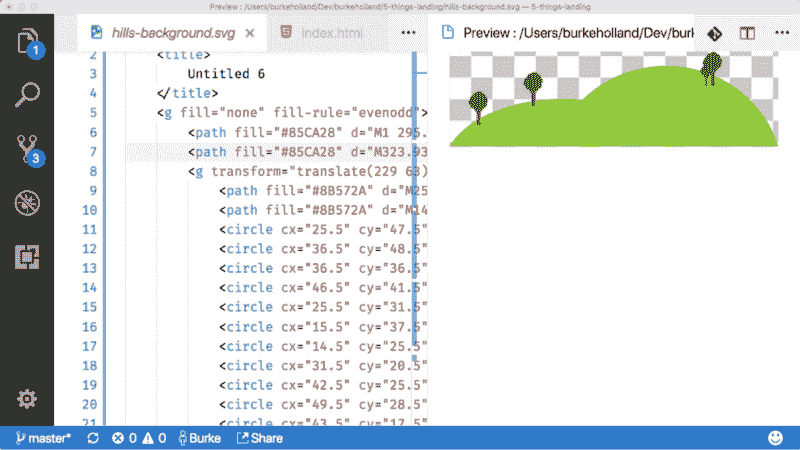

#### 转换为 PNG

这个扩展还添加了一个 convert 命令，因此您可以将 SVG 内联转换为 PNG。以这张卡车图片为例。我将其导出为 svg，但它只是一个包装在 SVG 标签中的数据 URI。那是没有意义的。我还不如把它带回静态图像。有了这个扩展，我就不需要再回到 Sketch 来做这些了。

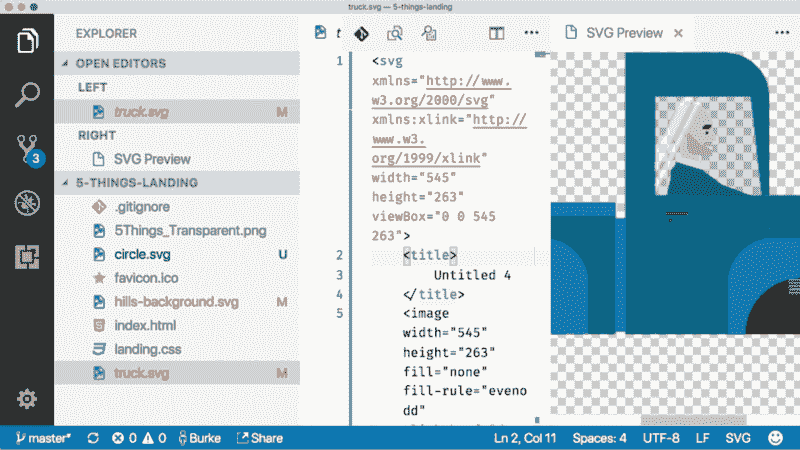

这个扩展还允许您复制任何 SVG 的数据 URI 模式。我想这很好，但这不是我曾经做过的事。既然我已经说过了，我确信我需要做这件事。

最后一个毫无价值的扩展是 [svg 编辑器](https://marketplace.visualstudio.com/items?itemName=henoc.svgeditor&WT.mc_id=vscoderelease-medium-buhollan)。

### SVG 编辑器

[**SVG 编辑器-Visual Studio market place**](https://marketplace.visualstudio.com/items?itemName=henoc.svgeditor&WT.mc_id=vscoderelease-medium-buhollan)
[*Visual Studio 代码的扩展 VSCode 的可视和文字 SVG 编辑器。*marketplace.visualstudio.com](https://marketplace.visualstudio.com/items?itemName=henoc.svgeditor&WT.mc_id=vscoderelease-medium-buhollan)

SVG 编辑器扩展非常具有侵略性。它试图在 VS 代码中创建一个完整的 SVG 编辑界面，包括绘图工具和全部九个代码。

需要注意的是，这个扩展对我根本不起作用。好像它在那里，但据我所知它什么也没做。也可能是我做错了。这种可能性很大。我的综合测试方法包括“点击一堆，看看会发生什么。”从来没有。

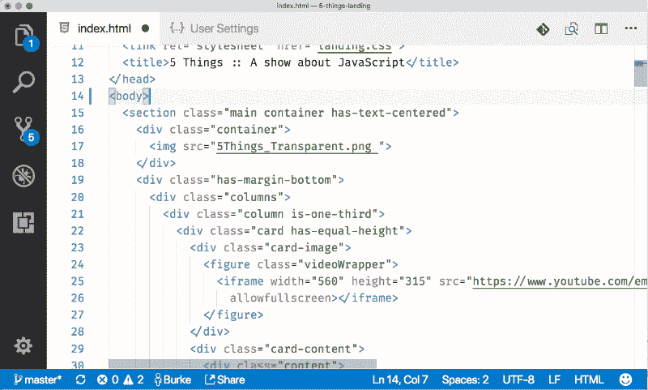

是的——不管用。但是尝试在 Visual Studio 代码中构建一个图形编辑器的技巧。这不是一件容易的事情，事实上，有人甚至试图这样做，这给我留下了深刻的印象。

### Enjoy Your SVG

通过扩展，VS 代码对 SVG 有了一些非常坚实的支持。对我来说，两件大事是代码完成和预览。虽然我应该注意到，你不能放大任何预览，所以我仍然不能满足我奇怪的渴望观看矢量图形的规模。

您可以在今天获得最新版本的 VS 代码，并在闲暇时安装这些 SVG 扩展。