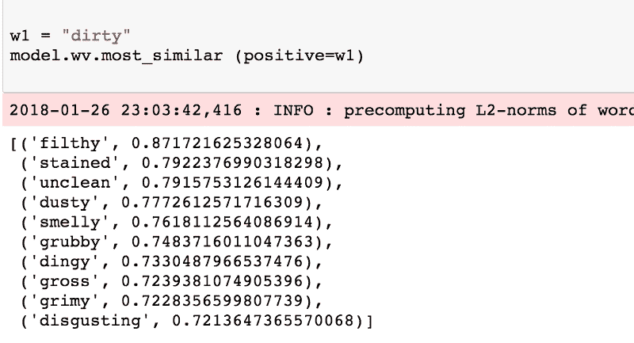
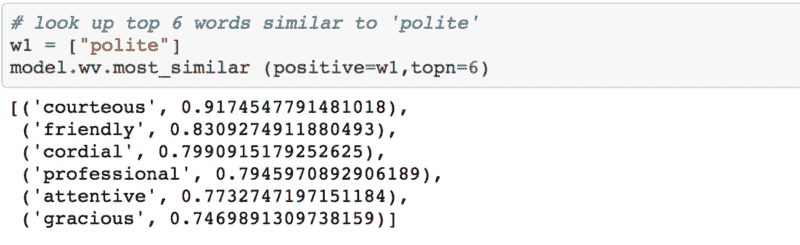
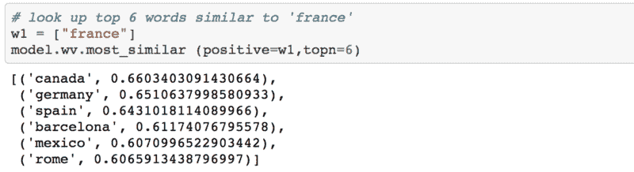
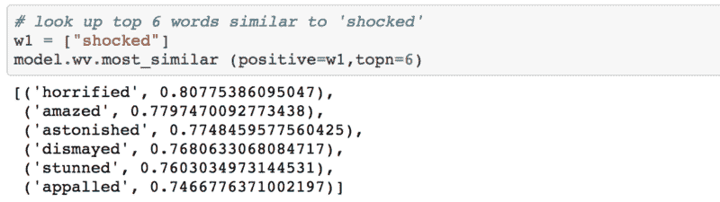
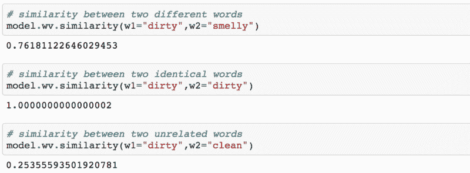

# 如何开始使用 word 2 vec——然后如何让它工作

> 原文：<https://www.freecodecamp.org/news/how-to-get-started-with-word2vec-and-then-how-to-make-it-work-d0a2fca9dad3/>

作者:卡维塔·加内桑

# 如何开始使用 word 2 vec——然后如何让它工作


Word2Vec 背后的想法非常简单。我们假设一个词的意思可以通过它的同伴来推断。这类似于一句谚语，“*让我看看你的朋友，我就能知道你是谁。*

如果你有两个单词有非常相似的邻居(意思是:使用它的上下文大致相同)，那么这些单词可能在意思上非常相似，或者至少是相关的。例如，单词*震惊*、*惊骇、*和*惊讶*通常用于类似的上下文中。

使用这个基本的假设，您可以使用 Word2Vec 来表现相似的概念，找到不相关的概念，计算两个单词之间的相似性，等等！

### 谈正事

在本教程中，您将学习如何使用 Word2Vec 的 Gensim 实现，并实际使用它。我早就听到了关于总体性能不佳的抱怨，但它确实是两件事的结合: **(1)您的输入数据**和 **(2)您的参数设置**。

请注意，Gensim 包中的训练算法实际上是由 Google 从最初的 [Word2Vec 实现移植而来，并扩展了附加功能。](https://arxiv.org/pdf/1301.3781.pdf)

### 导入和日志记录

首先，我们从导入开始，并建立日志记录:

```
# imports needed and loggingimport gzipimport gensim import logging
```

```
logging.basicConfig(format=’%(asctime)s : %(levelname)s : %(message)s’, level=logging.INFO)
```

### 资料组

我们的下一个任务是找到一个真正好的数据集。让 Word2Vec 真正为您工作的秘密是在相关领域拥有大量的文本数据。例如，如果你的目标是建立一个情感词典，那么使用来自医学领域甚至维基百科的数据集可能不是有效的。所以，明智地选择你的数据集。

对于本教程，我将使用来自我在[的一些博士论文](http://kavita-ganesan.com/opinion-based-entity-ranking/)的 [OpinRank](http://kavita-ganesan.com/entity-ranking-data/) 数据集中的数据。该数据集包含汽车和酒店的完整用户评论。我特意将所有的酒店评论收集到一个大文件中，这个文件大约是 **97 MB** 压缩文件和 **229 MB** 未压缩文件。在本教程中，我们将使用压缩文件。该文件中的每一行都代表一篇酒店评论。

现在，让我们通过打印第一行来仔细看看下面的数据。

您应该看到以下内容:

```
b"Oct 12 2009 \tNice trendy hotel location not too bad.\tI stayed in this hotel for one night. As this is a fairly new place some of the taxi drivers did not know where it was and/or did not want to drive there. Once I have eventually arrived at the hotel, I was very pleasantly surprised with the decor of the lobby/ground floor area. It was very stylish and modern. I found the reception's staff geeting me with 'Aloha' a bit out of place, but I guess they are briefed to say that to keep up the coroporate image.As I have a Starwood Preferred Guest member, I was given a small gift upon-check in. It was only a couple of fridge magnets in a gift box, but nevertheless a nice gesture.My room was nice and roomy, there are tea and coffee facilities in each room and you get two complimentary bottles of water plus some toiletries by 'bliss'.The location is not great. It is at the last metro stop and you then need to take a taxi, but if you are not planning on going to see the historic sites in Beijing, then you will be ok.I chose to have some breakfast in the hotel, which was really tasty and there was a good selection of dishes. There are a couple of computers to use in the communal area, as well as a pool table. There is also a small swimming pool and a gym area.I would definitely stay in this hotel again, but only if I did not plan to travel to central Beijing, as it can take a long time. The location is ok if you plan to do a lot of shopping, as there is a big shopping centre just few minutes away from the hotel and there are plenty of eating options around, including restaurants that serve a dog meat!\t\r\n"
```

你可以看到这是一篇很好的、有很多单词的全面综述，这正是我们想要的。在这个数据集中，我们有大约 255，000 个这样的评论。

为了避免混淆，Gensim 的 Word2Vec 教程说，您需要将一系列句子作为输入传递给 Word2Vec。然而，如果你有大量的数据，你实际上可以将整个评论作为一个句子(也就是说，一个大得多的文本)来传递，并且它不会产生太大的差异。最后，我们使用数据集的目的是获取给定目标词的所有相邻词。

### 将文件读入列表

现在我们已经有了数据集的一个峰值，我们可以将它读入一个列表，这样我们就可以将它传递给 Word2Vec 模型。请注意，在下面的代码中，我直接读取了压缩文件。我还使用`gensim.utils.simple_preprocess (line)`对评论进行了温和的预处理。这将进行一些基本的预处理，如标记化、小写等，并返回一个标记(单词)列表。这种预处理方法的文档可在官方 [Gensim 文档网站](https://radimrehurek.com/gensim/utils.html)上找到。

### 训练 Word2Vec 模型

训练模型相当简单。您只需实例化 Word2Vec 并传递我们在上一步中阅读的评论。因此，我们本质上传递了一个列表列表，其中主列表中的每个列表都包含一组来自用户评论的标记。Word2Vec 使用所有这些标记在内部创建词汇表。我所说的词汇是指一组独特的单词。

建立了词汇表之后，我们只需要调用`train(...)`就可以开始训练 Word2Vec 模型了。在幕后，我们实际上是在训练一个简单的只有一个隐藏层的神经网络。但是我们实际上不会在训练后使用神经网络。相反，目标是学习隐藏层的权重。这些权重本质上是我们要学习的单词向量。

在 [Word2Vec OpinRank](https://github.com/kavgan/data-science/tree/master/word2vec) 数据集上进行训练大约需要 10-15 分钟。因此，在数据集上运行代码时，请保持耐心

### 有趣的部分——一些结果！


让我们开始有趣的事情吧！因为我们是在用户评论上训练的，所以在一些形容词上看到相似性会很好。第一个示例显示了对类似于单词“dirty”的单词的简单查找。这里我们需要做的就是调用`most_similar`函数，并提供单词‘dirty’作为正例。这将返回前 10 个相似的单词。



**Words similar to ‘dirty’**

哦，看起来不错。让我们看看更多。

类似于*礼貌:*



**Words similar to ‘polite’**

类似*法国:*



**Words similar to “France”**

类似*震惊:*



**Words similar to “shocked”**

总的来说，结果实际上是有意义的。对于给定的查询单词，所有相关单词倾向于在相同的上下文中使用。

现在，您甚至可以使用 Word2Vec 通过调用`similarity(...)`函数并传入相关单词来计算词汇表中两个单词之间的相似度。



**Compute similarity between two words in the vocabulary**

下面，上面的三个代码片段使用两个指定单词的单词向量来计算它们之间的余弦相似度。从上面的分数来看，`dirty`与`smelly`高度相似而`dirty`与`clean`不相似是有道理的。如果你在两个相同的单词之间做相似性，分数将是 1.0，因为余弦相似性分数的范围将总是在[0.0-1.0]之间。你可以阅读更多关于余弦相似性评分[这里](https://en.wikipedia.org/wiki/Cosine_similarity)。

你会在我的 [Jupyter 笔记本](https://github.com/kavgan/data-science/blob/master/word2vec/Word2Vec.ipynb)中找到更多如何使用 Word2Vec 的例子。

### 仔细查看参数设置


为了更早地训练模型，我们必须设置一些参数。现在，让我们试着理解其中一些是什么意思。作为参考，这是我们用来训练模型的命令。

```
model = gensim.models.Word2Vec (documents, size=150, window=10, min_count=2, workers=10)
```

#### `size`

表示每个标记或单词的密集向量的大小。如果您的数据非常有限，那么 size 应该是一个更小的值。如果你有很多数据，尝试不同的大小是有好处的。对于相似性查找，100–150 的值对我来说很合适。

#### `window`

目标单词与其相邻单词之间的最大距离。如果您的邻居的位置大于左侧或右侧的最大窗口宽度，则一些邻居不被认为与目标单词相关。理论上，一个更小的窗口应该给你更相关的术语。如果你有大量的数据，那么窗口的大小不应该有太大的影响，只要它不会太窄或太宽。如果您对此不太确定，就使用默认值。

#### `min_count`

单词的最小频率计数。该模型将忽略不符合`min_count`的单词。极不常用的单词通常不重要，所以最好把它们去掉。除非数据集非常小，否则这不会真正影响模型。

#### `workers`

后台要用多少线程？

### 什么时候应该使用 Word2Vec？

Word2Vec 有很多应用场景。想象一下，如果你需要建立一个情感词典。在大量用户评论上训练 Word2Vec 模型有助于你实现这一点。你有一个不仅仅是情感的词汇，而且是词汇中大多数单词的词汇。

除了原始的非结构化文本数据，您还可以使用 Word2Vec 来处理更多的结构化数据。例如，如果您有一百万个 StackOverflow 问题和答案的标签，您可以找到相关的标签，并推荐这些标签进行探索。您可以通过将每组共现的标签视为一个“句子”并根据该数据训练一个 Word2Vec 模型来做到这一点。当然，你仍然需要大量的例子来使它工作。

### 源代码

要使用本教程的 Jupyter 笔记本，你可以去我的 [GitHub repo](https://github.com/kavgan/data-science/tree/master/word2vec) 并按照说明如何让笔记本在本地运行。我计划上传预先训练的向量，可用于您自己的工作。

要通过电子邮件关注卡维塔的文章，请[订阅她的博客](http://kavita-ganesan.com/subscribe/#.XGs_lpNKigQ)。
***本文原载于[kavita-ganesan.com](http://kavita-ganesan.com/gensim-word2vec-tutorial-starter-code/#.XGtAZJNKigQ)***