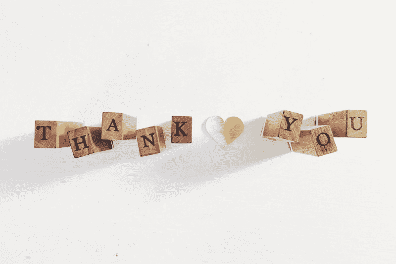

# 作为一名设计师，一年写 106 篇文章如何帮助我成长

> 原文：<https://www.freecodecamp.org/news/how-writing-has-helped-me-grow-as-a-designer-afbed63c16a7/>

蒂芙尼·伊顿

# 作为一名设计师，一年写 106 篇文章如何帮助我成长

[Stanley Dai](https://unsplash.com/@tiggerstan)

一致性从来都不是我的强项。当我年轻的时候，我记得我这个年龄的孩子写日记或日志。我妈妈甚至给我买了一本日记，希望我能写作。

“这有什么意义？”我以为。当然，回头看看 9 岁的我对生活的看法会很好，但主要问题是我害怕在写作中犯错。我害怕我的写作会变成我身体每一根纤维在一瞬间经历的事件的虚构。

我写的东西不真实。我无法用雄辩的方式表达我的想法。我讨厌我说话的方式。我从来不认为自己是一个作家，所以为什么开始？这些是在我幼小的头脑中运行了很长时间的一些想法。

直到大学三年级，我经历了一件事，改变了我不断发展的设计生涯的轨迹:我在微软的面试经历。

那时，我已经开发了这个门面，我认为我是一个伟大的设计师，我学习的速度完全没问题。我没有想过要督促自己继续学习，因为一旦我开始工作，我很可能会这样做。我已经处于一个很好的位置，因为我得到了所有这些采访！这已经足够证明了——至少我是这么认为的。

当我发现我被微软拒绝时，我很受伤。我不知道如何面对拒绝。我非常努力，我认为我做得很好。任何被拒绝的人都知道这种感觉是多么令人心碎。

直到这一刻，我才意识到我贬低自己的方式是有害的，我讨厌我让自己感觉自己一无是处的事实。我知道，如果我想做大事，如果我想以鼓励行动的方式处理拒绝，我还有很多事情要做。

那就是行动。我开始反思我的经历，看看哪里可以改进，把自己的感受放在一边。我想接受拒绝，但我想以一种方式让对技术感兴趣并准备面试的人了解我的面试经历。

这是我开始写我的[微软现场面试经历](https://medium.freecodecamp.org/what-i-learned-from-flying-to-seattle-for-microsofts-final-wave-of-design-interviews-8eab06c50ce5)给全世界阅读的时候。这是一种调和被拒绝的痛苦的方式，所以我可以回顾我的经历，并从中进步。

由于写了我的经历，我惊讶地收到了许多鼓励和感谢来分享我的故事。我还发现，当我写作时，我享受这一切的过程。我喜欢编造一个故事，反思我的经历，为我所学的东西保留一个有形的基准，这样我就可以不断成长，并与他人分享我的故事，这样他们就可以从中获得一些东西。我不能停留在一个故事上，我需要写更多。

…我们到了。一年后，我仍然每周都在写作。那么我一年来每周写作学到了什么呢？

### 写作让我能够整理思绪

[Ben White](https://unsplash.com/@benwhitephotography)

我相信我们的反思能力是如此强大，因为它让我们能够接受自己内心深处的想法，并鼓励行为改变。在我开始写作之前，我满脑子都是。我有这么多的想法，但没有出口来过滤它们。

写作让我每周花几个小时坐下来，开始反思我做过的事情。这可能是我在那个星期、那个月，甚至是最近几年里做过的任何事情。

收集我的想法让我深入思考我的经历，质疑出错或正确的事情。我现在能够从他们身上找到一些可以学习的东西。

因此，我已经能够从我的经历中成长，并发展深入思考我所做的事情的心态，专注于此刻并意识到我的周围环境，这样我就可以学习新的东西。

### 写作让我直面失败

[Bethany Legg](https://unsplash.com/@bkotynski)

每当我不成功的时候，我都喜欢写下我的经历，因为这能让我客观地思考问题，让我正确看待事情。它也使失败正常化，因为失败不是什么可怕的事情。就像在设计过程中，最好早点失败。

我曾经认为失败是可怕的。当它发生时，我会感到崩溃，但过一会儿我会站起来再试一次。事后看来，失败实际上比我的一些“成功”让我学到了更多。成功更多的是失败几次再尝试的结果。

通过写下我的经历并把它们放在网上，我承认了发生的事情，不管它们是成功还是失败。从错误中学习会带来进步。事实上，这加速了它。

承认失败让我感到脆弱。但是脆弱让我把精力放在自我完善上，而不是自我辩护上，这不允许我承认自己的失败。这导致了自满。

### 写作教会了我如何组织和讲述故事

[Alexis Brown](https://unsplash.com/@alexisrbrown)

讲述一个关于你的设计的故事和设计本身一样重要，如果不是更重要的话。如果你不能让人们理解你做的东西，那么你的想法肯定会死，除非你能更好地沟通它。

设计是创作者的反映。写作遵循同样的概念。

当我写作时，我把我所有的想法都写在纸上，然后把它们组织成一个连贯的叙述，让我的读者能够理解。就像在设计中一样，你需要布置你所有的内容，对其进行策划，并把它们结合在一个你想要传达的覆盖叙述或信息中。

我相信写作让我能够讲述更好的故事，因为这是一个组织你的想法并决定你要展示什么或如何展示它们的问题。

### 写作教会了我一致性

[Jason Wong](https://unsplash.com/@jasonhk1920)

有几周我对自己写的东西超级自豪，也有几周我觉得自己写的很糟糕。为了提高写作水平，我不得不坚持写作，不管我感觉如何，或者当我遇到写作瓶颈时。我发现当我挑战自己时，我实际上能够思考很多想法。我只需要集中精力。

一致性的目标让我不断思考制造东西，而不是被动地消费。如果我不坚持创作，我永远不会有今天。

在设计中，最重要的是执行——执行，然后担心你后来是怎么做的。如果你太在意某件事看起来如何，你就无法让自己站出来。在决定是否值得你花时间去改进它之前，你需要看看一些东西在现实世界中是如何工作的。

一致性让我在上传东西之前不那么担心它看起来怎么样，因为它是关于尽可能多地制作东西，迭代建立你自己或你的品牌，而不是在小细节上流汗。

### 写作教会了我勇气

[Nik MacMillan](https://unsplash.com/@nikarthur)

当你公开发表你的作品时，你极易受到批评。写作让我不害怕冒险，因为我决心把我的信息传播出去，这比人们怎么想更重要。

一个例子是当我写了一篇关于拒绝在谷歌实习的帖子。我收到了关于我所做的两极分化的意见。

我对人们反应的第一反应是:“我做了正确的决定吗？我是不是应该直接删了这个帖子？”

我变得非常害羞，因为一些对我的评论是如此严厉，让我质疑我如何描绘我的信息。

随着我继续写作，我意识到对我来说最重要的事情是对人们的批评持保留态度，并在质疑声中坚持自己的价值观。想写什么由我自己决定，因为我首先是为自己写。

无论什么时候写东西，都必然会有人提出假设。当这种情况发生时，你可以忽略这个评论，或者试着去理解那个人是从哪里来的，并澄清你的观点以防止误解。

不要让评论打败你。有时候，你创作的最好的作品是冒险的结果，并且提供了一个前无古人的观点。

### 写作教会了我感恩

[Courtney Hedger](https://unsplash.com/@cmhedger)

通过留出时间反思我所做的一切，无论是否与设计有关，我已经能够对我所学到的一切心怀感激。我感谢那些鼓励我继续写作的人，朋友、家人、同事，感谢我有幸与那些可能没有机会这样做的人分享我的经历。

### 结尾注释

曾经被认为是我的弱点变成了我的优势。写作给了我扩展到其他平台的机会，帮助其他人，并成为其他刚刚起步的设计师的榜样。

写作也让我发展了自己的声音，这是我多年来一直在努力的事情。

我将如何继续成长？对我来说，就是不断与公众分享我的经历，不断反思发生在我身上的一切，从我的成功和错误中学习。

感谢托马斯·德斯平写的关于他如何开始写作的文章激励了我。你可以在这里找到他的故事[。](https://thomasdespin.com/from-0-to-95-medium-stories-published-in-a-year-6bf3148ec1ca)

*查看我在 **[UX 研究](http://skl.sh/2nal9ZT)** 上的 Skillshare 课程，学习新知识！*

为了帮助你开始拥有自己的设计生涯，这里有一些来自 [**Rookieup**](https://transactions.sendowl.com/stores/8000/107314) 的神奇工具，我曾经在这个网站上得到资深设计师的指导。如果您使用我在下面提供的链接，您将获得折扣:

*   [在经验丰富的设计师的帮助下制作作品集](https://transactions.sendowl.com/stores/8221/107314)
*   [巩固和建立您的投资组合的基本工具](https://transactions.sendowl.com/stores/8219/107314)
*   成为一名自由职业者，掌控你的时间和事业
*   [获得一份令人惊叹的设计工作的技巧和诀窍](https://transactions.sendowl.com/stores/8222/107314)

链接到其他一些很酷的读物:

*   [设计团队和产品的衰落——如何恢复和促进包容性设计文化](https://medium.muz.li/the-one-big-mistake-design-leaders-make-baca844a8e98)
*   作为一名应届毕业生，我在脸书面试。以下是我对设计的了解
*   [成为设计领导者](https://medium.muz.li/standing-up-as-a-design-leader-9289620562a)
*   [旅程规划是获得共鸣的关键](https://uxplanet.org/journey-mapping-is-key-to-gaining-empathy-1da5b54655e1)
*   [UX 立足于理性，而非设计](https://uxplanet.org/ux-is-grounded-in-rationale-not-design-49e8f77b8f58)
*   [现在每个设计师都应该知道的设计研究类型](https://uxplanet.org/the-types-of-design-research-every-designer-should-know-now-5dad49106f02?source=user_profile---------4-----------)

如果你有任何关于设计的问题，在 **[LinkedIn](https://www.linkedin.com/in/tiffany-w-eaton-551584a0/)** 上给我发消息，我会写下来的！