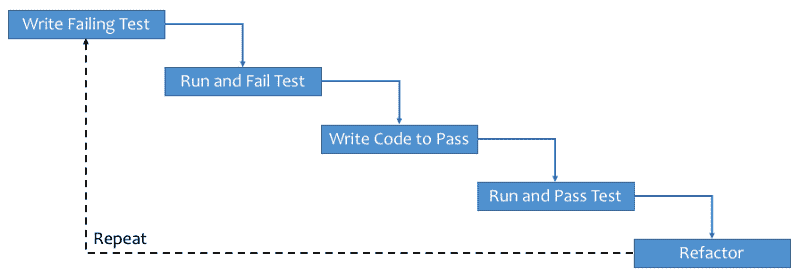

# Python 测试驱动开发的简单介绍

> 原文：<https://www.freecodecamp.org/news/learning-to-test-with-python-997ace2d8abe/>

作者:德米特里·拉斯托格夫

# Python 测试驱动开发的简单介绍


我是一个自学成才的初级开发人员，能够编写简单的应用程序。但我要坦白一件事。不可能在脑子里记住所有的东西是如何相互联系的。

如果几天后我回到我写的代码，情况会变得更糟。事实证明，这个问题可以通过遵循[测试驱动开发](https://en.wikipedia.org/wiki/Test-driven_development) (TDD)方法来解决。

### 什么是 TDD，为什么它很重要？

通俗地说，TDD 建议在编写实际代码之前编写测试来检查代码的功能。只有当您对您的测试和它所测试的特性感到满意时，您才开始编写实际的代码，以满足测试所强加的条件，从而允许它们通过测试。

遵循这个过程可以确保您仔细计划您编写的代码，以便通过这些测试。这也防止了编写测试被推迟到以后的可能性，因为与在此期间可能创建的附加特性相比，它们可能被认为是不必要的。

当你开始重构代码时，测试也给了你信心，因为当测试被执行时，由于即时的反馈，你更有可能捕捉到错误。



General workflow of TDD

### 如何入门？

为了开始用 Python 编写测试，我们将使用 Python 附带的`unittest` [模块](https://docs.python.org/2/library/unittest.html)。为此，我们创建一个新文件`mytests.py`，它将包含我们所有的测试。

让我们从通常的“hello world”开始:

```
import unittest
from mycode import *

class MyFirstTests(unittest.TestCase):

def test_hello(self):
        self.assertEqual(hello_world(), 'hello world')
```

注意，我们正在从`mycode`文件导入`helloworld()`函数。在文件`mycode.py`中，我们最初将只包含下面的代码，它创建了函数，但在这个阶段不返回任何东西:

```
def hello_world():
    pass
```

运行`python mytests.py`将在命令行中生成以下输出:

```
F

====================================================================

FAIL: test_hello (__main__.MyFirstTests)

--------------------------------------------------------------------

Traceback (most recent call last):

File "mytests.py", line 7, in test_hello

self.assertEqual(hello_world(), 'hello world')

AssertionError: None != 'hello world'

--------------------------------------------------------------------

Ran 1 test in 0.000s

FAILED (failures=1)
```

这清楚地表明测试失败了，这是意料之中的。幸运的是，我们已经编写了测试，所以我们知道它会一直检查这个函数，这让我们有信心在将来发现潜在的 bug。

为了确保代码通过，我们将`mycode.py`改为如下:

```
def hello_world():
    return 'hello world'
```

再次运行`python mytests.py`,我们在命令行中得到以下输出:

```
.

--------------------------------------------------------------------

Ran 1 test in 0.000s

OK
```

恭喜你。您刚刚完成了第一次测试。现在让我们转向一个稍微困难一点的挑战。我们将创建一个函数，允许我们用 Python 创建一个自定义的数字列表理解。

让我们从编写一个函数测试开始，这个函数将创建一个特定长度的列表。

在文件`mytests.py`中，这将是一个方法`test_custom_num_list`:

```
import unittest
from mycode import *

class MyFirstTests(unittest.TestCase):

def test_hello(self):
        self.assertEqual(hello_world(), 'hello world')

    def test_custom_num_list(self):
        self.assertEqual(len(create_num_list(10)), 10)
```

这将测试函数`create_num_list`是否返回长度为 10 的列表。让我们在`mycode.py`中创建函数`create_num_list`:

```
def hello_world():
    return 'hello world'

def create_num_list(length):
    pass
```

运行`python mytests.py`将在命令行中生成以下输出:

```
E.

====================================================================

ERROR: test_custom_num_list (__main__.MyFirstTests)

--------------------------------------------------------------------

Traceback (most recent call last):

File "mytests.py", line 14, in test_custom_num_list

self.assertEqual(len(create_num_list(10)), 10)

TypeError: object of type 'NoneType' has no len()

--------------------------------------------------------------------

Ran 2 tests in 0.000s

FAILED (errors=1)
```

这是意料之中的，所以让我们继续修改`mytest.py`中的函数`create_num_list`，以便通过测试:

```
def hello_world():
    return 'hello world'

def create_num_list(length):
    return [x for x in range(length)]
```

在命令行上执行`python mytests.py`表明第二个测试现在也通过了:

```
..

--------------------------------------------------------------------

Ran 2 tests in 0.000s

OK
```

现在让我们创建一个自定义函数，它将像这样转换列表中的每个值:`const * ( X ) ^ power`。首先让我们编写测试，使用方法`test_custom_func_`将值 3 作为 X，取它的 3 次方，乘以常数 2，得到值 54:

```
import unittest
from mycode import *

class MyFirstTests(unittest.TestCase):

def test_hello(self):
        self.assertEqual(hello_world(), 'hello world')

def test_custom_num_list(self):
        self.assertEqual(len(create_num_list(10)), 10)

    def test_custom_func_x(self):
        self.assertEqual(custom_func_x(3,2,3), 54)
```

让我们在文件`mycode.py`中创建函数`custom_func_x`:

```
def hello_world():
    return 'hello world'

def create_num_list(length):
    return [x for x in range(length)]

def custom_func_x(x, const, power):
    pass
```

不出所料，我们失败了:

```
F..

====================================================================

FAIL: test_custom_func_x (__main__.MyFirstTests)

--------------------------------------------------------------------

Traceback (most recent call last):

File "mytests.py", line 17, in test_custom_func_x

self.assertEqual(custom_func_x(3,2,3), 54)

AssertionError: None != 54

--------------------------------------------------------------------

Ran 3 tests in 0.000s

FAILED (failures=1)
```

更新函数`custom_func_x`为了通过测试，我们有以下内容:

```
def hello_world():
    return 'hello world'

def create_num_list(length):
    return [x for x in range(length)]

def custom_func_x(x, const, power):
    return const * (x) ** power
```

再次运行测试，我们通过了:

```
...

--------------------------------------------------------------------

Ran 3 tests in 0.000s

OK
```

最后，让我们创建一个新函数，将`custom_func_x`函数合并到列表理解中。像往常一样，让我们从编写测试开始。请注意，为了确定起见，我们包括两种不同的情况:

```
import unittest
from mycode import *

class MyFirstTests(unittest.TestCase):

def test_hello(self):
        self.assertEqual(hello_world(), 'hello world')

def test_custom_num_list(self):
        self.assertEqual(len(create_num_list(10)), 10)

def test_custom_func_x(self):
        self.assertEqual(custom_func_x(3,2,3), 54)

def test_custom_non_lin_num_list(self):
        self.assertEqual(custom_non_lin_num_list(5,2,3)[2], 16)
        self.assertEqual(custom_non_lin_num_list(5,3,2)[4], 48)
```

现在让我们在`mycode.py`中创建函数`custom_non_lin_num_list`:

```
def hello_world():
    return 'hello world'

def create_num_list(length):
    return [x for x in range(length)]

def custom_func_x(x, const, power):
    return const * (x) ** power

def custom_non_lin_num_list(length, const, power):
    pass
```

和以前一样，我们失败了:

```
.E..

====================================================================

ERROR: test_custom_non_lin_num_list (__main__.MyFirstTests)

--------------------------------------------------------------------

Traceback (most recent call last):

File "mytests.py", line 20, in test_custom_non_lin_num_list

self.assertEqual(custom_non_lin_num_list(5,2,3)[2], 16)

TypeError: 'NoneType' object has no attribute '__getitem__'

--------------------------------------------------------------------

Ran 4 tests in 0.000s

FAILED (errors=1)
```

为了通过测试，让我们将`mycode.py`文件更新如下:

```
def hello_world():
    return 'hello world'

def create_num_list(length):
    return [x for x in range(length)]

def custom_func_x(x, const, power):
    return const * (x) ** power

def custom_non_lin_num_list(length, const, power):
    return [custom_func_x(x, const, power) for x in range(length)]
```

最后一次运行测试，我们全部通过！

```
....

--------------------------------------------------------------------

Ran 4 tests in 0.000s

OK
```

恭喜你。这就结束了对 Python 测试的介绍。请务必查看下面的参考资料，了解更多关于一般测试的信息。

代码可以在 GitHub 上找到。

### 进一步学习的有用资源！

#### 网络资源

下面是一些专注于 Python 测试的库的链接:

*   [**25.3。unittest -单元测试框架- Python 2.7.14 文档**](https://docs.python.org/2.7/library/unittest.html)
*   [**pytest:帮助你编写更好的程序——pytest 文档**](https://docs.pytest.org/en/latest/)
*   [**欢迎来到假设！——假设 3.45.2 文献**](https://hypothesis.readthedocs.io/en/latest/)
*   [**unittest2 1.1.0 : Python 包索引**](https://pypi.python.org/pypi/unittest2)

#### YouTube 视频

如果你不喜欢阅读，我推荐你在 YouTube 上看下面的视频。