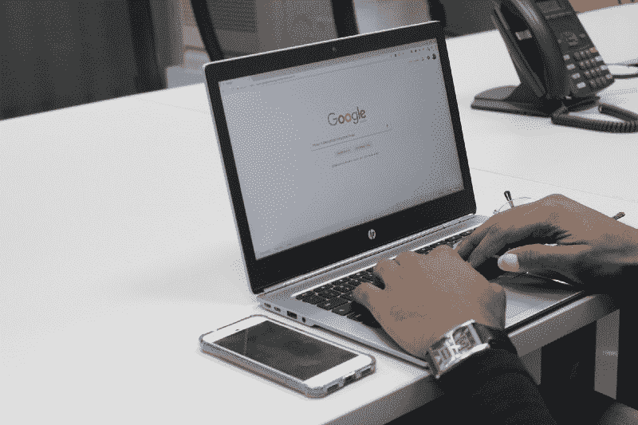

# 如何充分利用 freeCodeCamp

> 原文：<https://www.freecodecamp.org/news/how-to-get-the-most-out-of-free-code-camp-afc646073746/>

安东尼·扬诺斯

# 如何充分利用 freeCodeCamp

如果你目前正在学习如何编码，我强烈建议你看看 [freeCodeCamp](http://www.freecodecamp.com) 如果你还没有这样做的话。

对于那些刚刚起步的人，我想我会分享我迄今为止的经历。它可能对你改善 freeCodeCamp 的学习体验有所帮助。

### 1.慢点！

对于像我一样在屏幕上看到“挑战”字样并立即尝试尽快完成的人来说。

Photo by [Daniel Monteiro](https://unsplash.com/@danielmonteirox?utm_source=medium&utm_medium=referral) on [Unsplash](https://unsplash.com?utm_source=medium&utm_medium=referral)

当然，尽快通过挑战感觉很棒。

当然，在那一刻你会觉得自己是真正的天才。

但现实远非如此。

当我用一半的时间完成每个部分时，我对自己印象深刻，他们估计这需要一个普通人。我以前有一些 HTML 和 CSS 的经验。所以我想这就是为什么我理解了这些概念，并如此迅速地克服了挑战。

虽然我当时觉得自己是个天才，但我很快就开始了基本的前端开发项目。我意识到，到目前为止我所学的一切都不是留存的知识。

当然，我能够在他们估计的时间的一半(如果不是更少的话)内完成这些部分，但是我什么也没学到。这些概念都很熟悉，但没有什么真正留在我的脑海里。

为了避免我的错误，我最大的建议是**放慢你的脚步**。一旦你完成了一个挑战，不要马上进入下一个。额外花 5 到 10 分钟去理解他们在教你什么，以及**为什么**。

如果你一直最喜欢的食物现在就在你面前，你会连嚼都不嚼就把它吞下去吗？或者你会做明智的事情，品味和享受这种体验吗？

你不想因为吃得太快而肠胃不适。话虽如此，为什么你会想通过过快地学习来扰乱你的大脑呢？

现在我已经开始学习这门课程的 JavaScript 部分，我已经开始在每个挑战结束时做大量的笔记。我发现这帮助我记住了知识。比如像学数学一样，**重复就是一切**。写下你的笔记将真正帮助你记住这些新知识(至少对大多数人来说)。

Photo by [JESHOOTS.COM](https://unsplash.com/@jeshoots?utm_source=medium&utm_medium=referral) on [Unsplash](https://unsplash.com?utm_source=medium&utm_medium=referral)

### 2.不要仅仅依靠 freeCodeCamp 来学习如何编码

我的意思是，freeCodeCamp 在教你基础知识方面做得很好。但是还有很多有用的东西没有提到。例如，当涉及到 CSS 时，freeCodeCamp 不会涉及太多细节。

我不会只关注 freeCodeCamp 的内容，我会用其他资源补充它。我喜欢 MDN web docs 或 CSS-Tricks，例如，当深入研究 CSS 时。

同样，freeCodeCamp 也面向你学习如何使用 Bootstrap 框架进行开发。虽然我同意这一点，但我仍然认为在学习 Bootstrap 框架之前学习 HTML 和 CSS 的来龙去脉是一个好主意。

因此，除了在整个挑战过程中做笔记，我还会养成从其他资源中学习的习惯。当学习如何编码时，你想成为几乎所有方面的专家，而不是只知道建立一个基本网站的最低要求。

Photo by [Benjamin Dada](https://unsplash.com/@dadaben_?utm_source=medium&utm_medium=referral) on [Unsplash](https://unsplash.com?utm_source=medium&utm_medium=referral)

### 3.拥抱阅读-搜索-提问的方法

这涉及到我的第二点，但我想强调这一点。

学习 web 开发绝对不是一件容易的事情，也绝对不是一件你应该独自承担的事情。

你必须不断学习，不断提问。你可能会在 Reddit 或 Stack Overflow 上遭到一些人的反对。但是在学习如何编码的时候，没有愚蠢的问题。

freeCodeCamp 有一个最好的在线社区。你必须利用这一点，进行社交！在您所在的城市注册 freeCodeCamp meetups。虽然我们大多数人喜欢自己学习，但总有一天你会不得不与团队合作。所以为什么不趁你还在学习的时候现在就开始呢！

Photo by [Toa Heftiba](https://unsplash.com/@heftiba?utm_source=medium&utm_medium=referral) on [Unsplash](https://unsplash.com?utm_source=medium&utm_medium=referral)

### 将所有这些整合在一起…

我真的认为 freeCodeCamp 是学习如何编码的最好方法之一。围绕基于项目的学习体验的课程结构。他们神奇的在线社区。没有任何东西像它一样。

虽然这是一种很好的学习方式，但肯定有方法可以帮助改善你的学习体验。

**记住以下几点:**

1.  放慢脚步，享受这个过程。在进入下一个挑战之前，确保你理解了你正在学习的概念。
2.  尽可能足智多谋。你能找到的信息来源越多，你的学习就越容易。也就是说，确保找到可信的来源，并确保你正在学习当前的概念，因为很多事情确实会随着时间的推移而改变。
3.  拥抱**阅读-搜索-提问法**并加入有史以来最好的学习编码的在线社区之一。

我希望至少有一个人觉得这篇文章有帮助。请随时分享并展示你的爱，鼓掌****:)**或留下评论，让我知道你对 freeCodeCamp 的体验！**

**大家编码快乐！**