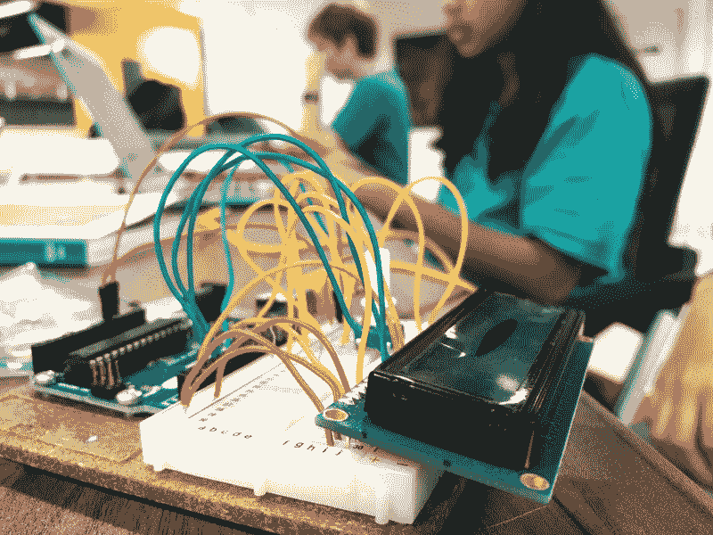
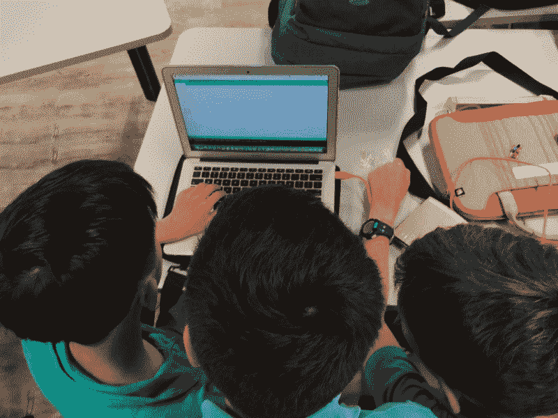
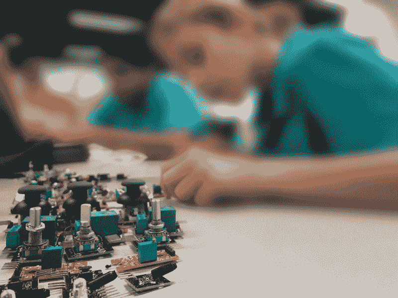

# 为什么我在学校教年轻学生如何编码

> 原文：<https://www.freecodecamp.org/news/why-im-teaching-younger-students-at-my-school-how-to-code-f74ba3f174e3/>

萨尔瓦夫·库尔帕蒂

# 为什么我在学校教年轻学生如何编码

#### 以及为什么你也应该教别人如何编码

想象一下，如果你在人群中长大，却从未学习过他们之间的语言。那岂不是很荒谬？然而，技术几乎驱动着当今世界的一切，而**大多数孩子对它所讲的语言一无所知。**

技术的快速发展需要教育的快速跟进，但很明显，学校远远落后了。他们只是花了太长时间来修改他们的课程。在我目前 10 年级的计算机科学课程中，光盘被认为是高科技。？

这就是为什么我决定亲自动手，给学校的学生讲授技术。

我今年 15 岁，对所有的技术事物都有强烈的热情，现在我已经编码将近两年了。

以下是为什么教每个孩子如何编程很重要的一些原因。

#### 1.科技越来越多地出现在我们的生活中

技术渗透到我们生活的几乎每一个方面——交通、娱乐、生产力，甚至教育——的趋势似乎没有减缓。事实上，由于摩尔定律，它正在加速，呈指数级增长。

我们至少应该对我们周围的系统以及它们如何工作有一个基本的了解，为此，孩子们需要学习编程。

#### 2.它让孩子们不仅仅是消费者

现在，孩子们可以获得制作游戏所需的关键技能，而不是玩视频游戏和使用应用程序。如果他们觉得这些技能有趣，他们可以完善这些技能，并把它作为自己的职业。

编程是令人惊奇的，因为**你可以使用你已经掌握的技术创造任何东西**——网络、实用程序，甚至整个世界。你说吧。

只有把这个机会介绍给孩子们，他们才会理解其中的可能性。

#### 3.它教会他们如何思考

> "这个国家的每个人都应该学会给计算机编程，因为它教会你如何思考。"—史蒂夫·乔布斯

编程教授基本的解决问题的技能，比如把事情分解成小任务，保持事情简单和模块化，以及从错误中学习。

孩子们从编程中学到的技能可以应用到他们生活的许多领域。

#### 4.学生成为自给自足的学习者

我自学了如何编码。我从来没有一个老师告诉我如何解决问题。我所学到的一切都来自于数小时的调试和在 Stackoverflow 中的滚动。

我不太确定我的学生是否会复制这种行为，但谢天谢地，他们做到了。他们中的一些人对他们正在制造的东西非常感兴趣，甚至在校外也不遗余力地学习东西是如何工作的，以及如何使用它们。

#### 5.你变得更擅长自己编码

教别人东西的时候，他们会不断问你最简单最基础的问题。这些是你知识的基础支柱，事实上你会不断重复它们，这意味着你的理解会变得坚如磐石。

事实上，我不得不教人们编码，这也意味着我不得不复习大量的知识，并在解释之前确保自己完全理解了这些知识。

就连诺贝尔奖得主物理学家理查德·费曼也曾认为教人是最好的学习方式，以至于有一种方法以他的名字命名。

### 为什么你也应该教别人如何编码

知识不应该被锁起来储存或保留在一群特定的人的头脑中。它应该传播，作为一个有知识的人，传播它是你的责任。

如果你会编码，你就会明白这是多么有趣和令人满足的事情。。你也明白知道如何编码的价值。

那么，为什么不把知识之光传递给你认识的人呢？

可能是你的朋友，你的孩子，甚至可能是你的同事。谁知道呢，他们可能会喜欢它，并开始自己学习。

感谢阅读。我希望这篇短文通过教别人如何编码点燃了你的热情。

**想聊天？在 [Twitter](https://twitter.com/SarvasvKulpati) 、 [Linkedin](https://www.linkedin.com/in/sarvasvkulpati/) 和 [Quora](https://www.quora.com/profile/Sarvasv-Kulpati)** 上找到我

**这是我写的其他一些帖子**

[**你需要节食**](https://hackernoon.com/you-need-to-go-on-an-information-diet-def2f5a3fd5b)
[*我们生活在一个吸毒者的社会里。你最好的朋友可能就是其中之一。你的家人也是。很有可能，你也是…*hackernoon.com](https://hackernoon.com/you-need-to-go-on-an-information-diet-def2f5a3fd5b)[**苹果的专长不是硬件或软件**](https://medium.com/swlh/apples-speciality-isn-t-hardware-or-software-af1e6337d5f2)
[*每个人在批评苹果时都会忽略的一点*medium.com](https://medium.com/swlh/apples-speciality-isn-t-hardware-or-software-af1e6337d5f2)[**如果你正在为年轻人创业，不要关注产品**](https://hackernoon.com/if-you-are-making-a-startup-for-young-people-dont-pay-attention-to-the-product-fbeebb9059ce)
[*Snapchat 赢得了我们所有千禧一代的特殊方式*hackernoon.com](https://hackernoon.com/if-you-are-making-a-startup-for-young-people-dont-pay-attention-to-the-product-fbeebb9059ce)