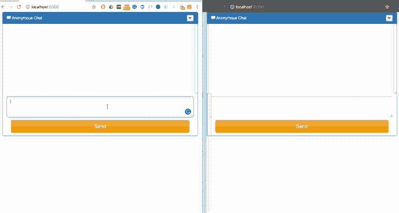
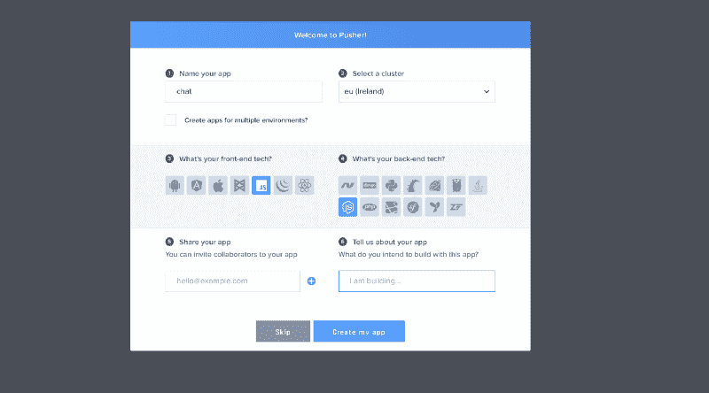

# 我如何用 JavaScript 构建一个公开的匿名聊天应用

> 原文：<https://www.freecodecamp.org/news/how-i-built-a-public-anonymous-chat-app-in-javascript-34f082b9b98/>

彼得·姆巴努戈

# 我如何用 JavaScript 构建一个公开的匿名聊天应用


Photo by [Kristina Flour](https://unsplash.com/photos/BcjdbyKWquw?utm_source=unsplash&utm_medium=referral&utm_content=creditCopyText) on [Unsplash](https://unsplash.com/search/photos/whisper?utm_source=unsplash&utm_medium=referral&utm_content=creditCopyText)

我们都熟悉即时消息，并使用它与人实时聊天。不过，有时我们可能想要一个应用程序，让我们可以匿名向朋友发送消息，或者匿名与附近的陌生人聊天。这种应用的一个例子是 [Truth](https://itunes.apple.com/us/app/truth-be-honest/id791407399) ，它可以让你在不暴露身份的情况下与联系人名单上的人交谈。

在本教程中，我将向您展示如何用 JavaScript(在服务器上使用 NodeJS 和 Express，在客户端使用 VanillaJS)和 [Pusher](https://pusher.com/) 构建一个公共匿名聊天应用程序。Pusher 允许我们构建可扩展的、可靠的实时应用程序。由于我们需要实时发送聊天消息，这是聊天应用程序的一个关键组件。下图描绘了我们将要构建的内容:



The final product

### 入门指南

让我们从[注册一个免费的 Pusher 帐户](https://pusher.com/signup)开始吧(或者如果你已经有一个的话就登录)。登录后，从[仪表板](https://dashboard.pusher.com/)创建一个新的 Pusher 应用程序，并记下您的应用程序 ID、密钥和密码，它们是一个应用程序独有的。

要创建新的 Pusher 应用程序，请单击`Your apps`侧菜单，然后单击抽屉下方的`Create a new app` 按钮。这将打开设置向导。

1.  输入应用程序的名称。在这种情况下，我称之为“聊天”。
2.  选择一个集群。
3.  如果您希望拥有不同的开发、试运行和生产实例，请选择“为多个环境创建应用程序”选项。
4.  选择**香草 JS** 作为前端，选择 **NodeJS** 作为后端。
5.  点击`Create my app`按钮设置应用实例，完成整个过程。



Creating the pusher app

### 编写服务器代码

我们需要一个后端，它将服务于我们的静态文件，也接受来自客户端的消息，然后通过 Pusher 广播到其他连接的客户端。我们的后端将用 NodeJS 编写，所以我们需要设置它。

我们需要一个`package.json`文件，我将通过运行下面的命令来添加它。对于每个提示符，我将使用按 enter 键提供的缺省值。

> *$ npm init*

添加了`package.json`文件后，我将安装 **Express** 、 **body-parser** 和 **Pusher** npm 包。运行以下命令:

> *$ npm 安装–保存 pusher express 主体解析器*

安装完这些包后，让我们添加一个名为`server.js`的新文件，内容如下:

```
var express = require('express');var bodyParser = require('body-parser');var Pusher = require('pusher');
```

```
var app = express();app.use(bodyParser.json());app.use(bodyParser.urlencoded({ extended: false }));
```

```
var pusher = new Pusher({ appId: "APP_ID", key: "APP_KEY", secret:  "APP_SECRET", cluster: "APP_CLUSTER" });
```

```
app.post('/message', function(req, res) {  var message = req.body.message;  pusher.trigger( 'public-chat', 'message-added', { message });  res.sendStatus(200);});
```

```
app.get('/',function(req,res){           res.sendFile('/public/index.html', {root: __dirname });});
```

```
app.use(express.static(__dirname + '/public'));
```

```
var port = process.env.PORT || 5000;app.listen(port, function () {  console.log(`app listening on port ${port}!`)});
```

使用上面的代码，我们定义了一个端点`/message`，一个客户端将使用它通过 Pusher 向另一个客户端发送消息。其他路由用于服务我们稍后将添加的静态文件。

用 Pusher 仪表盘中的值替换占位符字符串 App ID、Secret 和 Key。将这条语句`"start": "node server.js"`添加到我们的`package.json`文件的**脚本**属性中。这将允许我们在运行 **npm start** 时启动服务器。

### 构建前端

转到前端，让我们添加一个名为 **public** 的新文件夹。这个文件夹将包含我们的页面和 JavaScript 文件。用下面的内容添加一个名为 **style.css** 的新文件，它将保存我们对页面的样式定义。

```
@import url("http://netdna.bootstrapcdn.com/font-awesome/4.0.3/css/font-awesome.css");.chat{    list-style: none;    margin: 0;    padding: 0;}
```

```
.chat li{    margin-bottom: 10px;    padding-bottom: 5px;    border-bottom: 1px dotted #B3A9A9;}
```

```
.chat li.left .chat-body{    margin-left: 60px;}
```

```
.chat li.right .chat-body{    margin-right: 60px;}
```

```
.chat li .chat-body p{    margin: 0;    color: #777777;}
```

```
.panel .slidedown .glyphicon, .chat .glyphicon{    margin-right: 5px;}
```

```
.body-panel{    overflow-y: scroll;    height: 250px;}
```

```
::-webkit-scrollbar-track{    -webkit-box-shadow: inset 0 0 6px rgba(0,0,0,0.3);    background-color: #F5F5F5;}
```

```
::-webkit-scrollbar{    width: 12px;    background-color: #F5F5F5;}
```

```
::-webkit-scrollbar-thumb{    -webkit-box-shadow: inset 0 0 6px rgba(0,0,0,.3);    background-color: #555;}
```

用下面的标记添加另一个名为**index.html**的文件。

```
<!DOCTYPE html><html><head>    <!-- Latest compiled and minified CSS -->    <link rel="stylesheet" href="https://maxcdn.bootstrapcdn.com/bootstrap/3.3.7/css/bootstrap.min.css" integrity="sha384-BVYiiSIFeK1dGmJRAkycuHAHRg32OmUcww7on3RYdg4Va+PmSTsz/K68vbdEjh4u" crossorigin="anonymous">
```

```
 <!-- Optional theme -->    <link rel="stylesheet" href="https://maxcdn.bootstrapcdn.com/bootstrap/3.3.7/css/bootstrap-theme.min.css" integrity="sha384-rHyoN1iRsVXV4nD0JutlnGaslCJuC7uwjduW9SVrLvRYooPp2bWYgmgJQIXwl/Sp" crossorigin="anonymous">
```

```
 <script        src="https://code.jquery.com/jquery-2.2.4.min.js"        integrity="sha256-BbhdlvQf/xTY9gja0Dq3HiwQF8LaCRTXxZKRutelT44="        crossorigin="anonymous"><;/script>
```

```
 <!-- Latest compiled and minified JavaScript -->    <script src="https://maxcdn.bootstrapcdn.com/bootstrap/3.3.7/js/bootstrap.min.js" integrity="sha384-Tc5IQib027qvyjSMfHjOMaLkfuWVxZxUPnCJA7l2mCWNIpG9mGCD8wGNIcPD7Txa" crossorigin="anonymous"&gt;</script>
```

```
 <link rel="stylesheet" href="style.css">    <script src="https://js.pusher.com/4.0/pusher.min.js"></script>    <script src="index.js"></script></head><body>    <div class="container">    <div class="row form-group">        <div class="col-xs-12 col-md-offset-2 col-md-8 col-lg-8 col-lg-offset-2">            <div class="panel panel-primary">                <div class="panel-heading">                    <span class="glyphicon glyphicon-comment"></span> Anonymous Chat                    <div class="btn-group pull-right">                        <button type="button" class="btn btn-default btn-xs dropdown-toggle" data-toggle="dropdown">                            <span class="glyphicon glyphicon-chevron-down"></span>                        </button>                        <ul class="dropdown-menu slidedown">                            <li><a href="http://www.jquery2dotnet.com"><span class="glyphicon glyphicon-refresh">                            </span>Refresh</a></li>                            <li><a href="http://www.jquery2dotnet.com"><span class="glyphicon glyphicon-ok-sign">                            </span>Available</a></li>                            <li><a href="http://www.jquery2dotnet.com"><span class="glyphicon glyphicon-remove">                            </span>Busy</a></li>                            <li><a href="http://www.jquery2dotnet.com"><span class="glyphicon glyphicon-time"></span>                                Away</a></li>                            <li class="divider"></li>                            <li><a href="http://www.jquery2dotnet.com"><span class="glyphicon glyphicon-off"></span>                                Sign Out</a></li>                        </ul>                    </div>                </div>                <div class="panel-body body-panel">                    <ul class="chat">
```

```
 </ul>                </div>                <div class="panel-footer clearfix">                    <textarea id="message" class="form-control" rows="3"></textarea>                    <span class="col-lg-6 col-lg-offset-3 col-md-6 col-md-offset-3 col-xs-12" style="margin-top: 10px">                        <button class="btn btn-warning btn-lg btn-block" id="btn-chat">Send</button>                    </span>                </div>            </div>        </div>    </div></div>
```

```
<script id="new-message-other" type="text/template">    <li class="left clearfix">        <span class="chat-img pull-left">                    </span>        <div class="chat-body clearfix">            <p>                {{body}}            </p>        </div>    </li></script>
```

```
<script id="new-message" type="text/template">    <li id="{{id}}" class="right clearfix">        <div class="chat-body clearfix">            <p>                {{body}}            </p>        </div>    </li></script>
```

```
</body>&lt;/html>
```

我使用了一个来自[bootsinpp](http://bootsnipp.com/snippets/6eWd)的模板，这个模板已经被稍微修改过，只显示名字和消息。

添加一个名为 **index.js** 的新文件，内容如下。记得添加 Pusher 应用程序的详细信息:

```
$(document).ready(function(){        var pusher = new Pusher('APP_KEY', {        cluster: 'APP_CLUSTER',        encrypted: false    });
```

```
 let channel = pusher.subscribe('public-chat');    channel.bind('message-added', onMessageAdded);
```

```
 $('#btn-chat').click(function(){        const message = $("#message").val();        $("#message").val("");
```

```
 //send message        $.post( "http://localhost:5000/message", { message } );    });
```

```
 function onMessageAdded(data) {        let template = $("#new-message").html();        template = template.replace("{{body}}", data.message);
```

```
 $(".chat").append(template);    }});
```

使用这个文件中的代码，我们得到要发送的消息，然后用这个消息调用服务器。之后，我们通过使用 App Key 和您之前设置的集群创建一个新的 Pusher 对象来连接到 Pusher。

我们订阅了一个名为`message-added`的频道和事件。该频道是公共频道，因此您可以随意命名。我选择用`public-`作为我的前缀，但这只是我个人的命名惯例，因为没有公共频道的规则。`public`频道和`private`或`presence`频道的区别在于，公共频道不需要客户认证，任何知道频道名称的人都可以订阅。你可以在这里阅读更多关于推手频道[的信息。](https://pusher.com/docs/client_api_guide/client_channels)

我们绑定到页面上聊天按钮的 click 事件，从页面上的 textbox 中检索消息，然后用用户名将其发送到服务器。有了所有的设置，我们可以通过运行`npm start`来启动应用程序。以下是它在我的电脑上如何工作的一瞥。


### 包裹

这是一个展示如何使用 Pusher 实时发送消息的应用程序。我们建立了一个公共匿名聊天应用程序，允许您的网站访问者实时相互发送匿名消息。你可以在 GitHub 上找到代码

*此文最初发表在[推手](https://blog.pusher.com/build-secure-chat-web-app-javascript-auth0-pusher/)T3 上*