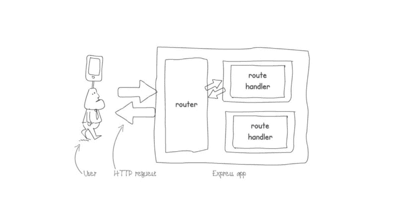
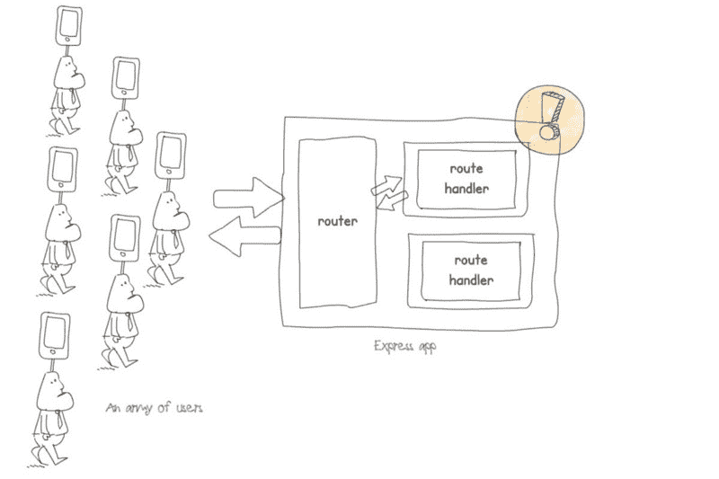
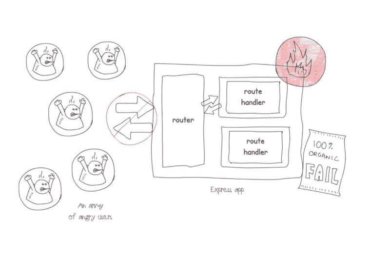
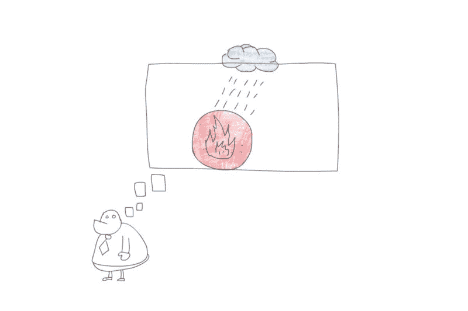
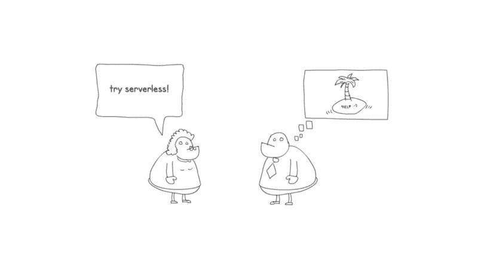
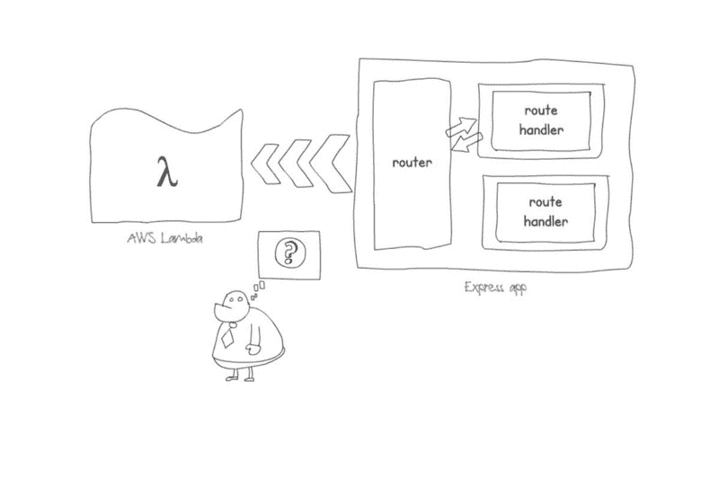
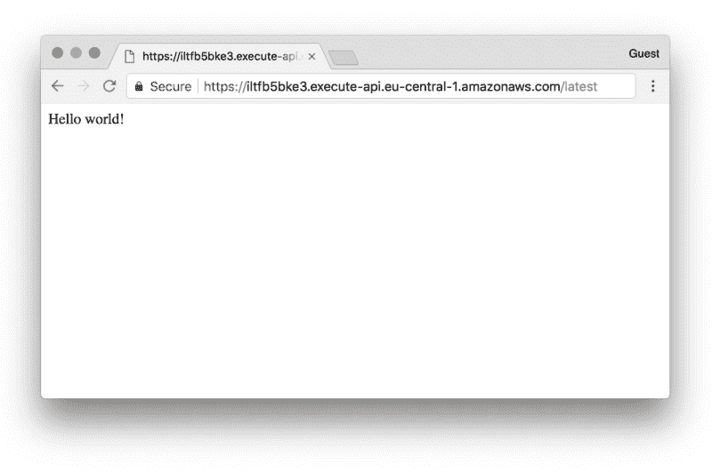
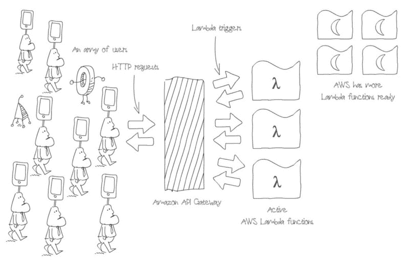

# Express.js 和 AWS Lambda——一个没有服务器的爱情故事

> 原文：<https://www.freecodecamp.org/news/express-js-and-aws-lambda-a-serverless-love-story-7c77ba0eaa35/>

斯洛博丹·斯托扬诺维奇

# Express.js 和 AWS Lambda——一个没有服务器的爱情故事

如果你是 Node.js 开发者或者你已经用 Node.js 构建了一个 API，那么你很有可能使用了 [Express.js](https://expressjs.com) 。Express 是*事实上*最流行的 Node.js 框架。

快速应用程序很容易构建。对于一个简单的 app，只需要添加几个路由和路由处理程序就可以了。就是这样。



A simple, traditionally hosted Express.js app, with a single request.

例如，最简单的 Express 应用程序看起来像下面的代码片段:

```
'use strict'
```

```
const express = require('express')const app = express()
```

```
app.get('/', (req, res) => res.send('Hello world!'))
```

```
const port = process.env.PORT || 3000app.listen(port, () =>   console.log(`Server is listening on port ${port}.`))
```

如果您将该代码片段保存为新文件夹中的 *app.js* ，您离拥有一个简单的 Express 应用程序只有三步之遥:

1.  创建新的 Node.js 项目。为此，在您的终端中运行`npm init -y`命令。只要确保您首先导航到包含`app.js`的文件夹。
2.  从终端运行`npm install express --save`命令，从 NPM 安装 Express 模块。
3.  运行`node app.js`命令，您应该看到“服务器正在监听端口 3000”作为回应。

瞧啊。你有一个快速应用程序。在你的浏览器中访问 http://localhost:3000，你会看到一个“Hello world！”消息。

### 应用程序部署

现在困难的部分来了:你如何把它展示给你的朋友或家人？如何让所有人都可以使用？

部署可能是一个漫长而痛苦的过程，但是让我们想象一下您能够快速而成功地完成它。每个人都可以使用你的应用程序，从此以后，它过着快乐的生活。

直到有一天，一个意想不到的用户大军开始使用它。

你的服务器挣扎了一下，但是成功了。



A simple, traditionally hosted Express.js app under load.

至少在一段时间内。然后就死了。☠️



A simple, but dead, traditionally hosted Express.js, that crashed because too many users accessed it.

一大群用户很愤怒(至少他们没有为这个应用付费——或者他们付费了吗？)你绝望了，试图谷歌解决方案。云能有所帮助吗？



Cloud should fix your scaling issues, right?

你又遇到了一个讨厌的朋友。她又在说那个没有服务器的东西了。但是拜托，你还有服务器。它只是属于别人，你无法控制它。



But, there are servers!

但是你绝望了，你会尝试任何东西，包括黑魔法，甚至无服务器。"那个无服务器的东西到底是什么？"

你最终得到了许多链接，包括 Manning Publications 的“使用 Node.js 的无服务器应用”的第一章的链接。

那一章解释了无服务器洗衣机！？听起来很疯狂，但是有点道理。？已经击中风扇，所以你决定尝试它。

### 让您的 Express.js 应用程序无需服务器

那一章都是关于 AWS 上的无服务器。现在你知道了无服务器 API 由 API 网关和 AWS Lambda 函数组成。但是你怎么能让你的 Express 应用程序没有服务器呢？

这听起来像那部关于马特·达蒙萎缩的电影一样有希望…



How do you fit your Express.js app into AWS Lambda?

Claudia 可以帮助你将你的应用程序部署到 AWS Lambda——让我们向她寻求帮助吧！

在运行 Claudia 命令之前，确保已经按照本教程中的说明配置了 AWS 访问凭证。

您的代码应该稍微修改一下，以支持 AWS Lambda 和通过 Claudia 的部署。您需要导出您的`app`，而不是使用`app.listen`启动服务器。您的`app.js`应该类似于下面的代码清单:

```
'use strict'
```

```
const express = require('express')const app = express()
```

```
app.get('/', (req, res) => res.send('Hello world!'))
```

```
module.exports = app
```

这会破坏本地 Express 服务器，但您可以添加包含以下内容的`app.local.js`文件:

```
'use strict'
```

```
const app = require('./app')
```

```
const port = process.env.PORT || 3000app.listen(port, () =>   console.log(`Server is listening on port ${port}.`))
```

然后使用以下命令运行本地服务器:

```
node app.local.js
```

为了让你的应用程序正确地使用 AWS Lambda，你需要为你的 Express 应用程序生成 AWS Lambda 包装器。对于 Claudia，您可以通过在终端中运行以下命令来实现:

```
claudia generate-serverless-express-proxy --express-module app
```

其中,`app`是您的 Express 应用程序的条目文件的名称，只是没有扩展名`.js`。

这一步生成了一个名为`lambda.js`的文件，内容如下:

```
'use strict'const awsServerlessExpress = require('aws-serverless-express')const app = require('./app')const binaryMimeTypes = [  'application/octet-stream',  'font/eot',  'font/opentype',  'font/otf',  'image/jpeg',  'image/png',  'image/svg+xml']const server = awsServerlessExpress  .createServer(app, null, binaryMimeTypes)exports.handler = (event, context) =>  awsServerlessExpress.proxy(server, event, context)
```

就是这样！现在您只需要使用`claudia create`命令将您的 Express 应用程序(带有`lambda.js`文件)部署到 AWS Lambda 和 API Gateway。

```
claudia create --handler lambda.handler --deploy-proxy-api --region eu-central-1
```

片刻之后，该命令完成并打印出以下响应:

```
{  "lambda": {    "role": "awesome-serverless-expressjs-app-executor",    "name": "awesome-serverless-expressjs-app",    "region": "eu-central-1"  },  "api": {    "id": "iltfb5bke3",    "url": "https://iltfb5bke3.execute-api.eu-central-1.amazonaws.com/latest"  }}
```

如果您在浏览器中访问该响应的链接，它会显示“Hello world！”成功了！？



Serverless Express app.

有了无服务器应用程序，你的用户大军可以继续增长，而你的应用程序仍然可以工作。

这是可能的，因为默认情况下，AWS Lambda 会自动扩展到 1000 个并发执行。在 API 网关收到请求后，新的函数马上就准备好了。



Serverless Express.js app under heavy load.

但这不是你唯一的好处。除了在较高负载下拥有稳定的应用程序之外，您还节省了资金。有了 AWS Lambda，您只需为自己使用的请求付费。此外，作为免费层的一部分，每月的前一百万个请求是免费的。


Your serverless app also saves your money!

要了解更多关于您的企业通过无服务器获益的方式，请参见[这篇](https://hackernoon.com/7-ways-your-business-will-benefit-through-serverless-522b3f628a33)文章。

### 无服务器 Express.js 应用程序的限制

无服务器 Express 应用程序听起来很棒，但是它们有一些限制。


Serverless, the limited edition.

无服务器快速应用程序的一些重要限制如下:

*   Websockets 不支持 AWS Lambda。那是因为当没有请求时，你的服务器是不存在的。通过 [AWS IOT websockets over MQTT 协议](https://docs.aws.amazon.com/iot/latest/developerguide/protocols.html#mqtt)，可以获得对 websockets 的一些有限支持。
*   *上传*到文件系统也不行，除非你上传到`/tmp`文件夹。这是因为 AWS Lambda 函数是只读的。即使你把文件上传到`/tmp`文件夹，它们也会存在很短的时间，而功能依然是“温暖”的。为了确保你的上传功能工作正常，你应该上传文件到 AWS S3。
*   *执行限制*也会影响你的无服务器 Express 应用。因为 API Gateway 的超时是 30 秒，而 AWS Lambda 的最大执行时间是 5 分钟。

这只是你的应用程序和 AWS Lambda 之间无服务器爱情故事的开始。期待更多的故事吧！

*一如既往，非常感谢我的朋友[亚历山大·西蒙维奇](https://twitter.com/simalexan)和[米洛万·约维奇](https://twitter.com/violinar)对本文的帮助和反馈。*

> 所有插图都是使用 [SimpleDiagrams4](https://www.simplediagrams.com) 应用程序创建的。

如果你想了解更多关于无服务器 Express 和无服务器应用程序的知识，请查阅“使用 Node.js 的无服务器应用程序”，这是我与 Aleksandar Simovic 为 Manning Publications 撰写的一本书:

[**使用 Node.js 的无服务器应用**](https://www.manning.com/books/serverless-applications-with-nodejs)
[*使用 Claudia.js 的无服务器部署的精彩介绍*www.manning.com](https://www.manning.com/books/serverless-applications-with-nodejs)

这本书将教你更多关于无服务器 Express 应用程序的知识，但你也将学习如何使用 Node 和 Claudia.js 构建和调试真实世界的无服务器 API(带数据库和认证)，以及如何为 Facebook Messenger 和 SMS(使用 Twilio)构建聊天机器人，以及 Alexa 技能。