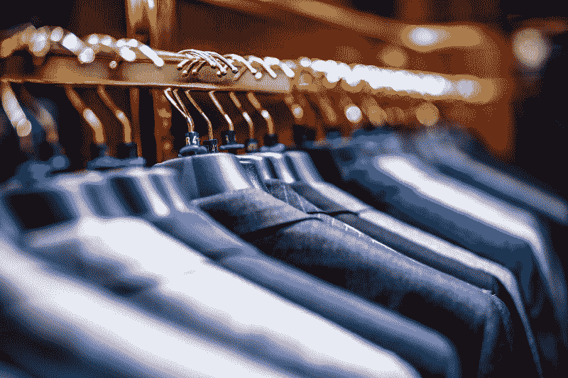
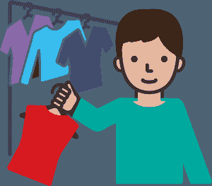
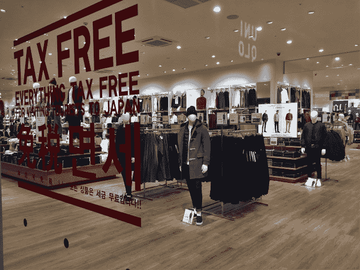
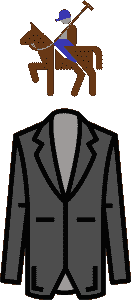
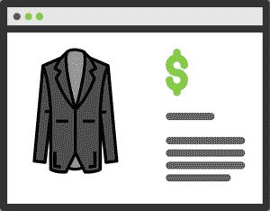
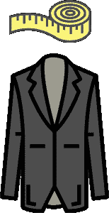
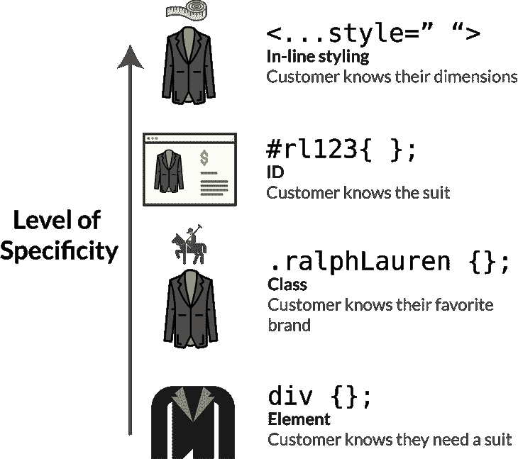

# 绝望地购买新衣服解释了 CSS 特异性

> 原文：<https://www.freecodecamp.org/news/css-specificity-explained-by-hopelessly-shopping-for-new-clothes-92bade5f2e5b/>

凯文·科诺年科



# 绝望地购买新衣服解释了 CSS 特异性

如果你曾经逛过百货商店或其他服装店，那么你就能理解 CSS 选择器是如何应用它们的样式的。

如果你是 CSS 的初学者，你可能已经见过很多 CSS 样式规则冲突的场景。你以为你只是给一个元素添加了一个新的样式，但是在多次刷新浏览器之后……你意识到这个样式因为某种原因没有被应用。

这里有一个例子。假设您有一个通用规则，即所有段落标签的行高应为 140%，如下所示。

```
p{   line-height:140%; }
```

但是，您还想创建一个行高为 120%的`subtitle`类，这通常适用于段落元素。

```
.subtitle{   line-height:120%; }
```

那么，当你这样分配时，哪一个将适用呢？

```
<p class="subtitle"> This is a subtitle</p>
```

答案是*s*类的样式，但是我想找到一个更好的方法来解释这个逻辑背后的规则。您不想每次不确定哪种样式更具体时都打开检查器..

这里有一个场景可以帮助你:想象你是一家百货商店或其他服装店的售货员。你的报酬取决于你一天卖出多少件衣服，所以如果你想赚最多的钱，你需要把时间花在最好的顾客身上。



看起来最有可能购买的顾客获得**优先权**。对自己想要什么有明确想法的顾客更有可能购买。

CSS 以类似的方式运行。它将优先考虑最具体的样式，这将覆盖不太具体的样式。添加样式的最常见方法有:

*   元素级别(`p`标签)
*   阶级等级(`.subtitle`)
*   身份证明
*   嵌入式造型

下面是如何判断上面哪个选择器是最具体的。在每种情况下，顾客都在寻找一套量身定制的西装，你必须卖出尽可能多的衣服。

### 元素选择器——只有一个模糊的概念

你是否曾经带着模糊的想法逛过百货商店，比如“我需要一套西装参加下周的一个活动。”？

从个人经验来看，我可以告诉你，这是一个被困在商店几个小时，试穿随机西装的好方法。反正这些类型的顾客会花最长的时间找到自己喜欢的东西。他们需要和几个人交谈，试穿多套西装。他们心目中想要的东西是这样的:


是啊，他们不知道自己想要什么。他们仍然需要选择一种风格，找到他们的价格范围，然后让你测量他们，以便你可以量身定制。

这是寻找套装最不具体的方式，它类似于一般类型元素的样式。像这样，一个黑色背景的`div`:

```
div{   background-color:black; }
```

### 班级选择器——至少你知道品牌…

好吧，一般类型服装之上的下一层是品牌。所以，你可以说你喜欢拉夫·劳伦的服装，所以你会从商店的一部分开始。



(**注**:照片中这不是拉夫·劳伦的展示，只是我能得到的唯一一张库存照片)

这比在商店里搜索所有的西装要好，但这仍然意味着顾客在愿意购买之前需要一点时间。下面是 CSS 的样子:

```
.ralphLauren{ }
```

这比我们在上面的例子中使用的 a `div`更具体。但是，这个 CSS 声明实际上可以变得更具体。既然我们知道顾客正在寻找一套 Ralph Lauren 西装，我们就把元素和类别结合起来。毕竟，拉夫·劳伦可以是任何类型的服装，从靴子到裤子到衬衫。

```
div.ralphLauren{ }
```



此样式将覆盖:

1.  所有常规`div`造型
2.  `ralphLauren`类被应用到`div`时的类样式。

这是因为它通过同时包含一个元素和一个类而变得更加具体。因此，如果我们有以下内容:

```
.ralphLauren{   background-color: black; } 
```

```
div.ralphLauren{   background-color:grey; }
```

第二个声明更加具体，因此它将优先于所有带有类`ralphLauren`的`divs`。

### ID 选择器—他们知道自己想要的确切型号

ID 选择器非常具体。这有点像一个人在网上尽可能多地购物，然后带着他们想要的西装的打印图片来到商店。



是的，人们仍然这样做。好吧，也许他们有一个保存的链接，这样他们就可以在他们的手机上打开它，给你这个销售人员看。

好吧，我有时会这么做。

无论如何，如果顾客已经知道他/她想要的西装的具体型号，你只需要测量他们的尺寸，然后他们就会准备购买。

ID 选择器只用于整个页面上的一个元素，这比类级或元素级选择器更加具体。以下是顾客在见你之前挑选的西装型号`RL123`的例子:

```
#rl123{   background-color:navy; }
```

如果 Ralph 海军服的默认颜色是灰色，这意味着该特定型号实际上具有海军色。

关于可伸缩性的一个小提示:你不希望页面上到处都是带有自定义 id 和样式的 HTML 元素。这将成为一个巨大的痛苦来维持。您仍然需要使用元素和类级别的样式来快速创建通用样式。但是，您还需要知道如何在个别情况下覆盖这些规则。

### 直列式设计——客户知道他们的型号和尺寸

这是最具体的方法，也是最不可扩展的方法。您可以直接在 HTML 元素中使用**内嵌样式**来覆盖 CSS 中编写的样式。

这有点像顾客来到商店，不仅知道他们想要的衣服，还知道他们的尺寸。他们对自己想要什么有一个非常具体的想法，他们准备好订购西装，并尽快离开商店。这对销售人员来说太棒了！因此，它获得了最高优先级。



这是 HTML 的样子。

我们将用类`ralphLauren:`将`**width**`和`**height**`属性分配给`div`

```
<div class="ralphLauren" style="height:100px; width:100px"></div>
```

如果我们在 CSS 中指定了宽度和高度，就像上面的例子一样，它会被改写。

### 百搭牌--！重要的

还有一种方法可以从 CSS 中改变样式规则的优先级。不过，我不打算谈论它，因为它只应该在没有其他选择的情况下使用。它打破了我们刚刚制定的所有规则…

您可以[阅读更多关于！这里重要的](https://appendto.com/2016/04/css-important-rule-how-to-use-it-correctly/)。

### 最终总结

以下是应用样式的不同方式的具体顺序:



### 获得更直观的编码教程

你喜欢这个教程吗？为它“鼓掌”，这样其他人也能发现它。

或者在这里注册我的最新教程: