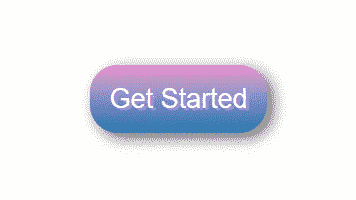
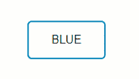
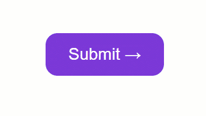
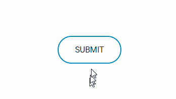
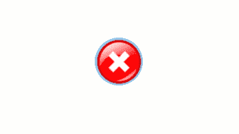
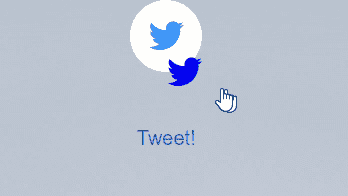

# CSS 按钮教程——如何用 CSS 设计 HTML 按钮

> 原文：<https://www.freecodecamp.org/news/a-quick-guide-to-styling-buttons-using-css-f64d4f96337f/>

阿什维尼·舍沙吉里

按钮已经成为前端开发不可避免的一部分。因此，在开始设计按钮样式之前，记住一些事情是很重要的。我收集了一些使用 CSS 设计按钮样式的方法。

### 一个简单的“开始”按钮



首先，创建按钮类本身:

```
.btn {
	background: #eb94d0;
```

#### 然后创建渐变:

```
background-image: -webkit-linear-gradient(top, #eb94d0, #2079b0);  background-image: -moz-linear-gradient(top, #eb94d0, #2079b0);  background-image: -ms-linear-gradient(top, #eb94d0, #2079b0);  background-image: -o-linear-gradient(top, #eb94d0, #2079b0);  background-image: linear-gradient(to bottom, #eb94d0, #2079b0);
```

#### 然后给按钮一个弯曲的边缘

```
-webkit-border-radius: 28;  -moz-border-radius: 28;  border-radius: 28px;
text-shadow: 3px 2px 1px #9daef5;  -webkit-box-shadow: 6px 5px 24px #666666;  -moz-box-shadow: 6px 5px 24px #666666;  box-shadow: 6px 5px 24px #666666;
font-family: Arial;  color: #fafafa;  font-size: 27px;  padding: 19px;  text-decoration: none;}
```

#### 如何触发按钮悬停事件

```
.btn:hover {
  background: #2079b0;
  background-image: -webkit-linear-gradient(top, #2079b0, #eb94d0);
  background-image: -moz-linear-gradient(top, #2079b0, #eb94d0);
  background-image: -ms-linear-gradient(top, #2079b0, #eb94d0);
  background-image: -o-linear-gradient(top, #2079b0, #eb94d0); 
  background-image: linear-gradient(to bottom, #2079b0, #eb94d0);
  text-decoration: none;
}
```

### 如何给 CSS 按钮添加透明背景



创建按钮类:

```
.btn {
```

#### /*文本颜色*/

```
 color: #0099CC; 
```

#### /*删除背景色*/

```
 background: transparent; 
```

#### /*边框粗细、线条样式和颜色*/

```
 border: 2px solid #0099CC;
```

#### /*将曲线添加到边框角*/

```
 border-radius: 6px; 
```

#### /*使字母大写*/

```
 border: none;      
      color: white;      
      padding: 16px 32px;      
      text-align: center;      
      display: inline-block;      
      font-size: 16px;      
      margin: 4px 2px;      
      -webkit-transition-duration: 0.4s; 
      /* Safari */      
      transition-duration: 0.4s;      
      cursor: pointer;      
      text-decoration: none;      
      text-transform: uppercase;
}
.btn1 {
      background-color: white;
      color: black;
      border: 2px solid #008CBA;
}
```

#### /*悬停时的按钮*/

```
 .btn1:hover {      background-color: #008CBA;      color: white; }
```

### 带有 CSS 实体的按钮



```
.button {  display: inline-block;  border-radius: 4px;  background-color: #f4511e;  border: none;  color: #FFFFFF;  text-align: center;  font-size: 28px;  padding: 20px;  width: 200px;  transition: all 0.5s;  cursor: pointer;  margin: 5px;}
```

```
.button span {  cursor: pointer;  display: inline-block;  position: relative;  transition: 0.5s;}
```

```
.button span:after {
content: '\00bb';  /* CSS Entities. To use HTML Entities, use →*/
position: absolute;  opacity: 0;  top: 0;  right: -20px;  transition: 0.5s;}
.button:hover span {  padding-right: 25px;}
.button:hover span:after {  opacity: 1;  right: 0;}
```

### 带点击动画的按钮



### 完整 CSS: (SCSS)

```
$gray: #bbbbbb;
* {  font-family: 'Roboto', sans-serif;}

.container {  position: absolute;
	top:50%;
	left:50%;
	margin-left: -65px;
	margin-top: -20px;
	width: 130px;
	height: 40px;
	text-align: center;
}

.btn {
	color: #0099CC; 
	/* Text color */
	background: transparent; /* Remove background color */
	border: 2px solid #0099CC; /* Border thickness, line style, and color */
	border-radius: 70px; /* Adds curve to border corners */
	text-decoration: none;
	text-transform: uppercase; /* Make letters uppercase */
	border: none;
	color: white;
	padding: 16px 32px;
	text-align: center;
	text-decoration: none;
	display: inline-block;
	font-size: 16px;
	margin: 4px 2px;
	-webkit-transition-duration: 0.4s; /* Safari */
	transition-duration: 0.4s;
	cursor: pointer;}.btn1 {
	background-color: white;
	color: black;
	border: 2px solid #008CBA;} .btn1:hover {
	background-color: #008CBA;
	color: white; 
}

&:active {    letter-spacing: 2px ;  
	}  &:after {    
	content:"";  }}.onclic {  
	width: 10px !important;  
	height: 70px !important;  
	border-radius: 50% !important;  
	border-color:$gray;  
	border-width:4px;  
	font-size:0;  
	border-left-color: #008CBA;  
	animation: rotating 2s 0.25s linear infinite;  
	&:hover {    color: dodgerblue;    background: white;  }}.validate {  content:"";  
	font-size:16px;  
	color: black;  
	background: dodgerblue;  
	border-radius: 50px;  
	&:after {    font-family:'FontAwesome';    content:" done \f00c";  }
}

b {  outline:none;  
	height: 40px;  
	text-align: center;  
	width: 130px;  
	border-radius:100px;  
	background: #fff;  
	border: 2px solid #008CBA;  
	color: #008CBA;  
	letter-spacing:1px;  
	text-shadow:0;  
	font:{    size:12px;    weight:bold;  }  
	cursor: pointer;  
	transition: all 0.25s ease;
	@keyframes rotating {  from {    transform: rotate(0deg);  }  to {    transform: rotate(360deg);  }
}
```

Javascript: (JQuery)

```
$(function() {  $("#button").click(function() {    $("#button").addClass("onclic", 250, validate);  });
```

```
function validate() {    setTimeout(function() {      $("#button").removeClass("onclic");      $("#button").addClass("validate", 450, callback);    }, 2250);  }  function callback() {    setTimeout(function() {      $("#button").removeClass("validate");    }, 1250);  }});
```

### 带有图像的按钮



```
.btn {

 background: #92c7eb; background-image: url(“http://res.freestockphotos.biz/pictures/15/15107-illustration-of-a-red-close-button-pv.png"); background-size: cover; background-position: center; display: inline-block; border: none; padding: 20px; width: 70px; border-radius: 900px; height: 70px; transition: all 0.5s; cursor: pointer;}.btn:hover{ width: 75px; height: 75px;}
```

### **带图标的按钮**



index.html:

```
<div class="main"><button class="button" style="vertical-align:middle"><a href="#" class="icon-button twitter"><i class="icon-twitter"></i><span></span></button></a>  <div class="text"><strong>TWEET!</strong></div></div>
```

style.css:

```
button{  border: none;  border-radius: 50px;}html,body {  font-size: 20px;  min-height: 100%;  overflow: hidden;  font-family: "Helvetica Neue", Helvetica, sans-serif;    text-align: center;}.text {  padding-top: 50px;  font-family: "Helvetica Neue", Helvetica, 'Lucida Sans Unicode', Geneva, Verdana, sans-serif;

}.text:hover{  cursor: pointer;  color: #1565C0;}.main {  padding: 0px 0px 0px 0px;  margin: 0;  background-image: url("https://someimg");  text-align: center;  background-size: 100% !important;  background-repeat: no-repeat;  width: 900px;  height: 700px;  }

.icon-button {  background-color: white;  border-radius: 3.6rem;  cursor: pointer;  display: inline-block;  font-size: 2rem;  height: 3.6rem;  line-height: 3.6rem;  margin: 0 5px;  position: relative;  text-align: center;  -webkit-user-select: none;  -moz-user-select: none;  -ms-user-select: none;  user-select: none;  width: 3.6rem;}

.icon-button span {  border-radius: 0;  display: block;  height: 0;  left: 50%;  margin: 0;  position: absolute;  top: 50%;  -webkit-transition: all 0.3s;  -moz-transition: all 0.3s;  -o-transition: all 0.3s;  transition: all 0.3s;  width: 0;}.icon-button:hover span {  width: 3.6rem;  height: 3.6rem;  border-radius: 3.6rem;  margin: -1.8rem;}.twitter span {  background-color: #4099ff;}

/* Icons */.icon-button i {  background: none;  color: white;  height: 3.6rem;  left: 0;  line-height: 3.6rem;  position: absolute;  top: 0;  -webkit-transition: all 0.3s;  -moz-transition: all 0.3s;  -o-transition: all 0.3s;  transition: all 0.3s;  width: 3.6rem;  z-index: 10;}.icon-button .icon-twitter {  color: #4099ff;}

.icon-button:hover .icon-twitter {  color: white;}
```

### 结论

在本教程中，您已经学习了如何使用 CSS 和一点 Javascript 定制按钮，如果您需要“点击后”功能的话。也可以使用 [CSS3ButtonGenerator](http://css3buttongenerator.com) 生成简单的按钮。如果你有任何问题，请随时联系我。