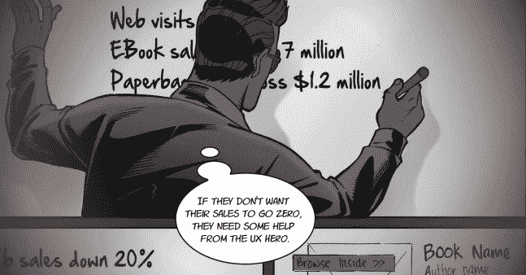
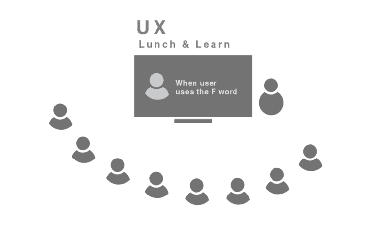

# 举办一次 UX 午餐，学习并成为 UX 英雄

> 原文：<https://www.freecodecamp.org/news/host-a-ux-lunch-and-learn-and-become-a-ux-hero-7b20d369b772/>

作者:阿里雷扎·莫哈拉布

# 举办一次 UX 午餐，学习并成为 UX 英雄

如何在办公室举办 UX 午餐和学习活动的实用指南

Image from [http://www.uxherocomics.com/](http://www.uxherocomics.com/)

三星的创新速度是其文化的一部分，它的快节奏让利益相关者不断了解正在发生的事情具有挑战性。作为一名用户体验(UX)研究员，这是我的工作。

我们的 UX 团队举办了一次午餐和学习活动，我和我在 UX 研究所的同事共同展示了来自三星可用性研究的顶级用户洞察。

你办公室里有多少人并不重要。人们可以吃东西，听一些关于用户的有趣想法和见解的活动总是会让努力得到回报。在这篇文章中，我将分享一些我尝试过的有效的方法。你可能需要根据自己的公司来调整。

### 为什么 UX 午餐和学习？

#### **你可以一次接触更多的利益相关者**

在另一篇文章中，我解释了邀请利益相关者参加可用性测试和实地研究是多么有用。然而，不可能让他们都参加这种活动。

并不是所有的涉众都同时可用，即使他们可用，你也不可能在可用性实验室或现场拥有他们。除此之外，还有一些不直接参与产品设计和开发的利益相关者，让他们作为观察者参与可用性研究可能是不相关的。

由于这些限制，我们应该考虑其他方法来提高利益相关者的用户意识。

#### **你帮助办公室里的每个人对他们所服务的顾客产生同理心**

几乎每个人都同意，创造良好的用户体验可以积极影响客户对品牌的忠诚度，并最终增加您的收入。[但是好的 UX 设计是不够的](https://uxplanet.org/but-good-ux-design-is-not-enough-now-comes-the-hard-part-6392e92f3cb1)。困难的部分是让你的组织中的人能够提供这种好的体验。仅仅通过告诉人们做什么是不可能的。

你需要向他们展示用户是如何体验产品的，痛点是什么，用户想要达到什么目的。这使得利益相关者能够对用户产生共鸣，避免高层做出糟糕的决策。

在我试图为用户建立同理心的不同方法中，举办一次午餐和学习活动似乎比其他方式更有优势。

#### **你可以不指指点点地成为用户拥护者**

当谈到可用性测试报告时，很容易就能显示出什么是不工作的。但这样也容易在不同的利益相关者之间产生芥蒂，相互指责。这在大公司中变得更加重要，因为当 [UX 撞上粉丝](https://uxplanet.org/when-ux-hits-the-fan-1e2ca2e8330)时，没有人受益！

通过向一组利益相关者展示用户如何努力来展示什么是不可行的，为利益相关者创造了一个看到问题的低压环境，而不是将责任归咎于他们。

### 计划 UX 午餐和学习

#### **邀请办公室里的每个人——甚至保安人员**

这一点非常重要，尤其是当你在 B2B 企业或者你的公司不直接与最终用户打交道的时候。很容易忘记我们是在为谁设计。

对于办公室里的每个人来说，了解谁是他们设计和开发的真正对象，以及他们的需求和目标是什么是很重要的。

#### **早点发出邀请**

人们总是忙于会议、研讨会、旅行等等。确保你提前几周通知他们活动，这样他们就能尽早知道。此外，使用其他方法，如在办公室张贴海报，让每个人都知道这件事即将发生。

#### **请你的办公室协调员帮助你做后勤工作**

举办这样的活动需要做很多事情。点餐、布置房间等等。如果你有专门的人，那就太好了！否则，自己动手。你是用户的英雄！

### 要避免什么？

#### **避免诋毁你的产品和公司**

绝对诚实，但尽量避免破坏你所评论的产品。让你的研究说出来。不要下结论。不要指责一群利益相关者。

#### **避免使用低音质的视频**

人们可能会容忍低质量的视频，但没有人想听到你在可用性房间里从风扇上录下的噪音。选择那些能传达信息并且容易被人看到和听到的。

### 包括什么？

#### **简单点，因为不是每个人都在 UX 团队**

想想那些更多地使用`if`语句而不是用户的开发人员。想想工程师、营销人员和项目经理。

甚至你的 UX 团队中的人也可能不知道你正在解释的特性的所有内容。简单易懂。

#### **也包括积极的东西**

午餐和学习不仅仅是展示问题，让人们对产品感觉不好！你还必须展示出运行良好的功能。你需要保持积极的氛围。这有助于人们继续做好工作。

#### **将每个功能/主题/项目分成三张幻灯片**

以下是我制作幻灯片的方法:

1.  背景
    简要展示并讲述该专题或项目的内容。你用什么方法测试，或者你想提到的关于设计特点的任何特别的事情。
    保持简洁，避免 UX 行话
2.  用户
    这里是你展示可用性测试视频、用户旅程图或分析的地方。
3.  **见识**
    这是你谈论你所学到的和有趣的见解和想法的地方。

### 需要考虑的事项

#### **试着吃一顿午餐，了解一下**

想想吧。如果你在一个大办公室里，你要求 50-100 个利益相关者给你 30 分钟的时间，你最好让这值得。

在此之前，试着邀请一位不在 UX 团队的利益相关者(可能来自营销人员，或者开发人员)来和你坐在一起，听听你有什么要说的。如果这对他们有意义，那就太好了。

如果没有，那么重复你的内容，直到它对非 UX 人有意义。

#### **告诉他们为什么这很重要**

在开始的时候放一张幻灯片，告诉人们为什么你认为尽早地、经常地了解用户是重要的，以及它如何对产品产生积极的影响。

#### **让它互动，你不是在讲课**

记住，这不是一个讲座。在每一部分之后，留出一些时间进行评论和提问。注意时间，但是当时间到了就让讨论结束。